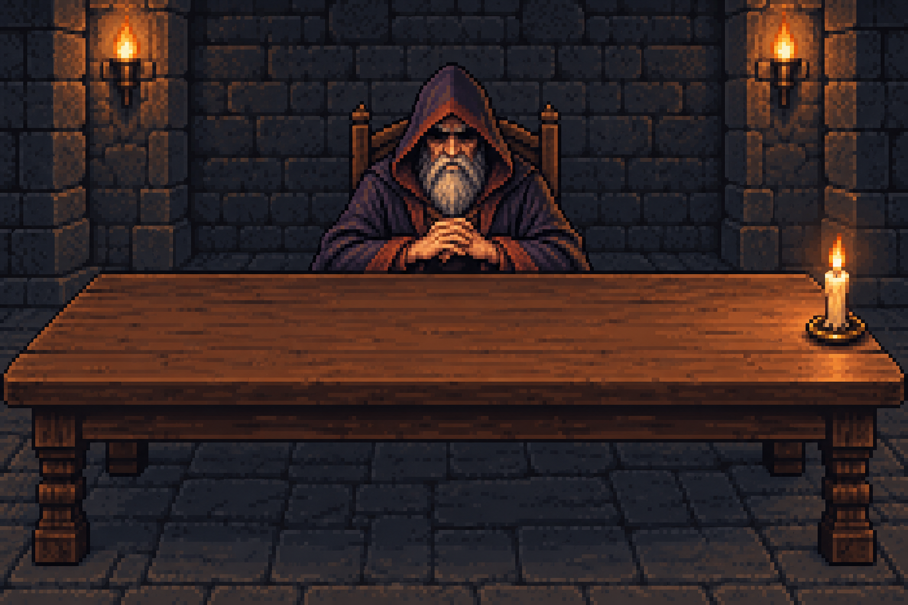
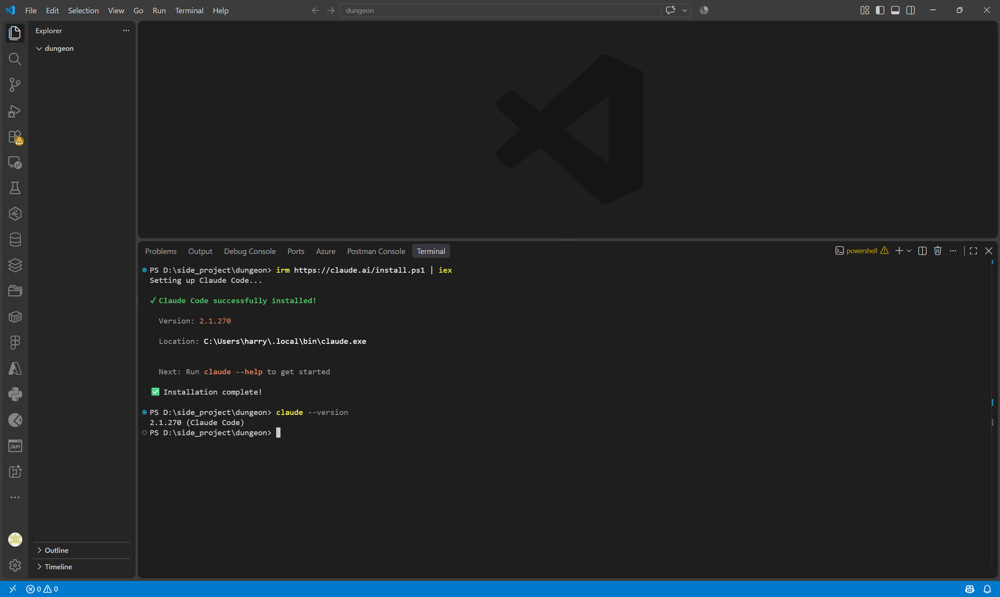
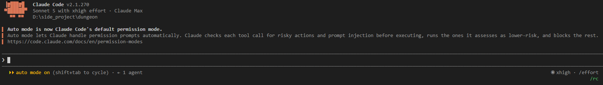
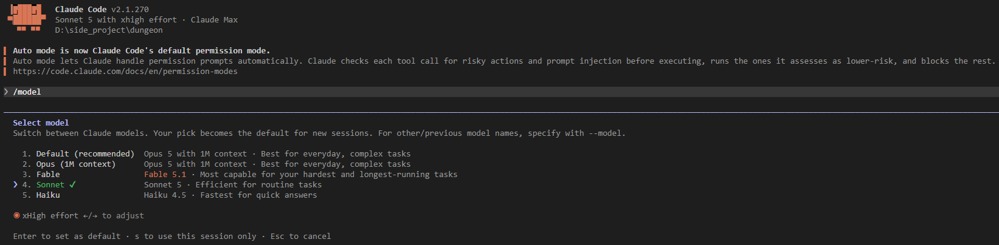
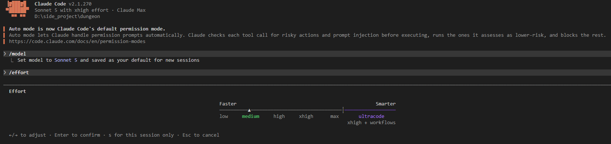
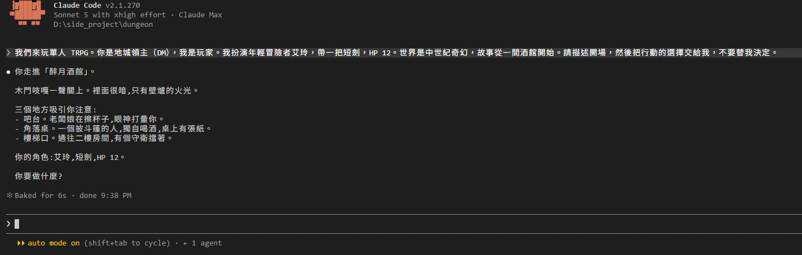
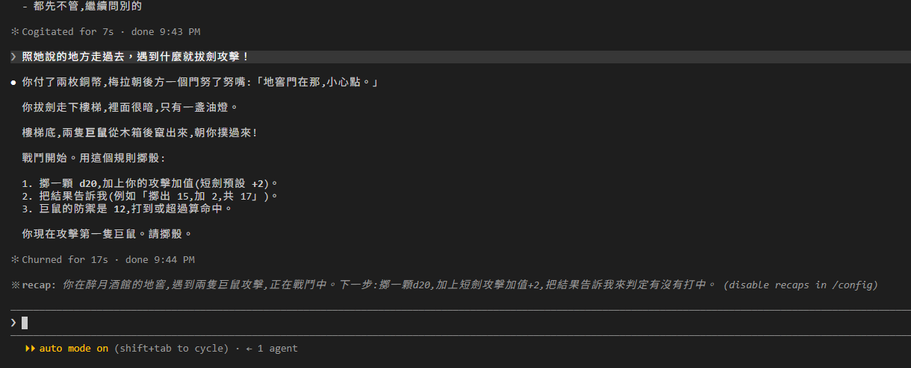
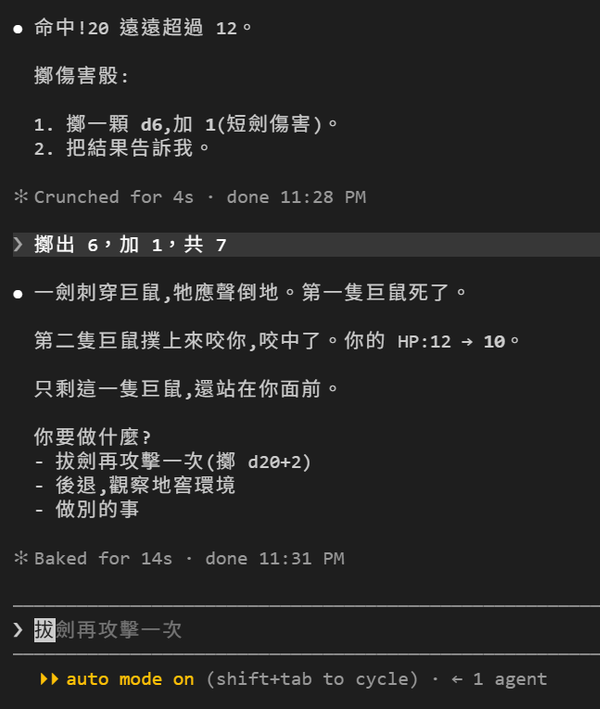
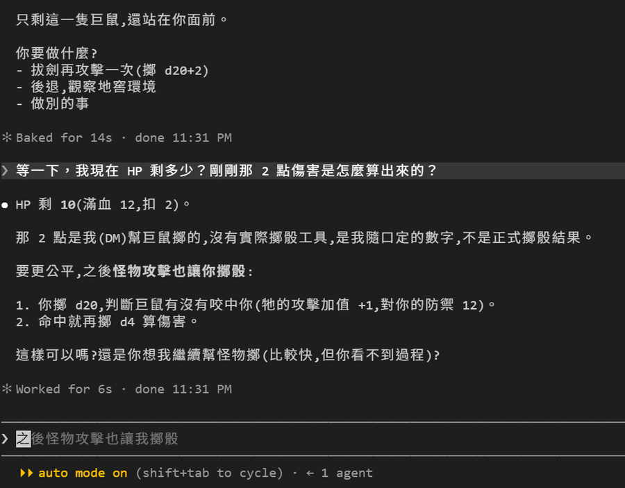

# [Day 1] 裝好 Claude Code，來開第一局吧!

Claude Code 跟地城領主有什麼關係？沒有。它是一個寫程式用的工具。但它會讀檔、改檔、跑指令，而且記得整個資料夾裡發生過什麼。這些能力拿來當桌遊主持人剛剛好，而且比一個一個講功能有趣。今天先把它裝起來，玩一局，看看它會做什麼、不會做什麼。



## Claude 是什麼

Claude 是 Anthropic 做的一系列語言模型。你在 [claude.ai](https://claude.ai/) 聊天視窗裡對話的那個就是它。目前是 Claude 5 家族：最強的是 Fable 5.1，官方把它留給最難的推理和跑很久的 agent 任務；一般工作用 Opus 5；日常用 Sonnet 5；Haiku 4.5 最小最快。這個系列的實驗大多用 Sonnet，因為便宜，也夠用。

## Claude Code 是什麼

Claude Code 是 Anthropic 把 Claude 裝進終端機的工具。你在一個資料夾裡打 `claude`，它就在那個資料夾裡工作：讀檔案、改檔案、跑指令、看結果，再決定下一步。

這種會自己讀檔、跑指令、看結果再決定下一步的程式，現在叫 agent：模型每一步可以呼叫工具，看結果，再決定下一步，直到它認為做完了。Claude Code 是為寫程式做的 agent，內建的工具是讀檔、改檔、跑 shell、搜尋、上網。但讀檔、跑指令這些事本來就不限於程式碼，所以很多人拿它做別的事：整理資料、跑腳本、寫文件，或是像我一樣拿來跑團。地城領主要記住玩家的血量、要擲骰、要查規則書，這些都能變成檔案和指令。後面 29 天大致就是在補上這些東西。

## 哪些方案能用

[官方快速入門](https://code.claude.com/docs/zh-TW/quickstart)說明：[Claude 訂閱方案](https://claude.com/pricing) Pro、Max、Team、Enterprise，或是 [Claude Console](https://platform.claude.com/) 的 API 帳號。免費方案不在清單上。**所以要跟這一系列文章一起操作至少要 Pro 訂閱，或是有儲值的 Console 帳號喔!!!**

## Claude Code 有四種介面

| 入口 | 長什麼樣 | 適合 |
|---|---|---|
| [終端機 CLI](https://code.claude.com/docs/zh-TW/quickstart) | 在 terminal 裡打 `claude` | 想完整掌握設定與操作的人 |
| [VS Code](https://code.claude.com/docs/zh-TW/vs-code)／[JetBrains](https://code.claude.com/docs/zh-TW/jetbrains) 擴充套件 | 編輯器側邊一個聊天面板 | 邊寫程式邊問 |
| [Claude 桌面 app](https://claude.ai/download) | Code 分頁內建 Claude Code，不用另外裝 CLI | 不想碰終端機的人 |
| 網頁版 [claude.ai/code](https://claude.ai/code) | 在雲端跑，要先綁 GitHub 帳號 | 長任務、不在電腦前 |

這系列的東西在哪個介面應該都能做。要跟著做的話，我的推薦順序：VS Code／JetBrains 擴充套件 > 終端機 > Claude 桌面 app > 網頁版。就我個人的工作習慣，接下來的教學都會在 Windows 上用 VS Code 加它內建的終端機來完成。用別的介面的話，指令和畫面就麻煩自己對應一下了。

## 安裝與登入

這章節有個三步驟：裝 VS Code、建資料夾並用 VS Code 打開、在它的終端機裡裝 Claude Code 後登入運行。

**1. 裝 VS Code。** 到 [VS Code 下載頁](https://code.visualstudio.com/download)抓你作業系統版，用預設選項一路下一步。Claude Code 的 VS Code 擴充套件要不要裝都可以。

**2. 建資料夾，用 VS Code 打開。** 這個系列接下來的東西都會放在這個資料夾裡。找你想要的地方建立 dungeon 資料夾，進入該資料夾，滑鼠右鍵選「用 VS Code 打開」或在目前目錄下的終端機裡打 `code .`。

VS Code 會開一個新視窗，裡面就是這個資料夾。

**3. 在 VS Code 的終端機裡裝 Claude Code。** 在 VS Code 介面上方選單點 Terminal → New Terminal 來打開內建終端機。接著用官方推薦原生方式在 terminal 裡安裝，輸入：

```powershell
irm https://claude.ai/install.ps1 | iex
```

有裝 winget 的話 `winget install Anthropic.ClaudeCode` 也行。裝完確認版本：

```powershell
claude --version
```

macOS 和 Linux 的安裝指令可以參考前面提過的[官方快速入門](https://code.claude.com/docs/zh-TW/quickstart)。

我寫這篇的時候版本是 2.1.270。Claude Code 很誇張地幾乎天天出新版本，可以訂閱 [Claude Log](https://www.youtube.com/@claudelog) 頻道每天都會收到更新通知（笑）。有問題就跑 `claude doctor`，它會檢查安裝和設定檔，不會開對話。



裝完直接在同一個終端機打：

```powershell
claude
```

第一次啟動會開瀏覽器要你登入 Claude 帳號，登入完回終端機就能用。之後想換帳號打 `/login`。

它還會問你信不信任這個資料夾。這是因為它會讀資料夾裡的設定檔，而設定檔可以改變它的行為。今天資料夾是空的，選信任就好。等我們開始往裡面放設定檔，再回來講這件事。



畫面最下面那行 `auto mode on` 是權限模式，決定它動手前要不要先問你。Pro、Max、Team 方案的預設就是這個。今天只是聊天，碰不到它。

## 先選模型和 effort，這跟錢有關

進到對話之後先打 `/model`，選單會列出你這個帳號能用的模型。上下鍵選，`Enter` 存成之後每次的預設，`s` 只套用這一次。也可以直接打 `/model sonnet`。



不同模型價格差很多。下面是[官方定價頁](https://platform.claude.com/docs/en/about-claude/pricing)的數字，每百萬 token，輸入／輸出：

| 模型 | 別名 | 輸入 | 輸出 | 拿來做什麼 |
|---|---|---|---|---|
| Fable 5.1 | `fable` | $10 | $50 | 最難的推理、跑很久的任務 |
| Opus 5 | `opus` | $5 | $25 | 需要判斷力的工作 |
| Sonnet 5 | `sonnet` | $2 | $10 | 日常 |
| Haiku 4.5 | `haiku` | $1 | $5 | 簡單、要快 |

訂閱方案不是照 token 付錢，但額度是照 token 扣的。貴的模型扣得快，以定價比例看，Fable 是 Sonnet 的五倍。額度以五小時一個窗口、一週一個窗口計算，用完就要等重置，換模型也救不了。這個系列全程用 `sonnet`應該就算是足夠了。

另一個影響錢的是 effort 設定，它決定模型每一步要**想**得多深。打 `/effort` 會出現一條滑桿，左右鍵調：`low`、`medium`、`high`、`xhigh`、`max`，預設 `high`。低一點比較快也比較便宜。跑團這種事 `medium` 就夠了，想得再深也不會讓酒保的名字更好聽。



想知道花了多少，打 `/usage`。訂閱方案看得到五小時和一週的額度用了幾成，API 帳號看得到這個 session 的 token 數和換算成美金的數字。

## 開第一局

資料夾裡什麼都沒有。沒有規則書、沒有角色卡、沒有骰子。模型用 `sonnet`，effort 留在 `medium`。直接輸入：

> 我們來玩單人 TRPG。你是地城領主（DM），我是玩家。我扮演年輕冒險者艾玲，帶一把短劍，HP 12。世界是中世紀奇幻，故事從一間酒館開始。請描述開場，然後把行動的選擇交給我，不要替我決定。

它回了一段開場。酒館叫「醉月酒館」，裡面很暗，只有壁爐的火光。它點出三個地方：吧台的老闆娘在擦杯子、角落桌一個披斗篷的人桌上有張紙、樓梯口有守衛擋著。最後一句是「你要做什麼？」



我問老闆娘叫什麼名字、長什麼樣子：

> 老闆娘叫梅拉。
>
> 她的樣子：中年女性，滿頭紅色捲髮，綁成鬆散的髮髻。手臂上有燙傷疤，像是常年在爐火邊工作留下的。眼神銳利，會一直觀察客人，但語氣溫和。

名字、髮色、疤、語氣，全部是它當場編的，我沒有給它任何一個字。這很好玩，也是後面會出問題的地方。

我點了麥酒，問這附近有什麼傳聞。麥酒兩枚銅幣，傳聞三個：地窖鬧鬼（願付 5 枚銀幣）、商隊失蹤、角落那位客人一直在打聽一個叫「白狼」的人。

然後我打了一句寫得很糟的話：

> 我照她說的地方走過去，遇到什麼就拔劍攻擊！

「她說的地方」有三個，我一個都沒指名。它自己選了地窖：讓我付掉兩枚銅幣、走下樓梯、遇到兩隻巨鼠。接著它做了一件我沒預料到的事，把骰子丟回給我：

> 1. 擲一顆 d20，加上你的攻擊加值（短劍預設 +2）。
> 2. 把結果告訴我（例如「擲出 15，加 2，共 17」）。
> 3. 巨鼠的防禦是 12，打到或超過算命中。



我手邊沒有骰子，也沒打算去找一顆。我直接回「擲出 18，加 2，共 20」，它照單全收：「命中！20 遠遠超過 12。」傷害骰同理，我回報 7。第一隻巨鼠死了，接著：

> 第二隻巨鼠撲上來咬你，咬中了。你的 HP：12 → 10。

這一次它沒叫我擲。咬不咬得中、扣幾點，都是它自己決定的。



所以我問了：

> 等一下，我現在 HP 剩多少？剛剛那 2 點傷害是怎麼算出來的？

它答得很老實：

> HP 剩 10（滿血 12，扣 2）。
>
> 那 2 點是我（DM）幫巨鼠擲的，沒有實際擲骰工具，是我隨口定的數字，不是正式擲骰結果。



## 玩完之後

七個回合，它做對的事比我預期多。場景有細節、選項有給、我亂打一句它會挑一個合理的解釋往下接，HP 從 12 扣到 10 也沒算錯。它甚至自己訂了一套規則：短劍加值 +2、巨鼠防禦 12、傷害 d6+1。一個空資料夾加一段 prompt，就是一個能玩的單人冒險 TRPG。

但整場沒有任何一顆骰子存在。我報的 18 和 7 是我隨口講的，它沒辦法查證；它幫巨鼠決定的 2 點，它自己承認是隨口定的。兩邊都在編數字，只是其中一邊比較誠實。

還有一件事我現在答不出來：梅拉會不會活到明天。她的名字、紅捲髮、燙傷疤，全部只存在這次對話裡。我關掉終端機再開一局，她還會是梅拉嗎？

明天就做這件事：重開一局，看它記得什麼、忘了什麼。