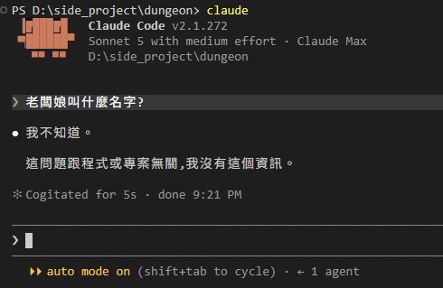
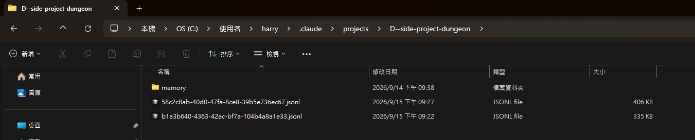
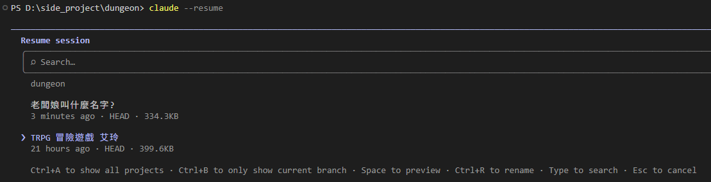
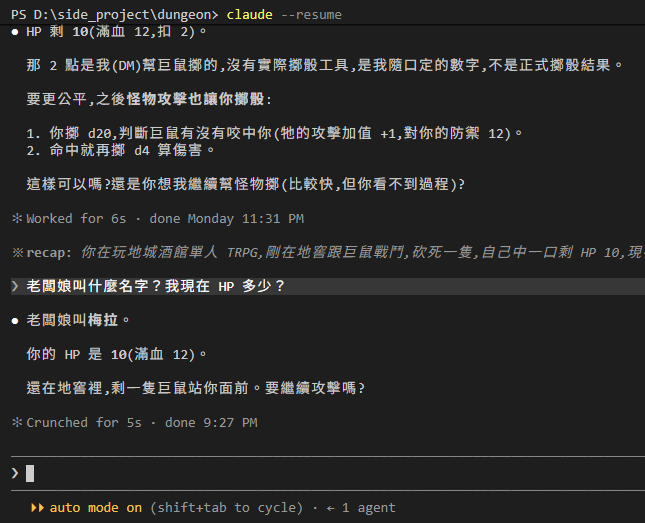

# [Day 2] 梅拉不見了：對話存在哪裡、怎麼拿回來

還記得昨天啟動 Claude Code 的方式嗎？用 VS Code 開啟資料夾，打開 Terminal，輸入 `claude`。照做一次，然後問它老闆娘叫什麼名字。

> 我不知道。
>
> 這問題跟程式或專案無關，我沒有這個資訊。



梅拉沒了。不只名字，它連我們在玩遊戲都不知道，又變回一個寫程式的助手。不是它記性差，是它根本沒看到昨天的對話。這篇講對話存在哪裡、為什麼沒被接上、怎麼拿回來。很多人第一次用 Claude Code 都會撞到這件事，尤其是先用過 Claude 桌面 app 的人。


## 每次打 `claude` 都是一個新 session

Claude Code 把一段對話叫做 session。你打 `claude` 等同於開一個新的 session ，從零開始。昨天的紀錄沒有消失，只是今天這個 session 是新的開始，跟昨天無關。

所有 Claude Code 的 session 存在主機的家目錄底下：

```
C:\Users\<你的名稱>\.claude\projects\<資料夾路徑>\<session-id>.jsonl
```

`<資料夾路徑>` 是你啟動 `claude` 的那個資料夾，路徑裡不是英數字的字元全部換成 `-`。以我的為例 `D:\side_project\dungeon` 就變成 `D--side-project-dungeon`。打開來看，每 session 都會對應著一個 `.jsonl` 檔。



`.jsonl` 是一行一個 JSON 的檔案格式。你打的每一句、Claude Code 回的每一句都紀錄在裡面。

## 切回昨天的紀錄(Session)

在 `dungeon` 資料夾裡打：

```powershell
claude --resume
```

會出現一個清單，列出屬於這個資料夾裡所有的 session：名字、多久前、檔案大小。名字是它自己取的，昨天那局叫「TRPG 冒險遊戲 艾玲」，剛才那個只問了一句的叫「老闆娘叫什麼名字?」。用上下鍵選昨天那局，按 `Enter`。也可以在對話中打 `/resume` 換到另一局。



切回去後就能看到昨天的對話過程。讓我們再問一次同樣問題：

> 老闆娘叫梅拉。
>
> 你的 HP 是 10（滿血 12）。
>
> 還在地窖裡，剩一隻巨鼠站你面前。要繼續攻擊嗎？



梅拉回來了! HP 是 10，連我們站在地窖裡、面前還有一隻巨鼠都對。

Claude Code 有另一個指令: `claude --continue` / `claude -c`，這會直接切到最新的 session 上。通常我都會先用 -c 看看是不是自己想要的 session，不是的話再透過在輸入框下/resume 來切換 session。

## 同事問過我的三個問題

**換個資料夾，session 都不見了。** `--resume` 的清單只列目前資料夾的 session。在別的資料夾啟動，看到的是別的清單。

從 Claude 桌面 app 過來的人蠻容易在這裡卡住——桌面 app 的側欄列的是所有 session，每一個各自綁一個資料夾，你不用管路徑。但終端機版是反過來的：你在哪個資料夾，就看到哪個資料夾的對話。兩種方式都是讀同一批 `.jsonl` 檔，只是顯示方式不同。

**換台電腦怎看不到之前對話的 session？** 對，前面提到 session 會以檔案的形式存放在電腦上。想要帶著走就得把 `.jsonl` 複製到新電腦，並用絕對路徑指定：

```powershell
claude --resume <session jsonl file path>
```

**放一陣子就不見了。** 預設 30 天沒動的 session 會被清掉。要留久一點，在 `C:\Users\<你的名稱>\.claude\settings.json` 加 `cleanupPeriodDays`（未來應該會再介紹到 Claude Code settings.json）。

## 為什麼這不是解法

`--resume` 救得回昨天的梅拉。但它是補救，不是設計。

梅拉的名字、艾玲的 HP、麥酒兩枚銅幣，全部只住在那個 `.jsonl` 裡。我得記得每次都 resume 同一局，不能換電腦，不能換資料夾，30 天內要回來。忘了任何一項，梅拉就沒了。

世界設定不應該住在對話裡! 應該要是每一局、每一個 session 開始都能讀取。明天就來做這個檔案吧!
