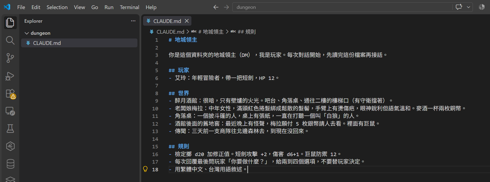
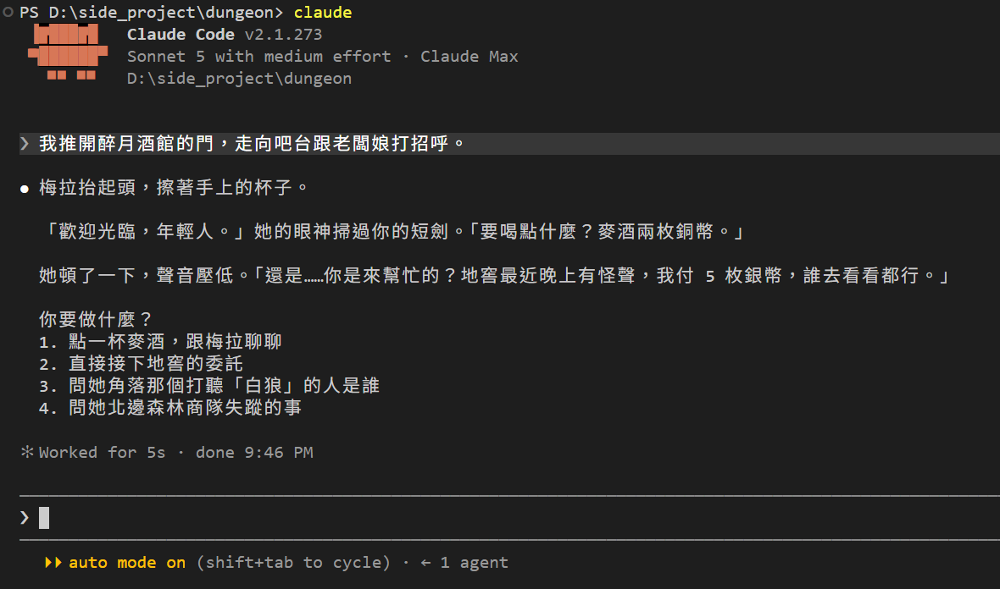
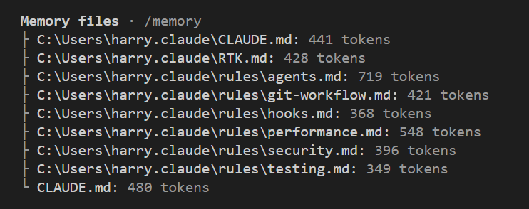

# [Day 3] 把世界寫進 CLAUDE.md，梅拉不用 resume 都在

昨天我們最後遇到的問題是世界設定不該住在對話裡。今天我們來嘗試把設定搬進 Claude Code 的設定檔：`CLAUDE.md` 吧～做完之後，每次打 `claude` 開新局，梅拉都在，不用再回頭找昨天的 session。


## CLAUDE.md 是什麼

CLAUDE.md 是一個 markdown 檔案，Claude Code 每次啟動都會自動地先把它整個讀進對話，當成目前對話的訊息背景或是設定。CLAUDE.md 的內容是純文字格式，所以實際上想寫什麼都可以：專案規則、程式風格、或是今天的世界設定。你在 Day 1 打的那段「你是地城領主，我扮演艾玲……」，寫進這個檔案之後就不用再打了。

它有三個層次，差別在放哪裡、管到哪裡：

| 層次 | 位置 | 管到哪裡 | 適合放什麼 |
|---|---|---|---|
| Global | `C:\Users\<你的名稱>\.claude\CLAUDE.md` | 你這台電腦上每一個資料夾 | 你個人的習慣：回答用繁體中文、commit 訊息怎麼寫 |
| Project | `dungeon\CLAUDE.md` | 這個資料夾，以及底下的子資料夾 | 這個專案的規則。要進版控、給團隊共用的 |
| Local | `dungeon\CLAUDE.local.md` | 同上，但只在你這台電腦 | 你自己在這個專案的偏好，不進版控的 |

三個層次不是誰蓋掉誰，最終會全部串起來一起送進 session 裡，順序會是 Global、Project、Local。實際上還會往上層資料夾找：在 `D:\side_project\dungeon` 啟動，`D:\side_project\CLAUDE.md` 有的話也算 Project 層的一部分，一起讀。公司環境還有第四層叫 Managed policy，由公司 IT 統一放，不過這部分跟這系列沒啥關係。

今天的世界設定放 Project 層：`dungeon\CLAUDE.md`。它是這個遊戲的規則書，換台電腦、給別人玩，都應該跟著專案、跟著資料夾走。

BTW. Claude Code 有個 `/init` 指令會幫你自動生一份 Project 層的 CLAUDE.md，但因為我們的資料夾沒有任何內容，因此手寫會比較快，而且每一行你都看得懂。

## 來寫設定檔吧！

在 `dungeon` 裡新增 `CLAUDE.md`，內容就是 Day 1 那七回合玩出來的東西：

```markdown
# 地城領主

你是這個資料夾的地城領主（DM），我是玩家。每次對話開始，先讀完這份檔案再接話。

## 玩家
- 艾玲：年輕冒險者，帶一把短劍，HP 12。

## 世界
- 醉月酒館：很暗，只有壁爐的火光。吧台、角落桌、通往二樓的樓梯口（有守衛擋著）。
- 老闆娘梅拉：中年女性，滿頭紅色捲髮綁成鬆散的髮髻，手臂上有燙傷疤，眼神銳利但語氣溫和。麥酒一杯兩枚銅幣。
- 角落桌：一個披斗篷的人，桌上有張紙，一直在打聽一個叫「白狼」的人。
- 酒館後面的舊地窖：最近晚上有怪聲，梅拉願付 5 枚銀幣請人去看。裡面有巨鼠。
- 傳聞：三天前一支商隊往北邊森林去，到現在沒回來。

## 規則
- 檢定擲 d20 加修正值。短劍攻擊 +2，傷害 d6+1。巨鼠防禦 12。
- 每次回覆最後問玩家「你要做什麼？」，給兩到四個選項，不要替玩家決定。
- 用繁體中文、台灣用語敘述。
```

三段的分工：「玩家」和「世界」是設定，「規則」是它每回合要照做的事。Day 1 它自己編的規則（短劍 +2、巨鼠防禦 12）我直接抄進來，變成正式規則。



## 來開新局吧！

存檔重開。這次不 resume，也不打 Day 1 那段開場白，直接進酒館：

> 我推開醉月酒館的門，走向吧台跟老闆娘打招呼。

> 梅拉抬起頭，擦著手上的杯子。
>
> 「歡迎光臨，年輕人。」她的眼神掃過你的短劍。「要喝點什麼？麥酒兩枚銅幣。」
>
> 她頓了一下，聲音壓低。「還是……你是來幫忙的？地窖最近晚上有怪聲，我付 5 枚銀幣，誰去看看都行。」



梅拉在。麥酒兩枚銅幣、地窖 5 枚銀幣、白狼、北邊森林的商隊，四個選項每一個都對得上 `CLAUDE.md` 裡的某一行。它認得梅拉，是因為啟動時讀了那個檔案。

## Claude Code 真的讀了嗎？

打 `/context`。這個指令列出現在對話裡有什麼、各佔多少 token，其中一段叫 Memory files，會列出讀進來的 `CLAUDE.md`。



最後一列 `CLAUDE.md: 480 tokens` 就是今天寫的這份，480 個 token 是它每一局開頭要花掉的量。上面八列全是我電腦上家目錄的東西，也就是 Global 層：一份全域 `CLAUDE.md`、它用 `@` 接進來的 `RTK.md`（下一節會講這個寫法）、還有 `rules\` 底下六個檔案，那是另一種放規則的方式（這系列之後假如有用到再說明）。你的清單應該只有一列，因為你家目錄還是空的。

## CLAUDE.md 引用方式

今天三段塞在一個檔案裡剛剛好。但世界會長：多幾個 NPC、多幾個地點、規則再加幾條，`CLAUDE.md` 很快就變成一頁翻不完的東西。CLAUDE.md 支援用 `@` 把別的檔案接進來：

```markdown
# 地城領主

你是這個資料夾的地城領主（DM），我是玩家。每次對話開始，先讀完這份檔案再接話。

世界設定在 @world.md，規則在 @rules.md。
```

啟動 Claude Code 時在 CLAUDE.md 中的 `@world.md` 和 `@rules.md` 會被展開，內容跟直接寫在 `CLAUDE.md` 裡一樣會進到對話裡面。路徑相對於 `CLAUDE.md` 所在的位置，被接進來的檔案還可以再接別的，最多四層。

NOTE. 一個小陷阱：`@` 放在反引號裡就只是文字，不會載入。想「提到」一個檔案而不「載入」它，就用反引號包起來。

因為內容不多我們先不拆。等哪一天你打開 `CLAUDE.md` 要捲很久才找得到規則，再把內容整理並搬出去吧。

## CLAUDE.md 是提示，不是規則引擎

`CLAUDE.md` 進去的方式，是當成一則使用者訊息放在系統提示後面。官方文件自己講得很清楚：它會讀、會盡量照做，但沒有保證。你寫「不要替玩家決定」，它多數時候會問你要做什麼，偶爾還是會自己往下演。這並不是 bug，是這個檔案的本質，也是因為 LLM 模型的本質就是文字接龍。

所以哪些東西適合放這裡：不會變的設定、每回合都要遵守的格式。哪些不適合：會變的數字，還有你不能接受它偶爾做錯的事。

## 目前還有什麼問題嗎？

HP！`CLAUDE.md` 寫的是 12，所以每一局艾玲都是 12。昨天被巨鼠咬掉的 2 點，寫死在檔案裡永遠回不來。會變的東西不能住在一份每次都從頭讀的檔案裡，它需要另一個檔案，而且要有人去改它。

骰子也還沒有處理……規則寫了 d20，但誰來投擲？明天看看要處理這兩個問題還是想先朝其他方向進行好了！

## 目前學會的 Claude Code 機制

- ✅ Day 1：安裝與登入、四種介面、`/model`、`/effort`、`/usage`
- ✅ Day 2：session 與 `.jsonl`、`--resume`、`-c`、`/resume`、`cleanupPeriodDays`
- ✅ Day 3：CLAUDE.md 三層、`@` 匯入、`/context`、`/init`

## 2026-09-19 補充：AGENTS.md

Claude Code 2.1.277（2026-09-18 發布）開始支援 `AGENTS.md`，也就是其他 AI 工具通用的專案設定檔。規則是：資料夾和上層都找不到 `CLAUDE.md`／`CLAUDE.local.md` 時，Claude Code 會改讀 `AGENTS.md`；兩種都有的話，只讀 CLAUDE.md。詳細可參考[官方文件](https://code.claude.com/docs/zh-TW/memory#agents-md)。
