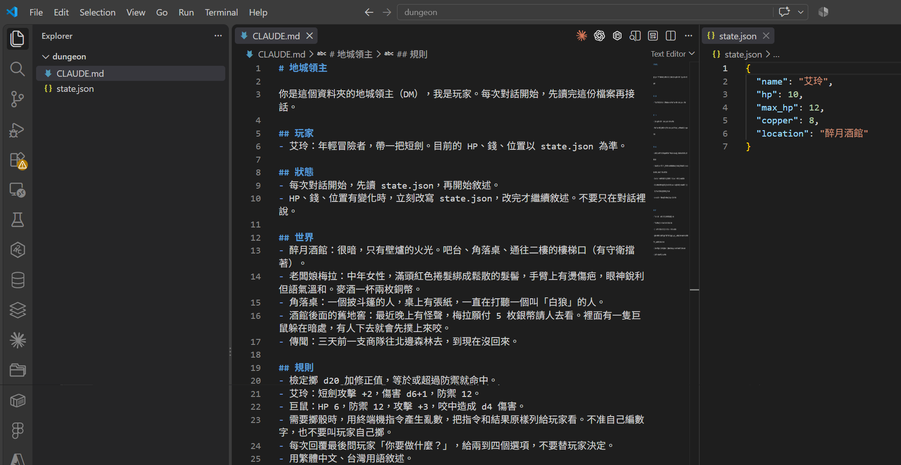
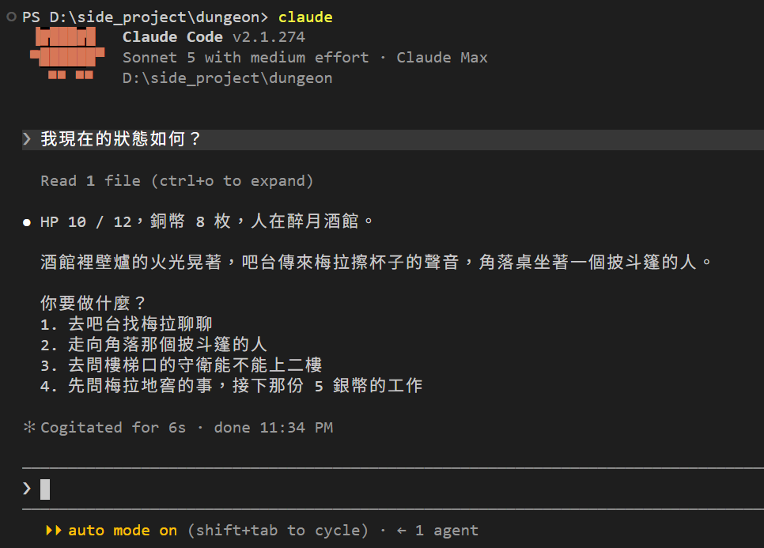
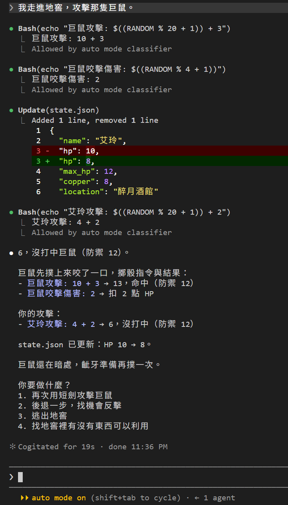
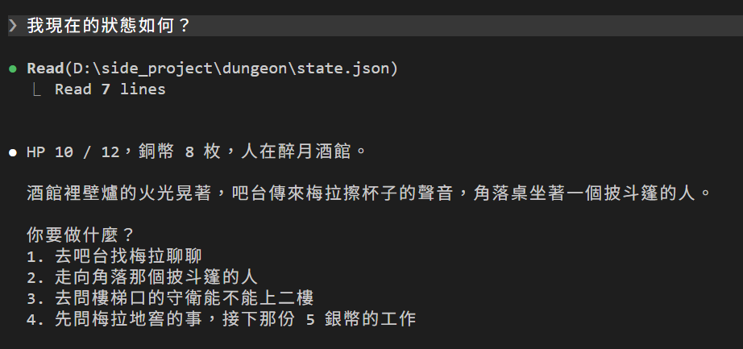

# [Day 4] 讓 Claude Code 紀錄血量與骰骰子吧！

昨天最後留了兩個問題：HP 寫死在 `CLAUDE.md` 裡導致每次開局血量都是 12，骰子寫了 d20 卻沒人擲骰。今天的重點不是加規則，是讓 Claude Code 用工具：會變的數字寫進檔案；骰子透過跑指令完成。重點是每一次用工具，畫面上都看得到。


## Claude Code 有哪些工具

Day 1 說過 Claude Code 是會動手的 agent。動手靠的是一堆內建工具，常見的有：

| 工具 | 做什麼 |
|---|---|
| Read | 讀檔案 |
| Write | 建立檔案或覆寫檔案 |
| Edit | 改檔案內容 |
| Bash | 跑終端機指令 |
| Glob、Grep | 找檔案、內容 |
| WebFetch、WebSearch | 抓網頁、上網搜尋 |

完整清單有四十多個，可參考[官方 tools reference](https://code.claude.com/docs/zh-TW/tools-reference)。

模型通常會自行決定要不要呼叫這些工具。呼叫的時候，畫面會印出類似 `Read 1 file (ctrl+o to expand)` 的文字，告訴你 Claude Code 剛用了什麼工具。今天我們嘗試讓 Claude Code 執行看看吧！

## 血量搬進 state.json

在 `dungeon` 資料夾下新增 `state.json`：

```json
{
  "name": "艾玲",
  "hp": 10,
  "max_hp": 12,
  "copper": 8,
  "location": "醉月酒館"
}
```

為了簡化行為，我們先只記錄艾玲的血量、錢和位置，然後改 `CLAUDE.md`：

```markdown
# 地城領主

你是這個資料夾的地城領主（DM），我是玩家。每次對話開始，先讀完這份檔案再接話。

## 玩家
- 艾玲：年輕冒險者，帶一把短劍。目前的 HP、錢、位置以 state.json 為準。

## 狀態
- 每次對話開始，先讀 state.json，再開始敘述。
- HP、錢、位置有變化時，立刻改寫 state.json，改完才繼續敘述。不要只在對話裡說。

## 世界
- 醉月酒館：很暗，只有壁爐的火光。吧台、角落桌、通往二樓的樓梯口（有守衛擋著）。
- 老闆娘梅拉：中年女性，滿頭紅色捲髮綁成鬆散的髮髻，手臂上有燙傷疤，眼神銳利但語氣溫和。麥酒一杯兩枚銅幣。
- 角落桌：一個披斗篷的人，桌上有張紙，一直在打聽一個叫「白狼」的人。
- 酒館後面的舊地窖：最近晚上有怪聲，梅拉願付 5 枚銀幣請人去看。裡面有一隻巨鼠躲在暗處，有人下去就會先撲上來咬。
- 傳聞：三天前一支商隊往北邊森林去，到現在沒回來。

## 規則
- 檢定擲 d20 加修正值，等於或超過防禦就命中。
- 艾玲：短劍攻擊 +2，傷害 d6+1，防禦 12。
- 巨鼠：HP 6，防禦 12，攻擊 +3，咬中造成 d4 傷害。
- 需要擲骰時，用終端機指令產生亂數，把指令和結果原樣列給玩家看。不准自己編數字，也不要叫玩家自己擲。
- 每次回覆最後問玩家「你要做什麼？」，給兩到四個選項，不要替玩家決定。
- 用繁體中文、台灣用語敘述。
```



## 開新局檢查看看

開新的 Claude Code 並輸入：

> 我現在的狀態如何？



回答上方多了一行 `Read 1 file (ctrl+o to expand)`，Claude Code 先讀了檔案才回覆，HP 10 就是從 `state.json` 來的，這是 Claude Code 第一次用工具。昨天的 `CLAUDE.md` 是啟動時自動塞進去的，今天的 `state.json` 是 Claude Code 自己決定去讀的，這兩件事在畫面上長得不一樣。

## 打一場，看 Claude Code 擲骰、改檔

> 我走進地窖，攻擊那隻巨鼠。



一句話，Claude Code 執行了四次工具。

因為 CLAUDE.md 寫了巨鼠會先撲上來咬，所以 DM 先幫巨鼠骰：攻擊骰 `$((RANDOM % 20 + 1))` 得到 10，加 3 是 13，過了艾玲的防禦 12；傷害骰 `$((RANDOM % 4 + 1))` 得到 2。指令、結果、加總，全部印在畫面上。這次 Claude Code 是真的有骰骰子而不是亂掰了！

實際因為我們在 CLAUDE.md 沒有指定用哪個指令，Claude Code 會根據情況自行選擇指令來做，以我為例選了 Git Bash 有的 `$RANDOM`。

畫面上 Bash 底下還有一句 `Allowed by auto mode classifier`，這是 Day 1 講過的 auto mode 在放行，改天應該會再提到這部分機制。

第三格是 `Update(state.json)`，底下一小段 diff：`"hp": 10` 變成 `"hp": 8`。工具表裡叫 Edit，畫面上印出來的是 Update。看起來 Claude Code 有遵守 CLAUDE.md 寫的「HP、錢、位置有變化時，立刻改寫 state.json，改完才繼續敘述」。

第四行 `Bash(...)` 是艾玲攻擊：骰到 4，加 2 是 6，沒過巨鼠的防禦 12，沒打中。

打開 `state.json` 對答案，檔案裡已經是 `"hp": 8`，跟 DM 說的一樣。這是 Day 1 做不到的事。

## 看看執行細節：Ctrl+O

當執行工具後只顯示摘要，可以按 `Ctrl+O` 打開 transcript viewer，會多顯示呼叫的細節。剛才那行 `Read 1 file (ctrl+o to expand)`，展開後長這樣：



讀了哪個檔案、完整路徑、讀了幾行，都看得到。再按一次 `Ctrl+O` 就收回去。

## 目前還有什麼問題嗎？

今天的每一次動手，都是 CLAUDE.md 「請」Claude Code 做的。沒有任何東西逼 Claude Code DM 一定要跑指令才能報數字，DM 想像 Day 1 那樣隨口編，還是編得出來。也沒有任何東西擋 DM 把 `"hp": 8` 改成 `"hp": 80`。這次做對了，單純只是因為 Claude Code 這次很聽話很乖XD

還有一件事：既然 Claude Code 會改檔案，那改壞了怎麼辦？打輸了想後悔倒帶呢？明天來說說 `/rewind` 指令吧！

今天結束時 `dungeon` 資料夾的完整內容在 [articles/04/dungeon](https://github.com/harry18456/claude-code-dungeon-master/tree/main/articles/04/dungeon)，給大家參考。

## 目前學會的 Claude Code 機制

- ✅ Day 1：安裝與登入、四種介面、`/model`、`/effort`、`/usage`
- ✅ Day 2：session 與 `.jsonl`、`--resume`、`-c`、`/resume`、`cleanupPeriodDays`
- ✅ Day 3：CLAUDE.md 三層、`@` 匯入、`/context`、`/init`
- ✅ Day 4：內建工具 Read／Bash／Edit、`Ctrl+O`
