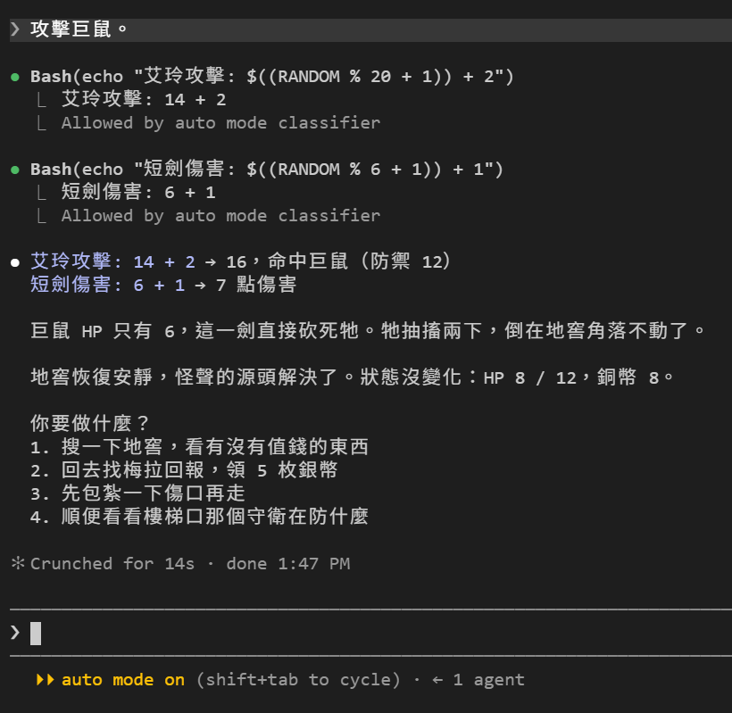
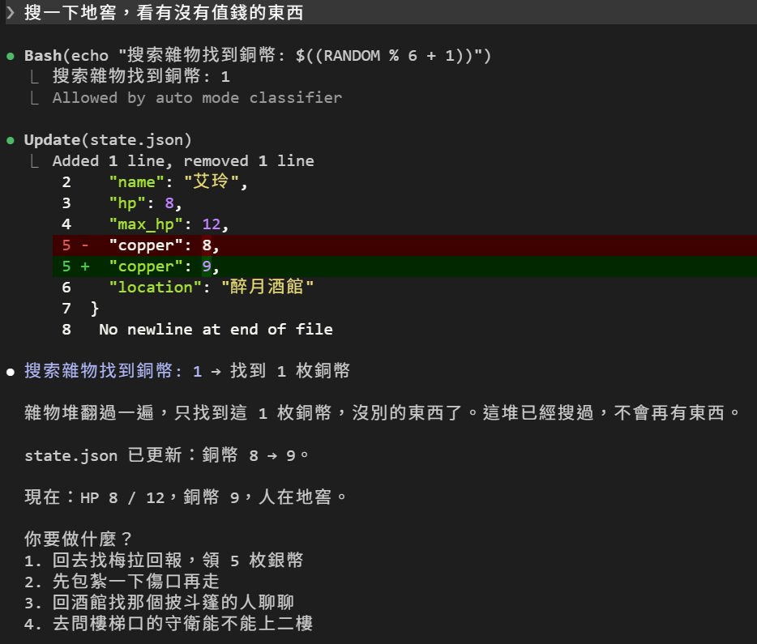
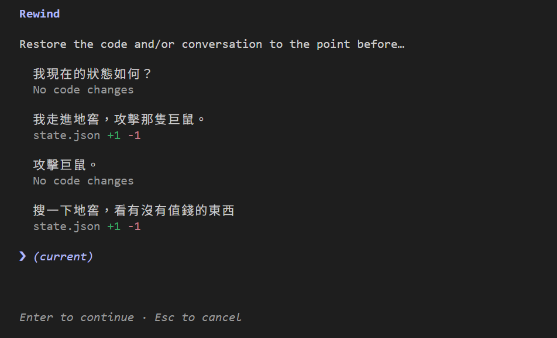
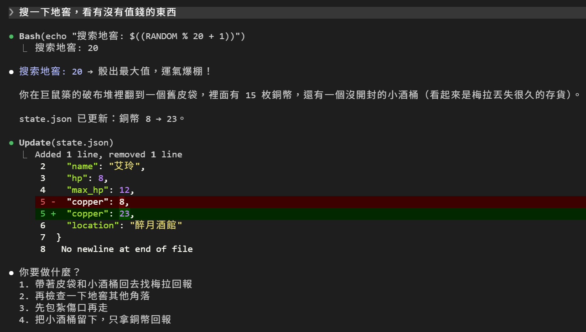

# [Day 5] 我不依我不依（地上打滾），我要回到上一個動作：/rewind

昨天艾玲被咬到剩 8 點 HP，巨鼠還活著。今天不開新局，用 `claude -c` 接回昨天那局（[Day 2](https://ithelp.ithome.com.tw/articles/10410920) 講過的）繼續打。桌遊打輸了只能認，但在 Claude Code 的機制裡似乎有後悔藥可以吃。


## 繼續遊戲

> 攻擊巨鼠。



一劍解決。DM 給的選項裡有「搜一下地窖」。玩過 RPG 的都知道，打完怪要撿東西，撿到爛的就讀檔重刷。這裡也可以，但要先給地窖放點東西。

## 先給地窖放點東西

`CLAUDE.md` 的「世界」裡，地窖那行加一句：

```markdown
- 酒館後面的舊地窖：最近晚上有怪聲，梅拉願付 5 枚銀幣請人去看。裡面有一隻巨鼠躲在暗處，有人下去就會先撲上來咬。角落有一堆雜物，搜過會找到 d6 枚銅幣，只能搜一次。
```

`CLAUDE.md` 是開局時讀的，所以改完要重開。關掉，再 `claude -c` 接回來，然後：

> 搜一下地窖，看有沒有值錢的東西



d6 骰到 1，`state.json` 的 `copper` 從 8 變成 9，竟然才 1 枚！假如是一般遊戲我們只能認栽，但這是在 Claude Code！我們來作弊吧，嘿嘿～

## Claude Code 其實一直在偷偷存檔

你每送出一句話，Claude Code 都會先記一個存檔點：`checkpoint`，同時把「自己用工具改過的檔案」在那一刻的內容存一份快照：`snapshot`。

這兒有幾個重點：

- 每一句你送出的訊息都是一個 checkpoint，一個 session 最多只留最新的前 100 個。
- 快照跟 session 一樣 30 天後清掉（還記得 Day 2 提過的 `cleanupPeriodDays` 嗎？）。

## 那 checkpoint 存在哪裡？

Day 2 說過對話（session）存在 `C:\Users\<你的名稱>\.claude\projects\D--side-project-dungeon\<session-id>.jsonl`。checkpoint 的紀錄也在同一個檔案裡，翻昨天那局的 `.jsonl`，可以找到這兩行：

```json
{"type": "file-history-snapshot", "messageId": "0dbf08ed-…", "snapshot": {"trackedFileBackups": {}, "timestamp": "2026-09-17T15:35:42.577Z"}}
```

你每送一句話就會多一行 `file-history-snapshot`，這就是一個 checkpoint，`messageId` 就是送出訊息的 id。這一行寫下去的時候還沒有任何檔案被改，所以 `trackedFileBackups` 是空的。

```json
{"type": "file-history-delta", "snapshotMessageId": "0dbf08ed-…", "trackingPath": "state.json", "backup": {"backupFileName": "5df4a25c4f197388@v1", "version": 1, "backupTime": "2026-09-17T15:35:55.205Z", "realParentDir": "D:\\side_project\\dungeon"}}
```

Claude Code DM 用 Edit 改 `state.json` 的那一刻，`file-history-delta` 就會記錄：改了哪個檔、屬於哪個 checkpoint、快照叫什麼名字。快照本體不在 `.jsonl` 裡，在另一個資料夾：

```
C:\Users\<你的名稱>\.claude\file-history\<session-id>\5df4a25c4f197388@v1
```

打開它，就是被咬之前的 `state.json`，`"hp": 10`。檔案被改過之後，你下一句話送出時會再存一份，叫 `@v2`。所以「倒帶」做的事很單純：把對應那句話的快照複製回 `D:\side_project\dungeon\state.json`。

那對話呢？倒帶之後，`.jsonl` 一行都不會刪。每則訊息都有自己的 `uuid`，還有一個 `parentUuid` 記著它接在哪一句後面。倒帶後你送的下一句，`parentUuid` 直接指回倒帶點那一句；被丟掉的那段還留在檔案裡，只是沒有人再接在它後面。對話其實是一棵樹，`/rewind` 和後面要講的 `/branch` 都是靠這個。

老實說為了洗很差的結果我這篇倒帶了九次（艸）。把這局的 `.jsonl` 畫成樹，長這樣：

```text
uuid      parentUuid
2f3e642e  無         我現在的狀態如何？
6f72b1d0  2f3e642e   └─ DM：HP 10 / 12……
0dbf08ed  6f72b1d0      └─ 我走進地窖，攻擊那隻巨鼠。
d7c96be4  0dbf08ed         └─ DM：巨鼠先咬一口……HP 10 → 8
d7adc823  d7c96be4            └─ 攻擊巨鼠。
085fd618  d7adc823               └─ DM：巨鼠死了
b165686c  085fd618                  ├─ 搜一下地窖…… → 6 枚（倒掉）
677ae70e  085fd618                  ├─ 搜一下地窖…… → 沒找到（沒改檔案不能拿來教學，倒掉）
41f7730c  085fd618                  ├─ 搜一下地窖…… → 6 枚和一把舊短刀（沒骰骰子……倒掉）
                                    ├─ ……
f0b93463  085fd618                  └─ 搜一下地窖…… → 1 枚，state.json 的 copper 變成 9 ← 現在在這裡
```

## 回到過去

輸入框空著的時候按兩下 `Esc`，或打 `/rewind`，會跳出這個 session 裡你送過的每一句話：



我們每次輸入的那則訊息底下都標著 Claude Code 處理後有沒有改檔：`No code changes`，或是 `state.json +1 -1`。圖片中可以看到第一次攻擊和搜地窖那句都有改檔，分別就是扣血量與加銅幣數的修改。

透過方向鍵選最後那句「搜一下地窖，看有沒有值錢的東西」後按 Enter，接著會問你要倒帶什麼：


先看選項上面那兩行。`The conversation will be forked`：對話會分岔，就是前面那棵樹。`The code will be restored +1 -1 in state.json`：檔案會還原，改了一行。所有選項的意思是：

| 選項 | 意思 | 用遊戲的話說 |
|---|---|---|
| 1. Restore code and conversation | 檔案和對話都回到那一句之前 | 讀檔，一切重來 |
| 2. Restore conversation | 只有對話回去，檔案不動 | DM 忘掉你搜過，但銅幣還在口袋裡 |
| 3. Restore code | 只有檔案回去，對話不動 | 銅幣沒了，DM 還記得你搜過 |
| 4. Summarize from here | 把這一句之後的對話壓成一段摘要 | 以我們的對話為例，假如 rewind 選了「我現在的狀態如何？」再選這個：後面的打鬥、搜地窖全壓成一段摘要，DM 只記得「進了地窖、殺了巨鼠、撿了 1 枚」，不記得確切過程 |
| 5. Summarize up to here | 把這一句之前的對話壓成一段摘要 | 假如選了「搜一下地窖」再選這個：開局到打死巨鼠壓成一段前情提要，搜地窖那段原封不動 |
| 6. Never mind | 什麼都不做，回到清單 | 什麼事都沒發生 |

如果選的那一句之後沒有任何檔案被改，1 和 3 不會出現，只剩 2、4、5、6。

4 和 5 不是倒帶，是瘦身。對話越長，每送一句話 Claude Code 就要把整段歷史重送一次，越來越慢、越來越貴，塞滿了還會開始忘東西。這兩個選項把一段對話換成摘要，檔案不動，`.jsonl` 裡的原文也還在。但今天用不到，打到第三十回合的時候會用到，之後講 context 再細說。

我們來選第一個。對話回到搜地窖之前，輸入框裡放著剛才那句，直接再送一次：



20！！！運氣爆棚，15 枚銅幣加一個小酒桶，`copper` 變成 23。注意 diff 是從 8 開始的，不是 9。S/L 大法成功XD

順帶一提，這次 DM 沒照規則骰 d6，自己改骰 d20，還加碼送了小酒桶。Day 3 說過的：CLAUDE.md 是提示，不是規則引擎。撿到就是賺到。

P.S. 當輸入框有文字時按下兩次 `Esc` 會快速清除輸入，而當輸入框沒有文字時按下兩次 `Esc` 才會觸發倒帶功能。

## 不想倒帶回溯？那建立另一條世界線吧！

倒帶會把目標那一句之後的對話丟掉。想保留原本那條路，可以用 `/branch`：對話複製一份，然後切到新的對話分支。新的這份是全新的 session id，`C:\Users\<你的名稱>\.claude\projects\` 底下會多一個 `.jsonl`，裡面是到分岔點為止的整段對話；原本那個檔案一個字都不會動，換句話說前面的對話一模一樣的保留。

## 倒帶救不回來的東西

- **用指令改的檔案。** 快照只記 Claude Code 用 Edit、Write 這類工具改的檔案。Claude Code DM 哪天心血來潮用終端機指令改 `state.json`，或是你自己在 VS Code 裡動了它，倒帶都不會管。剛才確認畫面最下面那行警告 `Rewinding does not affect files edited manually or via bash` 說的就是這個。
- **骰過的骰子。** 指令跑過就跑過了，但結果只存在對話裡。對話倒回去，DM 就不記得那次骰了幾，再搜一次會重骰。遊戲桌上這叫作弊，但這裡叫功能，剛才就是靠這個重刷的。
- **30 天以前的存檔。** 快照跟 session 一起清，過期的存檔點選了會失敗。真的要長期留，得用 git，Claude Code 內建的 session 管理不是版本控制的替代品。

## 目前還有什麼問題嗎？

倒帶解決了「改壞了怎麼辦」和「當次處理結果不滿意」。但還有一件事：艾玲 HP 8 / 12，怎麼補血？規則裡沒寫休息怎麼算。可以寫進 `CLAUDE.md`，但 `CLAUDE.md` 每一局開始都會整份載入，不管今天有沒有要休息。這種「偶爾才用、用的時候有固定步驟」的東西，放在每個 session 必讀的檔案裡實在有點浪費。

有沒有辦法做成一個指令，要用再叫出來？明天來講講 Skill 吧！

今天結束時 `dungeon` 資料夾的完整內容在 [articles/05/dungeon](https://github.com/harry18456/claude-code-dungeon-master/tree/main/articles/05/dungeon)，給大家參考。

## 目前學會的 Claude Code 機制

- ✅ Day 1：安裝與登入、四種介面、`/model`、`/effort`、`/usage`
- ✅ Day 2：session 與 `.jsonl`、`--resume`、`-c`、`/resume`、`cleanupPeriodDays`
- ✅ Day 3：CLAUDE.md 三層、`@` 匯入、`/context`、`/init`
- ✅ Day 4：內建工具 Read／Bash／Edit、`Ctrl+O`
- ✅ Day 5：checkpoint、`/rewind`（`Esc` 兩下）、`/branch`

## 補充：[Day 3 的 CLAUDE.md 介紹更新](https://ithelp.ithome.com.tw/articles/10412229)

Claude Code 2.1.277（2026-09-18 發布）開始支援 `AGENTS.md`，也就是其他 AI 工具通用的專案設定檔。規則是：資料夾和上層都找不到 `CLAUDE.md`／`CLAUDE.local.md` 時，Claude Code 會改讀 `AGENTS.md`；兩種都有的話，只讀 CLAUDE.md。詳細可參考[官方文件](https://code.claude.com/docs/zh-TW/memory#agents-md)。