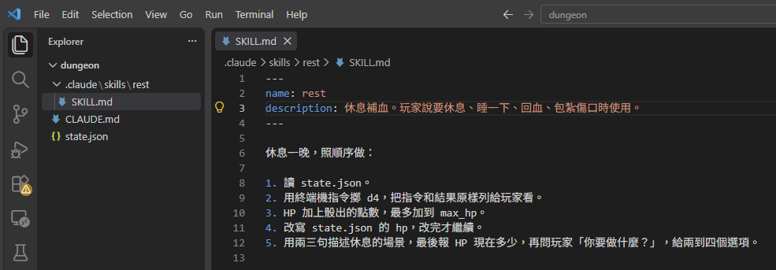
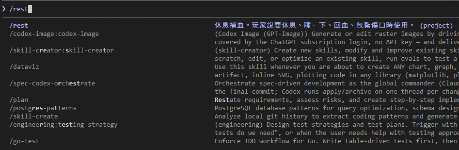
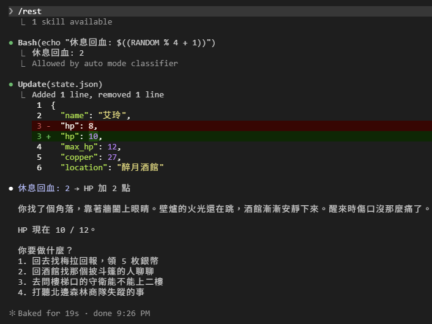
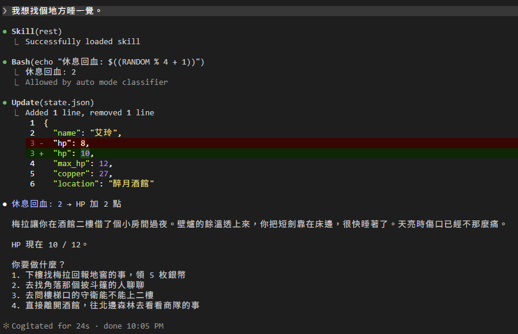
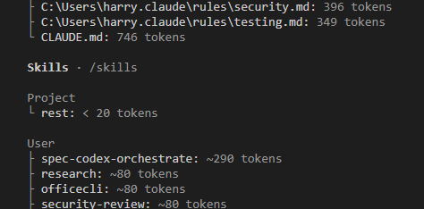

# [Day 6] 休息一晚回血：把偶爾才用的規則做成 Skill

艾玲 HP 8 / 12，口袋有 27 枚銅幣，人還在地窖。規則裡沒寫怎麼補血。今天來把「休息」做成一個指令，打 `/rest` 就會骰骰子、加血、改檔案。


## 為什麼不寫進 CLAUDE.md

休息規則當然可以寫在 `CLAUDE.md`。在「規則」底下加一行「休息一晚回 d4 點 HP」，DM 就會知道怎麼做（雖然不一定照做XD）。但 Day 3 說過，`CLAUDE.md` 每一局（session）開始都整份載入到對話裡。休息的規則、打架的流程、買東西的算法……每加一種，每一局都多背一段，但每一局都不一定用得到。

Claude Code 給這種「偶爾才用、用的時候有固定步驟」的東西有另一套處理方式：Skill。

## Skill 是什麼

一個資料夾、一個 `SKILL.md`，就是一個 Skill。放在專案裡長這樣：

```
dungeon\.claude\skills\<skill 名字>\
├── SKILL.md      必要：上面是 skill 資訊欄位，下面是實際指示或步驟
├── scripts\      可選：給 Agent 跑的程式
├── references\   可選：詳細說明或參考文件
└── assets\       可選：模板、素材、圖片等
```

資料夾名字是 `rest\`，那 skill 名稱就是 rest。另外放在 `C:\Users\<你的名稱>\.claude\skills\` 底下的話就是全域 skill，這台電腦同一個使用者的每個 session 都能用。

`SKILL.md` 內容分為兩段：

- 上半部 `---` 夾起來的欄位。當中最重要的是 `description`：一句話講這個 Skill 做什麼、什麼時候該用。
- 下面的內容：真正要做的步驟或說明。

叫它有兩種方式：你在 Claude Code 介面打 `/<skill 名字>`，或是 Claude Code 會自動地看對話覺得該用就自己叫，而 Claude Code 靠的就是 `description` 來判斷要不要使用。

跟 `CLAUDE.md` 最大的差別在載入時機：每一局開始，Claude Code 只把每個 Skill 的 `description` 讀進來，知道有哪些可以用；實際 skill 下面的步驟要等到真的被使用時才載入，`scripts\`、`references\` 裡的檔案更是步驟裡有寫到才會去讀。一百個 Skill，開局只多一百句話。這就是 Skill 懶載入（lazy loading）的設計。

### 哪些是標準，哪些是 Claude Code 自己加的

Skill 的格式是 Anthropic 提出的開放標準 [Agent Skills](https://agentskills.io)，同一份 `SKILL.md` 其他支援這個標準的工具（Codex、Cursor、GitHub Copilot 等）也能讀。標準只定義了兩件事：上面提到的 skill 路徑與資料夾結構，以及 `SKILL.md` 上半部的六個欄位：

| 欄位 | 必填 | 做什麼 |
|---|---|---|
| `name` | 是（在 Claude Code 沒寫就用資料夾名字） | 指令名字 |
| `description` | 是 | 做什麼、什麼時候用。Claude Code 靠它決定要不要自己叫 |
| `license` | 否 | 授權條款 |
| `compatibility` | 否 | 需要什麼環境：哪個產品、要裝什麼、要不要連網 |
| `metadata` | 否 | 自訂的鍵值對，例如作者、版本 |
| `allowed-tools` | 否 | 這個 Skill 執行時不用問就能用的工具 |

而 Claude Code 在標準上多加了自己專屬的定義，別的 Agent 工具可能不支援：

| 功能 | 寫在哪 | 做什麼 |
|---|---|---|
| 可帶參數 | 步驟裡放 `$ARGUMENTS` 或 `$0`、`$1` | 打 `/fight 巨鼠`，「巨鼠」會塞進步驟裡 |
| 指令展開 | 假如步驟裡寫 `` !`指令` `` | 送給模型之前，Claude Code 先把指令跑完，結果貼進步驟裡 |
| 誰能使用 | 欄位 `disable-model-invocation`、`user-invocable` | 只有你能叫，或只有 Claude Code 能叫 |
| 工具限制 | 欄位 `disallowed-tools`、`model` | 這個 Skill 執行時拿掉某些工具、換一個模型 |
| 另開對話執行 | 欄位 `context: fork` | 在獨立的對話裡執行，不佔主對話的空間 |

為簡化文章，今天只會用到 `name` 和 `description`。

順帶一提，以前 Claude Code 讓你自訂 slash command（官方叫 custom command），放在 `.claude\commands\` 底下一個 `.md` 就是一個 `/指令`。現在併進 Skill 了，這功能目前還能用，但假如是要寫新的指令就直接寫 Skill 就好。

## /rest：休息補血 skill

建立 `dungeon\.claude\skills\rest\SKILL.md`：

```markdown
---
name: rest
description: 休息補血。玩家說要休息、睡一下、回血、包紮傷口時使用。
---

休息一晚，照順序做：

1. 讀 state.json。
2. 用終端機指令擲 d4，把指令和結果原樣列給玩家看。
3. HP 加上骰出的點數，最多加到 max_hp。
4. 改寫 state.json 的 hp，改完才繼續。
5. 用兩三句描述休息的場景，最後報 HP 現在多少，再問玩家「你要做什麼？」，給兩到四個選項。
```



`description` 寫的是「什麼時候用」，不是「怎麼做」。description 每一局都會被讀，寫得越清楚 Claude Code 越容易自動挑中它，而 skill 實際步驟寫在下半部。

## 來休息吧！

Claude Code 會盯著 skill 資料夾，改 `SKILL.md` 不用重開就會生效。但 `.claude\skills\` 這個資料夾是第一次建，開局時還不存在，Claude Code 不知道要盯它，所以這次要重開一次。`claude -c` 接回對話接著輸入：

> /rest

打到 `/` 的時候清單就會跳出來，第一個就是 `rest`，右邊是它的 `description`，後面標著 `(project)`，表示是這個專案的 Skill：



按 Enter 送出：



`/rest` 底下先出現一行 `1 skill available`，這是 Claude Code 把 `SKILL.md` 載進對話。接下來的東西 Day 4 都看過：`Bash(...)` 骰 d4 得到 2，`Update(state.json)` 把 hp 從 8 改成 10，然後兩句休息的場景，HP 10 / 12。差別在於這次是 Claude Code DM 從 skill 知道的。

## 不打指令，直接說

重點來了：Skill 不一定要你叫。我們用前一天所教的 `/rewind` 回到送出 `/rest` 之前並輸入：

> 我想找個地方睡一覺。



第一行 `Skill(rest)` 和底下 `Successfully loaded skill` 表示 Claude Code DM 自己把 skill 叫出來執行了，後面的骰子、改檔跟剛才一模一樣。靠的是 `description` 裡那句「玩家說要休息、睡一下……時使用」。

順帶一提，`Skill` 本身也是 Day 4 講的內建工具之一，跟 `Read`、`Bash` 同一層，所以執行 Skill 時就會顯示在畫面上。

最後用 Day 3 的 `/context` 看一下：



`Skills` 底下分兩層：`Project` 是這個資料夾的 Skill，`User` 是 `C:\Users\<你的名稱>\.claude\skills\` 裡的全域 Skill。可以看到 `rest` 只佔不到 20 個 token，因為開局只讀了 `description` 那一句；相較上面 `CLAUDE.md` 是 746 個 token。這就是前面說的載入時機與占用對話記憶體的差別。

## CLAUDE.md 和 Skill 怎麼分

| | `CLAUDE.md` | Skill |
|---|---|---|
| 什麼時候載入 | 每一局開始，整份載入 | 開始只讀 `description`，真正用到才讀完整內容 |
| 誰觸發 | 沒有觸發，一直都在 | 輸入 `/skill 名字` 或是 Claude Code 自己挑 |
| 適合放 | 一直要記得的事：世界、角色、通用規則 | 偶爾才做、有固定步驟的事：休息、結帳、存檔、特定 workflow |

一句話：**永遠要記得的文字放在 `CLAUDE.md`，要用再拿出來看的文字寫在 Skill。**

## 不想手寫？讓 Claude Code 動手做！

今天手寫 `SKILL.md` 主要是因為內容簡單，假如複雜一點或是需要搭配程式碼可以安裝官方的 `skill-creator` 外掛：

```
/plugin install skill-creator@claude-plugins-official
```

裝好之後就直接跟 Claude Code 說「幫我做一個休息補血的 skill」，Claude Code 就會幫你把 `description` 和步驟寫出來。它還會做手寫做不到的事：幫你準備幾句測試用的玩家台詞，分別在「有這個 Skill」和「沒有這個 Skill」的乾淨對話測試並比較結果；`description` 寫得太寬或太窄、該觸發沒觸發，Claude Code 會建議怎麼改比較好。細節可以參考[使用 skill-creator 運行評估](https://code.claude.com/docs/zh-TW/skills#run-evals-with-skill-creator)。

## 目前還有什麼問題嗎？

Skill 的步驟跟 `CLAUDE.md` 一樣，都只是「請 & 希望」DM 這樣做。今天骰 d4、改 hp，DM 願意照做，不代表明天也會。骰子要不要骰，今天還是 DM 說了算。上面表格裡的「指令展開」就是為這件事準備的，後面會用到。

另一件事比較新：`/rest` 一打下去，DM 就讀檔、跑指令、改檔，三件事一次做完，一個都沒問我。Day 4 說「誰允許的」之後也會再提到。

## 目前學會的 Claude Code 機制

- ✅ Day 1：安裝與登入、四種介面、`/model`、`/effort`、`/usage`
- ✅ Day 2：session 與 `.jsonl`、`--resume`、`-c`、`/resume`、`cleanupPeriodDays`
- ✅ Day 3：CLAUDE.md 三層、`@` 匯入、`/context`、`/init`
- ✅ Day 4：內建工具 Read／Bash／Edit、`Ctrl+O`
- ✅ Day 5：checkpoint、`/rewind`（`Esc` 兩下）、`/branch`
- ✅ Day 6：Skill、`SKILL.md`、`description`、`/skill 名字`、skill-creator
