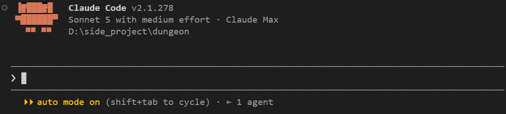
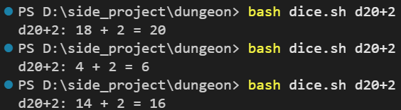
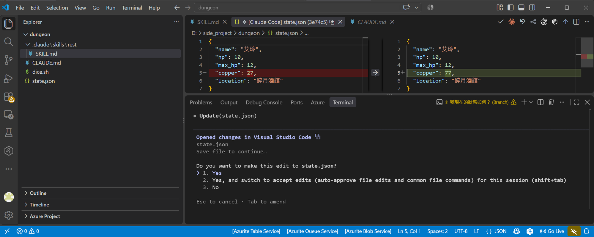
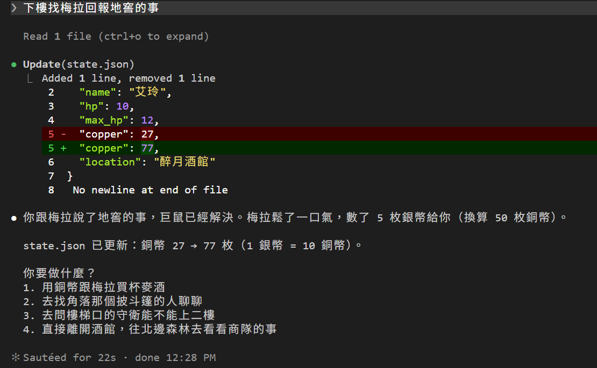
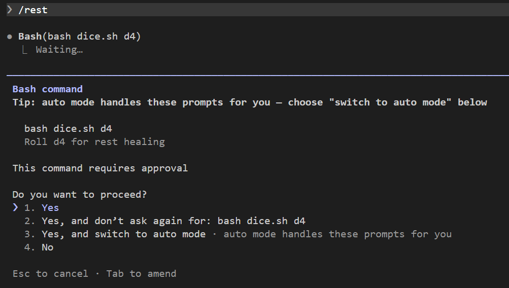
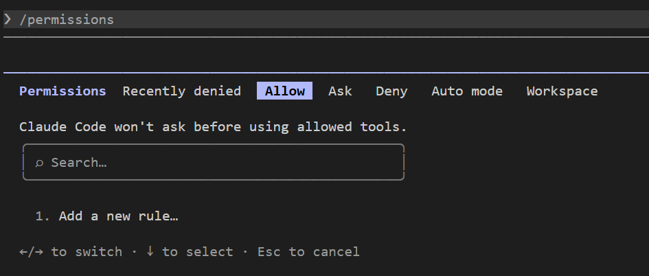
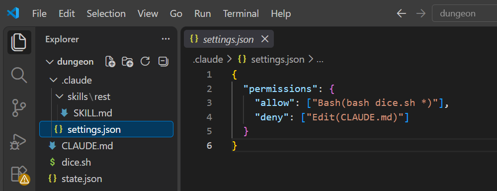
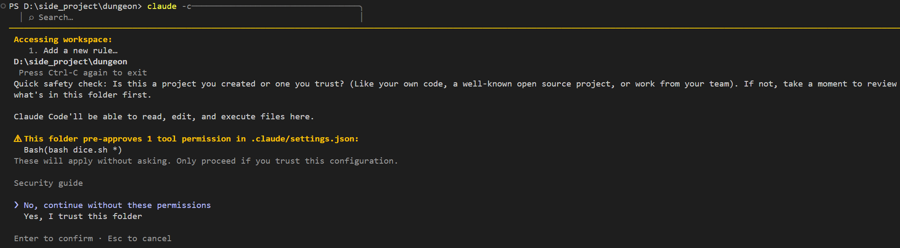
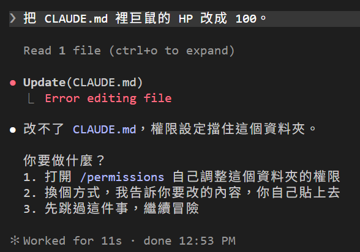
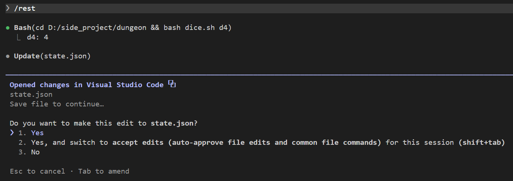

# [Day 7] 誰允許 DM 動手的？權限模式與 allow／deny

前三天 DM 讀檔、跑指令、改檔，一次都沒詢問過我。畫面上每次都有一行 `Allowed by auto mode classifier`，今天來講這行字是誰、它在做什麼、怎麼把「希望 DM 不要做」變成「DM 要做都不能做」。


## 每次動手前，都有人在把關

Day 4 說過 DM 動手靠的是工具：`Read`、`Bash`、`Edit`。每一次呼叫工具，Claude Code 都會先問一個問題：這個動作可以做嗎？誰來回答，取決於**權限模式**。

畫面最底下那行就是目前的模式：



使用 `Shift+Tab` 可以切換模式。常用的四種：

| 模式 | 狀態列 | 會直接執行的操作 | 其他操作 |
|---|---|---|---|
| Manual | `manual mode on` | 只有讀檔 | 每一件都問你 |
| Accept edits | `accept edits on` | 讀檔、改檔、建資料夾這類檔案操作 | 跑指令 |
| Plan | `plan mode on` | 讀檔、探索用的指令 | 改檔一律擋住，先擬計畫，你批准了才動手 |
| Auto | `auto mode on` | 讀檔、改資料夾裡的檔案 | 其他動作交給另一個模型在背後審，被擋才會跟你說 |

Pro／Max 方案開 Claude Code 預設就是 Auto，所以前三天你一次都沒被問。另外還有兩種模式不在 `Shift+Tab` 的循環裡，要用 flag 啟動：

| 模式 | 怎麼開 | 會直接執行的操作 | 其他操作 |
|---|---|---|---|
| dontAsk | `claude --permission-mode dontAsk` | 讀檔、你事先允許的工具 | 一律拒絕，不問 |
| bypassPermissions | `claude --dangerously-skip-permissions` | 全部 | 沒有其他，什麼都不檢查 |

`dontAsk` 是給自動化腳本用的：不會有人在旁邊按 Yes，該問的就直接當作 No。`bypassPermissions` 就是網路上說的 YOLO 模式，建議在隔離的容器或虛擬機裡使用。另外，下面會介紹的 deny 規則在這兩種模式一樣照擋。

## 先把骰子做成一支腳本

之前 Claude Code DM 骰骰子是自己決定用 `echo` 指令來跑，但每次長得都不一樣，導致規則機制無法好好應對，所以我們先來把骰子固定成一支腳本，`dungeon\dice.sh`，讓規則有一個明確的對象管理：

```bash
#!/usr/bin/env bash
# 骰子腳本。用法：
#   bash dice.sh d20      → 印出「d20: 14」
#   bash dice.sh d6+1     → 印出「d6+1: 3 + 1 = 4」
# 只接受 dN 或 dN+M 的寫法，N 是面數，M 是加值。

spec="$1"                      # 第一個參數，例如 d6+1
sides="${spec#d}"              # 去掉開頭的 d      → 6+1
sides="${sides%%+*}"           # 去掉 + 和後面的字 → 6，這就是面數
bonus="${spec##*+}"            # 只留 + 後面的字   → 1，這就是加值
[[ "$spec" == *+* ]] || bonus=0   # 沒有 + 的話加值是 0
roll=$(( RANDOM % sides + 1 ))    # 骰一次：1 到面數之間的亂數

if (( bonus == 0 )); then
  echo "$spec: $roll"
else
  echo "$spec: $roll + $bonus = $(( roll + bonus ))"
fi
```

在終端機試一下：

```powershell
bash dice.sh d20+2
```



跑三次三個數字，格式固定。

然後把 `CLAUDE.md` 規則那行「用終端機指令產生亂數」改成：

```markdown
- 需要擲骰時，一律跑 `bash dice.sh <骰子>`（例如 `bash dice.sh d20+2`），把指令和結果原樣列給玩家看。不准自己編數字，也不要叫玩家自己擲。
```

Day 6 的 `rest` Skill 第 2 步也改成「跑 `bash dice.sh d4` 擲骰」。從現在起 DM 骰骰子只有一種寫法，等一下的規則就認這個。

## 切成 Manual，看看被省掉的是什麼

按 `Shift+Tab` 一下，狀態列變成 `manual mode on`。接著讓 DM 做一件會改檔的事：

> 下樓找梅拉回報地窖的事



Auto 模式下一秒鐘就過的事，現在停下來徵求你同意。`Read` 沒問，因為讀檔大致上在每個模式都不會問；`Edit` 問了。選 1 讓它過：



改檔照常完成，梅拉的 5 枚銀幣被 DM 換算成 50 枚銅幣。這就是前三天 Claude Code 替你答掉的問題。

再打 `/rest`，換跑指令被攔下來：



跑指令的確認框比改檔多一個選項：「Yes, and don't ask again for: bash dice.sh d4」。選了它，Claude Code 會把這條指令記成一條規則存進檔案，之後同一條指令不再問。這裡先選 1，規則是下一節的主題，等一下自己寫。

## 規則：allow、ask、deny

模式選擇是 Claude Code 做事的基本規定，在上面還可以另外設定「規則」。打 `/permissions` 可以看目前所有規則：



分頁用 `←` `→` 切。Allow、Ask、Deny 三個分頁各放一種規則，現在都是空的；Recently denied 是最近被擋掉的動作，Auto mode 是分類器的規則，Workspace 是這個 session 能碰的資料夾設定。

如圖片看到目前有三種規則：

| 規則 | 意思 | 用遊戲的話說 |
|---|---|---|
| allow | 符合的動作不問，直接做 | 給 DM 一把鑰匙 |
| ask | 符合的動作一定問，連 Auto 模式也問 | 這件事要看我臉色 |
| deny | 符合的動作一律擋掉，任何模式都擋 | 上鎖，DM 拿不到 |

運行時比對順序是 deny → ask → allow，所以 deny 設定位階最高。

規則實際上長這樣：`工具名(條件)`。幾個例子：

- `Bash(bash dice.sh *)`：所有 `bash dice.sh` 開頭的指令
- `Edit(CLAUDE.md)`：改 `CLAUDE.md` 檔案
- `Read(./secrets/**)`：讀 `secrets` 底下的任何東西
- `Bash`：整個 Bash 工具，不管跑什麼

## 給 DM 一把鑰匙、上一道鎖

規則可以在 `/permissions` 裡加，也可以直接寫檔案。專案的規則放 `dungeon\.claude\settings.json`，全域的可以放在 `C:\Users\<你的名稱>\.claude\settings.json`，Day 2 提過的 `cleanupPeriodDays` 就是寫在那裡。因為目前規則需求是為了 Claude Code DM 專屬，這次就寫專案的檔案：

```json
{
  "permissions": {
    "allow": ["Bash(bash dice.sh *)"],
    "deny": ["Edit(CLAUDE.md)"]
  }
}
```



兩條規則各解決一件事：

- **鑰匙**：只放行 `bash dice.sh` 開頭的指令。就算在 Manual 模式，骰骰子也不會問你；DM 想跑別的指令照樣要問。為什麼不寫 `Bash(echo *)`？因為 `echo $(rm -rf x)` 也是 `echo` 開頭，鑰匙開太大就不是鑰匙了。Claude Code 比對複合指令時會一段一段檢查，就算是 `bash dice.sh d20 && rm x` 後半段一樣過不了門。
- **鎖**：`CLAUDE.md` 是規則書，只有我能改。DM 想動它，任何模式都擋。

存檔之後重開一次 `claude -c`。因為專案檔裡多了一條 allow 規則，等於是給 DM 權力，Claude Code 會跳出信任對話框，把那條規則列給你看，需要你親自確認：



選 Yes。之後打 `/permissions`，Allow 和 Deny 分頁就各有一條了。

試試看那把鎖。還是 Manual 模式，打：

> 把 CLAUDE.md 裡巨鼠的 HP 改成 100。



`Update(CLAUDE.md)` 底下一行紅字 `Error editing file`，沒有確認框，連問都不問。DM 只能跟你說它改不了，還很識相地建議你自己去 `/permissions` 開權限或自己貼。這跟前六天所有的「請」都不一樣：`CLAUDE.md` 和 Skill 裡寫的規則，模型可以不聽。官方文件那句話值得抄下來：**權限規則由 Claude Code 強制執行，不是由模型。**

再試那把鑰匙。打 `/rest`：



骰骰子那行沒問就過了，改 `state.json` 還是問。符合我們只允許骰骰子的設定。

順帶一提，DM 這次跑的指令是 `cd D:/side_project/dungeon && bash dice.sh d4`，前面多了一段 `cd`。規則還是放行了，因為 Claude Code 把複合指令拆開看：`cd` 到工作資料夾本來就免問，後半段對上 `Bash(bash dice.sh *)`。

## Auto 模式到底在審什麼

回到 Auto 模式（`Shift+Tab` 切回去）。現在可以講那行 `Allowed by auto mode classifier` 了。Auto 模式不是不檢查，是換一個人檢查：一個獨立的分類器模型，在每次動作前看一眼。順序是：

1. 先看你的規則。deny 擋、ask 問、allow 放，這三種不進分類器。
2. 讀檔、改工作資料夾裡的檔案，直接放行。
3. 剩下的（跑指令、上網、碰資料夾外面的東西）送給分類器審。分類器擋的是明顯超出你要求的事：下載東西執行、把資料送到外面、被 DM 讀到的內容牽著走。
4. 被擋的話，DM 會收到理由，換個方法再試。

所以 Day 4 那行字的意思是：那條 `echo` 骰子指令送去審了，分類器覺得沒問題，放行。今天加了 allow 規則之後，`bash dice.sh` 走的是第 1 步，連審都不用審。`Update(state.json)` 底下沒有那行字，因為改工作資料夾裡的檔案走的是第 2 步，根本沒送審。

規則寫在哪裡、管到哪裡，跟 Day 3 的 `CLAUDE.md` 是同一套邏輯：

| 檔案 | 管到哪裡 | 進版控嗎 |
|---|---|---|
| `dungeon\.claude\settings.json` | 這個專案，團隊共用 | 進 |
| `dungeon\.claude\settings.local.json` | 這個專案，只有你 | 不進。「don't ask again」存的就是這裡 |
| `C:\Users\<你的名稱>\.claude\settings.json` | 你這台電腦同個使用者的每個專案 | 不進。你自己的 |

## 目前還有什麼問題嗎？

「誰允許的」有答案了：Auto 模式是分類器在放行，Manual 模式是你按 Yes 在放行，規則是你事先寫好、不用再按的答案。而且 deny 是這系列第一個「限制 Claude Code」的設定。

但注意 allow 只是「不問」，不是「一定做」。`Bash(bash dice.sh *)` 放行了骰子腳本，DM 還是可以選擇不跑。要讓骰子一定發生，得回到 Day 6 表格裡那個「指令展開」，那是 Skill 的事，明天我們來把骰骰子做成 skill 並且可以帶參數以及強制要真的骰，而不是讓 Claude Code DM 看心情要不要骰。

今天結束時 `dungeon` 資料夾的完整內容在 [articles/07/dungeon](https://github.com/harry18456/claude-code-dungeon-master/tree/main/articles/07/dungeon)，給大家參考。

## 目前學會的 Claude Code 機制

- ✅ Day 1：安裝與登入、四種介面、`/model`、`/effort`、`/usage`
- ✅ Day 2：session 與 `.jsonl`、`--resume`、`-c`、`/resume`、`cleanupPeriodDays`
- ✅ Day 3：CLAUDE.md 三層、`@` 匯入、`/context`、`/init`
- ✅ Day 4：內建工具 Read／Bash／Edit、`Ctrl+O`
- ✅ Day 5：checkpoint、`/rewind`（`Esc` 兩下）、`/branch`
- ✅ Day 6：Skill、`SKILL.md`、`description`、`/skill 名字`、skill-creator
- ✅ Day 7：權限模式、`Shift+Tab`、`/permissions`、allow／ask／deny、`settings.json`
