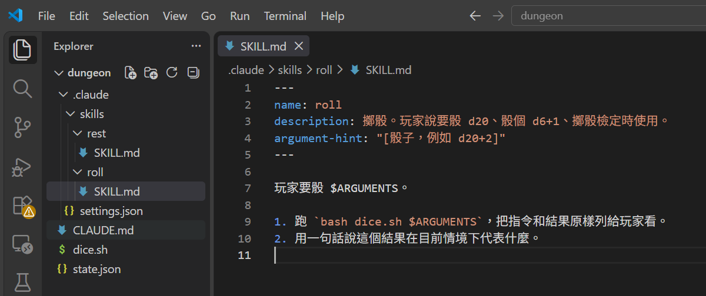
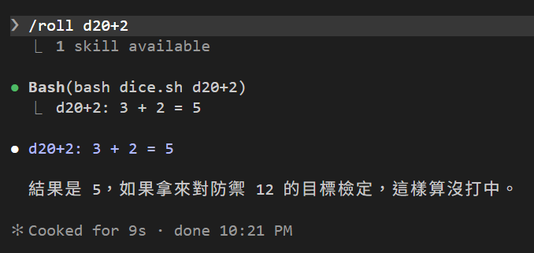
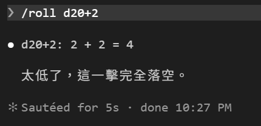
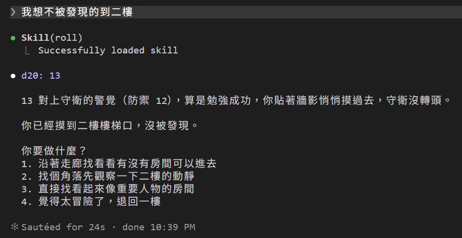

# [Day 8] /roll d20+2：讓 Skill 吃參數，骰子在進對話之前就骰好

昨天的 allow 規則放行了 `bash dice.sh`，但 Claude Code 還是有可能瞎掰直接亂給我一個數字。今天來做一個 `/roll` Skill 看看如何解決吧！分成兩個部分來處理好了：製作 Skill 並可以吃參數，打 `/roll d20+2` 就骰 d20+2；接著讓 Skill 的內容進到對話之前就先骰好骰子。


## Skill 第一版：步驟裡放參數

建立 `dungeon\.claude\skills\roll\SKILL.md`：

```markdown
---
name: roll
description: 擲骰。玩家說要骰 d20、骰個 d6+1、擲骰檢定時使用。
argument-hint: "[骰子，例如 d20+2]"
---

玩家要骰 $ARGUMENTS。

1. 跑 `bash dice.sh $ARGUMENTS`，把指令和結果原樣列給玩家看。
2. 用一句話說這個結果在目前情境下代表什麼。
```



新東西只有兩個：

- `$ARGUMENTS`：你打 `/roll d20+2`，`/roll` 後面的字會整串取代掉 `$ARGUMENTS`。真正進到對話的是「玩家要骰 d20+2。1. 跑 `bash dice.sh d20+2`……」。
- `argument-hint`：打 `/roll` 的時候清單旁邊會提示你要接什麼。純提示，不影響執行。

只要一個參數就用 `$ARGUMENTS`。多個參數可以用 `$0`、`$1` 分開拿，例如 `/fight 巨鼠 2` 裡 `$0` 是巨鼠、`$1` 是 2。今天用不到。

打：

> /roll d20+2



`$ARGUMENTS` 換成了 `d20+2`，跑的是 `bash dice.sh d20+2`，骰到 3 加 2 是 5。`bash dice.sh` 有 Day 7 的 allow 規則，沒問就跑了。但注意畫面上那行 `Bash(...)`：這是 Claude Code 呼叫 Bash 工具，發生在 SKILL.md 的內容進到對話之後。換句話說，Claude Code 讀完步驟才決定要跑，它也可以決定不跑。

## Skill 第二版：骰子在進對話之前就骰好

把 SKILL.md 的步驟換成這樣：

```markdown
---
name: roll
description: 擲骰。玩家說要骰 d20、骰個 d6+1、擲骰檢定時使用。
argument-hint: "[骰子，例如 d20+2]"
---

玩家要骰 $ARGUMENTS，結果已經骰好了：

!`bash dice.sh $ARGUMENTS`

把上面那行原樣報給玩家，不要自己改數字，也不要再骰一次。然後用一句話說這個結果在目前情境下代表什麼。
```


差別在 `` !`...` `` 這個寫法在 Day 6 曾提到過：「指令展開」，Claude Code 在把 SKILL.md 放進對話**之前**，先把 `!` 後面的指令跑完，把輸出貼回原位。真正進到對話的內容裡已經寫著例如「d20+2: 14 + 2 = 16」，沒有指令，只有結果。

存檔不用重開，Claude Code 盯著 skill 資料夾。再打一次 `/roll d20+2`。

兩個地方要注意，不照做會失敗：

- **`!` 裡的指令要寫得跟 allow 規則一樣。** Day 7 的規則是 `Bash(bash dice.sh *)`，所以這裡只能寫 `bash dice.sh $ARGUMENTS`。
- **`CLAUDE.md` 不能跟 Skill 打架。** 原本規則寫「一律跑 `bash dice.sh`，不准自己編數字」，Claude Code 讀到 Skill 裡直接給一個數字，反而覺得是假的，自己又骰了一次。CLAUDE.md 中擲骰規則那行改成這樣：

```markdown
- 需要擲骰時，一律用 roll 這個 Skill（`/roll <骰子>`，例如 `/roll d20+2`），結果原樣列給玩家看，直接採用。不准自己編數字，不要自己跑指令，也不要叫玩家自己擲。
```

`CLAUDE.md` 是開局讀的，改完重開 `claude -c`，再打一次 `/roll d20+2`：



畫面上沒有 `Bash(...)`，原因在於指令在內容進到對話之前就已經執行完了。雖然看起來像假的，但證據可以從之前提過的 session 紀錄檔案裡面確認到實際 Skill 有被替換內容：

```text
玩家要骰 d20+2，結果已經骰好了：

d20+2: 2 + 2 = 4

把上面那行原樣報給玩家，不要自己改數字，也不要再骰一次。
```

之前曾提過 `Ctrl+O` 可以看到較詳盡的內容，但這種行為因為是在內容進到對話之前就先跑好的，所以看不到更清楚的細節。

如此一來就不會發生 Skill 要求要做，但最後 Claude Code 不想做而隨便亂說的狀況(但還是有可能遇到Claude Code 最後仍隨便亂說XD)

## Claude Code 自己叫也一樣

CLAUDE.md 現在要求 DM 骰骰子也走 `/roll`。試試看不打指令，讓 Claude Code 自己決定：

> 我想不被發現的到二樓



Claude Code 自己決定要骰 d20 骰子，畫面上可以看到執行 roll skill，同樣沒有看到執行程式的文字。同樣翻看 session 紀錄檔案可以看到 Skill 到對話時一樣是替換好文字，代表程式已預先執行：

```text
assistant  tool_use  Skill {"skill": "roll", "args": "d20"}
user       (Skill 內容) 玩家要骰 d20，結果已經骰好了：
                        d20: 13
                        把上面那行原樣報給玩家……
assistant  text      `d20: 13` 13 對上守衛的警覺（防禦 12），算是勉強成功……
```

## Skill 兩版放在一起看

| | 第一版 | 第二版 |
|---|---|---|
| 步驟寫法 | 「跑 `bash dice.sh $ARGUMENTS`」 | `` !`bash dice.sh $ARGUMENTS` `` |
| 什麼時候跑指令 | 內容進到對話之後，由 Claude Code 決定要不要跑 | 內容進到對話之前就跑完 |
| 畫面上 | 有 `Bash(...)` 那行 | 沒有，翻 `.jsonl` 才看得到 |
| 能不能不骰 | 能 | 不能，讀到的已經是結果 |

三件事要知道：

- `!` 指令先過權限規則。有 allow 才在送出前跑；Auto 模式下沒對上規則會交給 Claude Code 自己跑，其他模式直接失敗。
- `!` 只在一行的開頭或空白後面才算數。寫成 `結果=!`...`` 貼在別的字後面，Claude Code 會當成普通文字，不跑。
- 這個功能只對你電腦上的 Skill 有效。如果 Skill 是綁定在 claude.ai 帳號同步下來的話就不會跑（等於讓遠端來的檔案在你電腦上執行指令）；另外公司也可以用 `disableSkillShellExecution` 關掉今天提到的預先執行行為。

## 目前還有什麼問題嗎？

玩家喊的骰子解決了。劇情裡 DM 自己要骰的呢？剛才 Claude Code 乖乖叫了 `/roll`，但那是因為 CLAUDE.md 請它這麼做。像巨鼠反咬那種戰鬥中的骰子，Claude Code 可以叫 `/roll`，也可以不叫，「一律用 roll」還是請求。要讓這種骰子也逃不掉，得從另一個方向來，之後講。

另外，`/roll` 現在誰都能叫，Claude Code 想骰就骰。有些 Skill 你會希望只有你能叫，有些只想讓 Claude Code 自己用。明天講。

## 目前學會的 Claude Code 機制

- ✅ Day 1：安裝與登入、四種介面、`/model`、`/effort`、`/usage`
- ✅ Day 2：session 與 `.jsonl`、`--resume`、`-c`、`/resume`、`cleanupPeriodDays`
- ✅ Day 3：CLAUDE.md 三層、`@` 匯入、`/context`、`/init`
- ✅ Day 4：內建工具 Read／Bash／Edit、`Ctrl+O`
- ✅ Day 5：checkpoint、`/rewind`（`Esc` 兩下）、`/branch`
- ✅ Day 6：Skill、`SKILL.md`、`description`、`/skill 名字`、skill-creator
- ✅ Day 7：權限模式、`Shift+Tab`、`/permissions`、allow／ask／deny、`settings.json`
- ✅ Day 8：Skill 參數 `$ARGUMENTS`、`argument-hint`、`` !`指令` `` 展開
