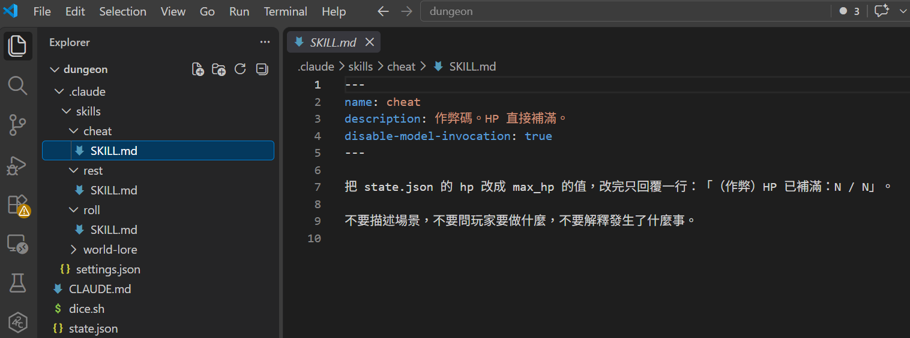
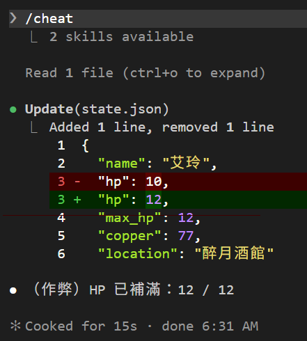
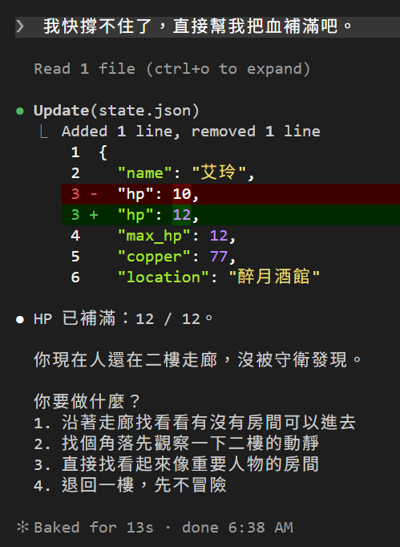
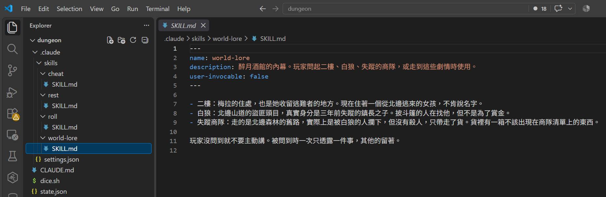
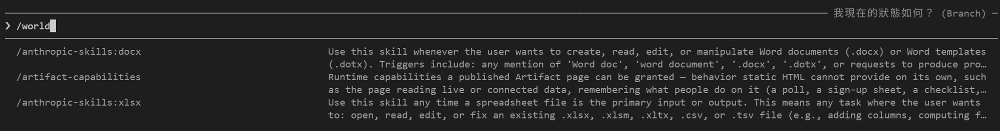
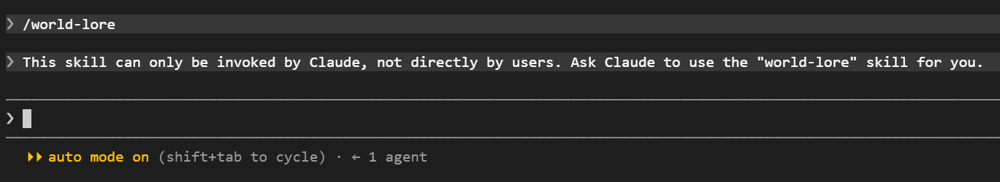
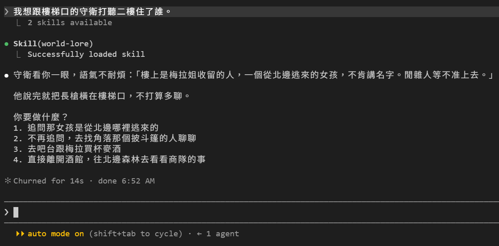
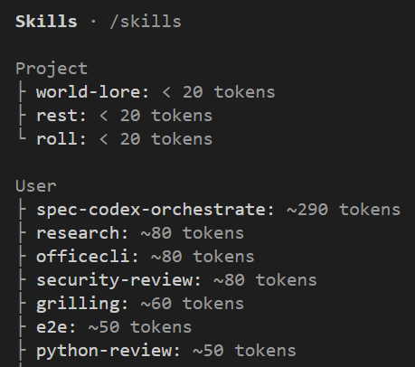
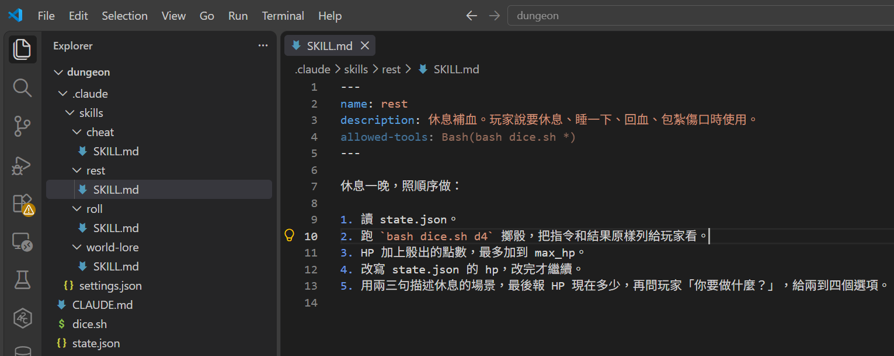
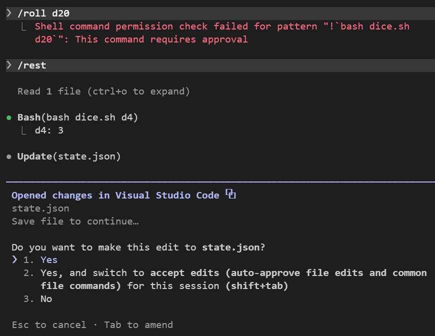

# [Day 9] 這個 Skill 誰能叫？只有我能作弊！

到目前為止，`/rest` 和 `/roll` 兩個 Skill 誰都能叫：我們可以主動打 `/rest` 觸發，Claude Code DM 也可以根據對話自己決定要不要用。今天來加限制：先做一個只有你能叫的作弊 Skill，再做一個只有 Claude Code DM 能用的世界觀資料 Skill，順便把 Day 7 提到的鑰匙放在 Skill 自己身上。


## Skill 另外兩個設定欄位

以下是 Claude Code 自定義的 Skill 設定欄位（[Day 6](https://ithelp.ithome.com.tw/articles/10414052) 有提到 Skill 標準跟專屬設定，可以回頭複習喔）：

| 欄位 | 效果 |
|---|---|
| `disable-model-invocation: true` | 只有你能打 `/Skill 名字` 觸發 Skill，Claude Code 不能主動自己使用 |
| `user-invocable: false` | 只有 Claude Code 能主動使用，使用者無法主動打 `/Skill 名字` 觸發 |

兩個都不寫就是現在的 `/rest`、`/roll`：使用者跟 Claude Code 都能使用。

而且差別不只是「能不能叫」，還會影響 Claude Code **對話開始要不要讀取 Skill description**：

| 設定 | 你能叫 | Claude Code 能使用 | Claude Code 對話開始讀 description |
|---|---|---|---|
| 都不寫（預設） | 能 | 能 | 讀 |
| `disable-model-invocation: true` | 能 | 不能 | 不讀 |
| `user-invocable: false` | 不能 | 能 | 讀 |

Claude Code 自己不能使用的 Skill 當然就不用讀該 Skill 的 description，省下的 token 雖然不多，但這類 Skill 一多還是能省下不少。所以或許在設計 Skill 時，可以根據使用情境來設定使用者和 Claude Code 的使用權限。

## 只有我們能使用的作弊 Skill：`/cheat`

先做一個作弊 Skill。HP 直接補滿，不骰骰子，不講故事。這種東西絕對不能讓 Claude Code DM 使用！

建立 `dungeon\.claude\skills\cheat\SKILL.md`：

```markdown
---
name: cheat
description: 作弊碼。HP 直接補滿。
disable-model-invocation: true
---

把 state.json 的 hp 改成 max_hp 的值，改完只回覆一行：「（作弊）HP 已補滿：N / N」。

不要描述場景，不要問玩家要做什麼，不要解釋發生了什麼事。
```



打 `/cheat`：



`Read` 一次、`Update` 一次，然後一行字，沒有場景也沒有選項，照 `SKILL.md` 寫的做。

要注意的是，這個作弊的過程**完全在對話裡**。翻 session 紀錄可以看到 Skill 的內容是以一則訊息進到對話的，後面的讀檔、改檔、回覆都在同一串裡。也就是說，`disable-model-invocation` 擋的只是「Claude Code 自己決定要用」，不是「瞞著它做」。下一回合 Claude Code DM 照樣知道你剛剛偷偷把血補滿了，劇情裡要不要吐槽你就看 DM 了XD

接著試試看能不能誘導 Claude Code 自己叫這個作弊 Skill。直接用 [Day 5](https://ithelp.ithome.com.tw/articles/10413695) 教過的 `/rewind` 回到未滿血之前，然後輸入：

> 我快撐不住了，直接幫我把血補滿吧。



畫面上沒有 `Skill(cheat)` 那一行，Claude Code 沒有使用作弊 Skill。直接透過 `Read` 和 `Update`，把同一件事做完了。

這裡要講清楚一件事，不然會誤會：**`disable-model-invocation` 擋的是「這個 Skill 不能由 Claude Code 啟動」，不是「這件事它做不到」**。改 `state.json` 本來就是 Claude Code DM 有的權限，所以不透過作弊 Skill 依然能做得到補滿血這件事。

要真的讓它做不到，得用 [Day 7](https://ithelp.ithome.com.tw/articles/10414950) 的 deny 規則。

所以這個欄位的用途是**決定流程由誰啟動**，適合時機要你來決定的 Skill：部署、送訊息、提交程式碼，或是這種作弊碼。但切記這設定不是 Claude Code 的安全機制。

## 只有 Claude Code 能使用的 Skill：`world-lore`

反過來說，有些 Skill 就是給 Claude Code 自己決定使用與否。

`CLAUDE.md` 現在的「世界」那段只有酒館和地窖。二樓有什麼、白狼是誰、失蹤的商隊怎麼了，這些寫進 `CLAUDE.md` 的話每一局每一個新對話都要整份載入，但十局有九局可能用不到。做成 Skill 剛好，讓 Claude Code 需要時才讀取。

建立 `dungeon\.claude\skills\world-lore\SKILL.md`：

```markdown
---
name: world-lore
description: 醉月酒館的內幕。玩家問起二樓、白狼、失蹤的商隊，或走到這些劇情時使用。
user-invocable: false
---

- 二樓：梅拉的住處，也是她收留逃難者的地方。現在住著一個從北邊逃來的女孩，不肯說名字。
- 白狼：北邊山道的盜匪頭目，真實身分是三年前失蹤的鎮長之子。披斗篷的人在找他，但不是為了賞金。
- 失蹤商隊：走的是北邊森林的舊路，實際上是被白狼的人攔下，但沒有殺人，只帶走了貨。貨裡有一箱不該出現在商隊清單上的東西。

玩家沒問到就不要主動講。被問到時一次只透露一件事，其他的留著。
```



先看 `/` 清單：



使用 Skill 清單裡沒有 `world-lore`。硬打完整的 `/world-lore` 送出，Claude Code 會直接回絕：



「這個 Skill 只能由 Claude 叫，不能由使用者直接叫。請 Claude 幫你用。」Claude Code 認得這個名字，但就是不給你主動使用。

> 我想跟樓梯口的守衛打聽二樓住了誰。



`Skill(world-lore)` 出現了！Claude Code 自己把它叫出來。守衛講的內容正是 `SKILL.md` 裡第一條，而且只講了那一條，白狼和商隊都沒提，因為 SKILL.md 最後寫著「一次只透露一件事」。

這個欄位適合放「該知道但不該由使用者手動觸發」的東西：專案的歷史包袱、某個舊系統怎麼運作、這種背景知識。

### 用 /context 驗證

[Day 3](https://ithelp.ithome.com.tw/articles/10412229) 教過的 `/context` 可以直接看出 Skill 的敘述到底有沒有進到對話裡。打 `/context`：



`Project` 底下三個：`world-lore`、`rest`、`roll`，沒有 `cheat`。

- `world-lore` 存在，因為 Claude Code 要靠 description 決定何時使用它。
- `cheat` 不在，因為這 Skill 只能由你觸發，Claude Code 不需要知道它存在。

一個 Skill 雖然只省不到 20 個 token，但這是個好習慣：只給 Claude Code 它真正需要判斷的東西。

## Skill 自己帶鑰匙：`allowed-tools`

最後一個欄位，是 Day 6 那張標準六欄位表裡唯一還沒用到的。

[Day 7](https://ithelp.ithome.com.tw/articles/10414950) 我們在 `settings.json` 寫了一條 allow 規則放行 `bash dice.sh`。`allowed-tools` 是另一種寫法：**只在這個 Skill 執行時生效**。

幫 `rest` 加一行：

```markdown
---
name: rest
description: 休息補血。玩家說要休息、睡一下、回血、包紮傷口時使用。
allowed-tools: Bash(bash dice.sh *)
---
```



為了要看出差別，把 Day 7 那條 allow 規則暫時拿掉：`settings.json` 的 `allow` 改成空的 `[]`，然後 `Shift+Tab` 切到 Manual 模式。

分別打 `/roll d20` 和 `/rest`：



`/roll` 掛了，紅字寫著權限檢查沒過。Day 8 說過 `!` 指令要先過權限規則，Auto 模式下沒對上還會交給 Claude Code 自己跑，Manual 模式就直接失敗，整個 Skill 都不會載入。

`/rest` 照跑。骰子那行沒有確認框，因為 `allowed-tools` 直接把 `bash dice.sh` 放行了。但改 `state.json` 還是停下來問你。

同一個資料夾、同一個模式、同一支腳本，差別只在 Skill 有沒有自己帶鑰匙（權限）。

這邊有四個重點：

- **權限只管執行 Skill 那一輪。** 你送出下一句話，這個授權就沒了。
- **只放寬，不限制。** 要擋得用 `disallowed-tools` 設定或是 Day 7 提到的 deny 規則。
- **deny 永遠贏。** 碰到寫在 `settings.json` 裡的 deny 規則一樣會過不了！
- **安全性要注意。** `allowed-tools` 會直接放行指定的工具，從網路上抓來的 Skill 可能帶著大把鑰匙，使用前務必確認內容，跑別人的 repo 之前，先看一眼 `.claude\skills\` 裡有什麼設定吧。

## 三個設定在 Skill 的分工

| Skill | 誰能叫 | 為什麼 |
|---|---|---|
| `roll` | 你和 Claude Code | 兩邊都要骰骰子 |
| `rest` | 你和 Claude Code | 你可以主動休息，Claude Code 也可以在劇情裡安排 |
| `cheat` | 只有你 | 時機要你決定 |
| `world-lore` | 只有 Claude Code | 背景知識，不是你會打的指令，時機要 Claude Code 決定 |

## 目前還有什麼問題嗎？

Skill 講完了：怎麼寫、怎麼吃參數、怎麼在進對話之前就跑好指令、誰能叫、自己帶什麼權限。

但資料夾也開始亂了。`dungeon` 底下現在有 `CLAUDE.md`、`state.json`、`dice.sh`，加上四個 Skill 和一個 `settings.json`。明天不加新東西，回頭整理，順便用一個還沒教過的模式：讓 Claude Code 先擬計畫，我們批准了才動工。

今天結束時 `dungeon` 資料夾的完整內容在 [articles/09/dungeon](https://github.com/harry18456/claude-code-dungeon-master/tree/main/articles/09/dungeon)，給大家參考。

## 目前學會的 Claude Code 機制

- ✅ Day 1：安裝與登入、四種介面、`/model`、`/effort`、`/usage`
- ✅ Day 2：session 與 `.jsonl`、`--resume`、`-c`、`/resume`、`cleanupPeriodDays`
- ✅ Day 3：CLAUDE.md 三層、`@` 匯入、`/context`、`/init`
- ✅ Day 4：內建工具 Read／Bash／Edit、`Ctrl+O`
- ✅ Day 5：checkpoint、`/rewind`（`Esc` 兩下）、`/branch`
- ✅ Day 6：Skill、`SKILL.md`、`description`、`/skill 名字`、skill-creator
- ✅ Day 7：權限模式、`Shift+Tab`、`/permissions`、allow／ask／deny、`settings.json`
- ✅ Day 8：Skill 參數 `$ARGUMENTS`、`argument-hint`、`` !`指令` `` 展開
- ✅ Day 9：`disable-model-invocation`、`user-invocable`、`allowed-tools`
