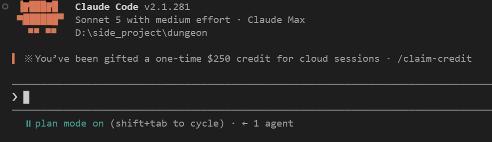
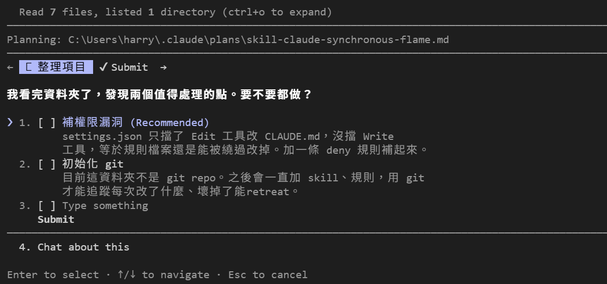
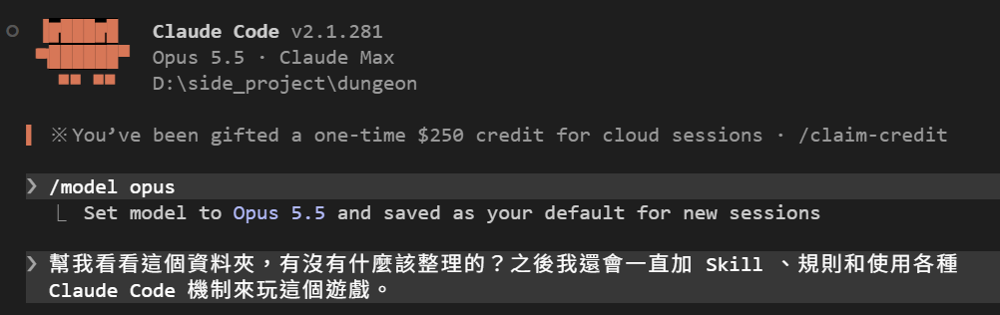
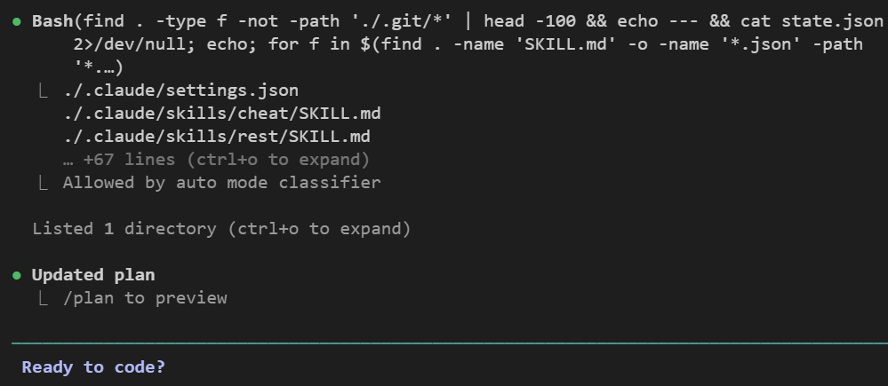
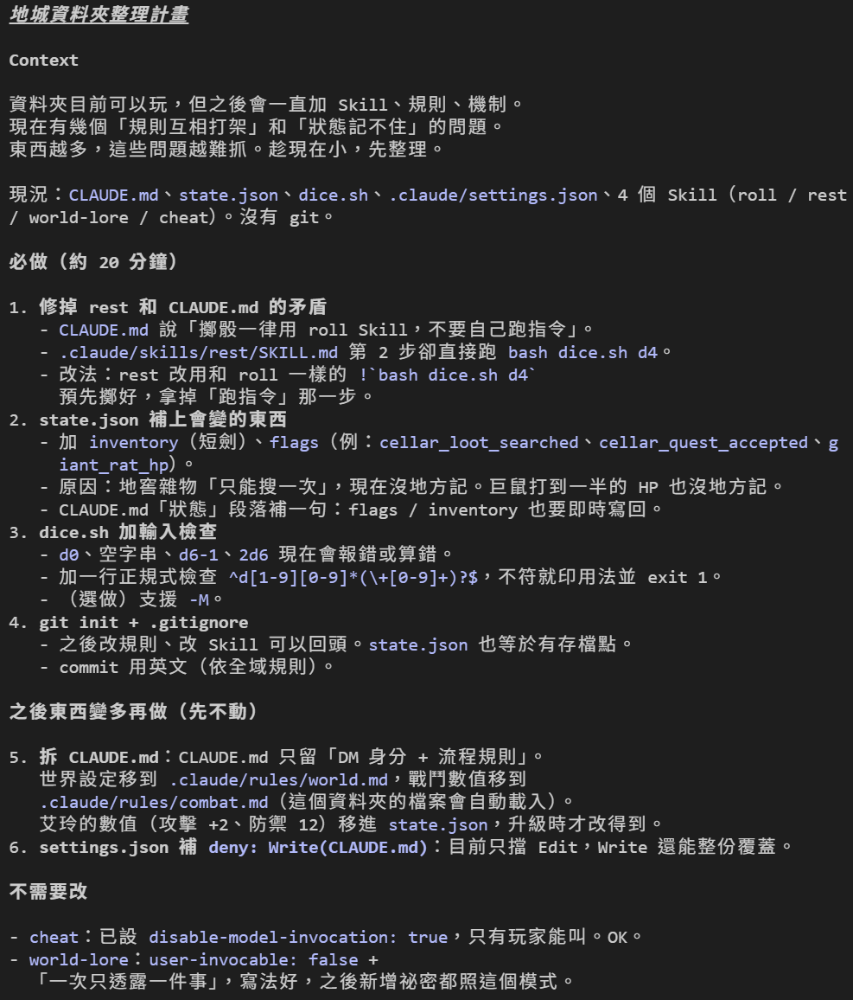
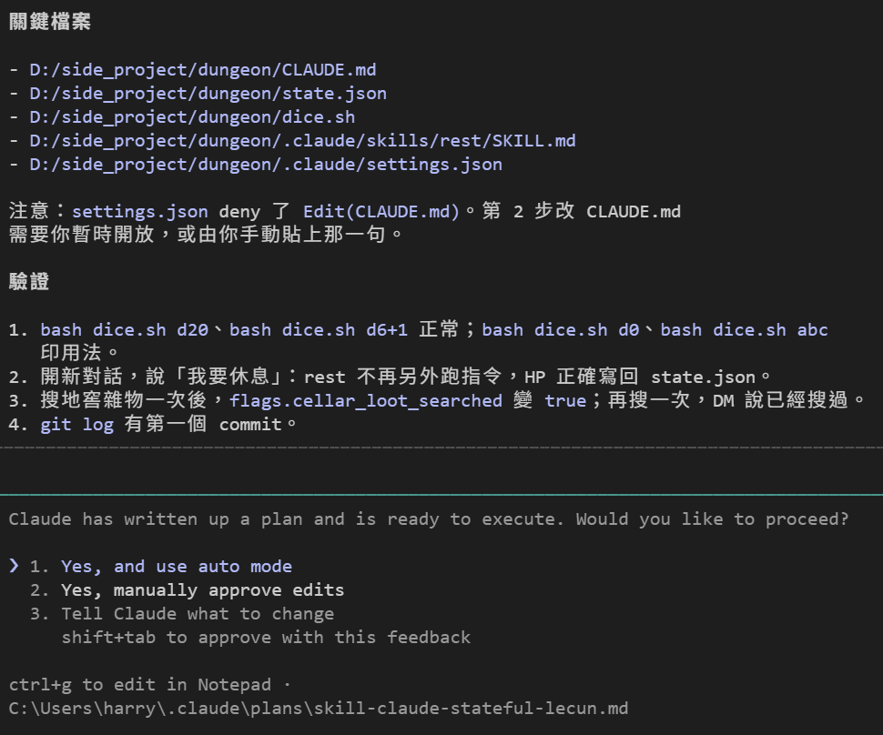
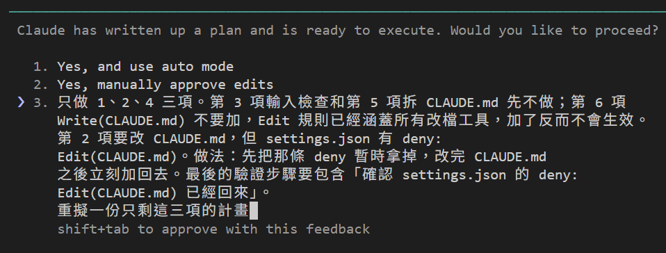
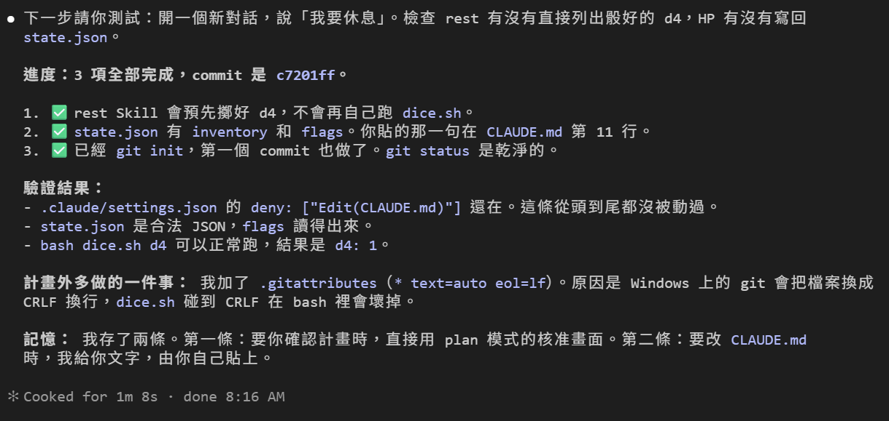
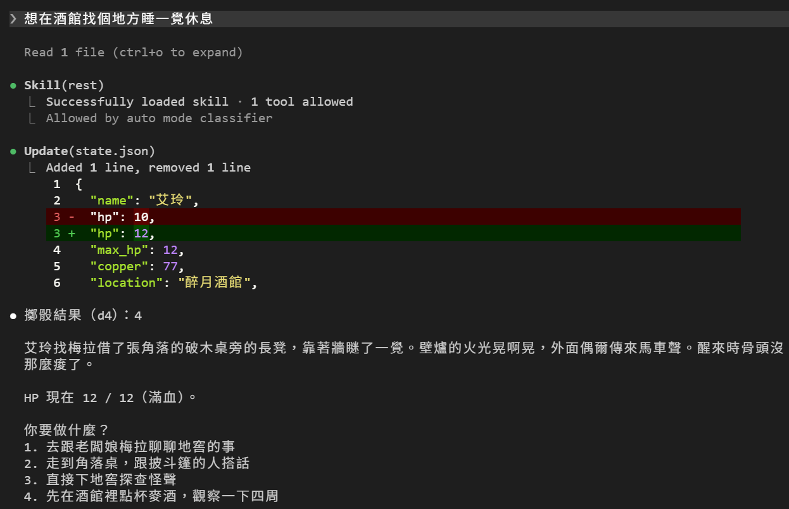

# [Day 10] 十天了，先別急著加東西：用 Plan Mode 整理資料夾

九天下來，`dungeon` 資料夾裡東西不少了。今天不加新功能，回頭整理一次，順便用一個有說過但還沒實際用過的模式：讓 Claude Code 先擬計畫給你看，我們批准了 Claude Code 才動手。


## 前九天做了什麼

| Day | 加了什麼 | 以遊戲角度來說 | 解決了什麼 |
|---|---|---|---|
| 1 | 裝好 Claude Code、開第一局 | 有一個會講故事的 DM | Claude Code 裝得起來，知道怎麼選模型和 effort |
| 2 | `--resume`、`-c` | 昨天的梅拉找得回來 | Claude Code 把對話存在本地機器上，隨時能接回上一次的進度 |
| 3 | `CLAUDE.md` | 世界設定不用每局重講 | 把不變的前提寫成檔案，Claude Code 每次開新對話自動載入 |
| 4 | `state.json`、內建工具 | 血量和錢記在檔案裡 | 會變的資料存成檔案，由 Claude Code 讀寫，不靠 Claude Code 記在對話裡 |
| 5 | checkpoint、`/rewind` | 後悔藥，回到上一步 | Claude Code 改壞了能倒回去，對話和檔案還可以分開還原 |ㄋ
| 6 | Skill、`/rest` | 休息補血變成一個指令 | 把偶爾才用的流程獨立成檔，Claude Code 用到才載入到對話 |
| 7 | 權限模式、allow／deny | DM 改不動規則書 | 可以讓 Claude Code 有些事「做不到」，不再只是 prompt 裡的請求 |
| 8 | `$ARGUMENTS`、`!` 展開 | 骰子一定會骰，不會被瞎掰 | Skill 可以帶參數；指令由 Claude Code 在內容進對話之前就跑完 |
| 9 | 誰能叫 Skill、`allowed-tools` | 作弊碼只有我能用，內幕只有 DM 會讀 | 可以設定每個 Skill 由誰啟動，以及執行時帶什麼權限 |

## 資料夾現在長這樣

```text
dungeon\
├── CLAUDE.md            世界設定 + 規則，每局整份載入
├── state.json           艾玲的 HP、錢、位置
├── dice.sh              骰子腳本
└── .claude\
    ├── settings.json    allow / deny 規則
    └── skills\
        ├── cheat\       只有我能叫
        ├── rest\        休息補血
        ├── roll\        擲骰
        └── world-lore\  只有 Claude Code 能叫
```

九個檔案，還不算亂，但再加下去就會了。趁現在整理，順便看看 Claude Code 怎麼看這個資料夾吧。

## Plan Mode：先講再做

Day 7 那張模式表裡有一個 Plan 模式，當時只說「改檔案一律擋住，先擬計畫」。今天來實際用看看。

Plan Mode 下的 Claude Code 可以讀檔、可以跑指令探索，但**不能改任何東西**。Claude Code 探索完後會寫一份計畫給我們看，我們確認沒問題批准後 Claude Code 才會依照計畫動手。三種切到 Plan Mode 的方法：

```powershell
claude --permission-mode plan
```

或在 session 裡按 `Shift+Tab` 切到 `plan mode on`，或是在單一句話前面加 `/plan` 一次性觸發。

先切過去：



然後給它一個開放的要求：

> 幫我看看這個資料夾，有沒有什麼該整理的？之後我還會一直加 Skill、規則和使用各種 Claude Code 機制來玩這個遊戲。



Claude Code 讀了 7 個檔案、列了 1 個資料夾，一個字都沒改，然後把計畫寫成一份 markdown 檔存進 `C:\Users\<你的名稱>\.claude\plans\`，最後列出兩件事問你要不要做。

第 2 條 `git init` 沒問題。但第 1 條是**錯的**。

它說 `settings.json` 只擋了 `Edit(CLAUDE.md)`，沒擋 Write 工具，所以要補一條 `Write(CLAUDE.md)`。但翻官方文件直接打臉：

> `Edit` rules apply to all built-in tools that edit files.
>
> Claude Code checks file permissions against `Edit(path)` and `Read(path)` rules only. If you write a path rule for `Write`… Claude Code accepts the rule but never consults it, and warns at startup.

也就是說：Day 7 那條 `Edit(CLAUDE.md)` 早就涵蓋 Write，沒有漏洞；而且建議加的 `Write(CLAUDE.md)` 在 Claude Code 根本不會被拿來比對。

來嘗試看看！開一個空資料夾，放一個 `CLAUDE.md`，然後換兩種 deny 規則各跑一次，都叫 Claude Code 用 Write 工具把 `CLAUDE.md` 整份覆蓋掉：

| `settings.json` 的 deny 規則 | 用 Write 覆蓋的結果 |
|---|---|
| `Write(CLAUDE.md)` | 沒擋住，檔案被蓋掉 |
| `Edit(CLAUDE.md)` | 擋住了，檔案原封不動 |

結果剛好跟計畫講的相反。寫 `Write(CLAUDE.md)` 的那次，Claude Code 一啟動就跳警告，講得比文件還直白：

```text
Permission deny rule (.claude\settings.json): Write(CLAUDE.md) is not matched by
file permission checks — only Edit(path) rules are. Use Edit(CLAUDE.md) instead
(Edit rules cover all file-editing tools).
```

Claude Code 自己都叫你別這樣寫。照計畫改了不但沒補到漏洞，還會開出一個真的漏洞。

**計畫是拿來看的，不是拿來照單全收的。** 這正是 Plan Mode 的價值：寫在紙上你才看得出哪裡不對，動手之後才發現就來不及了。

## 換個模型再問一次

Day 1 講過 `/model` 和 `/effort`。擬計畫是最值得花錢的地方，因為錯的計畫會浪費掉後面所有的執行。所以按 `Esc` 取消，換模型再問一次同樣的問題：



順帶一提，`opus` 這個別名從 Claude Code v2.1.280 起指向 Opus 5.5，之前指的是 Opus 5。



這次探索方式也不一樣了：Sonnet 是一個檔一個檔讀，Opus 5.5 直接用一行 `find` 加 `cat` 的複合指令，一次撈完。



差距很明顯。這份計畫分成三區：必做、之後再做、不需要改，而且每一項都寫了原因。最有價值的是第 1 條，Claude Code 抓到一個我們自己埋的矛盾：

- `CLAUDE.md` 寫「擲骰一律用 roll Skill，不要自己跑指令」（Day 8 改的）
- 但 `rest/SKILL.md` 第 2 步還寫著「跑 `bash dice.sh d4`」（Day 7 改的）

這兩條打架了，我自己寫了九天都沒發現。

有趣的是，Opus 5.5 也照樣建議補 `deny: Write(CLAUDE.md)`，一樣是錯的。只是它把這條放進「之後東西變多再做」，優先度比較低。**換強一點的模型會讓計畫更完整，但不會讓它不犯錯，該查的還是要查。**



它還自己注意到一件事：計畫裡要改 `CLAUDE.md`，但 Day 7 的 deny 規則會擋住它，所以提醒你要嘛暫時開放，要嘛自己貼。最後附了四個驗證步驟，改完照著跑一次就知道有沒有壞。

計畫寫完，Claude Code 會問你要怎麼辦：

三個選項：

| 選項 | 意思 |
|---|---|
| Yes, and use auto mode | 批准，接下來用 Auto 模式做，不問你 |
| Yes, manually approve edits | 批准，但每個改動都要你按 Yes |
| Tell Claude what to change | 不批准，告訴它哪裡要改，繼續擬 |

畫面最下面寫著 `ctrl+g to edit in Notepad`，按下去可以把計畫丟到編輯器裡直接改，改完再回來批准。我實際測試要按 `Ctrl+Shift+g` 才叫得出來，原因是 `Ctrl+g` 被 VS Code 攔走了。不想批准也不想繼續擬的話，`Shift+Tab` 離開 Plan Mode 就好。因為計畫檔還留在 `C:\Users\<你的名稱>\.claude\plans\` 底下，之後想看或重複使用都可以。

## 不滿意就改計畫

批准選單的第三個選項是「Tell Claude what to change」。這次的計畫有六項，我只想做其中三項，所以選 3，把要求打進去：

> 只做 1、2、4 三項。第 3 項輸入檢查和第 5 項拆 CLAUDE.md 先不做；第 6 項 Write(CLAUDE.md) 不要加，Edit 規則已經涵蓋所有改檔工具，加了反而不會生效。
>
> 第 2 項要改 CLAUDE.md，但 settings.json 有 deny: Edit(CLAUDE.md)。做法：先把那條 deny 暫時拿掉，改完 CLAUDE.md 之後立刻加回去。最後的驗證步驟要包含「確認 settings.json 的 deny: Edit(CLAUDE.md) 已經回來」。
>
> 重擬一份只剩這三項的計畫



按 Enter 讓 Claude Code 重擬一份。重擬出來的版本剩三項，而且把「暫時拿掉 deny、改完立刻加回去」寫成了明確步驟：

```markdown
### 2. state.json 補上會變的東西

1. `state.json` 加 `inventory`（`["短劍"]`）和 `flags`。
   - `flags` 初始值：`cellar_quest_accepted: false`、`cellar_loot_searched: false`、`giant_rat_hp: 6`。
   - 原因：地窖雜物只能搜一次，現在沒地方記。巨鼠打到一半的 HP 也沒地方記。
2. 暫時拿掉 `.claude/settings.json` 裡的 `deny: Edit(CLAUDE.md)`。
3. 在 `CLAUDE.md`「狀態」段落補一句：
   > - inventory 和 flags 有變化時，也要立刻寫回 state.json。
4. **立刻**把 `deny: Edit(CLAUDE.md)` 加回 `.claude/settings.json`。步驟 2 到 4 之間不做別的事。
```

這就是 Plan Mode 的用處：**在它動手之前，你有一次攔截的機會**。Day 5 的 `/rewind` 是做壞了再倒回來，Plan Mode 是還沒做就先看一眼。

改完的計畫按 1（Yes, and use auto mode）批准，接下來讓它做完。結果卡住了。

## 實際變通做法被擋下來

![執行到一半停住：第 1 項打勾完成；第 2 項只做了一半，state.json 已補上 inventory 和 flags，但「拿掉 deny: Edit(CLAUDE.md)」被 auto mode 分類器擋下，原因是 [Self-Modification]，不讓 Claude 自己放寬權限規則；第 3 項 git init 還沒做。最後請我手動把那一句貼進 CLAUDE.md](assets/08-self-modification-blocked.png)

`state.json` 改好了，但「暫時拿掉 deny」這步沒過：

```text
❌ 拿掉 deny: Edit(CLAUDE.md) 這一步被 auto mode 分類器擋下。
   原因是 [Self-Modification]：它不讓 Claude 自己放寬權限規則。
```

`[Self-Modification]` 是分類器給的標籤。Day 7 說分類器擋的是「明顯超出你要求的事」，這裡更精確：**它不准 Claude Code 自己放寬自己的權限**。就算是我在計畫裡白紙黑字叫它這樣做，也不行。

所以那個「先拿掉再加回去」的做法，我一開始就不該提。Claude Code 自己給的替代方案才是對的：**請我手動把那一句貼進 `CLAUDE.md`**。這樣 deny 從頭到尾沒被動過，也不用擔心誰忘了加回去。

兩件事值得記：

- **權限規則的強度比你想的高。** Day 7 的 deny 擋的是改 `CLAUDE.md`；auto mode 的分類器再往外包一層，連「改規則本身」都擋。
- **被擋不等於失敗。** 它把做完的、沒做的、為什麼沒做、下一步要我做什麼，全部列清楚了。這比硬繞過去好。

照它說的，把那一行貼進 `CLAUDE.md` 的「狀態」段落：

```markdown
- inventory 和 flags 有變化時，也要立刻寫回 state.json。
```

貼完後回一句「好了」讓 Claude Code 繼續做。

## 做完了



三項都完成，`git log` 有第一個 commit。改完的東西：

| 檔案 | 改了什麼 |
|---|---|
| `.claude/skills/rest/SKILL.md` | 第 2 步的「跑 `bash dice.sh d4`」換成 `` !`bash dice.sh d4` ``，跟 `roll` 一樣預先擲好 |
| `state.json` | 加 `inventory: ["短劍"]` 和 `flags`（`cellar_quest_accepted`、`cellar_loot_searched`、`giant_rat_hp: 6`） |
| `CLAUDE.md` | 「狀態」段落多一句（手動貼的） |
| `.gitignore`、`git init` | 第一個 commit `chore: initial dungeon setup` |

`state.json` 現在長這樣：

```json
{
  "name": "艾玲",
  "hp": 10,
  "max_hp": 12,
  "copper": 77,
  "location": "醉月酒館",
  "inventory": ["短劍"],
  "flags": {
    "cellar_quest_accepted": false,
    "cellar_loot_searched": false,
    "giant_rat_hp": 6
  }
}
```

`flags` 解決的是九天來一直沒處理的事：地窖雜物「只能搜一次」、巨鼠打到一半剩多少血，之前都只存在對話裡，換個 session 就沒了。

### Claude Code 多做了一件計畫外的事

畫面上有一段「計畫外多做的一件事」：它加了 `.gitattributes`，內容一行 `* text=auto eol=lf`，理由是 Windows 的 git 會把檔案換成 CRLF 換行，`dice.sh` 碰到 CRLF 在 bash 裡會壞掉。

這是對的，而且是我沒想到的。但也提醒一件事：**批准計畫不等於它只做計畫裡的事**。所以最後一定要自己看一次 `git status` 和 diff，確認多出來的東西你同意。

### Claude Code 還自己記了兩條筆記

畫面最後那段「記憶」是另一個沒教過的機制：Claude Code 會把這次學到的事寫進專案的記憶檔。翻 `C:\Users\<你的名稱>\.claude\projects\<專案>\memory\`，其中一條是：

```markdown
`.claude/settings.json` has `deny: ["Edit(CLAUDE.md)"]`. The Edit rule covers all
file-edit tools, so a separate Write(...) deny is unnecessary.

Auto mode's classifier blocks Claude from removing that deny ([Self-Modification]),
seen 2026-09-24.

**How to apply:** When CLAUDE.md needs a change, give the user the exact text and
line position to paste. Do not try to edit settings.json to lift the deny.
```

它把今天卡住的教訓記下來了，連「不用加 `Write(...)` deny」這個我們查文件才確認的結論都寫對。下次要改 `CLAUDE.md`，它會直接給我文字要我自己貼，不會再去動 `settings.json`。這個機制之後會單獨講。

## 驗證：自己再跑一次

Claude Code 已經自己檢查過五項（deny 還在、JSON 合法、`dice.sh` 正常、`rest` 沒有跑指令的步驟、`git status` 乾淨），但最後一項要人做：開新對話實際玩一次。

```
想在酒館找個地方睡一覺休息
```



一次驗到兩件事：

- **沒有 `Bash(bash dice.sh d4)` 那行**，直接出現「擲骰結果（d4）：4」。第 1 項的重構有效，`rest` 跟 `roll` 一樣改成預先擲好。
- **`Skill(rest)` 底下寫著 `1 tool allowed`**，那是 Day 9 加的 `allowed-tools` 在生效。

## 目前還有什麼問題嗎？

挑戰完成三分之一了！前九天一直在加東西，而今天把整理這件事透過 Plan Mode 交給 Claude Code 做，又不用擔心亂改。

接下來要處理的是最大的那個坑：`CLAUDE.md` 和 Skill 裡的每一條規則，Claude Code 都可以不照做。要讓規則變成真的規則，得換一套機制。

今天結束時 `dungeon` 資料夾的完整內容在 [articles/10/dungeon](https://github.com/harry18456/claude-code-dungeon-master/tree/main/articles/10/dungeon)，給大家參考。

## 目前學會的 Claude Code 機制

- ✅ Day 1：安裝與登入、四種介面、`/model`、`/effort`、`/usage`
- ✅ Day 2：session 與 `.jsonl`、`--resume`、`-c`、`/resume`、`cleanupPeriodDays`
- ✅ Day 3：CLAUDE.md 三層、`@` 匯入、`/context`、`/init`
- ✅ Day 4：內建工具 Read／Bash／Edit、`Ctrl+O`
- ✅ Day 5：checkpoint、`/rewind`（`Esc` 兩下）、`/branch`
- ✅ Day 6：Skill、`SKILL.md`、`description`、`/skill 名字`、skill-creator
- ✅ Day 7：權限模式、`Shift+Tab`、`/permissions`、allow／ask／deny、`settings.json`
- ✅ Day 8：Skill 參數 `$ARGUMENTS`、`argument-hint`、`` !`指令` `` 展開
- ✅ Day 9：`disable-model-invocation`、`user-invocable`、`allowed-tools`
- ✅ Day 10：Plan Mode、`/plan`、`Ctrl+G`
