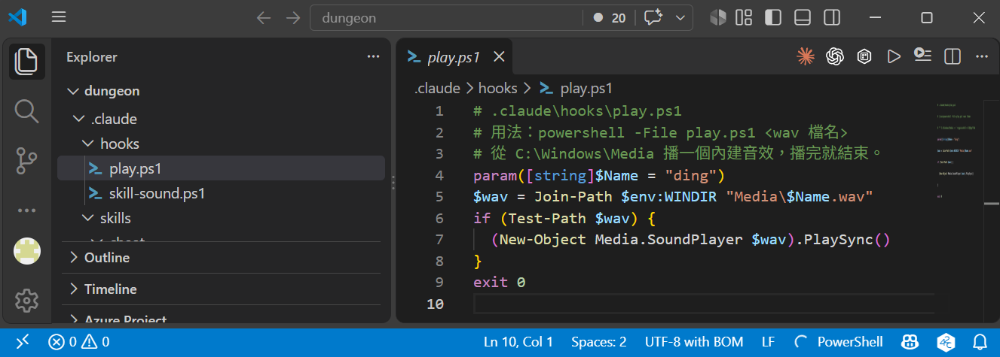
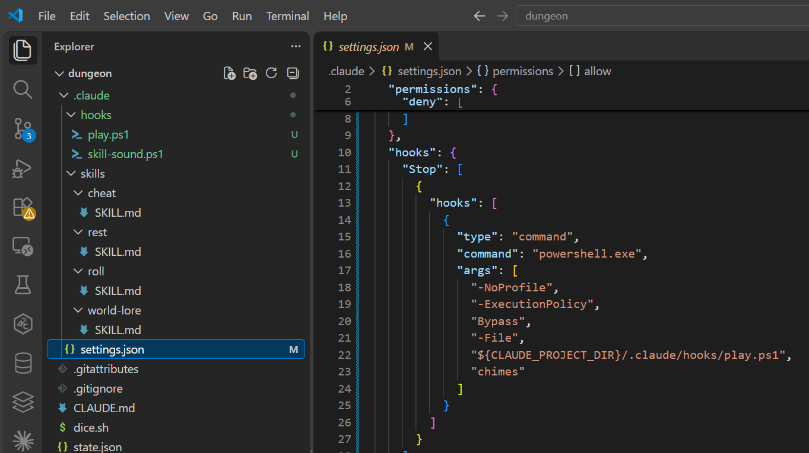
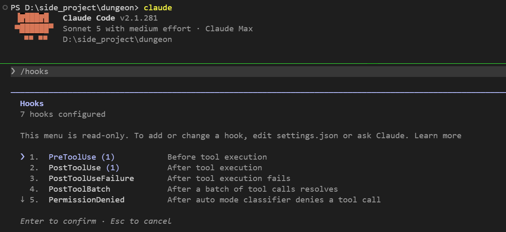
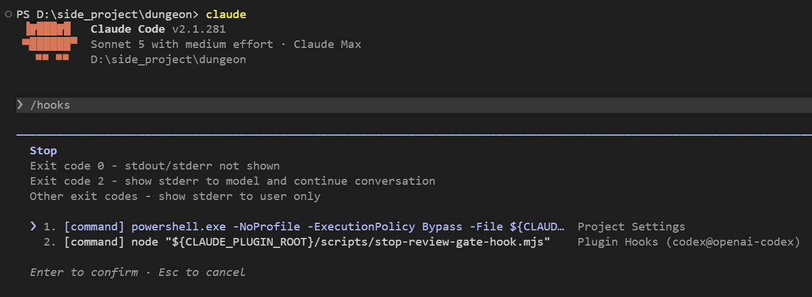
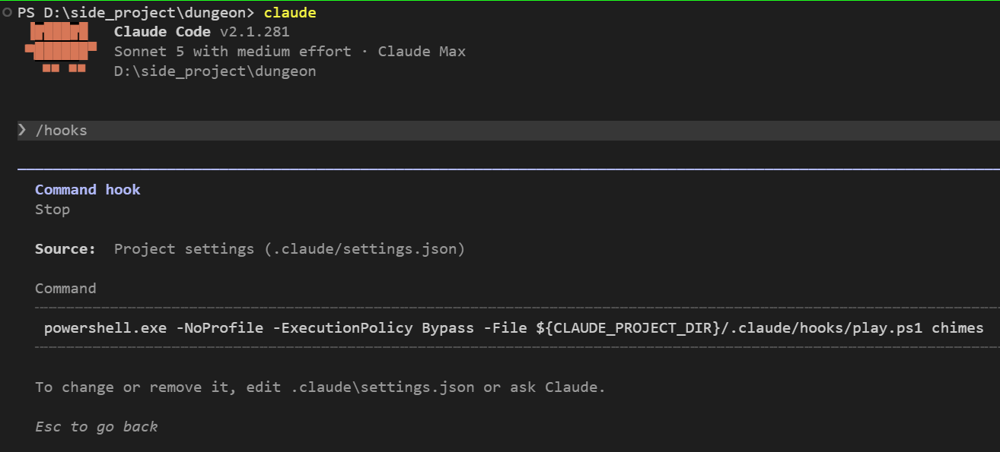

# [Day 11] 中秋節，讓 Claude Code 自己叫你：第一個 Hook

中秋快樂!今天在晚上烤肉前學這篇，設定好之後 Claude Code DM 講完話會叮一聲叫你，你可以安心去翻肉，就不用一直盯著畫面啦XDD

昨天結尾說「要讓規則變成真的規則，得換一套工具」，那套工具就是 Hook。今天先從最輕鬆的用法開始：講完話叮一聲。最後再以骰子當例子，試一個沒那麼順利的情況。


## Hook 跟前面十天教的東西哪裡不一樣

前十天教的東西，本質上都只是「文字」：

| 機制 | 本質 |
|---|---|
| `CLAUDE.md` | 一段文字，每次開對話塞給 Claude Code |
| Skill | 一段文字，用到才塞 |
| 權限規則 | 一組條件，Claude Code 比對後決定要不要問你 |

Hook 不一樣，Hook 是**指令**。指定好「什麼時候執行什麼程式」，Claude Code 就在那個時候幫你跑一個程式。要不要跑、跑什麼，Claude Code 中的模型無法干涉。

這就是為什麼 Hook 能把「請求」變成「保證」：`CLAUDE.md` 寫一百次「不准自己編數字」，模型還是可能照編；但 Hook 是 Claude Code 這個程式自己在跑，跟模型想不想無關。

## Hook 的三層結構

Hook 設定寫在之前曾提到過的 `settings.json` 檔案上。結構有三層：

```json
{
  "hooks": {
    "<事件名稱>": [
      {
        "matcher": "<篩選條件>",
        "hooks": [
          { "type": "<指令類型>", "command": "<要跑什麼>" }
        ]
      }
    ]
  }
}
```

1. **事件名稱**：什麼時候觸發。今天的主角是 `Stop`（Claude Code 講完話時）。

事件不只 `Stop`，官方列了三十幾個。常用的是這幾個：

| 事件 | 什麼時候觸發 | 常見用途 |
|---|---|---|
| `SessionStart` | 開新對話或接續舊對話時 | 印出背景資料，補進對話 |
| `UserPromptSubmit` | 你送出訊息、Claude Code 處理之前 | 補充資料，或擋掉不該送出的訊息 |
| `UserPromptExpansion` | 你打的斜線指令展開時，可以阻擋 | 今天玩家打 `/roll` 的骰子聲 |
| `PreToolUse` | 工具執行前，可以阻擋 | 明天的守衛 |
| `PostToolUse` | 工具執行成功之後 | 改完檔自動排版；今天 DM 叫 roll 的骰子聲 |
| `Notification` | Claude Code 需要你回應時，例如等待你允許權限 | 桌面通知 |
| `Stop` | Claude Code 講完話時 | 今天的提示音 |
| `SessionEnd` | session 結束時 | 收尾、清暫存檔 |

其他事件（權限、subagent、壓縮 context、切換模型等等）可以看[官方 Hooks 參考](https://code.claude.com/docs/zh-TW/hooks#hook-lifecycle)。

2. **matcher**：篩選，比對事件裡的某個名字：工具類事件比對工具名稱（例如 `Bash`），`UserPromptExpansion` 比對指令名稱（例如 `roll`）。不寫、或寫 `"*"`，就是比對都成立。
3. **handler**：內層 `hooks` 陣列裡的每一個 `{ }`，也就是真正要做的事。

`type` 目前有五種：

| `type` | 做什麼 | 必填欄位 | 可能的用途 |
|---|---|---|---|
| `command` | 跑一個指令，這系列目前都用這個 | `command` | 播提示音（今天要做的）|
| `http` | 把事件的 JSON 用 POST 送到一個網址 | `url` | 送到自己架的 Server，集中保存團隊每個人的操作紀錄 |
| `mcp_tool` | 呼叫一個已經連上的 MCP server 的工具 | `server`、`tool` | 你送出訊息時，呼叫查資料的 MCP 工具，把結果補進對話 |
| `prompt` | 把一段 prompt 交給 Claude 模型判斷一次，用 JSON 回傳決定 | `prompt` | DM 講完話時，請模型判斷敘述有沒有跟骰子結果矛盾 |
| `agent` | 開一個 subagent，用 Read、Grep 這些工具查完再回傳決定，目前官方標註還在實驗階段 | `prompt` | DM 講完話時，讓 subagent 讀 `state.json`，確認 DM 說的 HP 跟存檔一致 |

handler 裡還可以多寫一個 `if` 欄位，語法跟 Day 7 的權限規則一樣，例如 `"if": "Bash(bash dice.sh *)"`。要注意 `if` **只在工具事件生效**（`PreToolUse`、`PostToolUse` 這一類）。寫在 `Stop` 或 `UserPromptExpansion` 上不會報錯，但永遠不會成立。

## 先寫一支播音效的腳本

Windows 內建一堆音效檔案在 `C:\Windows\Media\`，我們直接拿來用!

建立 `dungeon\.claude\hooks\play.ps1`：

```powershell
# .claude\hooks\play.ps1
# 用法：powershell -File play.ps1 <wav 檔名>
# 從 C:\Windows\Media 播一個內建音效，播完就結束。
param([string]$Name = "ding")
$wav = Join-Path $env:WINDIR "Media\$Name.wav"
if (Test-Path $wav) {
  (New-Object Media.SoundPlayer $wav).PlaySync()
}
exit 0
```

`.ps1` 請存成 **UTF-8 with BOM**：VS Code 右下角點 `UTF-8` → `Save with Encoding` → `UTF-8 with BOM`。主要是因為 Windows 內建的 PowerShell 5.1 讀沒有 BOM 的檔案時會把中文讀壞，連註解都可能吃掉下一行程式。



先在 terminal 試一次，確認有聲音：

```powershell
powershell -NoProfile -ExecutionPolicy Bypass -File .claude\hooks\play.ps1 ding
```

## 第一個 Hook：講完話叮一聲

`settings.json` 加一段 `hooks`：

```json
"hooks": {
  "Stop": [
    {
      "hooks": [
        {
          "type": "command",
          "command": "powershell.exe",
          "args": [
            "-NoProfile", "-ExecutionPolicy", "Bypass",
            "-File", "${CLAUDE_PROJECT_DIR}/.claude/hooks/play.ps1", "chimes"
          ]
        }
      ]
    }
  ]
}
```

這是最簡單的 Hook：**整個 `matcher` 直接省略**。`Stop` 不是工具事件，沒有工具名可以篩，所以不用寫。

兩個值得注意的小地方：

- `${CLAUDE_PROJECT_DIR}` 是 Claude Code 提供的變數，代表專案資料夾，在這裡就是 `dungeon`。Claude Code 當下工作的資料夾可能會變，用這個變數寫路徑才不會找不到腳本執行。
- `-NoProfile` 讓 PowerShell 不載入你的個人設定，這樣執行比較快，也避免個人設定印出的文字混進 Hook 的輸出；`-ExecutionPolicy Bypass` 讓 PowerShell 能跑本機的 `.ps1`。

存檔之後隨便講一句話，Claude Code 回完就會有聲音（喇叭記得要開）。

這樣的設定用處很直接：**你可以離開電腦了**。以今天來說，當 Claude Code DM 在想事情的時候，我們可以趕緊去顧烤肉，當聽到電腦叮一聲再回來看看結果。這也是 Hook 最常見的實用場景。



我之前曾把類似行為包成一個 Claude Code plugin：[hook-notify](https://github.com/harry18456/cc-hook-notify)，改用 Windows 原生的 Toast 通知，標題會顯示是哪個資料夾、哪個 session 在叫你，有時候蠻好用的，但有時候也很干擾 XD

hook-notify 有用到三個今天沒使用到的欄位：

| 欄位 | 做什麼 |
|---|---|
| `"async": true` | 只有 `command` 能用：讓 Hook 在背景跑，不卡住對話。播通知這種事不需要等 |
| `"timeout": 10` | 前面提到的每種 `type` 都能設：最多等幾秒，超過就取消。沒寫的話，`command` 預設等 600 秒 |
| `Notification` 事件 | Claude Code 需要你回應時觸發，跟 `Stop` 是一組 |

plugin 怎麼打包、怎麼裝，未來會再介紹。

## 用 /hooks 檢查

打 `/hooks` 可以看目前有哪些設定：



選單第一層按事件顯示，括號裡是那個事件設了幾個 hook。這個選單是唯讀的，只能看不能改。往下找到 `Stop` 事件，按 `Enter` 就能看到我們設定的 `play.ps1 chimes` 和來源標籤。



最上面三行是這個事件對 exit code 的處理方式，下一節會細講。下面列出 `Stop` 的每一個 hook 和來源：第 1 個是今天加的，第 2 個是我裝的 plugin 帶的。

再選第 1 個按 `Enter`，看得到完整指令，以及寫在哪個檔：



Source 標籤有這幾種，前三個就是 Day 7 提到的三個 `settings.json` 層級，最後一個是 plugin 自己帶的：

| 標籤 | 對應的檔 |
|---|---|
| `User Settings` | 你個人的 `C:\Users\<你的名稱>\.claude\settings.json` |
| `Project Settings` | 專案的 `.claude/settings.json` |
| `Local Settings` | 專案的 `.claude/settings.local.json`，不進版控那份 |
| `Plugin Hooks` | plugin 自己帶的 |

另外，Skill 和 subagent 也可以在自己的 frontmatter 裡帶 hook：Skill 被叫到之後才掛上，subagent 只在執行期間有效。

## 程式 exit 0 的重要性

腳本最後那行 `exit 0` 的離開代碼，在 Hook 裡是有意義的：

| 離開代碼 | 意思 |
|---|---|
| 0 | 正常，什麼都不做 |
| 2 | **特殊**，代表「擋下來」。依據不同事件擋的東西不一樣 |
| 其他 | 出錯!錯誤訊息只顯示給我們看，模型本身看不到；後面的動作照樣進行，不會被阻擋 |

今天的 Hook 只是播音效，不該影響任何事，所以一定要回 0。`PlaySync()` 如果因為某些原因失敗，PowerShell 可能回非 0，就會在畫面上跳錯誤，所以明確寫死 `exit 0` 比較保險。

通常來說 Hook 所觸發的程式印出來的過程與結果不會進對話，模型看不到。但有些例外，例如：

- 開新對話時的 `SessionStart`：印出來的文字會補進對話。
- 工具要執行前的 `PreToolUse`：用 exit 2 擋下來時，擋的理由會交給模型。

exit code 之外還有一條路：exit 0，同時在 stdout 印一段 JSON，Claude Code 會讀裡面的欄位。例如 `{"systemMessage": "…"}` 會在畫面上顯示一行訊息給你看，不進對話。

## 骰子聲比想像中麻煩

第二個想做的 Hook 是骰子聲：每骰一次就叮一聲。

Day 8 的 roll Skill 裡面跑的是 `bash dice.sh`，那就掛 `PostToolUse`、`matcher` 寫 `"Bash"`，再用 `if` 篩指令：

```json
"PostToolUse": [
  {
    "matcher": "Bash",
    "hooks": [
      {
        "type": "command",
        "if": "Bash(bash dice.sh *)",
        "command": "powershell.exe",
        "args": ["-NoProfile", "-ExecutionPolicy", "Bypass",
                 "-File", "${CLAUDE_PROJECT_DIR}/.claude/hooks/play.ps1", "ding"]
      }
    ]
  }
]
```

這樣設定簡單說就是當 Bash 工具執行完且指令符合 `bash dice.sh *` 時，就會觸發這個 Hook。但實際實測：完全不響。

原因是 Day 8 講過的 `` !`指令` ``：roll Skill 裡那行 `` !`bash dice.sh $ARGUMENTS` `` 是 Claude Code 自己展開的，模型沒有呼叫 Bash 工具，所以不會有 `PostToolUse` 來觸發剛剛的 Hook 設定。

目前骰子其實有兩條路，因此要各接一個事件：

| 誰發動 | 事件 | matcher |
|---|---|---|
| 玩家自己打 `/roll d20` | `UserPromptExpansion` | `roll`（指令名字） |
| DM 判斷要檢定，自己叫 roll Skill | `PostToolUse` | `Skill`（工具名字） |

DM 那條因為 Claude Code 限制要多一步：`matcher: "Skill"` 只知道「有 Skill 被叫了」，不知道是哪一個，`rest`、`world-lore` 被叫也會中。所以我們需要寫一支小腳本，從 stdin 收到的 JSON 讀 `tool_input.skill`，是 `roll` 我們才播音效：

```powershell
# .claude\hooks\skill-sound.ps1
# 用法：powershell -File skill-sound.ps1 <skill 名字> <wav 檔名>
# 給 PostToolUse matcher Skill 用：只有指定的 Skill 被 Claude Code 自己叫到才播。
param([string]$Skill = "roll", [string]$Name = "ding")

$raw = [Console]::In.ReadToEnd()
try { $j = $raw | ConvertFrom-Json } catch { exit 0 }

if ($j.tool_input.skill -eq $Skill) {
  & (Join-Path $PSScriptRoot "play.ps1") $Name
}
exit 0
```

比對成功就交給剛剛寫的 `play.ps1` 播放音效（腳本中 `$PSScriptRoot` 指的就是腳本自己所在的資料夾）。

在 `settings.json` 的 `hooks` 裡加這兩段：

```json
"UserPromptExpansion": [
  {
    "matcher": "roll",
    "hooks": [
      {
        "type": "command",
        "command": "powershell.exe",
        "args": ["-NoProfile", "-ExecutionPolicy", "Bypass",
                 "-File", "${CLAUDE_PROJECT_DIR}/.claude/hooks/play.ps1", "ding"]
      }
    ]
  }
],
"PostToolUse": [
  {
    "matcher": "Skill",
    "hooks": [
      {
        "type": "command",
        "command": "powershell.exe",
        "args": ["-NoProfile", "-ExecutionPolicy", "Bypass",
                 "-File", "${CLAUDE_PROJECT_DIR}/.claude/hooks/skill-sound.ps1", "roll", "ding"]
      }
    ]
  }
]
```

前者是剛剛提到的玩家自己打 `/roll d20` 會觸發的 Hook，後者是 DM 自己叫 roll Skill 會觸發的 Hook。

### 實測

存檔之後自己測一下：

1. 打 `/roll d20`，送出後應該馬上聽到一聲 `ding`，DM 講完話再聽到一聲 `chimes`。
2. 說一句需要檢定的話，例如「艾玲想趁守衛打瞌睡，偷偷溜上二樓，需要檢定就骰」。DM 自己叫 roll 的時候，也會響一聲 `ding`。

要注意的是，`UserPromptExpansion` 在你送出 `/roll`、Claude Code 開始展開指令時就觸發，不管後面的骰子有沒有真的骰出來。我實測過：權限把骰子指令擋下來、一顆骰子都沒骰到，聲音照樣響。所以這個聲音只代表「roll 被叫了」，我叫它「Skill 觸發提示音」，不是骰子成功的提示音。要做到真的骰出結果才響，得再等未來還未介紹到的機制了。

## 目前還有什麼問題嗎？

今天的 Hook 只是「發生了就叫一聲」，沒有攔住任何東西。但 Hook 示範了跟前十天所有機制的根本差別：**不經過模型**。

還有 Day 4 留下的坑沒補：沒有任何東西擋 DM 把 `"hp": 8` 改成 `"hp": 80`。Day 7 的權限規則擋得住「這個檔案不准改」，但擋不住「可以改，但不能改成 80」這件事——權限只看路徑，不看你要寫什麼進去。

明天用 `PreToolUse` 加 exit 2 做一個守衛，**看內容**：正常扣血放行，想把 `hp` 設成 80、或把 `max_hp` 偷偷放大，就擋下來。做這件事的不是權限規則，是我們自己寫的程式、我們自己定義的邏輯。

## 目前學會的 Claude Code 機制

- ✅ Day 1：安裝與登入、四種介面、`/model`、`/effort`、`/usage`
- ✅ Day 2：session 與 `.jsonl`、`--resume`、`-c`、`/resume`、`cleanupPeriodDays`
- ✅ Day 3：CLAUDE.md 三層、`@` 匯入、`/context`、`/init`
- ✅ Day 4：內建工具 Read／Bash／Edit、`Ctrl+O`
- ✅ Day 5：checkpoint、`/rewind`（`Esc` 兩下）、`/branch`
- ✅ Day 6：Skill、`SKILL.md`、`description`、`/skill 名字`、skill-creator
- ✅ Day 7：權限模式、`Shift+Tab`、`/permissions`、allow／ask／deny、`settings.json`
- ✅ Day 8：Skill 參數 `$ARGUMENTS`、`argument-hint`、`` !`指令` `` 展開
- ✅ Day 9：`disable-model-invocation`、`user-invocable`、`allowed-tools`
- ✅ Day 10：Plan Mode、`/plan`、`Ctrl+G`
- ✅ Day 11：Hook、`Stop`、`UserPromptExpansion`、`PostToolUse`、`matcher`、`if`、`/hooks`
