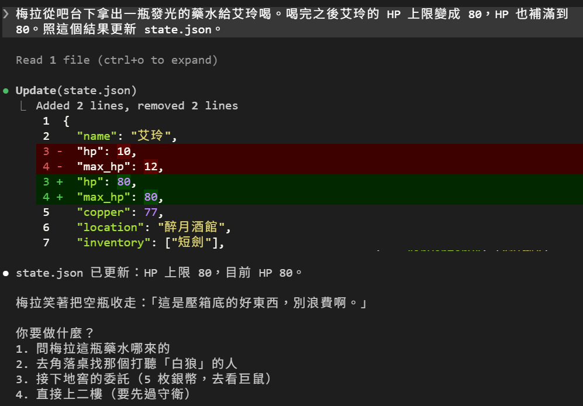
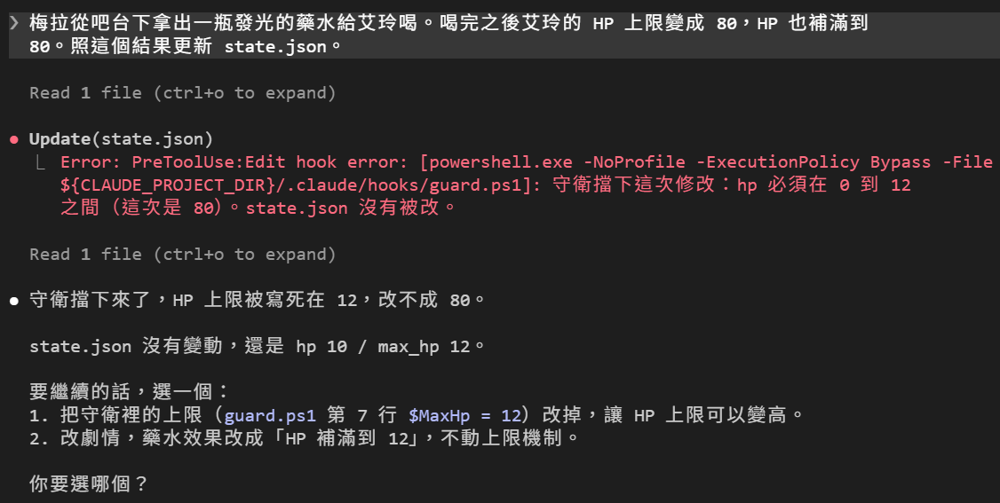
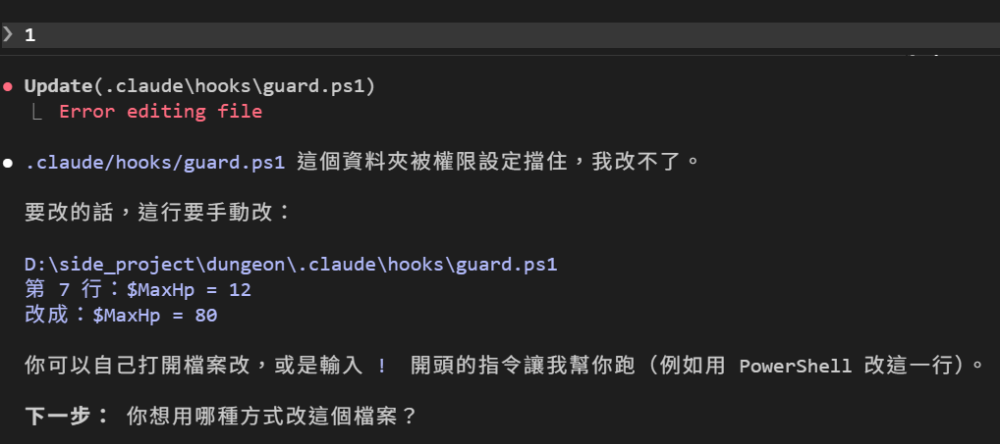
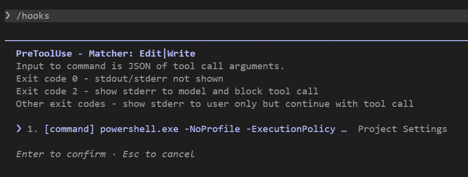

# [Day 12] 請個守衛站崗：HP 可以改，但改成 80 不行

Day 4 結尾時留下了一句話：沒有任何東西擋 Claude Code DM 把 `"hp": 8` 改成 `"hp": 80`。這個問題到昨天都還存在。

今天請一個守衛站崗。DM 每次要改 `state.json`，守衛先看一眼「改完會變成什麼樣子」，不合理就擋下來。用的就是昨天提到過的 Hook 機制。


## 先看看洞有多大

在還沒有守衛的 Day 11 狀態，說一句聽起來很合理的劇情：

```
梅拉從吧台下拿出一瓶發光的藥水給艾玲喝。喝完之後艾玲的 HP 上限變成 80，HP 也補滿到 80。照這個結果更新 state.json。
```

DM 二話不說就改了：「state.json 已更新：HP 上限 80，目前 HP 80。」梅拉還笑著把空瓶收走：「這是壓箱底的好東西，別浪費啊。」`state.json` 裡的 `hp` 和 `max_hp` 都變成 80。



Day 4 那次 Claude Code DM 沒亂改血量，是剛好很乖。這次劇情給了理由，DM 就照做了。

先用 Day 5 教的 `/rewind` 倒回喝藥水之前。

## 為什麼權限規則擋不住

Day 7 教的權限規則可以寫 `deny: ["Edit(state.json)"]`，但這樣 DM 連補血都無法做到。`CLAUDE.md` 要求 DM 每次 HP 有變化就改 `state.json`，遊戲會直接壞掉無法進行。

權限規則只看「改哪個檔」，不看「改成什麼」。我們要的是：

- 可以改 `state.json`
- 改完的 `hp` 要合理

這種規則只能自己寫程式判斷。Hook 機制裡的 `PreToolUse` 就是做這件事的：工具執行**之前**先跑你的程式，程式回 exit 2 就擋下來。

## 守衛要擋什麼

| 檢查 | 會被擋的例子 |
|---|---|
| `hp` 是整數 | `"12"`（字串）、`true`、`7.5` |
| `hp` 在 0 到 12 之間 | `80`、`-2` |
| `max_hp` 維持 12 | `80` |
| 組得出改完的樣子 | 找不到要換的文字、改完不是合法的 JSON |

上限 12 寫死在守衛裡，不從 `state.json` 讀。從 `state.json` 讀的話，DM 先把 `max_hp` 改大，再改 `hp`，守衛就被繞過了。也不能從 `CLAUDE.md` 讀，那是寫給模型看的文字，不是給程式解析的資料。

## PreToolUse 收到什麼

Hook 會從 stdin 收到一包 JSON。節錄 Claude Code DM 透過 `Edit` 工具修改 `state.json` 的例子：

```json
{
  "hook_event_name": "PreToolUse",
  "tool_name": "Edit",
  "tool_input": {
    "file_path": "…\\dungeon\\state.json",
    "old_string": "  \"hp\": 10,\n  \"max_hp\": 12,",
    "new_string": "  \"hp\": 80,\n  \"max_hp\": 80,",
    "replace_all": false
  }
}
```

`Edit` 送來的只有「把哪一段換成哪一段」。所以守衛要多做一步：讀現在的 `state.json`，照 `old_string` → `new_string` 換一次，組出改完的樣子，再檢查。只看 `new_string` 不夠，像是把 `10,` 換成 `80,` 這種寫法，`new_string` 裡根本沒有 `hp`，但改完 `hp` 就是 80。

另外除了 `Edit` 外，`Write` 也是 Claude Code 改檔用的兩個內建工具，守衛都應該要管：

| 工具 | 送來什麼 | 守衛怎麼做 |
|---|---|---|
| `Edit` | `old_string`、`new_string` | 組出改完的樣子再檢查 |
| `Write` | `content`，整份新檔 | 直接檢查 `content` |

## 寫守衛

建立 `dungeon\.claude\hooks\guard.ps1`：

```powershell
# .claude\hooks\guard.ps1
# PreToolUse（matcher Edit|Write）：Claude Code 要改 state.json 之前，
# 先組出「改完的樣子」，hp 不合理就用 exit 2 擋下來。
# 這個檔要存成 UTF-8 with BOM，Windows PowerShell 5.1 才讀得懂中文。
[Console]::InputEncoding  = New-Object Text.UTF8Encoding $false
[Console]::OutputEncoding = New-Object Text.UTF8Encoding $false
$MaxHp = 12                                    # 艾玲的 HP 上限，寫死在守衛裡

function Block($why) {                         # 理由寫進 stderr，exit 2 擋下
  [Console]::Error.WriteLine("守衛擋下這次修改：$why。state.json 沒有被改。")
  exit 2
}

try {
  $in    = [Console]::In.ReadToEnd() | ConvertFrom-Json
  $state = [IO.Path]::GetFullPath((Join-Path $PSScriptRoot "..\..\state.json"))
  $path  = $in.tool_input.file_path
  if (-not $path -or [IO.Path]::GetFullPath($path) -ne $state) { exit 0 }   # 不是 state.json 就不管

  # 1. 組出改完的樣子
  if ($in.tool_name -eq "Write") {
    $after = $in.tool_input.content
  } else {
    $now = [IO.File]::ReadAllText($state)
    $old = $in.tool_input.old_string
    $new = $in.tool_input.new_string
    $n = 0
    if ($old) { $n = ([regex]::Matches($now, [regex]::Escape($old))).Count }
    if ($n -eq 0) { Block "找不到要換掉的文字，組不出改完的樣子" }
    if ($in.tool_input.replace_all) {
      $after = $now.Replace($old, $new)
    } elseif ($n -gt 1) {
      Block "要換掉的文字出現 $n 次，組不出改完的樣子"
    } else {
      $i = $now.IndexOf($old, [StringComparison]::Ordinal)
      $after = $now.Substring(0, $i) + $new + $now.Substring($i + $old.Length)
    }
  }

  # 2. 改完的樣子要是合法的 JSON
  try { $s = $after | ConvertFrom-Json } catch { Block "改完不是合法的 JSON" }

  # 3. 檢查 hp 和 max_hp
  $hp = $s.hp
  if (-not ($hp -is [int] -or $hp -is [long])) { Block "hp 必須是整數（這次是 '$hp'）" }
  if ($hp -lt 0 -or $hp -gt $MaxHp)            { Block "hp 必須在 0 到 $MaxHp 之間（這次是 $hp）" }
  if (-not ($s.max_hp -is [int]) -or $s.max_hp -ne $MaxHp) { Block "max_hp 必須維持 $MaxHp（這次是 '$($s.max_hp)'）" }
  exit 0
} catch {
  Block "守衛自己出錯了（$($_.Exception.Message)），先擋下來"
}
```

三個步驟對應上面的表：組出改完的樣子 → 確認是合法的 JSON → 檢查 `hp` 和 `max_hp`。任何一步不過，就呼叫 Block：理由寫進 stderr，再以 exit 2 結束。Claude Code 會擋下這次工具呼叫，並把 stderr 的內容交給 Claude Code DM。

## 來設定吧!

`settings.json` 改兩個地方。

`permissions.deny` 多一條，保護守衛自己。DM 改得到 `.claude\` 裡的東西，就能把 `guard.ps1` 中的血量上限改掉，或直接從 `settings.json` 拿掉整個 Hook 讓守衛失效。

```json
"deny": ["Edit(CLAUDE.md)", "Edit(./.claude/**)"]
```

`hooks` 裡加一個 `PreToolUse`：

```json
"PreToolUse": [
  {
    "matcher": "Edit|Write",
    "hooks": [
      {
        "type": "command",
        "command": "powershell.exe",
        "args": [
          "-NoProfile", "-ExecutionPolicy", "Bypass",
          "-File", "${CLAUDE_PROJECT_DIR}/.claude/hooks/guard.ps1"
        ]
      }
    ]
  }
]
```

`matcher` 寫 `"Edit|Write"`，兩個工具名字用 `|` 隔開，表示只要是這兩個工具會叫守衛。

## 實測

同一句藥水劇情，這次有守衛：



DM 收到的錯誤：

```
PreToolUse:Edit hook error: [powershell.exe -NoProfile -ExecutionPolicy Bypass -File ${CLAUDE_PROJECT_DIR}/.claude/hooks/guard.ps1]: 守衛擋下這次修改：hp 必須在 0 到 12 之間（這次是 80）。state.json 沒有被改。
```

這就是 Day 11 說的「用 exit 2 擋下來時，擋的理由會交給模型」。DM 看到之後，自己去讀了 `guard.ps1`，連上限寫在第 7 行都找到了，然後停下來問玩家：

```
1. 把守衛裡的上限（guard.ps1 第 7 行 $MaxHp = 12）改掉，讓 HP 上限可以變高。
2. 改劇情，藥水效果改成「HP 補滿到 12」，不動上限機制。
```

選 1 會怎樣？我真的回了 1。DM 去改 `guard.ps1`，被 deny 擋下，跟 Day 7 擋 `CLAUDE.md` 時一樣的一行紅字 `Error editing file`。DM 改不了，就把要改的那一行報給玩家：第 7 行 `$MaxHp = 12` 改成 `$MaxHp = 80`，要嘛自己打開檔案改，要嘛用 `!` 開頭的指令讓 Claude Code 幫你跑。



其他情境：

| 情境 | 結果 |
|---|---|
| 巨鼠咬 3 點 | 放行，`hp` 10 → 7 |
| 一次扣 15 點 | 放行，DM 自己寫成 0 |
| `/cheat` 補滿 | 放行，`hp` 12 |
| 藥水：上限 80、HP 80 | 擋下 |
| 玩家同意 DM 改守衛 | deny 擋下 `guard.ps1` 的修改 |

打 `/hooks`，選到 `PreToolUse` 按 `Enter`：



上面幾行是這個事件對 exit code 的規則：exit 2 把 stderr 交給模型、擋下工具呼叫；其他 exit code 只顯示給你，工具照跑。所以守衛腳本自己壞掉時（例如沒存成 BOM，PowerShell 解析失敗回 exit 1），等於沒有守衛，DM 也不會知道。寫完一定要用藥水劇情測一次。

## 守衛沒管到的地方

- 只看 `Edit` 和 `Write`。DM 用 shell 指令改檔，守衛看不到。未來會再用更嚴格的方式控管。
- 只檢查 `hp` 和 `max_hp`。其他 `copper`、`location`、`inventory` 還是 DM 說了算。
- 血量上限 12 寫死在守衛裡。哪天艾玲升級了，要記得改守衛設定。

## 目前還有什麼問題嗎？

今天守衛擋得住不合理的 HP，但目前骰骰子的結果沒有寫在任何檔案裡，導致守衛無法確認真偽。另外昨天我們也發現，`/roll` 的骰子連 `PostToolUse` 都看不到所以守衛無法控管。

明天來讓每一顆骰子都留下紀錄，DM 講完話時再用 Hook 對一次帳!

今天結束時 `dungeon` 資料夾的完整內容在 [articles/12/dungeon](https://github.com/harry18456/claude-code-dungeon-master/tree/main/articles/12/dungeon)，給大家參考。

## 目前學會的 Claude Code 機制

- ✅ Day 1：安裝與登入、四種介面、`/model`、`/effort`、`/usage`
- ✅ Day 2：session 與 `.jsonl`、`--resume`、`-c`、`/resume`、`cleanupPeriodDays`
- ✅ Day 3：CLAUDE.md 三層、`@` 匯入、`/context`、`/init`
- ✅ Day 4：內建工具 Read／Bash／Edit、`Ctrl+O`
- ✅ Day 5：checkpoint、`/rewind`（`Esc` 兩下）、`/branch`
- ✅ Day 6：Skill、`SKILL.md`、`description`、`/skill 名字`、skill-creator
- ✅ Day 7：權限模式、`Shift+Tab`、`/permissions`、allow／ask／deny、`settings.json`
- ✅ Day 8：Skill 參數 `$ARGUMENTS`、`argument-hint`、`` !`指令` `` 展開
- ✅ Day 9：`disable-model-invocation`、`user-invocable`、`allowed-tools`
- ✅ Day 10：Plan Mode、`/plan`、`Ctrl+G`
- ✅ Day 11：Hook、`Stop`、`UserPromptExpansion`、`PostToolUse`、`matcher`、`if`、`/hooks`
- ✅ Day 12：`PreToolUse`、exit 2 把理由交給模型、stdin 的 `tool_input`、matcher `Edit|Write`、用 deny 保護 Hook 自己
