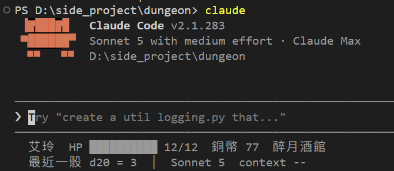

# [Day 14] HP 還剩多少？看畫面最下面：狀態列

到今天為止，DM 改 HP 有守衛看著，DM 報骰子有帳本對著。但我們想知道艾玲現在剩多少 HP，還是得問 Claude Code DM 或自己打開 `state.json` 檔案來看。

問 DM 拿到的是 DM 記得的數字，不一定是檔案裡的數字。今天把遊戲狀態直接掛在畫面最下面，從**狀態列**（status line）來看!


## 狀態列是什麼

在 `settings.json` 設定一個 `statusLine` 並指定一個指令。Claude Code 就會執行這個指令，並把 session 資訊從標準輸入傳給這個指令，指令處理後印出來的每一行，就顯示在輸入框下面。

聽起來跟 Hook 很像，差別在這裡：

| | Hook | 狀態列 |
|---|---|---|
| 誰來跑 | Claude Code | Claude Code |
| 什麼時候跑 | 指定的事件發生時 | 開 session 時、之後每次 DM 回話、`/compact` 完成、切換權限模式時等 |
| 輸出給誰 | 預設誰都看不到，少數情況交給模型 | 只顯示給你，不會進對話，也不會花 token |
| 能不能擋模型行為 | exit 2 可以擋 | 不能，只負責顯示 |

狀態列更新的時機，上表列了主要幾種。想定時刷新，可以在 `statusLine` 裡加`refreshInterval`（單位是秒，最小 1）。

## 從今天起改用 Python

Day 11～13 的腳本都是 PowerShell 來寫。Day 12 也看到了些問題：檔案得改 BOM，不然讀中文會有問題。今天起新的腳本改用 Python：讀 JSON 簡單，在 macOS、Linux 也能使用。

Python 用 **uv** 來裝和執行。uv 是 Python 的管理工具，要跑 Python 腳本時，uv 會自己找到或下載 Python，不用煩惱安裝和路徑。

安裝 uv，Windows 在 PowerShell 執行：

```powershell
powershell -ExecutionPolicy ByPass -c "irm https://astral.sh/uv/install.ps1 | iex"
```

裝完重開終端機，先把 Python 下載好：

```bash
uv python install
```

## 狀態列拿得到哪些資料

Claude Code 每次執行狀態列的指令，都會從 stdin 傳進一段 JSON，裡面是這個 session 的資訊。程式從裡面挑想顯示的欄位就好，常用的有這些：

| 欄位 | 內容 |
|---|---|
| `model.display_name` | 目前的模型，例如 `Sonnet 5` |
| `effort.level` | 目前的 effort：`low`、`medium`、`high`、`xhigh` 或 `max` |
| `context_window.used_percentage` | context 用了百分之幾；剛開 session 時可能還沒有值 |
| `cost.total_cost_usd` | 這個 session 照 API 定價估算的費用，單位是美元 |
| `rate_limits.five_hour.used_percentage` | 5 小時額度用了百分之幾；只有 Pro、Max 訂閱才有，而且要等第一次回覆之後 |
| `workspace.current_dir` | 目前的工作資料夾 |
| `session_id`、`transcript_path` | 這個 session 的編號、對話紀錄檔的位置 |
| `version` | Claude Code 的版本 |

完整的欄位清單在[官方文件](https://code.claude.com/docs/zh-TW/statusline#available-data)。

這段 JSON 只有 Claude Code 自己知道的事，艾玲的 HP、銅幣不在裡面，得由程式自己去讀 `state.json`。今天的狀態列兩種都用：模型和 context 用量來自這段 JSON，遊戲的數字來自檔案。

## 寫狀態列

建立 `dungeon\.claude\statusline.py`：

```python
# .claude/statusline.py
# 狀態列：Claude Code 更新畫面時執行這支程式，印出的每一行顯示在輸入框下面。
# 遊戲的數字一律讀檔案（state.json、.game/rolls.log），不靠 DM 講。
import json
import pathlib
import sys

sys.stdout.reconfigure(encoding="utf-8")                 # Windows 預設不是 UTF-8，中文會亂碼
ROOT = pathlib.Path(__file__).resolve().parent.parent    # dungeon 資料夾

try:                                                     # Claude Code 從 stdin 餵進來的 session 資訊
    session = json.loads(sys.stdin.buffer.read().decode("utf-8-sig"))
except ValueError:
    session = {}


def bar(value, total, width=10):
    filled = max(0, min(width, round(width * value / total))) if total else 0
    return "█" * filled + "░" * (width - filled)


# 第一行：角色狀態，讀 state.json
try:
    st = json.loads((ROOT / "state.json").read_text(encoding="utf-8"))
    print(f"{st['name']}  HP {bar(st['hp'], st['max_hp'])} {st['hp']}/{st['max_hp']}"
          f"  銅幣 {st['copper']}  {st['location']}")
except (OSError, ValueError, KeyError):
    print("讀不到 state.json")

# 第二行：最近一骰讀帳本，模型和 context 用量讀 session
last = "還沒骰過"
ledger = ROOT / ".game" / "rolls.log"
if ledger.exists():
    rows = [r for r in ledger.read_text(encoding="utf-8").splitlines() if r.strip()]
    if rows:
        roll_id, spec, total = rows[-1].split()[:3]
        last = f"最近一骰 {spec} = {total}"
model = session.get("model", {}).get("display_name", "?")
pct = (session.get("context_window") or {}).get("used_percentage")
context = f"{pct:.0f}%" if isinstance(pct, (int, float)) else "--"
print(f"{last}  │  {model}  context {context}")
```

目前在狀態列顯示的兩行資料來源：

| 顯示 | 從哪裡來 |
|---|---|
| 名字、HP 條、銅幣、位置 | `state.json` |
| 最近一骰 | 昨天的帳本 `.game/rolls.log` 最後一行 |
| 模型、context 用量 | Claude Code 從 stdin 餵進來的 session 資訊 |

遊戲的數字都從檔案讀，DM 講什麼都不影響狀態列。剛開 session 時，context 用量還是空的，所以顯示 `--`。

在 dungeon 資料夾手動試一次：

```powershell
'{"model":{"display_name":"Sonnet 5"},"context_window":{"used_percentage":8}}' | uv run --no-project .claude/statusline.py
```

```
艾玲  HP ████████░░ 10/12  銅幣 77  醉月酒館
還沒骰過  │  Sonnet 5  context 8%
```

帳本裡有骰子的話，第二行會變成「最近一骰 d20+2 = 17」這樣。

`uv run --no-project` 的意思是：用 uv 管理的 Python 跑這支腳本，不要往上層資料夾找 Python 專案的設定。這支腳本只用 Python 內建的功能，不需要專案設定。

## 設定狀態列

`settings.json` 加一段，跟 `permissions`、`hooks` 同一層：

```json
"statusLine": {
  "type": "command",
  "command": "uv run --no-project .claude/statusline.py"
}
```

Windows 有裝 Git Bash 的話，Claude Code 會用 Git Bash 執行這個指令，所以路徑要寫正斜線 `/`。

存檔之後，Claude Code 會馬上用新的指令跑一次：



## 實測

讓艾玲直接下地窖跟巨鼠打一架。Claude Code DM 骰完、改完 `state.json` 檔案，回話的那一刻，狀態列跟著更新：HP 條變短，最新的骰子也換了。

![DM 敘述艾玲走下地窖，暗處竄出一隻巨鼠撲上來咬，艾玲 HP 10 / 12（被咬中，扣 2 點）；骰子：d20+3: 13 + 3 = 16 [R:7a295aa8=16]、d4: 2 [R:5456353c=2]，列出四個選項。下面的狀態列跟著更新：第一行 艾玲 HP 條少了兩格 10/12 銅幣 77 舊地窖；第二行 最近一骰 d4 = 2 │ Sonnet 5 context 7%](assets/02-statusline-bitten.png)

## 狀態列的階層關係

`statusLine` 和之前提過的 Skill 或是 Hook 也同樣有全域與專案層級設定，但 statusLine 同時只會看一種。使用者層的 `C:\Users\<你的帳號>\.claude\settings.json` 和專案的 `.claude/settings.json` 都設的話，專案的優先。

我之前寫過一個全域用的狀態列：[claude-code-statusline](https://github.com/harry18456/claude-code-statusline)，會顯示模型、context 用量、花費、快取命中率、5 小時和 7 天的額度，還有 git 分支等等。有興趣也可以使用看看。

## 目前還有什麼問題嗎？

狀態列只負責「看」。HP 還是 Claude Code DM 用 `Edit` 修改，Hook 守衛只檢查 `hp` 合不合理；骰子還是透過 `dice.sh` 印出來、DM 參考使用。規則越來越多，全都靠 DM 照 `CLAUDE.md` 做事，還是太鬆。

明天來看 Claude Code 另一個重要機制：MCP。先接一個現成的 MCP server，看看工具怎麼從外面接進 Claude Code；再自己寫一個最小的骰子 server，讓骰子變成 DM 真正呼叫的工具。往後幾天，攻擊、移動、各種檢定也會一樣一樣交給 MCP 工具。最後 DM 只負責說故事，擲骰、算數字、改狀態都交給工具。

今天結束時 `dungeon` 資料夾的完整內容在 [articles/14/dungeon](https://github.com/harry18456/claude-code-dungeon-master/tree/main/articles/14/dungeon)，給大家參考。

## 目前學會的 Claude Code 機制

- ✅ Day 1：安裝與登入、四種介面；模型：`/model`、`/effort`、`/usage`
- ✅ Day 2：session：`.jsonl`、`--resume`、`-c`、`/resume`、`cleanupPeriodDays`
- ✅ Day 3：CLAUDE.md：三層、`@` 匯入、`/init`；`/context`
- ✅ Day 4：內建工具：Read／Bash／Edit、`Ctrl+O`
- ✅ Day 5：checkpoint：`/rewind`（`Esc` 兩下）、`/branch`
- ✅ Day 6：Skill：`SKILL.md`、`description`、`/skill 名字`、skill-creator
- ✅ Day 7：權限：權限模式、`Shift+Tab`、`/permissions`、allow／ask／deny、`settings.json`
- ✅ Day 8：Skill：`$ARGUMENTS`、`argument-hint`、`` !`指令` `` 展開
- ✅ Day 9：Skill：`disable-model-invocation`、`user-invocable`、`allowed-tools`
- ✅ Day 10：權限：Plan Mode、`/plan`、`Ctrl+G`
- ✅ Day 11：Hook：`Stop`、`UserPromptExpansion`、`PostToolUse`、`matcher`、`if`、`/hooks`
- ✅ Day 12：Hook：`PreToolUse`、exit 2 把理由交給模型、stdin 的 `tool_input`、matcher `Edit|Write`、`.ps1` 存成 UTF-8 with BOM；權限：用 deny 保護 Hook 自己
- ✅ Day 13：Hook：`Stop` 的 `last_assistant_message`、JSON 輸出 `systemMessage`；帳本與票根
- ✅ Day 14：狀態列：`statusLine`、收到的 session JSON、`refreshInterval`；uv：`uv run`
