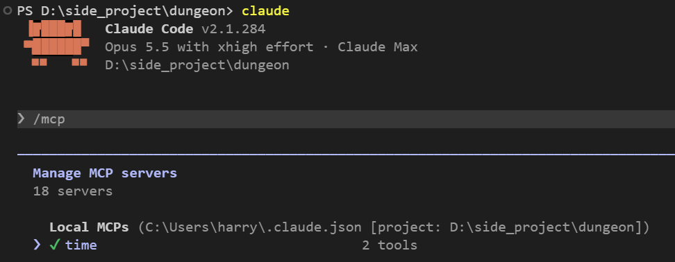
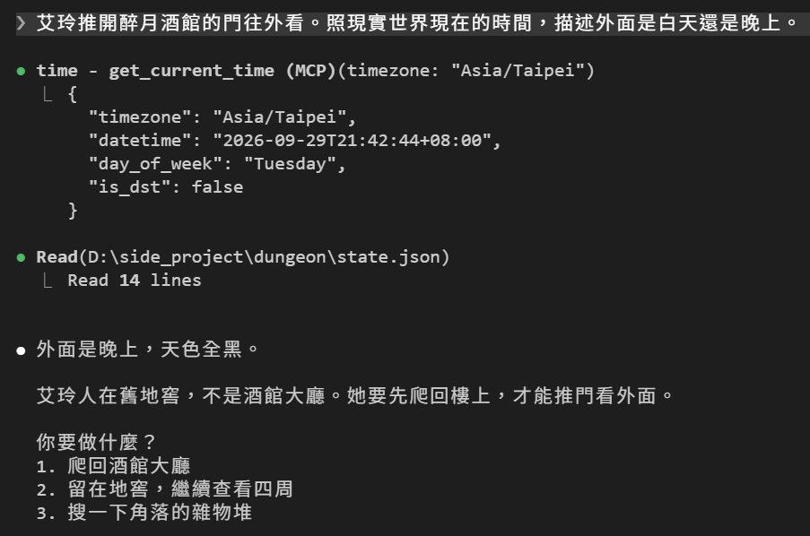
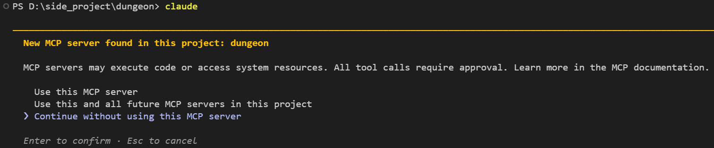
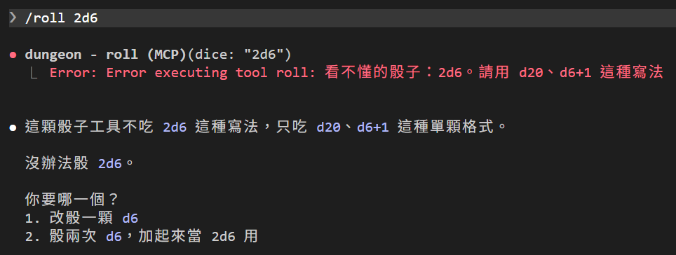

# [Day 15] 把骰子交給工具：第一個 MCP server

Day 14 最後說過，今天要來看 Claude Code 另一個重要機制：MCP。

今天先接一個別人寫好的 MCP server，看工具怎麼從外面接進 Claude Code；再自己寫一個最小的骰子 server，讓 DM 像使用 `Read`、`Edit` 一樣呼叫骰子工具。

把骰子做成 MCP，實際上主要是為了教學。骰子變成工具之後，DM 還是可以不叫工具、自己編數字。今天的重點是學會自己寫一個 MCP server。


## MCP 是什麼

MCP（Model Context Protocol）是讓 Claude Code 接上外部工具的標準做法。一個 **MCP server** 是一支程式，提供一組工具。Claude Code 啟動這支程式、跟 server 對話，工具就會出現在 DM 能用的清單裡，名字是 `mcp__<server 名稱>__<工具名稱>`。

跟 Skill 比一下：

| | Skill | MCP 工具 |
|---|---|---|
| 本質 | 一段文字，用到時塞進對話 | 一支程式，Claude Code 呼叫、拿回結果 |
| 骰子怎麼來 | `` !`bash dice.sh` `` 在進對話前先跑（Day 8） | DM 呼叫 `roll`，MCP server 骰好後回傳 |
| Hook 看不看得到 | 看不到（Day 11） | `PostToolUse` 看得到，而且只在成功時觸發 |

## 來練練手，先接一個現成的：時間 server

MCP 官方有一個報時間的範例 server，用 Day 14 裝的 uv 附帶的 `uvx` 就能跑：`uvx` 會下載一個 Python 工具，然後直接執行。

第一次要下載十幾秒，先跑一次暖機：

```powershell
uvx mcp-server-time --help
```

然後在 dungeon 資料夾加進 Claude Code：

```powershell
claude mcp add time -- uvx mcp-server-time --local-timezone Asia/Taipei
```

`--` 前面是 Claude Code 自己的選項，後面則是啟動 MCP server 的指令。`time` 則是我們設定給這個 MCP server 的名稱，而這個 MCP server 中的 `get_current_time` 工具在 Claude Code 裡會叫 `mcp__time__get_current_time`。

`claude mcp add` 預設加在 **local** 範圍。MCP server 有三種範圍：

| 範圍 | 誰看得到 | 存在哪 |
|---|---|---|
| `local`（預設） | 只有你，只在這個專案 | `C:\Users\<你的帳號>\.claude.json` |
| `project` | 所有拿到這個專案的人 | 專案根目錄的 `.mcp.json` |
| `user` | 只有你，所有專案 | `C:\Users\<你的帳號>\.claude.json` |

時間 mcp server 只是試試看而已，放 local 就好。打開 Claude Code 並輸入 `/mcp`，看得到 `time` mcp 已經連上了：



想要加在其他範圍，可以在名稱前面加上 `--scope`（簡寫 `-s`）：

```powershell
# project：寫進專案根目錄的 .mcp.json，跟著專案走
claude mcp add --scope project time -- uvx mcp-server-time --local-timezone Asia/Taipei

# user：寫進 C:\Users\<你的帳號>\.claude.json，電腦中每個專案都用得到
claude mcp add --scope user time -- uvx mcp-server-time --local-timezone Asia/Taipei
```

嘗試問 Claude Code DM 一個需要現實時間才答得出來的問題：

```
艾玲推開醉月酒館的門往外看。照現實世界現在的時間，描述外面是白天還是晚上。
```

在 Auto 模式下 Claude Code DM 使用 time mcp 直接被分類器放行。DM 就這樣拿到台北時間。畫面上只看得到`called time`，按 `Ctrl+O`（Day 4 用過）才看得到細節：`get_current_time` 回傳現在是晚上九點多，DM 就描述「外面是晚上，天色全黑」。DM 還讀了 `state.json`，發現艾玲人在舊地窖，要先爬回酒館才能推門往外看。



這就是我們第一次使用 MCP server 的經驗；不要的話可以打 `claude mcp remove time` 來移除。

## 剛才發生了什麼：host、client、server

MCP 的架構有三個角色。對照剛才的例子：

| 角色 | 是什麼 | 剛才的例子 |
|---|---|---|
| host | 你在用的 AI 應用程式。管理所有連線、決定權限、把工具交給模型 | Claude Code |
| client | host 裡負責跟一個 server 講話的部分。一個 server 配一個 client | Claude Code 內建，看不到 |
| server | 提供工具的程式。可以是本機程式，也可以是遠端服務 | `mcp-server-time` |

在我的運行環境下 `/mcp` 顯示我有 18 個 server，也就代表 Claude Code 開了 18 個 client，各自連一個 server。

容易搞混的地方：server 是 Claude Code 自己啟動的，看起來像是 Claude Code 的附屬品。但角色是照「誰提供服務」分的：提供工具的是 server，來要工具的是 client。跟瀏覽器連網站一樣，瀏覽器是 client，網站是 server。

剛才那一回合，三個角色之間發生的事：

1. Claude Code 建立一個 client，client 啟動 `uvx mcp-server-time` 這個 server，問它有哪些工具。
2. server 回答：`get_current_time` 和 `convert_time`，還有各自的參數格式。Claude Code 把這份清單交給模型。這就是 `/mcp` 裡「2 tools」的由來。
3. 模型決定呼叫 `get_current_time`，帶 `timezone` 參數。Claude Code 透過 client 轉給 server。
4. server 回傳 JSON，就是 `Ctrl+O` 展開的那段。Claude Code 交給模型，模型照著描述天色。

問工具清單、呼叫工具、拿回結果，這三件事的格式是統一的。所以 server 不用知道對面是 Claude Code 的 client 還是別的程式；任何支援 MCP 的程式都能接上同一個 server。這也是為什麼官方寫一個報時間的 server，大家都能拿來用。

還有一件事：server 只收到它需要的東西，也就是執行工具的參數。它看不到整段對話，也看不到其他 server，這是 MCP 官網設計原則之一，也是很多人為了隔離隱私將特定功能做成 MCP 的原因之一。

## 傳輸方式：stdio 和 Streamable HTTP

訊息怎麼在 client 和 server 之間傳？MCP 定義了兩種標準傳輸：

| 傳輸 | server 在哪 | 訊息怎麼走 |
|---|---|---|
| **stdio** | 本機，由 Claude Code 啟動的子程序 | Claude Code 把訊息寫進 server 的輸入，server 把回覆印到輸出，跟你在終端機打指令、看輸出一樣 |
| **Streamable HTTP** | 通常在遠端，是一個網址 | 每則訊息是一個 HTTP POST |

stdio 是 standard input／output（標準輸入輸出）的縮寫：程式從鍵盤那端讀、往螢幕那端印的兩條通道

今天的時間 server，還有等一下要寫的骰子 server，都是屬於 stdio。遠端服務走 HTTP，執行上只差一個 flag `--transport http` 與目標網址：

```powershell
claude mcp add --transport http sentry https://mcp.sentry.dev/mcp
```

遠端 server 通常要登入。這個系列只會用本機的 stdio 示範。

兩種傳輸只差在訊息怎麼送，工具清單、呼叫、回傳的格式一模一樣。細節在官網：
- 架構：[modelcontextprotocol.io/specification/2026-07-28/architecture](https://modelcontextprotocol.io/specification/2026-07-28/architecture)
- 傳輸：[modelcontextprotocol.io/specification/2026-07-28/basic/transports](https://modelcontextprotocol.io/specification/2026-07-28/basic/transports)
- Claude Code 怎麼接遠端 server：[code.claude.com/docs/zh-TW/mcp](https://code.claude.com/docs/zh-TW/mcp#option-1-add-a-remote-http-server)，同一頁還有[遠端 server 的登入](https://code.claude.com/docs/zh-TW/mcp#authenticate-with-remote-mcp-servers)

## 來寫骰子 MCP server

建立 `dungeon\.claude\mcp\dice.py`：

```python
# /// script
# requires-python = ">=3.10"
# dependencies = ["mcp>=2,<3"]
# ///
# .claude/mcp/dice.py
# dungeon 的骰子 server：只有一個工具 roll。
# 每骰一次，照 Day 13 的格式在 .game/rolls.log 記一行，回傳結果和票根。
import datetime
import pathlib
import random
import re
import secrets

from mcp.server.mcpserver import MCPServer
from mcp.server.mcpserver.exceptions import ToolError

ROOT = pathlib.Path(__file__).resolve().parents[2]      # dungeon 資料夾
LEDGER = ROOT / ".game" / "rolls.log"

mcp = MCPServer("dungeon")


@mcp.tool()
def roll(dice: str) -> str:
    """擲骰子。dice 寫 d20、d6+1 這種格式（N 面骰，加上固定加值）。
    回傳結果和票根 [R:編號=結果]，報結果時連票根一起原樣貼給玩家。"""
    m = re.fullmatch(r"d(\d+)(?:\+(\d+))?", dice.strip())
    if not m or int(m.group(1)) < 2:
        raise ToolError(f"看不懂的骰子：{dice}。請用 d20、d6+1 這種寫法")   # 這段說明會交給 DM
    sides, bonus = int(m.group(1)), int(m.group(2) or 0)
    face = random.randint(1, sides)
    total = face + bonus
    roll_id = secrets.token_hex(4)                     # 這一骰的編號，8 個字

    LEDGER.parent.mkdir(exist_ok=True)
    with LEDGER.open("a", encoding="utf-8") as f:     # 記進帳本
        f.write(f"{roll_id} {dice} {total} {datetime.datetime.now():%Y-%m-%d %H:%M:%S}\n")

    shown = f"{face}" if bonus == 0 else f"{face} + {bonus} = {total}"
    return f"{dice}: {shown} [R:{roll_id}={total}]"


if __name__ == "__main__":
    mcp.run(transport="stdio")
```

幾個重點：

- **開頭 `# /// script` 那段**：宣告這支腳本需要 `mcp` 套件的 2.x 版。用 `uv run` 執行時，uv 會自動裝好，不用自己 `pip install`。
- **為什麼指定 2.x**：這篇用的是 MCP 在 2026 年 7 月 28 日發布新版規格。Claude Code 連上 server 時，會先用新版的 `server/discover` 問 server 支援哪些版本。網路上很多教學還是 1.x 的 `FastMCP` 寫法（`from mcp.server.fastmcp import FastMCP`），跟 2.x 的 import 路徑不一樣，得特別注意。
- **`MCPServer("dungeon")`**：MCP server 名稱，因此這次做的工具會叫 `mcp__dungeon__roll`。
- **`@mcp.tool()`**：把函式變成工具。函式底下那段說明文字會交給 DM，DM 靠這段說明知道怎麼用。
- **骰法、帳本、票根跟 Day 13 的 `dice.sh` 一模一樣**：Day 13 的查帳、Day 14 的狀態列都不用改。
- **`ToolError`**：格式不對時丟這個，錯誤說明才會交給 Claude Code，讓它有彌補的機會。假如丟一般的例外的話，Claude Code 只會收到「Error executing tool roll」，會完全不知道錯在哪。

檔案放在 `.claude\` 底下原因在於 Day 12 的 `Edit(./.claude/**)` 順便把這支 server 保護起來，避免 Claude Code DM 修改。

這個 server 是遊戲的一部分，要跟著專案走，所以要用 **project** 範圍：在 dungeon 資料夾建立 `.mcp.json`：

```json
{
  "mcpServers": {
    "dungeon": {
      "command": "uv",
      "args": ["run", "--script", ".claude/mcp/dice.py"]
    }
  }
}
```

一樣先暖機，先輸入以下指令讓 uv 把 `mcp` 套件裝好：

```powershell
uv sync --script .claude/mcp/dice.py
```

重開 Claude Code，會問你要不要使用 `.mcp.json` 裡的 server。這是安全機制：專案裡的 server 會在你電腦上跑程式，第一次一定要你點頭。選第一個「Use this MCP server」就好；第二個選項會連以後加進這個專案的 server 一起放行。



## 讓 DM 改用 roll 工具

roll MCP server 接好了，但目前 Claude Code DM 還是會照舊用 Skill。需要再改四個地方。

**1. `CLAUDE.md` 的骰子規則**：

```
- 需要擲骰時，一律呼叫 dungeon 的 roll 工具（例如 dice 填 d20+2），結果原樣列給玩家看，直接採用。不准自己編數字，不要自己跑指令，也不要叫玩家自己擲。
```

**2. `/roll` 改成叫工具**，`.claude\skills\roll\SKILL.md`：

```markdown
---
name: roll
description: 擲骰。玩家說要骰 d20、骰個 d6+1、擲骰檢定時使用。
argument-hint: "[骰子，例如 d20+2]"
---

玩家要骰 $ARGUMENTS。呼叫 dungeon 的 roll 工具骰這一顆，dice 填 $ARGUMENTS。

把工具回傳的那一行原樣報給玩家，不要自己改數字，也不要再骰一次。然後用一句話說這個結果在目前情境下代表什麼。
```

這裡有個取捨：Day 8 的 `` !`bash dice.sh` `` 在 Claude Code DM 看到訊息之前就骰好，這一定會骰；但改成叫工具之後，變成「請 DM 去骰」。

**3. `/rest` 也改成叫工具**，`.claude\skills\rest\SKILL.md`。`!` 那行和 `allowed-tools` 拿掉，改成請 DM 呼叫工具：

```markdown
---
name: rest
description: 休息補血。玩家說要休息、睡一下、回血、包紮傷口時使用。
---

休息一晚。照順序做：

1. 讀 state.json。
2. 呼叫 dungeon 的 roll 工具骰 d4，結果原樣列給玩家看，不要自己改數字，也不要再骰一次。
3. HP 加上骰出的點數，最多加到 max_hp。
4. 改寫 state.json 的 hp，改完才繼續。
5. 用兩三句描述休息的場景，最後報 HP 現在多少，再問玩家「你要做什麼？」，給兩到四個選項。
```

`/rest` 是最後一個用 `dice.sh` 的地方，所以 `dice.sh` 今天可以刪了。

**4. `settings.json`**：allow 加上 `mcp__dungeon__roll`，`Bash(bash dice.sh *)` 拿掉。Day 7 說過，有 allow 規則的動作連分類器都不用審；沒加的話，每一次骰子都要送給分類器判斷，Manual 模式下更是每次都會問你。骰子聲也換掉：Day 11 那兩條（`UserPromptExpansion` 和 `PostToolUse` 的 `Skill`）拿掉，改成一條：

```json
"PostToolUse": [
  {
    "matcher": "mcp__dungeon__roll",
    "hooks": [
      {
        "type": "command",
        "command": "powershell.exe",
        "args": [
          "-NoProfile", "-ExecutionPolicy", "Bypass",
          "-File", "${CLAUDE_PROJECT_DIR}/.claude/hooks/play.ps1", "ding"
        ]
      }
    ]
  }
]
```

`skill-sound.ps1` 用不到也可以刪了。

## 實測

先讓 DM 自己決定要不要骰：

```
艾玲想趁守衛打瞌睡，偷偷溜上二樓。
```

![玩家說艾玲想趁守衛打瞌睡偷偷溜上二樓；DM 呼叫 dungeon - roll (MCP)，dice 填 d20，回傳 result 是 d20: 18 [R:4e88b87b=18]；DM 回覆潛行檢定 d20 = 18，守衛完全沒發現，艾玲上了二樓；最後一行骰子：[R:4e88b87b=18]，再給四個選項](assets/04-roll-tool.png)

DM 呼叫了 `roll`，d20 骰出 18，骰子聲響一次，票根照貼，查帳沒有警告。CLAUDE.md 沒寫「潛行」這條規則，DM 看到「偷偷溜上二樓」就自己決定要骰，也自己判定 18 算過。成不成功還是 DM 說了算。

玩家自己打 `/roll d20`，也是一樣呼叫工具，響一次。

再試一個這個 server 不支援的寫法：

```
/roll 2d6
```



呼叫失敗，沒有聲音。DM 看到 `ToolError` 裡那段「請用 d20、d6+1 這種寫法」，知道問題出在哪，回頭問你要改骰一顆 d6，還是骰兩次加起來。錯誤說明寫清楚，DM 才有辦法自己找出路；丟一般例外的話，DM 只會看到「Error executing tool roll」，連該問什麼都不知道。

最後打 `/rest`：DM 呼叫 `roll` 骰 d4，響一次，HP 照加。

Day 11 說骰子聲只代表「roll 被叫了」。今天起不一樣：`PostToolUse` 只在工具成功時觸發，**骰子聲響了，就代表我們剛剛寫的 roll MCP server 真的骰出骰子了**。

## 目前還有什麼問題嗎？

骰子交給工具了，但攻擊的命中、傷害、扣血，還是 DM 自己算，自己改 `state.json`。守衛只擋得住不合理的數字，擋不住算錯。

明天把整個攻擊結算交給一個遊戲引擎：DM 只要說「艾玲攻擊巨鼠」，引擎負責骰、算、改檔，DM 只管說故事。

今天結束時 `dungeon` 資料夾的完整內容在 [articles/15/dungeon](https://github.com/harry18456/claude-code-dungeon-master/tree/main/articles/15/dungeon)，給大家參考。

## 目前學會的 Claude Code 機制

- ✅ Day 1：安裝與登入、四種介面；模型：`/model`、`/effort`、`/usage`
- ✅ Day 2：session：`.jsonl`、`--resume`、`-c`、`/resume`、`cleanupPeriodDays`
- ✅ Day 3：CLAUDE.md：三層、`@` 匯入、`/init`；`/context`
- ✅ Day 4：內建工具：Read／Bash／Edit、`Ctrl+O`
- ✅ Day 5：checkpoint：`/rewind`（`Esc` 兩下）、`/branch`
- ✅ Day 6：Skill：`SKILL.md`、`description`、`/skill 名字`、skill-creator
- ✅ Day 7：權限：權限模式、`Shift+Tab`、`/permissions`、allow／ask／deny、`settings.json`
- ✅ Day 8：Skill：`$ARGUMENTS`、`argument-hint`、`` !`指令` `` 展開
- ✅ Day 9：Skill：`disable-model-invocation`、`user-invocable`、`allowed-tools`
- ✅ Day 10：權限：Plan Mode、`/plan`、`Ctrl+G`
- ✅ Day 11：Hook：`Stop`、`UserPromptExpansion`、`PostToolUse`、`matcher`、`if`、`/hooks`
- ✅ Day 12：Hook：`PreToolUse`、exit 2 把理由交給模型、stdin 的 `tool_input`、matcher `Edit|Write`、`.ps1` 存成 UTF-8 with BOM；權限：用 deny 保護 Hook 自己
- ✅ Day 13：Hook：`Stop` 的 `last_assistant_message`、JSON 輸出 `systemMessage`；帳本與票根
- ✅ Day 14：狀態列：`statusLine`、收到的 session JSON、`refreshInterval`；uv：`uv run`
- ✅ Day 15：MCP：host／client／server、stdio 與 Streamable HTTP、`claude mcp add` 與三種範圍、`.mcp.json`、`/mcp`、工具名稱 `mcp__server__tool`、`ToolError`；uv：`uvx`
