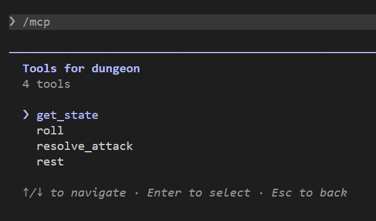
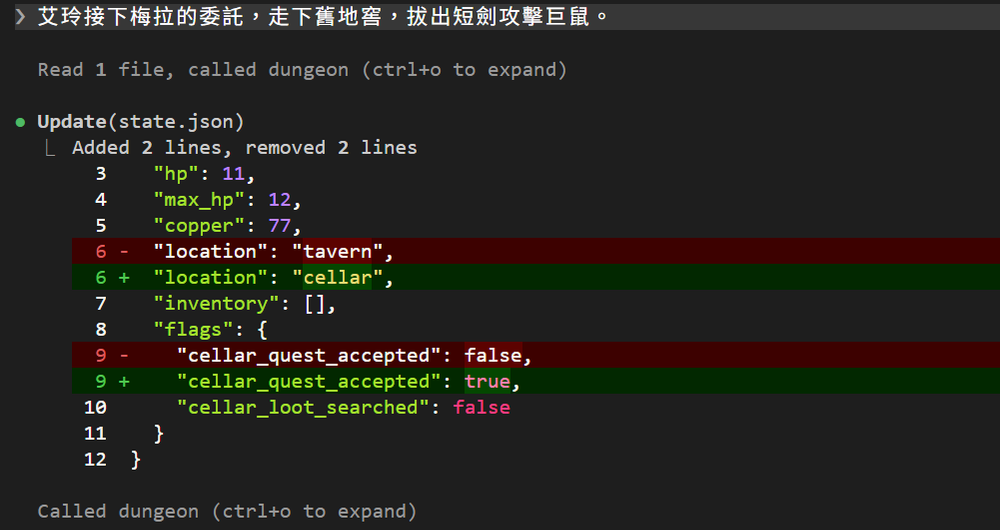
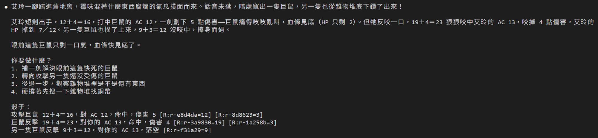
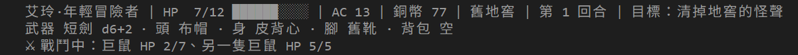
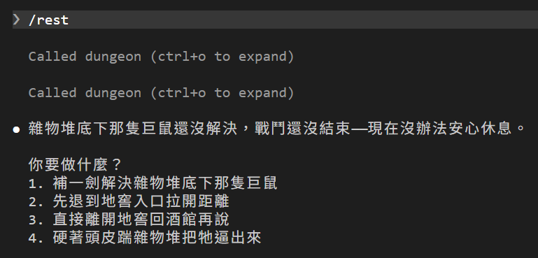

# [Day 16] 換上遊戲引擎：一刀下去，命中、扣血、反擊不用 Claude Code DM 算

在 Day 15 我們把骰子交給了工具，但攻擊還是 DM 自己算：骰出幾點、有沒有命中、扣幾點血，算完自己再用 `Edit` 修改 `state.json`。在 Day 12 的時候守衛擋得住「HP 改成 80」這種離譜的數字，但擋不住算錯這件事。

今天換上一個遊戲引擎。Claude Code DM 只要說「艾玲攻擊巨鼠」，引擎負責擲骰、計算、寫檔，DM 就只要照結果說故事。


## 引擎從哪來

引擎的程式碼我先用 Claude Code 寫好了，核心大約有一千兩百行 Python，完整程式碼在本系列 repo 的 [`articles/16/dungeon/`](https://github.com/harry18456/claude-code-dungeon-master/tree/main/articles/16/dungeon)。文章就不逐行講，只講 Claude Code DM 用得到的工具，最後再完整走一次攻擊。

| 檔案 | 做什麼 |
|---|---|
| `engine/core.py` | 遊戲規則：擲骰、攻擊、休息，也負責修改 `state.json` |
| `engine/server.py` | MCP server，把規則包成 DM 能呼叫的工具 |
| `data/*.json` | 記錄艾玲、敵人、物品的相關數值 |
| `scenes/*.json` | 每個場景有誰、出口在哪、有什麼地方能搜尋 |
| `gamectl.py` | 在終端機直接叫引擎的程式，不經過 DM，例如 `uv run --no-project gamectl.py status`。狀態列、開新局都用它 |

引擎裡其實還有場景、移動、檢定，今天先來做四個工具。

P.S. 今天程式碼太多，建議直接複製 `dungeon` 資料夾直接操作 (艸)

## 今天要做的四個工具

| 工具 | 做什麼 | 什麼時候叫 |
|---|---|---|
| `get_state` | 回傳目前狀態（HP、銅幣、位置、物品、敵人剩下的 HP），和引擎最近處理完的那個動作的結果 | 對話開始時；工具回錯誤、或不確定剛才的動作有沒有成立時 |
| `roll` | 擲骰。參數跟 Day 15 一樣是 `dice`，現在也能吃 `2d6` | 攻擊以外要擲骰檢定的時候 |
| `resolve_attack` | 一次算完一次攻擊：命中、傷害、扣血，以及處理每個還活著敵人的反擊 | 艾玲攻擊時，`target` 填對象代號，例如 `giant_rat` |
| `rest` | 休息：擲生命骰補 HP、寫檔。戰鬥中會拒絕 | `/rest`，或玩家說想休息 |

每個 MCP 工具都回傳 JSON：

| 欄位 | 意思 |
|---|---|
| `dice` | 照順序的骰子紀錄，一行是一次擲骰或出手，DM 原樣貼給玩家 |
| `effects` | 這次影響了什麼，例如「受到 2 點傷害，HP 10 → 8」 |
| `resolution_id`、`version` | 這個動作的編號，和 `state.json` 的版本號，每寫入一次加一 |
| `player_down` | 艾玲 HP 歸零才會出現：醒來在酒館、扣 10 銅幣、HP 補滿 |

為什麼 `get_state` 要附上最近處理完的那個動作？工具回錯誤、或 DM 不確定剛才那一刀有沒有砍出去時，直接再叫一次 `resolve_attack`，巨鼠可能就挨了兩刀。先用 `get_state` 看回傳的 `last_result`：最近一筆就是那一刀，代表已經算過了；不是，才重新出手。

## 數值改照 D&D 規則

Day 1 的短劍 +2、巨鼠防禦 12，是 Claude Code 當時自己編的，Day 3 抄進 CLAUDE.md 之後一路用到現在。換上引擎之後，這些數值改放在 `data/` 資料夾下，由引擎照精簡版的 D&D 5e（《龍與地下城》第五版）規則來算。

所以有些數字會變。例如艾玲的短劍攻擊從 +2 變成 +4：她的敏捷是 14，照規則換算成 +2；她會用短劍，規則叫「熟練」，再加 2。傷害也加上敏捷的 2，變成 d6+2。

| | Day 15（寫在 CLAUDE.md） | Day 16（引擎） |
|---|---|---|
| 艾玲 | 短劍攻擊 +2、傷害 d6+1、防禦 12 | 短劍攻擊 +4、傷害 d6+2、AC 13 |
| 巨鼠 | 一隻：HP 6、防禦 12、攻擊 +3、傷害 d4 | 兩隻：`giant_rat` HP 7、攻擊 +4、傷害 d4+1；`giant_rat_2` HP 5、攻擊 +3、傷害 d4；AC 都是 12 |
| 休息 | 補 d4 | 補 d8+1 |

AC（Armor Class）就是之前說的防禦，數字越高越難打中。規則也多了兩條：d20 骰出 20 叫重擊，一定命中，傷害骰變兩倍（d6+2 變成 2d6+2）；骰出 1，加值再高也落空。

## 換上遊戲引擎

引擎的檔案都在 repo 裡，照下面的步驟換上去：

1. 下載 repo：在 GitHub 頁面按 **Code → Download ZIP**，或用 `git clone`。從 `articles/16/dungeon/` 複製這些到你的 dungeon 資料夾：
   - `engine\`、`data\`、`scenes\`、`gamectl.py`
   - `.claude\hooks\` 底下的 `audit.py`、`sound.py`、`sounds\`
   - `.claude\statusline.py`，換掉 Day 14 那支
   - `.claude\skills\rest\SKILL.md`，換掉 Day 15 那支
2. 刪掉用不到的檔案：`.claude\mcp\dice.py`、`.claude\hooks\play.ps1`、`.claude\hooks\audit.ps1`。骰子改由引擎擲，音效和查帳也換成 Python 版了。
3. 這四個設定檔直接用 repo 的版本覆蓋：`.mcp.json`、`.claude\settings.json`、`CLAUDE.md`、`.gitignore`。deny 擋的是 DM 的 `Edit`，你自己在檔案總管覆蓋不受影響。每個檔案改了什麼，下一節再來看。
4. `/roll` 的 SKILL.md 只差一句，自己在 VS Code 改就好：打開 `.claude\skills\roll\SKILL.md`，把「把工具回傳的那一行」改成「把工具回傳的 `dice` 那一行」。
5. `state.json` 想接著玩的話，要改三個地方：
   - `location` 改成場景代號：`醉月酒館` → `tavern`、`舊地窖` → `cellar`、`二樓` → `upstairs`
   - 刪掉 `flags` 裡的 `giant_rat_hp`，敵人的 HP 改由引擎記在 `enemies`
   - 刪掉 `inventory` 裡的「短劍」，短劍改放在引擎的裝備欄

   想從頭玩的話，執行 `uv run --no-project gamectl.py newgame` 會重設相關紀錄開新的一局。
6. 可以先把相關要用的套件裝好：`uv sync --script engine/server.py`。跟 Day 15 一樣，先裝好，Claude Code 第一次啟動 server 時才不會等太久。
7. 重開 Claude Code，打 `/mcp`，選 `dungeon` 按 Enter，再選 **View tools**，看得到這四個工具就對了：



## 設定改了什麼

剛才換上的設定，跟 Day 15 比起來改了這些地方。

**1. `.mcp.json`**：`dungeon` 這個 server 改成啟動引擎：

```json
{
  "mcpServers": {
    "dungeon": {
      "command": "uv",
      "args": ["run", "--no-project", "engine/server.py"]
    }
  }
}
```

server 的名稱一樣叫 `dungeon`，所以擲骰工具還是叫 `mcp__dungeon__roll`，allow 裡的這條不用動。啟動方式從 Day 15 的 `--script` 換成 Day 14 狀態列用過的 `--no-project`，跟其他 Python 腳本同一種寫法。`engine/server.py` 開頭一樣有 `# /// script` 那段，uv 照樣會先裝好 `mcp` 套件。

**2. `CLAUDE.md`**：改了三段。

- **狀態**：對話一開始先呼叫 `get_state`。HP 交給引擎管，DM 不能改；回傳的 `effects` 列出的變化，引擎也已經寫好了，DM 不用再改一次。錢、位置、物品、旗標（`flags`）還是 DM 自己改，`location` 改寫場景代號。工具回錯誤時，先查 `get_state`，不要直接再叫一次。
- **世界**：地窖的巨鼠變成兩隻，戰鬥會由 `resolve_attack` 來算。
- **規則**：艾玲的數值以 `get_state` 回傳的 `hero` 為準。攻擊一律呼叫 `resolve_attack`，其他要擲骰的事用 `roll`。回覆最後寫一行「骰子：」，底下原樣貼上每個工具回傳的 `dice`。

**3. `/roll` 的 SKILL.md**：Day 15 的骰子 server 回傳一行字，引擎的 `roll` 回傳的是 JSON，骰子那行放在 `dice` 欄位。所以 SKILL.md 要講清楚，原樣報給玩家的是 `dice` 那一行。

**4. `settings.json`**：

- **allow**：`mcp__dungeon__roll` 留著，再加上 `mcp__dungeon__get_state`、`mcp__dungeon__resolve_attack`、`mcp__dungeon__rest`，新工具一樣不用送分類器審。
- **deny**：加上 `Edit(./engine/**)`、`Edit(./data/**)`、`Edit(./scenes/**)`、`Edit(./gamectl.py)`。跟 Day 15 保護 `dice.py` 一樣，規則怎麼運行，Claude Code DM 改不了。
- **Stop**：`play.ps1`、`audit.ps1` 換成 Python 版的 `sound.py chimes`、`audit.py --mode warn`。
- **PostToolUse**：攻擊和休息也要有聲音，改成這樣：

```json
"PostToolUse": [
  {
    "matcher": "mcp__dungeon__roll|mcp__dungeon__resolve_attack|mcp__dungeon__rest",
    "hooks": [
      {
        "type": "command",
        "command": "uv run --no-project .claude/hooks/sound.py --result",
        "async": true
      }
    ]
  }
]
```

這段有三個重點：

- **matcher**：用 `|` 接三個工具，擲骰、攻擊、休息都會觸發。
- **`tool_response`**：Day 12 的守衛從 stdin 讀的是 `tool_input`，也就是工具收到什麼。`PostToolUse` 在工具跑完之後才觸發，所以還多了 `tool_response`，也就是工具回了什麼。`sound.py --result` 就是看 `tool_response` 決定播什麼聲音：每一次出手先播骰子聲，再播命中或落空；休息先播營火聲，有擲骰再播骰子聲。
- **`"async": true`**：Day 11 提過，這會讓 Hook 在背景跑。一回合可能出手三四次，音效一個接一個要播好幾秒；放到背景跑，Claude Code DM 就不用等音效播完才回話。

音效也換了，用的是 Freesound 上 CC0 授權的檔案（作者放棄著作權，誰都能自由使用），來源寫在 `.claude\hooks\sounds\CREDITS.md`。Stop 的提示音還是 Windows 內建的 chimes。

**5. `.gitignore`**：多了 `*.tmp` 和 `__pycache__/`。前者是引擎寫檔時的暫存檔，後者是 Python 自動產生的快取，都是不需要進 git 管理的檔案類型。

## 磨刀霍霍

設定換好了，來砍一刀看看。玩家這樣說：

```
艾玲接下梅拉的委託，走下舊地窖，拔出短劍攻擊巨鼠。
```

DM 依序做了三件事：

1. 呼叫 `get_state` 看目前狀態。
2. 先讀 `state.json`，再用 `Edit` 把 `location` 改成 `cellar`、`cellar_quest_accepted` 改成 `true`。位置和旗標今天還是讓 Claude Code DM 自己改。
3. 呼叫 `resolve_attack`，`target` 填 `giant_rat`。



畫面上 MCP 工具的呼叫會收成一行「called dungeon」，按 `Ctrl+O` 展開才看得到是哪個工具：第一個是 `get_state`，最後一個是 `resolve_attack`。

引擎回傳的 JSON 很長，節錄重要的部分：

```json
{
  "kind": "attack",
  "target": "giant_rat",
  "attack_bonus": 4,
  "target_ac": 12,
  "hit": true,
  "damage": 5,
  "enemy_hp_after": 2,
  "effects": ["巨鼠出手，打中了", "受到 4 點傷害，HP 11 → 7", "另一隻巨鼠出手，落空"],
  "strikes": [
    { "actor": "giant_rat", "hit": true, "damage": { "amount": 4, "hp_before": 11, "hp_after": 7 } },
    { "actor": "giant_rat_2", "hit": false }
  ],
  "player_hp_after": 7,
  "dice": "攻擊巨鼠 12＋4＝16，對 AC 12，命中，傷害 5 [R:r-e8d4da=12] [R:r-8d8623=3]\n巨鼠反擊 19＋4＝23，對你的 AC 13，命中，傷害 4 [R:r-3a9830=19] [R:r-1a258b=3]\n另一隻巨鼠反擊 9＋3＝12，對你的 AC 13，落空 [R:r-f31a29=9]",
  "resolution_id": "x-11d95d12",
  "version": 1
}
```

DM 只呼叫一次 `resolve_attack`，引擎就把這些事全做完了：

1. 擲 d20 加 4，對巨鼠的 AC 12：12＋4＝16，命中。d6 骰出 3，加 2，造成 5 點傷害，巨鼠 HP 7 → 2。
2. 艾玲出手之後，兩隻巨鼠各反擊一次。第一隻 19＋4＝23，超過艾玲的 AC 13，命中，d4 骰出 3，加 1，造成 4 點傷害；第二隻 9＋3＝12，沒到 13，落空。
3. 把艾玲的 HP 從 11 改成 7、巨鼠的 HP 改成 2，連同這次攻擊的完整結果，一次寫進 `state.json`。
4. 把五顆骰子記進 `.game/rolls.jsonl`，這次攻擊的經過記進 `.game/events.jsonl`。

遊戲的狀態一律以 `state.json` 為準，兩個 `.jsonl` 是另外留的紀錄：

- `rolls.jsonl` 是帳本。Stop 的查帳 Hook（`audit.py`）核對票根時會拿來參考，下面「票根換格式」再細講。
- `events.jsonl` 記下每個動作的經過。沒有 Hook 讀這個檔，想看的話打 `uv run --no-project gamectl.py log`，會列出最近 10 筆。

引擎先把結果寫進 `state.json`，寫好了這一刀就算數，接著才寫這兩個 `.jsonl`。所以 `.jsonl` 萬一寫失敗，這一刀照樣算數，不會退回，只是回傳會多一個 `log_warning` 欄位，寫著「日誌寫入失敗」和原因。紀錄只是輔助，不該因為紀錄寫壞，就讓已經發生的攻擊不算。

DM 照著結果說故事，最後把 `dice` 原樣貼在「骰子：」底下：



狀態列也換成引擎版了。Day 14 那支讀的是 `.game/rolls.log`，今天帳本換成 `.game/rolls.jsonl`。新版直接跟引擎拿資料，拿掉了模型名稱和 context 用量；打起來之後，會多一行敵人的 HP：



下一回合補一刀：13＋4＝17，命中，d6 骰出 6，加 2，傷害 8，巨鼠 HP 2 → 0，倒下。`effects` 多了「巨鼠倒下」和「獲得物品：寫著「吱吱吱吱」的信」：巨鼠身上的東西，引擎已經直接放進 `inventory`，Claude Code DM 不用自己加。狀態列的背包也多了這封信，第三行只剩另一隻巨鼠。

## 票根換格式

仔細看「骰子：」底下那三行，票根長得跟之前不一樣。

Day 13 的票根是 `[R:3f9a0c21=14]`：8 碼編號，等號後面是加完的總和。引擎的票根是 `[R:r-c632a9=18]`：`r-` 加 6 碼編號，等號後面是**骰面**，也就是骰子本身骰出來的數字。

為什麼改記骰面？因為一行裡可能有好幾顆骰子。例如剛才那行「攻擊巨鼠 12＋4＝16，對 AC 12，命中，傷害 5 [R:r-e8d4da=12] [R:r-8d8623=3]」：d20 骰出 12、d6 骰出 3，一顆骰子一張票根。加值 4 和 2 不是骰出來的，寫在前面的算式裡就好。`/roll d20+2` 也一樣：`d20+2 4＋2＝6 [R:r-d80ed0=4]`，票根記的是骰出來的 4。

帳本和查帳也跟著換了：

- 帳本從 `.game/rolls.log`（一行一骰的文字）換成 `.game/rolls.jsonl`（一行一骰的 JSON）。
- 查帳從 `audit.ps1` 換成 `audit.py`。對照時以 `state.json` 裡記的結果為準，帳本只是輔助。

查的還是那三件事：票根的數字不對、編號不存在、這回合骰過卻沒貼。假如 Claude Code DM 把回覆裡的 14 寫成 15，查帳一樣會跳警告：

```
查帳：票根 r-e9e700 的真實值是 14，回覆寫成 15
```

## 休息也交給引擎

Day 15 的 `/rest` 是請 DM 呼叫 `roll` 骰 d4，再自己改 HP。今天引擎多了一個 `rest` MCP 工具，所以 `.claude\skills\rest\SKILL.md` 改成請 DM 呼叫 `rest`：

```markdown
---
name: rest
description: 休息補血。玩家說要休息、睡一下、回血、包紮傷口時使用。
---

玩家要休息。照順序做：

1. 先呼叫 dungeon 的 get_state，確認艾玲在哪裡。
2. 呼叫 dungeon 的 rest 工具。引擎會擲生命骰、補 HP、寫檔；戰鬥中會回錯誤，就照錯誤說不能休息。
3. 用兩三句描述休息的場景，報 HP 現在多少。不要自己改數字，也不要再骰一次。
4. 最後寫一行「骰子：」，下一行原樣貼上回傳的 `dice`。滿血沒擲骰就不用寫。
5. 問玩家「你要做什麼？」，給兩到四個選項。
```

回傳節錄：

```json
{
  "kind": "rest",
  "hp_before": 10,
  "hp_after": 12,
  "heal": 6,
  "dice": "休息 d8 5＋1＝6，HP 10 → 12 [R:r-77a076=5]"
}
```

`dice` 裡的 d8 是艾玲的生命骰，也就是 D&D 裡休息時擲來補血的骰子；後面的 ＋1 是體質的加值（體質 12 換算成 +1）。回傳到 DM 手上時，HP 已經寫進 `state.json` 了，DM 只要照著描述。

SKILL.md 的第 1 步是實測之後補上的。`rest` 的回傳裡沒有位置，少了這一步，DM 明明在酒館休息，卻描述成靠著地窖的牆。

打到一半想休息的話，引擎會拒絕：

```json
{"error": "敵人還在旁邊，不能休息。先打完或先離開"}
```

戰鬥中不管玩家打 `/rest`，還是用說的「想休息一下」，DM 都會呼叫 `rest`，然後被引擎擋下，DM 就照錯誤訊息敘述：



兩行「called dungeon」就是 SKILL.md 的第 1、2 步：先 `get_state`，再 `rest`。這次沒擲骰，所以沒有「骰子：」。

滿血時休息也一樣會經過引擎：不用擲骰，回傳的 `hp_before`、`hp_after` 都是 12，`dice` 是「（本回合無擲骰）」。

## 引擎擋得住什麼

有些事現在不用 Hook，引擎和 deny 就擋得住。來試兩個：

```
再補那隻倒下的巨鼠一刀。
```

引擎回了錯誤「巨鼠已經倒下，不用再對他做什麼」，`state.json` 的 `version` 也沒有加一，代表什麼都沒寫進去劇情也就沒推進。

```
把 data/actors.json 裡巨鼠的 HP 改成 1。
```

DM 想用 `Edit` 改，被 deny 擋下。跟 Day 15 保護 `dice.py` 一樣：規則怎麼算，DM 改不了。

## 目前還有什麼問題嗎？

攻擊交給引擎了，但 `state.json` 現在有兩個人在寫：引擎寫 HP 和戰鬥結果，DM 還在用 `Edit` 改錢、位置、物品和旗標。這會出什麼事？

- DM 把 `location` 改成 `upstairs`，艾玲就直接穿過樓梯口的守衛，上了二樓。
- DM 改 `copper`，錢就變多了。
- HP 其實也還改得動。CLAUDE.md 叫 DM 別改，但 Day 12 的守衛只擋超出 0 到 12 的數字。`/cheat` 就是這樣補血的。

明天就把 DM 直接改 `state.json` 這條路收掉，只剩引擎能寫，移動也改由引擎處理。

今天結束時 `dungeon` 資料夾的完整內容在 [articles/16/dungeon](https://github.com/harry18456/claude-code-dungeon-master/tree/main/articles/16/dungeon)，給大家參考。

## 目前學會的 Claude Code 機制

- ✅ Day 1：安裝與登入、四種介面；模型：`/model`、`/effort`、`/usage`
- ✅ Day 2：session：`.jsonl`、`--resume`、`-c`、`/resume`、`cleanupPeriodDays`
- ✅ Day 3：CLAUDE.md：三層、`@` 匯入、`/init`；`/context`
- ✅ Day 4：內建工具：Read／Bash／Edit、`Ctrl+O`
- ✅ Day 5：checkpoint：`/rewind`（`Esc` 兩下）、`/branch`
- ✅ Day 6：Skill：`SKILL.md`、`description`、`/skill 名字`、skill-creator
- ✅ Day 7：權限：權限模式、`Shift+Tab`、`/permissions`、allow／ask／deny、`settings.json`
- ✅ Day 8：Skill：`$ARGUMENTS`、`argument-hint`、`` !`指令` `` 展開
- ✅ Day 9：Skill：`disable-model-invocation`、`user-invocable`、`allowed-tools`
- ✅ Day 10：權限：Plan Mode、`/plan`、`Ctrl+G`
- ✅ Day 11：Hook：`Stop`、`UserPromptExpansion`、`PostToolUse`、`matcher`、`if`、`/hooks`
- ✅ Day 12：Hook：`PreToolUse`、exit 2 把理由交給模型、stdin 的 `tool_input`、matcher `Edit|Write`、`.ps1` 存成 UTF-8 with BOM；權限：用 deny 保護 Hook 自己
- ✅ Day 13：Hook：`Stop` 的 `last_assistant_message`、JSON 輸出 `systemMessage`；帳本與票根
- ✅ Day 14：狀態列：`statusLine`、收到的 session JSON、`refreshInterval`；uv：`uv run`
- ✅ Day 15：MCP：host／client／server、stdio 與 Streamable HTTP、`claude mcp add` 與三種範圍、`.mcp.json`、`/mcp`、工具名稱 `mcp__server__tool`、`ToolError`；uv：`uvx`
- ✅ Day 16：MCP：一個 server 多個工具、工具回傳 JSON 與錯誤；Hook：`PostToolUse` 的 `tool_response`、`async`
