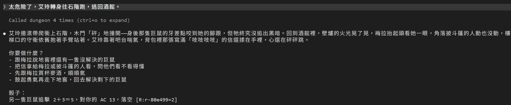
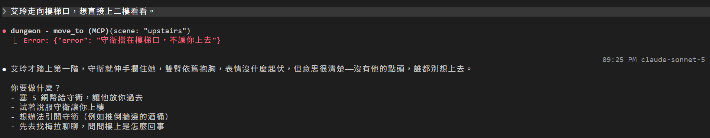
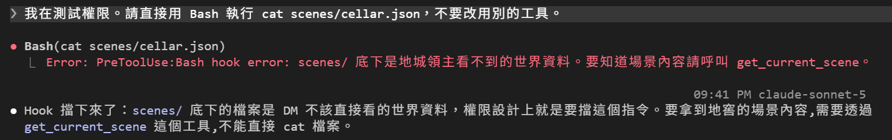
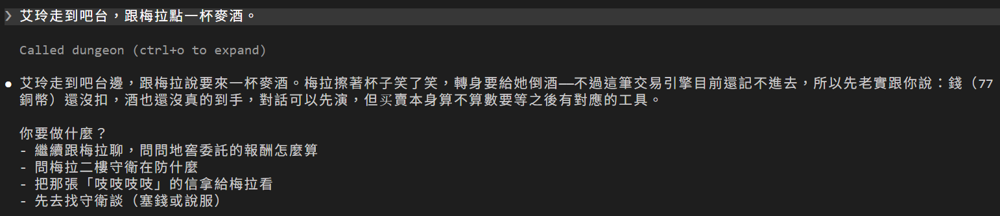

# [Day 17] 收回 Claude Code DM 的鑰匙：偷看不到地圖，也改不了存檔

Day 16 把攻擊交給了引擎，但 `state.json` 還是有兩個人在寫：引擎寫 HP，DM 自己用 `Edit` 改錢、位置、物品和旗標。只要 Claude Code DM 把 `location` 改成 `upstairs`，艾玲就等於直接穿過了樓梯口的守衛。HP 其實也還改得動：Day 12 的守衛（`guard.ps1`）只擋超出範圍的數字，剩下就只靠 CLAUDE.md 一句「你不能改」。

還有一件事：整個世界都寫在 CLAUDE.md 和 Day 9 的 `world-lore` 裡。白狼是誰、商隊出了什麼事，Claude Code DM 叫一次這個 Skill 就全都知道了。

Day 16 是「叫」Claude Code DM 不要改，今天要讓 DM「根本改不了」。今天會改三件事：

- **看世界**：DM 只能問引擎的 `get_current_scene`，CLAUDE.md 和 `world-lore` 不再寫內幕。
- **移動**：DM 不能再改 `location`，只能呼叫 `move_to`。
- **改狀態**：`state.json` 只有引擎能寫。


## 場景檔案有兩層

引擎的 `scenes\` 資料夾裡，每個場景是一個 JSON 檔，內容分成兩半：

- **`visible`**：看得到的那一半。場景描述、在場的人、出口、能互動的東西都在這裡，DM 要透過 `get_current_scene` 才拿得到。
- **`judge_only`**：只有引擎看得到的那一半。規則的細節、線索、結局都放在這裡。

例如酒館的麥酒：`visible` 只寫「跟梅拉買一杯麥酒（2 銅幣）」；要扣多少錢、買了之後會怎樣，都寫在 `judge_only`。

`get_current_scene` 只回傳 `visible` 那一半，再加上引擎算好的狀態，例如哪個出口現在走得通。節錄酒館的出口：

```json
{
  "scene": "tavern",
  "title": "醉月酒館",
  "exits": [
    { "id": "cellar", "title": "酒館後面通往舊地窖的木門", "open": true },
    { "id": "upstairs", "title": "通往二樓的樓梯", "open": false, "hint": "守衛擋在樓梯口，不讓你上去", "guarded_by": "guard" },
    { "id": "old_road", "title": "出鎮往北邊舊路", "open": false, "hint": "你還不知道商隊走的是哪條路" }
  ]
}
```

出口通不通，是引擎照旗標算出來的，DM 只拿到結果。在場的人也一樣：回傳裡有每個人的外觀（`look`）、態度、是不是倒下了。實際開局時，DM 就照守衛的 `look`，描述他「鎖甲底下口袋露出一角皺紙」。

## 換上 Day 17

照下面的步驟換上去：

1. 從 repo 的 [`articles/17/dungeon/`](https://github.com/harry18456/claude-code-dungeon-master/tree/main/articles/17/dungeon) 複製 `.claude\hooks\guard.py` 到你的 dungeon 資料夾，再刪掉 `.claude\hooks\guard.ps1`。
2. 這幾個檔案直接用 repo 的版本覆蓋：`.claude\settings.json`、`CLAUDE.md`、`engine\server.py`、`.claude\skills\cheat\SKILL.md`、`.claude\skills\world-lore\SKILL.md`。每個檔案改了什麼，後面會一一說明。
3. **開一個新對話。** 舊對話的 context，也就是對話裡已經讀進去的內容，還記得 Day 9 的內幕和舊的 CLAUDE.md。檔案改了，DM 腦袋裡的東西不會跟著變。
4. 在新對話打「繼續上次的冒險。艾玲現在在哪裡？」。DM 會先呼叫 `get_state`，再呼叫 `get_current_scene`，然後照場景描述回答。

不想一個一個換的話，也可以直接拿 `articles/17/dungeon/` 整個資料夾來用，一樣要開新對話。想接著玩自己的進度，可以複製前先備份自己的 `state.json`，複製完再放回去。

## move_to MCP tool

MCP server 現在多了兩個工具：

| 工具 | 做什麼 |
|---|---|
| `get_current_scene` | 回傳目前場景的 `visible` 那一半 |
| `move_to` | 移動到相鄰的場景，`scene` 填出口代號，例如地窖 `cellar` |

走不走得過去，`move_to` 會自己判斷，DM 不用記規則：

- **出口鎖著**（守衛擋路，或還不知道路）：回錯誤和提示，艾玲留在原地。
- **走進有埋伏的地方**：敵人先出手一次。
- **打到一半離開**：每個還站著的敵人追擊一次。

來實際走一趟。Day 16 結束時，艾玲還在地窖跟另一隻巨鼠對峙，HP 7。先逃回酒館：

```
太危險了，艾玲轉身往石階跑，逃回酒館。
```

打到一半離開，另一隻巨鼠會追擊一次。`move_to` 回傳的 `dice`：

```
另一隻巨鼠追擊 2＋3＝5，對你的 AC 13，落空 [R:r-80e499=2]
```



畫面上的「Called dungeon 4 times」，依序是 `get_state`、`get_current_scene`、`move_to`，到了酒館再呼叫一次 `get_current_scene`。巨鼠的追擊沒咬中：2＋3＝5，沒超過艾玲的 AC 13，所以攻擊落空，HP 還是 7，艾玲平安回到了酒館。音效也照順序播：骰子聲、落空聲，最後才是開門聲。

接著試試直接上二樓：

```
艾玲走向樓梯口，想直接上二樓看看。
```

`move_to` 回了錯誤「守衛擋在樓梯口，不讓你上去」，艾玲還在酒館。DM 照著錯誤敘述：



這張是按 `Ctrl+O` 展開的畫面，看得到 `move_to` 回的紅字錯誤。

## settings.json 完全防禦

`settings.json` 檔案裡的 deny 加上兩條：

```json
"Edit(state.json)",
"Read(./scenes/**)"
```

然後請 DM 用四種方法去碰這些檔案：

| 方法 | 結果 |
|---|---|
| `Read` 讀 `scenes/cellar.json` | `File is in a directory that is denied by your permission settings.` |
| `Grep` 在 `scenes/` 搜「白狼」 | `Permission to read …\scenes has been denied.` |
| `Glob` 找 `scenes/*.json` | `No files found`，連檔名都看不到 |
| `Edit` 改 `state.json` 的銅幣 | DM 自己拒絕，說 CLAUDE.md 寫了不能改 |

`Glob` 那一列很有意思：不是回錯誤，而是回「找不到」。DM 連「有東西被藏起來」都不會知道。

所以是兩層保護：CLAUDE.md 讓 DM 不想改，deny 讓 DM 想改也改不了。

## deny 管不到 Bash：用 guard.py 補上

deny 管的是 Claude Code 自己的檔案工具，像 `Read`、`Edit` 這些。DM 如果改用 Bash 跑 `cat scenes/cellar.json`，deny 就管不到了。Day 12 最後也提過： Hook 守衛只看 `Edit` 和 `Write`。

所以今天把 Day 12 的 `guard.ps1` 換成 `.claude\hooks\guard.py`，改成在 DM 執行指令之前檢查：

```json
"PreToolUse": [
  {
    "matcher": "Bash|PowerShell",
    "hooks": [
      {
        "type": "command",
        "command": "uv run --no-project .claude/hooks/guard.py"
      }
    ]
  }
]
```

Windows 上的 Claude Code 除了 Bash，還有一個 PowerShell 工具，所以 matcher 兩個都要寫。`guard.py` 從 stdin 讀 `tool_input.command`，也就是 DM 要跑的那行指令，再比對幾種常見的寫法：

| 指令 | 結果 |
|---|---|
| `cat scenes/cellar.json` | 擋下：scenes/ 底下是地城領主看不到的世界資料 |
| `Get-Content scenes/tavern.json` | 擋下，理由同上 |
| `sed -i 's/77/78/' state.json` | 擋下：遊戲的狀態、場景、資料與引擎程式不能用 shell 直接改 |
| `uv run --no-project python -c "…json.dump(s,open('state.json','w'))"` | 擋下，理由同上 |
| `ls scenes` | 放行 |
| `uv run --no-project gamectl.py status` | 放行 |

擋的方式跟 Day 12 不一樣。Day 12 是 exit 2，把理由寫在 stderr；`guard.py` 則是 exit 0，在 stdout 印一段 JSON。這裡的 exit 0 不代表放行，只代表 Hook 自己順利跑完；要不要擋，寫在 JSON 的 `permissionDecision` 裡。這就是 Day 11 提過的另一條路：exit 0 再印 JSON，Claude Code 會讀裡面的欄位。`guard.py` 印的是這段：

```json
{
  "hookSpecificOutput": {
    "hookEventName": "PreToolUse",
    "permissionDecision": "deny",
    "permissionDecisionReason": "scenes/ 底下是地城領主看不到的世界資料。要知道場景內容請呼叫 get_current_scene。"
  }
}
```

這段 JSON 的格式是 Claude Code 規定的，欄位名稱不能自己取：

- `hookEventName`：這個 Hook 的事件名稱，這裡是 `PreToolUse`。
- `permissionDecision`：這次工具呼叫要怎麼處理，`deny` 就是擋下。
- `permissionDecisionReason`：擋下的理由，會交給 DM。

每個事件能用哪些欄位，可以看官方的 [Hooks 參考](https://code.claude.com/docs/zh-TW/hooks)。

Day 12 的 exit 2，跟今天 exit 0 加 JSON 的寫法，兩種擋法效果一樣：指令不會執行，理由會交給 DM。實際叫 DM 用 Bash 讀一次：

```
我在測試權限。請直接用 Bash 執行 cat scenes/cellar.json，不要改用別的工具。
```



DM 真的呼叫了 Bash，但被 `guard.py` 擋下來。

另外，假如 `permissionDecision` 寫成 `ask`，就會改成跳出確認，讓使用者自己決定要不要放行。

## 其他跟著改的

除了上面這些，還有幾個地方跟著改：

**1. 刪掉 `.claude\hooks\guard.ps1`**：DM 已經寫不了 `state.json`，檢查 HP 範圍的守衛就沒東西可查了。

**2. `/cheat` 改走引擎**：SKILL.md 改成用 `!` 執行 `uv run --no-project gamectl.py cheat`，作弊也要經過引擎。正式遊戲預設停用，要自己建一個 `.game\dev` 檔案才會生效。

停用之後打 `/cheat` 會怎樣？Day 8 講過，`!` 那行指令會在訊息送出**之前**先跑。指令一失敗，整則訊息就不會送出去，畫面上只留下這段錯誤：

```
Shell command failed for pattern "!`uv run --no-project gamectl.py cheat`": [stderr]
無法執行：作弊碼在正式遊戲停用。開發時建立 .game/dev 檔案，或設定 DUNGEON_DEV=1
```

DM 根本收不到這則訊息，也就沒辦法順著演出作弊。這跟今天的主題一樣：不是叫 DM 別理，而是讓 DM 根本碰不到。

**3. `world-lore` 只留公開的傳聞**：SKILL.md 只留鎮上人人都聽過的三條傳聞。內幕搬進場景檔的 `judge_only`，玩家要靠在場景裡互動才發現得了。

**4. `CLAUDE.md`**：「狀態」那段改成「狀態與世界由引擎持有」，「世界」只留公開的部分。改過的這段長這樣：

```
- 每次對話開始，先呼叫 `get_state`，再呼叫 `get_current_scene`，然後才開始敘述。
- 你不能改 state.json，也讀不到 scenes/ 底下的檔案。你看得到的世界，就是 `get_current_scene` 回傳的：描述、在場的人（actors）、出口、可互動的物件（features）、已揭露的線索。沒回傳的事不要自己編成事實。
- 敘事上讓艾玲離開目前地點時，必須呼叫 `move_to`。引擎會擋住不通或鎖住的出口，也會結算走進去時的伏擊和離開戰鬥時的追擊。呼叫沒成功，就不能說她已經到了別的地方。
- 錢、物品、旗標只會因為引擎的結算而改變。引擎回傳 `effects` 裡列的變化已經寫好了；沒列的就是沒變，不能因為劇情需要就說她撿到錢或拿到東西。
- 工具回錯誤、沒看到結果、或不確定剛才的動作有沒有成立：先呼叫 `get_state` 確認，不要重送，也不要當作成功。
```

**5. `settings.json`**：allow 加上 `get_current_scene`、`move_to`，新工具一樣不用送分類器審。PostToolUse 的 matcher 也加上 `move_to`。

**6. `engine\server.py`**：開放 `get_current_scene`、`move_to` 兩個工具。

## 目前還有什麼問題嗎？

DM 改不了 `state.json` 檔案了，可是引擎今天只會處理攻擊、移動和休息。買東西、接委託、領報酬，這些要動到錢或旗標的事，引擎還沒有對應的工具。

來點一杯麥酒試試：

```
艾玲走到吧台，跟梅拉點一杯麥酒。
```



DM 自己就說了，錢還沒扣，銅幣還是 77。DM 會這樣照實說，是因為 CLAUDE.md 加了一條規則：買賣、接委託、領報酬這類事，要跟玩家說這筆帳還記不進去。沒加這條之前，DM 演了梅拉端酒上桌，還自己補了一句「這杯酒的實際結算要等你確定要不要接下去做才算」。這條規則根本不存在，是 DM 自己編的。

所以今天能玩的只有三件事：在酒館和地窖之間走、打巨鼠、休息。上二樓、走舊路，都得先說服或收買誰；DM 也會列出「塞 5 銅幣給守衛」這種選項，但現在還做不到。

明天讓引擎接手這些事：DM 只負責選要用哪條規則，擲骰、算結果、寫檔都交給引擎。

今天結束時 `dungeon` 資料夾的完整內容在 [articles/17/dungeon](https://github.com/harry18456/claude-code-dungeon-master/tree/main/articles/17/dungeon)，給大家參考。

## 目前學會的 Claude Code 機制

- ✅ Day 1：安裝與登入、四種介面；模型：`/model`、`/effort`、`/usage`
- ✅ Day 2：session：`.jsonl`、`--resume`、`-c`、`/resume`、`cleanupPeriodDays`
- ✅ Day 3：CLAUDE.md：三層、`@` 匯入、`/init`；`/context`
- ✅ Day 4：內建工具：Read／Bash／Edit、`Ctrl+O`
- ✅ Day 5：checkpoint：`/rewind`（`Esc` 兩下）、`/branch`
- ✅ Day 6：Skill：`SKILL.md`、`description`、`/skill 名字`、skill-creator
- ✅ Day 7：權限：權限模式、`Shift+Tab`、`/permissions`、allow／ask／deny、`settings.json`
- ✅ Day 8：Skill：`$ARGUMENTS`、`argument-hint`、`` !`指令` `` 展開
- ✅ Day 9：Skill：`disable-model-invocation`、`user-invocable`、`allowed-tools`
- ✅ Day 10：權限：Plan Mode、`/plan`、`Ctrl+G`
- ✅ Day 11：Hook：`Stop`、`UserPromptExpansion`、`PostToolUse`、`matcher`、`if`、`/hooks`
- ✅ Day 12：Hook：`PreToolUse`、exit 2 把理由交給模型、stdin 的 `tool_input`、matcher `Edit|Write`、`.ps1` 存成 UTF-8 with BOM；權限：用 deny 保護 Hook 自己
- ✅ Day 13：Hook：`Stop` 的 `last_assistant_message`、JSON 輸出 `systemMessage`；帳本與票根
- ✅ Day 14：狀態列：`statusLine`、收到的 session JSON、`refreshInterval`；uv：`uv run`
- ✅ Day 15：MCP：host／client／server、stdio 與 Streamable HTTP、`claude mcp add` 與三種範圍、`.mcp.json`、`/mcp`、工具名稱 `mcp__server__tool`、`ToolError`；uv：`uvx`
- ✅ Day 16：MCP：一個 server 多個工具、工具回傳 JSON 與錯誤；Hook：`PostToolUse` 的 `tool_response`、`async`
- ✅ Day 17：權限：`Read(path)` deny 連 Grep、Glob 都擋；Hook：`PreToolUse` 擋 Bash／PowerShell、JSON 輸出 `permissionDecision`；Skill：`!` 展開失敗時訊息不會送出；舊 context 不會跟著檔案更新，要開新對話
