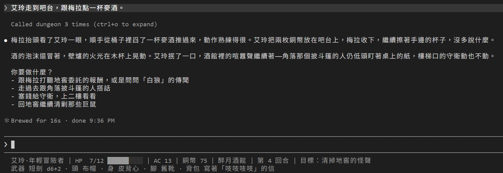

# [Day 18] 麥酒記進帳，再請一位裁判：第一個 Subagent

Day 17 最後點了一杯麥酒，Claude Code DM 只能照實說「這筆帳記不進去」，因為引擎只會處理攻擊、移動和休息。

今天分兩步補上：

1. **引擎多開一個 MCP 工具 `resolve_check`**：買東西、說服、偷、搜，都交給引擎擲骰、算結果、寫檔。Claude Code DM 只要選「用哪條規則、對誰」。
2. **請一位裁判**：玩家的點子千奇百怪，「這招算哪條規則」，DM 有時也拿不準。這時就交給一位只看規則、不說故事的裁判，也就是 Claude Code 的 **Subagent**。


## 規則書：九個動詞

先準備一本規則書。今天的 dungeon 資料夾會多一個 `rules.md`，內容是精簡版的 D&D 規則。DM 能選的行動只有九種，每一種代表一個動作且各有一個英文代號（`rule_id`）：

| rule_id | 名稱 | 擲 d20 加什麼 | 對誰 |
|---|---|---|---|
| `attack` | 攻擊 | 攻擊加值，對 AC | 任何人（受保護的除外） |
| `persuade` | 說服 | 魅力 | 任何人 |
| `sneak` | 潛行 | 敏捷 | 守著路的人 |
| `distract` | 聲東擊西 | 敏捷 | 守著路的人 |
| `steal` | 偷竊 | 敏捷 | 身上有東西的人 |
| `provoke` | 動粗 | 不擲骰，對方先揍你 | 任何人 |
| `interact` | 互動 | 不擲骰 | 場景列出的事：買東西、接委託、塞錢 |
| `search` | 搜索 | 感知 | 場景列出的物件 |
| `improvise` | 自由行動 | 不加，只看演得好不好 | 一律對 `here`，不改變世界 |

艾玲擅長的說服和潛行，還會再加 2，就是 Day 16 說過的「熟練」。

擲出來的數字要跟 DC 比。DC（Difficulty Class）是檢定的門檻，跟攻擊時要過的 AC 一樣：d20 加上加值，等於或超過 DC 就成功。有時候 DC 會看對方的角色態度有不同變化：友善 10、中立 15、戒心或敵意 20。

另外還有優勢和劣勢：有優勢就擲兩顆 d20、取高的那顆，有劣勢就取低的。請對方喝過酒，說服他就有優勢；對方已經在提防你（引擎叫「警戒」），就有劣勢。其他細節都寫在 `rules.md`。

## resolve_check：Claude Code DM 選規則，引擎來算有沒有成功

其實 Day 17 的 `get_current_scene` 就已經列出每個人能對他做哪些動詞（`verbs`）、每樣東西能用哪條規則（`rules`）。酒館的節錄：

```json
"actors": [
  { "id": "cloaked", "name": "披斗篷的人", "attitude": "neutral", "verbs": ["persuade", "provoke", "attack", "steal"] },
  { "id": "guard", "name": "守衛", "attitude": "neutral", "verbs": ["persuade", "provoke", "attack", "steal", "sneak", "distract"] }
],
"features": [
  { "id": "marlda_ale", "title": "跟梅拉買一杯麥酒（2 銅幣）", "rules": ["interact"] },
  { "id": "guard_bribe", "title": "塞 5 銅幣給守衛", "rules": ["interact"], "hint": "不用說服，他收錢就讓路" },
  { "id": "barrels", "title": "牆邊的酒桶", "rules": ["search"] }
]
```

今天開放的 `resolve_check(rule_id, target_id)` 只收兩個代號：動詞的代號和對象的代號。

- **DM**：從 `verbs`、`rules` 挑一個動詞，再從 `actors`（在場的人）、`features`（能互動的東西）挑一個對象。
- **引擎**：檢查條件、算 DC、擲骰、套用結果，再寫進 `state.json`。

Claude Code DM 碰不到任何數字，也決定不了結果。

## 換上 Day 18 的地城

照下面的步驟換上去：

1. 從 repo 的 [`articles/18/dungeon/`](https://github.com/harry18456/claude-code-dungeon-master/tree/main/articles/18/dungeon) 複製這些到你的 dungeon 資料夾：`rules.md`、`.claude\agents\rules-judge.md`、`.claude\skills\check\`。
2. 刪掉 `.claude\skills\roll\`。
3. 這幾個檔案直接用 repo 的版本覆蓋：`CLAUDE.md`、`.claude\settings.json`、`engine\server.py`、`scenes\tavern.json`、`data\quest.json`。
4. **重開 Claude Code。** `.claude\agents\` 是新資料夾。Claude Code 只會注意開啟時就已經存在的資料夾，要重開才會載入裁判。

不想一個一個換的話，也可以直接拿 `articles/18/dungeon/` 整個資料夾來用，一樣要重開 Claude Code。想接著玩自己的進度，可以複製前先備份自己的 `state.json`，複製完再放回去。

## 麥酒記進帳

換好之後，先把 Day 17 那杯麥酒補進帳。一樣的一句話：

```
艾玲走到吧台，跟梅拉點一杯麥酒。
```

這次 DM 呼叫了 `resolve_check("interact", "marlda_ale")`，回傳節錄：

```json
{
  "rule": "interact",
  "target": "marlda_ale",
  "dc": null,
  "success": true,
  "effects": ["銅幣 77 → 75", "旗標 bought_ale 成立"],
  "dice": "（本回合無擲骰）"
}
```

買東西不用擲骰，錢由引擎扣。狀態列的銅幣也跟著從 77 變成 75：



「Called dungeon 3 times」依序是 `get_state`、`get_current_scene`、`resolve_check`：重開之後的第一句話，DM 照 CLAUDE.md 先查狀態、再看場景，才去買酒。這回合沒擲骰，所以 DM 的回覆沒有「骰子：」。

## /check 取代 /roll

有了 `resolve_check`，每顆骰子都屬於某個動作：檢定、攻擊或休息。只擲骰、不影響任何事的「裸骰」，反而會讓人以為骰了就有結果，所以 `roll` 工具和 `/roll` 今天下架。

玩家想自己指定檢定，就改用 `/check 動詞 對象`。這個 Skill 設了 `disable-model-invocation: true`，只有玩家能叫（Day 9 講過），叫了就直接走 `resolve_check`。趁還在酒館，搜搜看牆邊的酒桶：

```
/check search barrels
```

```
搜索牆邊的酒桶 15＋1＝16，對 DC 12，成功 [R:r-4218bc=15]
銅幣 d4 → 3 [R:r-ff60b9=3]
```

第一行是搜索：15＋1＝16，過了 DC 12。第二行是搜到的銅幣：擲 d4，得到 3 枚。

## Subagent

裁判是一個 Subagent（子代理）：另一個 Claude，有自己的系統提示（對話開始前先交給模型的那段指示）、自己的工具，在一段全新的對話裡工作。DM 把任務交給子代理（這叫委派），子代理做完，只把最後一段回覆（結果）交回來。

跟 Skill 比一下：

| | Skill | Subagent |
|---|---|---|
| 在哪裡跑 | 內容塞進 DM 自己的對話 | 另開一段新的對話 |
| 看得到前面的對話嗎 | 看得到 | 看不到，只看得到 DM 交代的任務 |
| 交回什麼 | 整份內容留在 DM 的 context | 只有最後一段回覆 |

這張表說的，是裁判這種在 `.claude\agents\` 自己定義的子代理。Claude Code 另外還有一種子代理叫 fork：分出去的時候帶著整段對話，系統提示、工具都跟 DM 一模一樣，適合把一件旁支的小事交出去，不用再交代一次前因後果。想自己開一個 fork，打 `/subtask` 加上要做的事就行。裁判要的正好相反，重點就是看不到前面的劇情，所以不用 fork。

為什麼要請裁判？Claude Code DM 是說故事的人。玩家想出「彈一枚銅幣引開守衛」，該算潛行還是聲東擊西？讓 DM 自己判，很容易順著劇情放水。裁判看不到前面的劇情，只看規則書和場景，判完就走。裁判讀規則書、查場景的過程，也不會塞進 DM 的 context。

## 第一個 Subagent：rules-judge

剛才複製進來的 `.claude\agents\rules-judge.md` 長這樣：

```markdown
---
name: rules-judge
description: 規則裁判。玩家提出行動時，判斷該用哪個動詞、對哪個對象，或說明為什麼不擲骰。只回傳裁決 JSON，不寫敘事、不改狀態。
---

你是這個 TRPG 的規則裁判。你不是說書人，也不擁有遊戲狀態。原則是儘量放行：合理的事都用骰子決定。

你的工作：讀 `rules.md`，呼叫 `get_current_scene` 看目前的人（`actors`，每個人列了接受的動詞）、物件（`features`）和 `here`，然後判斷玩家的行動：

1. 對某個人：說服 `persuade`、偷 `steal`、打 `attack`、揍或威脅 `provoke`；他守著路的話還有 `sneak`、`distract`。給 `rule_id` 與 `target_id`。
2. 對某個物件：用它列出的規則（`search`、`interact`）。
3. 創意做法（推酒桶、丟石頭、假裝喝醉）對到最接近的動詞，在 `reason` 說明類比依據。
4. 對不上任何人和物、但合理無害的小動作 → `improvise` 對 `here`。
5. 對場所動手（砸店、推翻桌子、點火弄動靜）→ 對場所的人 `provoke`，或當作 `distract`。場所本身不會被改變。
6. 只有三種給 null：不可能的事，`reason` 寫「不可能」；越線的事（折磨、傷害小孩、性暴力、放火燒有人的房子），`reason` 寫「越線，DM 拒絕」；目標根本不在這個場景。

## 輸出格式

只輸出一個 JSON 物件，不要有前後文字，不要用程式碼圍欄：

{"rule_id": "<動詞或 null>", "target_id": "<對象代號或 null>", "reason": "<一句話理由>", "alternatives": ["<這個場景可以做的事>"]}

## 界線

- 不得寫敘事，不得擲骰，不得決定成敗或 DC。那些是引擎的事。
- 找不到規則就用 `improvise`，不要硬湊成會改變世界的動詞。
```

- **`---` 之間是設定**：`name` 是名字；`description` 說明什麼時候該找這個子代理，Claude Code DM 就是靠這段決定要不要交給裁判，跟 Skill 的 `description` 一樣。這兩欄都要寫，其他欄位都是選填。例如 `model`、`effort`（Day 1 的 `/model`、`/effort`）可以讓裁判用跟 DM 不同的模型和 effort，Day 28 算成本時再來調；`tools` 明天就會用到。
- **底下的內文是裁判的系統提示**：裁判拿到的就是這段內文，再加上工作資料夾這類環境資訊，不是 Claude Code 原本那一大段系統提示。
- **裁判只回 JSON**：寫用哪個動詞、對誰、為什麼。擲骰和算結果，還是由 DM 呼叫 `resolve_check` 交給引擎。

之後再改這個檔，幾秒內就會生效，不用再重開。

CLAUDE.md 也加了「裁決」一節，其中兩條在講什麼時候找裁判：

```
- 直接對人或物件做它列出的動詞（買酒、說服梅拉、搜酒桶），自己選動詞和對象。
- 玩家用創意方法達成目的（推酒桶、裝醉、丟東西引開守衛），不要自己判：先跟玩家說一句「等裁判」，把玩家的原話交給 rules-judge 子代理，再照它回的 `rule_id`、`target_id` 呼叫 `resolve_check`。
```

## 請他喝一杯：優勢

端著剛買的麥酒，去找角落那個人：

```
艾玲端著麥酒走到角落桌，放在披斗篷的人面前請他喝，順便打聽白狼的事。
```

這句 DM 也先交給了裁判，裁判判成 `persuade cloaked`，也就是對披斗篷的人用說服（交給裁判的過程，下一節細看）。DM 再照裁判的判斷呼叫 `resolve_check("persuade", "cloaked")`，剛剛那杯麥酒派上用場了：

```
說服披斗篷的人 優勢 10、19 取 19＋3＝22，對 DC 15，成功 [R:r-501669=10] [R:r-a32463=19]
```

回傳的 `why` 寫著這次為什麼這樣算：`bought_ale：優勢`。披斗篷的人態度中立，DC 15；艾玲請他喝過酒，所以擲兩顆 d20，取高的 19。成功之後，引擎把他說的話放在 `revealed`，也就是這次新揭露的線索：

```
披斗篷的人壓低聲音：商隊是在北邊舊路被攔下的，領頭的叫白狼。他找白狼不是為了賞金，是替人帶一句話；託他的人是誰，他不肯說。岔路口有人守著，他過不去。
```

DM 再照這段話演出來。什麼時候說出內幕、說多少，都由引擎決定。

## 等裁判

再試一個更有創意的：

```
艾玲把一枚銅幣彈到酒館另一頭的地上，趁守衛轉頭去看，貓著腰溜上樓梯。
```

DM 先回一句「等裁判。」，再呼叫 `Agent` 工具，把任務交給 rules-judge。`Agent` 是 Claude Code 用來委派子代理的工具，DM 交出去的任務是這段：

```
玩家的原話：「艾玲把一枚銅幣彈到酒館另一頭的地上，趁守衛轉頭去看，貓著腰溜上樓梯。」

場景目前的 actors 代號：marlda, cloaked, guard。guard 擋著 upstairs 出口，可用動詞：persuade, provoke, attack, steal, sneak, distract。

請裁決應該用哪個 rule_id、對哪個 target_id 呼叫 resolve_check，只回傳裁決 JSON。
```

這段就是裁判知道的全部，前面的對話裁判都看不到。裁判交回來的 JSON：

```json
{"rule_id": "sneak", "target_id": "guard", "reason": "彈幣引開守衛注意力只是手法，玩家的真正目的是無視守衛耳目溜上樓梯，等同守著路的人可用的『sneak』潛行繞過", "alternatives": ["直接說服守衛放行", "威嚇或打倒守衛強行通過", "改為引開守衛（distract）製造更大空檔"]}
```

DM 照裁判的判斷呼叫 `resolve_check("sneak", "guard")`：

```
潛行守衛 18＋4＝22，對 DC 15，成功 [R:r-feb1f6=18]
```

守衛沒發現，往二樓的出口打開了。DM 接著呼叫 `move_to` 上二樓，二樓的女孩第一次出場。

<!-- 截圖 02：DM 回「等裁判」，輸入框下方出現 rules-judge 正在跑 -->

<!-- 截圖 03：裁判判完，DM 照判呼叫 resolve_check，上二樓 -->

注意：一個動作變成了兩則訊息。互動模式下，Claude Code 預設讓子代理在背景跑：DM 交出任務，先回你一則「等裁判」；裁判判完，DM 收到通知，才接著算結果、說故事。裁判還在跑的時候，輸入框下方會列出來；打 `/tasks` 可以打開裁判的紀錄，看裁判讀了什麼、回了什麼。

想直接指定裁判，就在訊息開頭打 `@agent-rules-judge`（打 `@` 會跳出選單）。實際試過，加了這個之後，連「跟梅拉買一杯麥酒」這種小事，DM 也會先送給裁判。

## 其他跟著改的

除了上面這些，還有幾個地方跟著改：

**1. `engine\server.py`**：開放 `resolve_check`，`roll` 工具下架。

**2. `CLAUDE.md`**：檢定改走 `resolve_check`；拿掉 Day 17 那條「記不進帳要照實說」，現在記得進去了；新增「裁決」一節；敘述的規則（貼「骰子：」、給選項）移到最後一節「敘述」。

為什麼要把敘述的規則移到最後？第一次實測時，「裁決」接在最後面，DM 有兩回合沒貼「骰子：」，Stop 的查帳就跳出警告。把敘述的規則移到最後一節之後，每回合都有貼了。選項的規則也順便補一句：用玩家看得懂的話寫，不要寫 `marlda_quest` 這種代號。

**3. `.claude\settings.json`**：allow 加上 `resolve_check`、拿掉 `roll`，新工具一樣不用送分類器審；deny 加上 `Edit(rules.md)`，規則書也不讓 DM 改；PostToolUse 的 matcher 把 `roll` 換成 `resolve_check`，檢定時也有骰子聲。

**4. `scenes\tavern.json`、`data\quest.json`**：今天起，艾玲有機會打聽到商隊走的路。不過北邊舊路要等後面的章節才會開放，所以打聽到之後，舊路出口的提示會改成「現在還不是出發的時候，鎮上的事還沒弄清楚」，狀態列的目標也會改成「先把鎮上的事弄清楚，再出發去北邊舊路」。

## 目前還有什麼問題嗎？

第一個問題：裁判被叫得太勤。CLAUDE.md 寫的是「玩家用創意方法達成目的……不要自己判」，結果 DM 連「端麥酒請他喝」這種明顯是說服的事，也送給了裁判。每送一次，這回合就多一則訊息，多等十幾秒。

第二個問題比較大：裁判手上到底有哪些工具？直接叫 DM 去問，DM 會說這跟遊戲無關，不肯問。所以我在測試用的副本裡，臨時在裁判的指示多加一句，請裁判回覆前先列出自己的工具。裁判列出了這些：

```
工具：Agent, Bash, Edit, Glob, Grep, PowerShell, Read, Skill, ToolSearch, Write, EnterWorktree, ExitWorktree, Monitor, NotebookEdit, SendMessage, TaskStop, WebFetch, WebSearch, mcp__dungeon__get_current_scene, mcp__dungeon__get_state, mcp__dungeon__move_to, mcp__dungeon__resolve_attack, mcp__dungeon__resolve_check
```

`rules-judge.md` 沒寫 `tools` 這一欄，裁判就繼承了 DM 能用的全部工具：可以自己呼叫 `resolve_check`、`move_to`，手上也有 Bash、Edit、Write。內文寫的「不得擲骰」，跟 Day 16 叫 DM「不能改 hp」一樣，只是一句請求，擋不住。

明天給裁判上鎖：只給裁判需要的工具，再看看子代理跟 DM 還有哪些地方不一樣。

今天結束時 `dungeon` 資料夾的完整內容在 [articles/18/dungeon](https://github.com/harry18456/claude-code-dungeon-master/tree/main/articles/18/dungeon)，給大家參考。

## 目前學會的 Claude Code 機制

- ✅ Day 1：安裝與登入、四種介面；模型：`/model`、`/effort`、`/usage`
- ✅ Day 2：session：`.jsonl`、`--resume`、`-c`、`/resume`、`cleanupPeriodDays`
- ✅ Day 3：CLAUDE.md：三層、`@` 匯入、`/init`；`/context`
- ✅ Day 4：內建工具：Read／Bash／Edit、`Ctrl+O`
- ✅ Day 5：checkpoint：`/rewind`（`Esc` 兩下）、`/branch`
- ✅ Day 6：Skill：`SKILL.md`、`description`、`/skill 名字`、skill-creator
- ✅ Day 7：權限：權限模式、`Shift+Tab`、`/permissions`、allow／ask／deny、`settings.json`
- ✅ Day 8：Skill：`$ARGUMENTS`、`argument-hint`、`` !`指令` `` 展開
- ✅ Day 9：Skill：`disable-model-invocation`、`user-invocable`、`allowed-tools`
- ✅ Day 10：權限：Plan Mode、`/plan`、`Ctrl+G`
- ✅ Day 11：Hook：`Stop`、`UserPromptExpansion`、`PostToolUse`、`matcher`、`if`、`/hooks`
- ✅ Day 12：Hook：`PreToolUse`、exit 2 把理由交給模型、stdin 的 `tool_input`、matcher `Edit|Write`、`.ps1` 存成 UTF-8 with BOM；權限：用 deny 保護 Hook 自己
- ✅ Day 13：Hook：`Stop` 的 `last_assistant_message`、JSON 輸出 `systemMessage`；帳本與票根
- ✅ Day 14：狀態列：`statusLine`、收到的 session JSON、`refreshInterval`；uv：`uv run`
- ✅ Day 15：MCP：host／client／server、stdio 與 Streamable HTTP、`claude mcp add` 與三種範圍、`.mcp.json`、`/mcp`、工具名稱 `mcp__server__tool`、`ToolError`；uv：`uvx`
- ✅ Day 16：MCP：一個 server 多個工具、工具回傳 JSON 與錯誤；Hook：`PostToolUse` 的 `tool_response`、`async`
- ✅ Day 17：權限：`Read(path)` deny 連 Grep、Glob 都擋；Hook：`PreToolUse` 擋 Bash／PowerShell、JSON 輸出 `permissionDecision`；Skill：`!` 展開失敗時訊息不會送出；舊 context 不會跟著檔案更新，要開新對話
- ✅ Day 18：Subagent：`.claude/agents/`、`name`、`description`、內文就是系統提示、`Agent` 委派、背景執行、`@agent-名字`、`/tasks`
