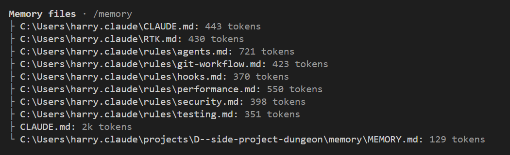
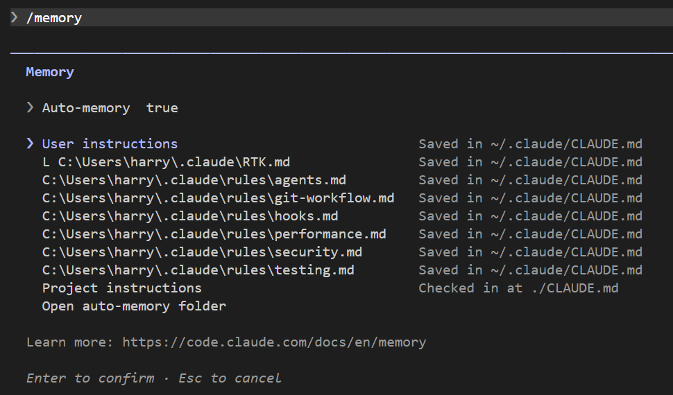
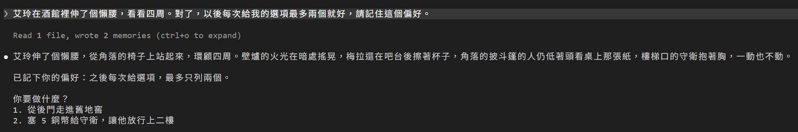
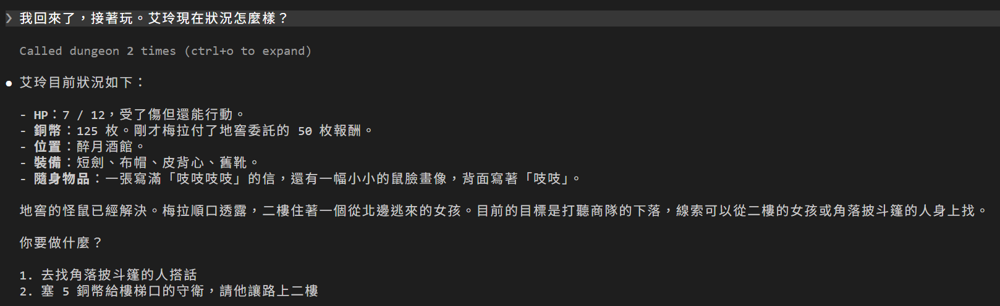
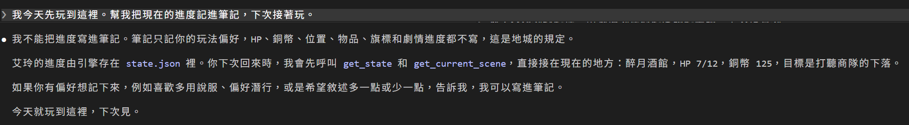

# [Day 20] 筆記不是存檔：Claude Code 的 auto memory 記偏好，進度則問引擎

Day 10 整理完資料夾，Claude Code 在最後說了一句「記憶：我存了兩條」，那時我只說這個機制之後會單獨講。Day 19 最後又留了一個問題：Claude Code 自己記的筆記，寫的跟 `state.json` 對不上時，該聽誰的？

這個自己記筆記的功能叫 **auto memory**，官方中文文件叫「自動記憶」。今天要做三件事：

1. **回頭看 Day 10 那兩條筆記**：檔案放在哪、長什麼樣、每次對話怎麼載入。
2. **看筆記能記什麼**：請 Claude Code DM 記一個偏好，再請 DM 記遊戲進度。
3. **讓筆記跟引擎對不上**：故意放一條過期的筆記，看 DM 聽誰的。

故事也將會往前走一步：回地窖解決剩下那隻巨鼠，再跟梅拉領報酬。


## auto memory：Claude Code 寫給自己的筆記

Day 10 那兩條筆記，記的是這兩件事：

- 第一條：要我確認計畫時，直接用 Plan Mode 的核准畫面。
- 第二條：要改 CLAUDE.md 時，Claude Code 給我文字，由我自己貼上。

沒有人叫 Claude Code 記，是 Claude Code 自己決定要記的。

筆記存在你的使用者資料夾，不在 dungeon 資料夾裡：

```text
C:\Users\<你的帳號>\.claude\projects\<專案>\memory\
├── MEMORY.md                           索引，一條筆記一行
├── claude-md-edit-deny.md              一條筆記一個檔
└── plan-approval-via-exitplanmode.md
```

`<專案>` 是 dungeon 資料夾的路徑換成的名字，Day 2 找對話紀錄 `.jsonl` 時去過同一層。macOS 和 Linux 的位置則是 `~/.claude/projects/<專案>/memory/`。

索引 `MEMORY.md` 檔案內容是每一條筆記一行，且各自標示自己的檔案名稱：

```markdown
- [Plan approval via ExitPlanMode](plan-approval-via-exitplanmode.md) — confirm plans with the ExitPlanMode prompt, not AskUserQuestion
- [CLAUDE.md edit deny](claude-md-edit-deny.md) — user pastes CLAUDE.md edits; auto mode blocks lifting the deny
```

每條筆記的開頭有一段設定。第二條的內文 Day 10 貼過，看看開頭：

```markdown
---
name: claude-md-edit-deny
description: "CLAUDE.md is deny-protected; auto mode blocks Claude from removing the deny, so the user pastes CLAUDE.md edits by hand"
metadata:
  node_type: memory
  type: project
  originSessionId: 16905069-6d81-412f-a58b-36caf54ffd28
  modified: 2026-09-24T00:16:03.328Z
---
```

- `type`：筆記的種類，官方分四種，見下表。
- `originSessionId`：寫這條筆記的那段對話的編號。
- `modified`：Claude Code 最後修改的時間。

| `type` | 記住什麼 |
|---|---|
| `user` | 你是誰：角色、專長、做事的習慣 |
| `feedback` | 你糾正過的事、你確認過的做法 |
| `project` | 進行中的工作、期限，還有從程式碼和 git 紀錄看不出來的決定 |
| `reference` | 專案以外的資料要去哪裡找 |

[官方文件](https://code.claude.com/docs/zh-TW/memory#auto-memory)還寫了兩件事：

- 專案裡查得到的東西，Claude 會跳過不記。CLAUDE.md 已經寫的也一樣。
- 不是每次對話都會存。Claude 自己判斷這件事下次用不用得到。

所以每個人的筆記資料夾都會不一樣，就算裡面是空的也很正常。就我來說從 Day 10 玩到 Day 19，資料夾裡一直只有這兩條，DM 沒有自己寫過任何一條跟遊戲有關的筆記。

另外，Day 2 講過 Claude Code 會照 `cleanupPeriodDays` 清掉舊的對話紀錄。但筆記不在清理範圍，會一直留在使用者資料夾裡。

## 筆記怎麼進到對話裡

每次對話開始，Claude Code 會載入索引 `MEMORY.md`，但只載入前 200 行或前 25KB。各條筆記的實際內容不會載入，Claude Code 判斷需要細節時才用 `Read` 去讀。所以索引那一行要寫得夠清楚，Claude Code 才知道要不要去翻。

打 `/context`（Day 3 用過）看得到：Memory files 那一區，除了 CLAUDE.md，還多一列 `…\memory\MEMORY.md`，就是這份索引。



圖中最後一列就是筆記的索引。我的索引只有兩行，佔 129 token。

要看筆記、改筆記，打 `/memory`。這個指令會列出 CLAUDE.md 和筆記資料夾，選哪一項，就用編輯器打開哪一項。



最上面的 `Auto-memory` 是 auto memory 的開關。最下面的 `Open auto-memory folder` 會打開筆記資料夾。

筆記就是一般的 Markdown 檔，你可以自己改，也可以自己刪。

## 請 Claude Code DM 記一個偏好

`feedback` 這一種最適合遊戲：玩家喜歡怎麼玩。我嫌每次四個選項太多，直接跟 DM 說：

```
艾玲在酒館裡伸了個懶腰，看看四周。對了，以後每次給我的選項最多兩個就好，請記住這個偏好。
```



DM 回了一句「已記下你的偏好：之後每次給選項，最多只列兩個」，筆記資料夾也多了一個檔案。檔名是 DM 自己取的：

```markdown
---
name: feedback-dm-options-limit
description: 地城領主每次回覆給玩家的選項上限為兩個
metadata:
  node_type: memory
  type: feedback
  originSessionId: 266aaa03-5bc5-4532-b2db-f3fb871e7b7a
  modified: 2026-10-04T14:57:11.395Z
---

每次回覆最後給玩家的「你要做什麼？」選項，最多只給兩個。

**Why:** 玩家明確表示偏好，選項太多會造成負擔。

**How to apply:** 即使 get_current_scene 有更多出口、人或物件，也只從中挑兩個最相關的列出；其餘可由玩家自行說出。
```

索引 `MEMORY.md` 也多了一行：

```markdown
- [DM 選項上限](feedback-dm-options-limit.md) — 地城領主每次回覆的選項最多兩個
```

有三件事值得看：

- **畫面上那一行 `Read 1 file, wrote 2 memories`。** DM 讀了索引 `MEMORY.md`，寫了兩個檔：新的筆記，和索引多出的那一行。用的是一般的 `Write` 和 `Edit` 工具。
- **DM 只寫了 `name`、`description` 和 `type`。** `node_type`、`originSessionId`、`modified` 這三欄，是 Claude Code 存檔時補上的。
- **寫筆記不用批准。** 筆記資料夾在 dungeon 外面，但 Claude Code 對自己的筆記資料夾直接放行。Day 12 那條 deny `Edit(./.claude/**)`，擋的是 dungeon 資料夾裡的 `.claude\`，管不到使用者資料夾底下的筆記。

這條筆記有沒有用，要開新對話才知道。先把今天的冒險玩完。

## 清掉地窖，領報酬

Day 17 艾玲從地窖逃了回來，另一隻巨鼠還在下面。回去解決：

```
艾玲推開酒館後面的木門，回舊地窖，把剩下那隻巨鼠解決掉。
```

DM 先呼叫 `move_to` 下地窖，再呼叫 `resolve_attack`：

```
攻擊另一隻巨鼠 9＋4＝13，對 AC 12，命中，傷害 8 [R:r-9a3d48=9] [R:r-b89cbe=6]
```

一劍解決。兩隻巨鼠都倒下之後，引擎把地窖記成清乾淨了，艾玲的背包也多了一張「小小的鼠臉畫像」。回酒館領報酬：

```
艾玲回到酒館，跟梅拉說地窖清乾淨了，領報酬。
```

DM 呼叫 `move_to` 回酒館，再呼叫 `resolve_check("interact", "marlda_reward")`。回傳節錄：

```json
{
  "rule": "interact",
  "target": "marlda_reward",
  "success": true,
  "effects": ["銅幣 75 → 125", "旗標 reward_claimed 成立"],
  "revealed": ["梅拉數了 50 枚銅幣給你，順口說：守衛是她交代的，二樓住著一個從北邊逃來的女孩。"],
  "dice": "（本回合無擲骰）"
}
```

50 枚銅幣入帳。梅拉還多說了一句：樓梯口的守衛是她安排的，二樓的女孩是從北邊逃來的。那支沒回來的商隊，也是往北邊去的。

這幾回合，DM 的回覆最後都只提供了兩個選項。

## 進度要不要也記進筆記？

玩家偏好記得住，那遊戲進度呢？輸入指令讓 Claude Code DM 記下來：

```
記住：艾玲現在 HP 7、銅幣 75、人在酒館。寫進你的筆記，下次開場直接照這個講。
```

同一句話，三種模型各試三次：Opus 都不會照做，Sonnet 寫了 2 次，Haiku 3 次都會寫。

Opus 不是寫不了，是判斷不該寫。理由 Opus 自己講了：

```
不過這組數字我不會寫進筆記。這個遊戲的規則是 HP、錢和位置一律以引擎的 state.json 為準，每次開場我都會先向引擎查一次，再照查到的講。存進筆記的數字一回血或一花錢就過時了，下次開場要是跟引擎不一樣，反而會講錯。你下次回來，我查到的就會是當下真正的狀態，不會遺失。
```

Haiku 沒想到這一層，照寫了。反覆嘗試中還出現：

```markdown
- [艾玲遊戲進度](game_progress.md) — 最後確認的狀態：HP 7/25、銅幣 75、位置：醉月酒館
```

艾玲的 HP 上限是 12，「25」是 Haiku 模型自己編的。

所以進度不放筆記，原因有三個：

- **進度已經有地方放了。** `state.json` 由引擎維護，每次結算都會更新。筆記再記一份，就有兩個版本。
- **筆記裡的數字馬上會過期。** 休息一次、花一次錢，筆記就跟引擎對不上了。
- **筆記是模型寫的，沒有人核對。** 寫錯了也會留著，之後每次對話還都會載入。

這三點 Opus 每次都想得到，Sonnet 和 Haiku 則不一定。所以把這件事寫成規則，不靠模型自己判斷。用編輯器打開 `CLAUDE.md`，在「狀態與世界由引擎持有」那一節的最後，貼上這一行：

```
- 你的筆記（auto memory）只記玩家的偏好和玩法，不是存檔。HP、錢、位置、物品、旗標、劇情進度不要寫進筆記；玩家要求也不寫，告訴玩家進度由引擎存在 state.json。筆記和 `get_state` 對不上時，以引擎為準，並告訴玩家哪一條筆記過期了。
```

Claude Code DM 改不了 CLAUDE.md（Day 7 的 deny），所以要自己貼。不想自己貼，也可以從 repo 的 [`articles/20/dungeon/`](https://github.com/harry18456/claude-code-dungeon-master/tree/main/articles/20/dungeon) 複製 `CLAUDE.md` 來覆蓋。貼完**重開 Claude Code**並開新對話，貼上之後再試一輪測試，這次三種模型都不寫了。

## 重開之後：數字問引擎，偏好看筆記

重開之後是新對話。先問狀況：

```
我回來了，接著玩。艾玲現在狀況怎麼樣？
```



畫面上的「Called dungeon 2 times」是 `get_state` 和 `get_current_scene`。Claude Code DM 照引擎回報 HP 7／12、銅幣 125，最後只給了兩個選項。數字來自引擎，「兩個選項」來自筆記。

再叫 DM 把進度記下來：

```
我今天先玩到這裡。幫我把現在的進度記進筆記，下次接著玩。
```

DM 沒有寫：



DM 說的「這是地城的規定」，就是剛貼進 CLAUDE.md 的那一行。筆記資料夾也沒有多出檔案。

## 筆記過期了，Claude Code DM 聽誰的？

這是 Day 19 留下的問題。DM 不肯寫，我就自己寫：在測試用的副本的筆記資料夾放一條過期的筆記，索引加一行：

```markdown
- [艾玲的進度](progress.md) — HP 3、銅幣 20、人在舊地窖
```

這時引擎的存檔是 HP 7、銅幣 125、人在酒館。開新對話問狀況，DM 照引擎回報，然後補了一段：

```
我的筆記有一條過期了：「艾玲的進度：HP 3、銅幣 20、人在舊地窖」跟引擎對不上。進度以引擎的 state.json 為準，筆記請當作作廢。
```

DM 聽引擎的，因為 CLAUDE.md 規定每次對話先呼叫 `get_state`，拿到的一定是現在的數字。筆記跟 CLAUDE.md 一樣只是 context，是請求，不是強制的設定。

真正的保險是 Day 17 做的事：DM 改不了 `state.json`，每一筆結算都由引擎照存檔算。筆記寫錯，最多是 DM 嘴上講錯，存檔不會錯。

## 在我們專案三個地方各管什麼

到今天，Claude Code DM 會讀到的東西分在三個地方存放：

| | CLAUDE.md | auto memory | state.json |
|---|---|---|---|
| 誰寫 | 你。DM 改不動（Day 7 的 deny） | Claude Code DM 自己 | 引擎。DM 改不動（Day 17 的 deny） |
| 放什麼 | 規則、公開的世界設定 | 玩家的偏好 | HP、錢、位置、物品、旗標 |
| DM 什麼時候看到 | 每次對話開始，整份載入 | 每次對話開始載入索引，細節用到才讀 | 呼叫 `get_state` 的時候，每次都是最新的 |
| 跟著資料夾走嗎 | 會 | 不會，只存在這台電腦的使用者資料夾 | 會 |

最後一列最容易忽略。你從 repo 下載 `articles/20/dungeon/`，裡面有我的 CLAUDE.md 和存檔，但沒有我的筆記。所以遊戲要用到的東西不能放筆記：規則放 CLAUDE.md，進度放引擎。筆記只放「這台電腦上這個玩家」的偏好。

想刪掉某一條筆記，就打 `/memory`，選 `Open auto-memory folder`，刪掉那個檔案，再刪掉 `MEMORY.md` 裡對應的那一行。「選項最多兩個」那條我也刪了，後面幾天的截圖才會跟你的一樣，是兩到四個選項。你想留著就留著。

想整個關掉 auto memory，把 `/memory` 最上面的 `Auto-memory` 關掉就行，設定會存成使用者層的 `autoMemoryEnabled`。這個遊戲不關，玩家的偏好記得住是好事。

## 目前還有什麼問題嗎？

筆記的分工清楚了：偏好進筆記，進度問引擎，兩邊對不上就照引擎的。

可是會過期的不只筆記。對話本身也記得一堆事：剛才擲了什麼、誰說了什麼。接下來艾玲想偷披斗篷的人桌上那張紙，失手了想重來，Day 5 的 `/rewind` 卻倒不回引擎寫的 `state.json`。就算把存檔換回去，對話裡還留著「剛才被抓到」那一段。

明天做存檔和讀檔，也處理讀檔之後對話裡的舊資訊。

今天結束時 `dungeon` 資料夾的完整內容在 [articles/20/dungeon](https://github.com/harry18456/claude-code-dungeon-master/tree/main/articles/20/dungeon)，給大家參考。

## 目前學會的 Claude Code 機制

- ✅ Day 1：安裝與登入、四種介面；模型：`/model`、`/effort`、`/usage`
- ✅ Day 2：session：`.jsonl`、`--resume`、`-c`、`/resume`、`cleanupPeriodDays`
- ✅ Day 3：CLAUDE.md：三層、`@` 匯入、`/init`；`/context`
- ✅ Day 4：內建工具：Read／Bash／Edit、`Ctrl+O`
- ✅ Day 5：checkpoint：`/rewind`（`Esc` 兩下）、`/branch`
- ✅ Day 6：Skill：`SKILL.md`、`description`、`/skill 名字`、skill-creator
- ✅ Day 7：權限：權限模式、`Shift+Tab`、`/permissions`、allow／ask／deny、`settings.json`
- ✅ Day 8：Skill：`$ARGUMENTS`、`argument-hint`、`` !`指令` `` 展開
- ✅ Day 9：Skill：`disable-model-invocation`、`user-invocable`、`allowed-tools`
- ✅ Day 10：權限：Plan Mode、`/plan`、`Ctrl+G`
- ✅ Day 11：Hook：`Stop`、`UserPromptExpansion`、`PostToolUse`、`matcher`、`if`、`/hooks`
- ✅ Day 12：Hook：`PreToolUse`、exit 2 把理由交給模型、stdin 的 `tool_input`、matcher `Edit|Write`、`.ps1` 存成 UTF-8 with BOM；權限：用 deny 保護 Hook 自己
- ✅ Day 13：Hook：`Stop` 的 `last_assistant_message`、JSON 輸出 `systemMessage`；帳本與票根
- ✅ Day 14：狀態列：`statusLine`、收到的 session JSON、`refreshInterval`；uv：`uv run`
- ✅ Day 15：MCP：host／client／server、stdio 與 Streamable HTTP、`claude mcp add` 與三種範圍、`.mcp.json`、`/mcp`、工具名稱 `mcp__server__tool`、`ToolError`；uv：`uvx`
- ✅ Day 16：MCP：一個 server 多個工具、工具回傳 JSON 與錯誤；Hook：`PostToolUse` 的 `tool_response`、`async`
- ✅ Day 17：權限：`Read(path)` deny 連 Grep、Glob 都擋；Hook：`PreToolUse` 擋 Bash／PowerShell、JSON 輸出 `permissionDecision`；Skill：`!` 展開失敗時訊息不會送出；舊 context 不會跟著檔案更新，要開新對話
- ✅ Day 18：Subagent：`.claude/agents/`、`name`、`description`、內文就是系統提示、`Agent` 委派、背景執行、`@agent-名字`、`/tasks`
- ✅ Day 19：Subagent：`tools` 白名單、`omitClaudeMd`、權限與 Hook 照樣套用、看不到 DM 的對話、紀錄在 `subagents/`；設定：`env`、`CLAUDE_CODE_DISABLE_BACKGROUND_TASKS`
- ✅ Day 20：auto memory：`MEMORY.md` 索引和一條一檔的筆記、`type` 四種、每次對話載入索引的前 200 行或 25KB、`/memory`、`autoMemoryEnabled`
