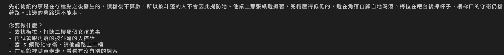
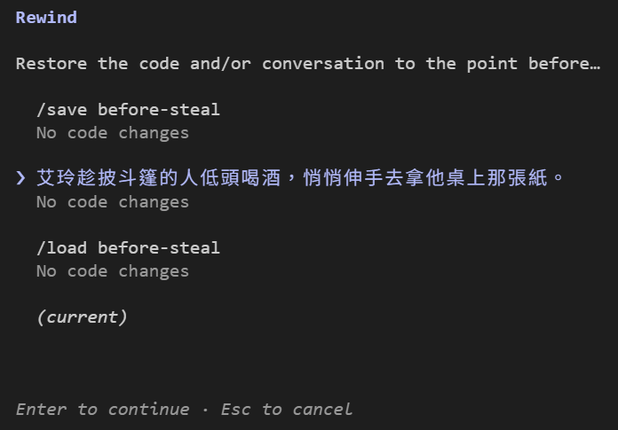
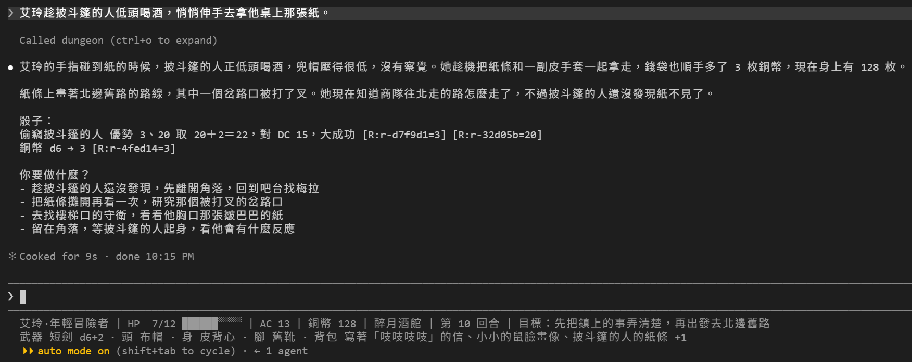
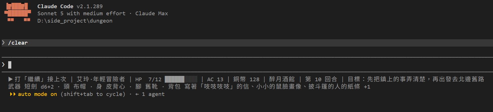
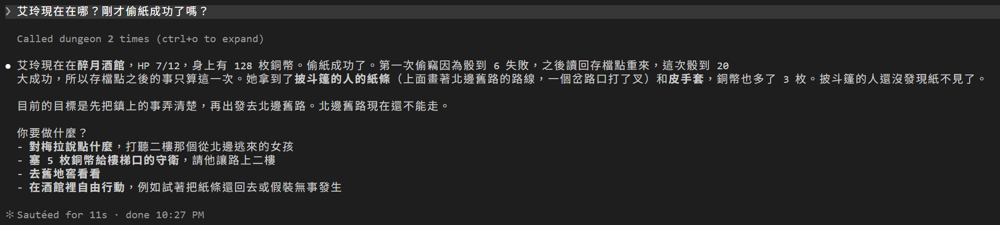

# [Day 21] 偷東西之前先存檔：/save、/load，和 /clear 之後的前情提要

Day 20 最後說，艾玲接下來想偷披斗篷的人桌上那張紙。失手了想重來，Day 5 的 `/rewind` 卻倒不回引擎寫的 `state.json`。只把存檔換回去，對話裡還留著「剛才被抓到」那一段，好像也沒用。

要回到偷之前，有兩樣東西要倒回去：引擎管的遊戲狀態，和對話。Day 5 講過，倒帶只管 Claude Code 自己用 Edit、Write 改的檔；`state.json` 現在由引擎寫，所以 `/rewind` 只倒得回對話。今天要做兩件事：

1. **加上 `/save`、`/load`**：存檔和讀檔交給引擎。偷紙之前先存檔，失手就讀檔，再用 `/rewind` 把對話也倒回去。
2. **開新對話也接得上**：`/clear` 或隔天重開之後，靠 `SessionStart` Hook 把前情提要交給 Claude Code DM。

最後也會提到對話太長時的 `/compact` 行為。


## 換上 Day 21 的地城

照下面的步驟換上去：

1. 從 repo 的 [`articles/21/dungeon/`](https://github.com/harry18456/claude-code-dungeon-master/tree/main/articles/21/dungeon) 複製這些到你的 dungeon 資料夾：`.claude\skills\save\`、`.claude\skills\load\`、`.claude\skills\recap\`、`.claude\hooks\recap.py`。
2. 這幾個檔案直接用 repo 的版本覆蓋：`CLAUDE.md`、`.claude\settings.json`、`.claude\statusline.py`。
3. **重開 Claude Code。** 新加的 `SessionStart` Hook 只在對話開始時跑，CLAUDE.md 也要開新對話才讀得到（Day 17）。

不想一個一個換的話，也可以直接拿 `articles/21/dungeon/` 整個資料夾來用，一樣要重開 Claude Code。想接著玩自己的進度，可以複製前先備份自己的 `state.json`，複製完再放回去。

## /save 和 /load：只有玩家能叫

先看 `save` 的 SKILL.md：

```markdown
---
name: save
description: 把目前的遊戲狀態存進一個存檔槽。只由玩家明確觸發。
argument-hint: "[存檔名稱，預設 quick]"
disable-model-invocation: true
allowed-tools: Bash(uv run --no-project gamectl.py save *)
---

以下結果已在你看到前由引擎執行：

!`uv run --no-project gamectl.py save quick $ARGUMENTS`

把上面那一行原樣回報給玩家。不要描述場景，不要改任何檔案。
```

Day 5 是拿倒帶當讀檔；現在 `state.json` 歸引擎管，存檔也交給引擎。SKILL.md 用到的都是學過的東西：

- **`disable-model-invocation: true`（Day 9）**：只有玩家能叫。存不存檔、讀哪個檔，是玩家的決定。不過 Day 9 也說過，這只擋 Skill；DM 想用 Bash 跑同一行指令，還是有機會做到，所以 CLAUDE.md 另外寫了一條，下面會看到。
- **`allowed-tools`（Day 9）**：Skill 自己帶權限，`!` 那一行不用再到 settings.json 放行。
- **`` !`指令` `` 展開（Day 8）**：訊息送出之前，引擎就存好檔了。Day 17 的 `/cheat` 也是這樣叫 `gamectl.py`。
- **`quick $ARGUMENTS`**：打 `/save before-steal`，展開成 `save quick before-steal`，`gamectl.py` 取最後一個字當存檔名；只打 `/save`，就存到 `quick`。

存檔放在 `.game\saves\<名稱>.json`。`.game\` 有 Day 13 的 deny 和 Day 17 的 `guard.py` 守著，Claude Code DM 改不了存檔的內容。

`load` 長得差不多，指令換成 `gamectl.py load`，內文多了一段交代：

```
讀檔之後，這段對話裡在存檔點之後發生的事都不算數。先呼叫 `get_state` 與 `get_current_scene`，再用兩三句描述艾玲現在在哪、狀態如何，最後問玩家「你要做什麼？」，給兩到四個選項。不要引用讀檔前的骰值或事件。
```

CLAUDE.md 也多了一條：

```
- 存讀檔只由玩家用 `/save`、`/load` 觸發。`/rewind` 倒不回引擎寫的檔案；玩家讀檔之後，存檔點之後的事一律不算。
```

## 偷紙之前先存檔

先存檔：

```
/save before-steal
```

```
已存檔：before-steal（HP 7/12，醉月酒館，第 9 回合）
```

然後動手，目標是 Day 1 開場就攤在他桌上的那張紙：

```
艾玲趁披斗篷的人低頭喝酒，悄悄伸手去拿他桌上那張紙。
```

DM 判成 `steal cloaked`，對披斗篷的人偷竊：加敏捷，DC 15（Day 18）。Day 18 請他喝過酒，引擎對他的檢定都給優勢，偷也算：

```
偷竊披斗篷的人 優勢 6、4 取 6＋2＝8，對 DC 15，失敗 [R:r-22662e=6] [R:r-4a39e7=4]
```

兩顆都不夠。他把紙收進懷裡，兜帽底下的眼睛盯住艾玲。引擎把他記成「警戒」，之後對他的檢定會有劣勢，剛好抵掉喝酒的優勢；而且同一招失手之後，引擎不讓你馬上再試。想回到他還沒起疑的時候，只能讀檔。

讀檔：

```
/load before-steal
```



DM 照 Skill 的交代，先呼叫 `get_state` 和 `get_current_scene`，再從存檔點接著講：剛才偷紙的事不算數，那張紙還攤在桌上。

## 讀檔之後，用 /rewind 把對話也倒回去

遊戲狀態回到存檔點了，對話還沒有：「他把紙收進懷裡」那一段，還在這段對話裡。

這時候用 Day 5 倒帶表格的第 2 個選項：按 `Esc` 兩下，選偷紙的那一句：



每一句底下都寫著 `No code changes`：引擎改的 `state.json` 不算 Claude Code 改的檔，所以這裡能倒的只有對話。按 Enter，再選 `Restore conversation`。

對話停在剛存完檔的地方，偷紙那一句也放回了輸入框。`/load` 已經把遊戲狀態倒回去，現在兩邊都回到存檔點，DM 完全不知道剛才失手過。這就是 Day 5 表格裡「讀檔，一切重來」那一招，只是檔案的部分改由引擎讀檔。

不倒對話也可以：`/load` 那段交代和 CLAUDE.md 那一條，都要 DM 把存檔點之後的事當成不算數。不過 Day 3 說過，CLAUDE.md 是提示，不是規則引擎；舊事也還留在對話裡。兩邊一起倒回去最乾淨。

按 Enter，把輸入框裡那一句送出去，再偷一次：

```
偷竊披斗篷的人 優勢 3、20 取 20＋2＝22，對 DC 15，大成功 [R:r-d7f9d1=3] [R:r-32d05b=20]
銅幣 d6 → 3 [R:r-4fed14=3]
```



骰到 20，大成功：紙條、一雙皮手套，再加 3 枚銅幣。引擎回傳的 `revealed` 寫著：

```
紙條上畫著北邊舊路的路線，一個岔路口打了叉。披斗篷的人還沒發現紙不見了。
```

Day 18 他說過，岔路口有人守著。打叉的，會不會就是那裡？

狀態列的目標是「先把鎮上的事弄清楚，再出發去北邊舊路」：路知道了，但還不是出發的時候。

## /clear 和前情提要：SessionStart Hook

玩了一個晚上，對話已經很長了。想從一段乾淨的對話開始，可以打 `/clear`：清掉這段對話，開一段新的。舊的對話沒有刪掉，還在 Day 2 講的 `.jsonl` 裡，用 `/resume` 找得回來。

清掉之後會怎樣？Day 2 開新對話時，DM 不認得梅拉；後來 Day 3 用 CLAUDE.md 記住設定，Day 4 用 `state.json` 記住數字。現在 DM 開場會先呼叫 `get_state`，知道艾玲現在的狀態，卻不知道剛才發生了什麼：偷過紙嗎？讀過檔嗎？

所以今天加了一個 Hook，在對話一開始就把引擎的紀錄交給 Claude Code DM。settings.json 的 `hooks` 裡多了這一段：

```json
"SessionStart": [
  {
    "hooks": [
      {
        "type": "command",
        "command": "uv run --no-project .claude/hooks/recap.py"
      }
    ]
  }
]
```

Day 11 的事件表裡，第一個就是 `SessionStart`：對話開始時觸發，印出的文字會補進對話。今天終於用上。它的 matcher 對的是「這段對話怎麼開始的」：

| matcher | 什麼時候 |
|---|---|
| `startup` | 開一段新對話 |
| `resume` | `--resume`、`-c`、`/resume`（Day 2） |
| `clear` | `/clear` |
| `compact` | 對話壓縮之後（下一節） |
| `fork` | 從舊對話分出一段新的，例如 Day 5 的 `/branch` |

跟 Day 11 一樣，沒寫 matcher 就是每一種都跑。是哪一種，Hook 從 stdin 收到的 JSON 裡有一個 `source` 欄位會寫明（Day 12 看過 stdin）。

`recap.py` 用 `gamectl.py` 讀出目前狀態，和 Day 16 講過的事件紀錄 `events.jsonl` 最後 8 筆，包成 JSON 印出來：

```json
{
  "hookSpecificOutput": {
    "hookEventName": "SessionStart",
    "additionalContext": "【前情提要，來源：clear】\n目前狀態：……"
  }
}
```

`SessionStart` 直接印文字也會進到對話裡；包成 JSON 的 `additionalContext`，意思寫得更明確。它跟 Day 13 的 `systemMessage` 剛好相反：`systemMessage` 只給玩家看，Claude Code DM 看不到；`additionalContext` 只給 Claude Code DM 看，畫面上不會出現。

打完 `/clear`，畫面上確實什麼都沒多：



但 DM 已經拿到這段前情提要：

```
【前情提要，來源：clear】
目前狀態：HP 7/12 | AC 13 | 銅幣 128 | 醉月酒館 | 第 10 回合 | …… | 目標：先把鎮上的事弄清楚，再出發去北邊舊路
最近的事件（由引擎紀錄，可信）：
[move] tavern → cellar
[attack] 用短劍對 另一隻巨鼠 攻擊骰 9+4 命中，傷害 8，對方 HP 0；艾玲 HP 7
[move] cellar → tavern
[check] 互動：向梅拉領地窖委託的報酬，成功
[save] slot=before-steal
[check] 偷竊：披斗篷的人，d20 6 對 DC 15，失敗
[load] slot=before-steal
[check] 偷竊：披斗篷的人，d20 20 對 DC 15，成功
玩家第一次開口時，先用兩三句回顧上次玩到哪、艾玲現在在哪，再呼叫 get_current_scene 給選項。不要重述上面的骰值。
```

CLAUDE.md 的第一條也補了一句，跟這段對上：「開場脈絡裡有「前情提要」時，玩家第一次開口不管說什麼，先用兩三句回顧上次玩到哪，再給選項」。

想確認 Hook 有沒有跑，直接問 DM：

```
艾玲現在在哪？剛才偷紙成功了嗎？
```



對話是空的，DM 照樣接得上。`/load` 只換回 `state.json`，事件紀錄不會跟著倒，所以還記著失手的那一次；但紀錄裡也有 `[save]` 和 `[load]`，夾在中間的那次失手，Claude Code DM 會知道不算。

前情提要最後交代了「不要重述上面的骰值」，DM 還是講了「骰到 6」「骰到 20」：再次印證寫在提示裡的事，Claude Code 不一定照做。

還有一件小事：Claude Code 在最一開始的時候不會自己先開口，需要玩家先打一句話。所以狀態列也改了：對話還沒開始時，最前面會出現「▶ 打「繼續」接上次」（就是 `/clear` 之後那張圖），新局則是「▶ 打「開始」開新局」。Day 14 的狀態列，剛開對話時 context 用量是空的；`statusline.py` 就是用這一點判斷對話還沒開始。

前情提要只在對話開始時給，壓縮之後也會再給一次（下一節）。玩到一半想回顧，就用今天加的第三個 Skill `/recap`：讀引擎最近十筆事件，請 DM 回顧一下。它沒有設 `disable-model-invocation`，Claude Code DM 也可以自己叫。description 是這樣寫的：

```
回顧最近發生的事。玩家問「剛才發生什麼」「我做到哪了」，或你需要整理已發生的事實時使用。
```

## 對話太長：/compact 和自動壓縮

Day 5 的倒帶選單有兩個 `Summarize` 選項，那時說「之後講 context 再細說」，就是今天。

context 是 Claude Code 每送一句話，都要整包交給模型的內容，裡面有 CLAUDE.md、這段對話的每一句、工具回傳的結果等等。Day 3 打 `/context` 看到的就是這一包；Day 14 狀態列上的 context 百分比，是這一包用掉了多少。

對話越長，這一包越大：回覆越慢、花費越貴，快塞滿了還會開始忘東西。要讓它變小，辦法都是把一段對話換成摘要：

- 倒帶選單的 `Summarize from here`：選的那一句之後，換成摘要。
- 倒帶選單的 `Summarize up to here`：選的那一句之前，換成摘要。
- `/compact`：整段對話換成摘要。
- 自動壓縮：快塞滿的時候，Claude Code 自己做一次 `/compact`。

整段換成摘要之後，CLAUDE.md 和 auto memory 會從檔案重新讀進來。`SessionStart` 的 `compact` 就在這時觸發：壓縮完，前情提要再交給 DM 一次。

Day 5 把 `Summarize up to here` 壓出來的摘要也叫「前情提要」，那是模型自己寫的；今天的前情提要，是引擎紀錄印出來的。

實際嘗試 `/compact`：對話從約 26,500 token 壓到約 2,400 token。接著問「剛才偷紙成功了嗎？」，Claude Code DM 一樣可以答對。

今天用到的做法，整理一下：

| 做法 | 遊戲狀態（`state.json`） | 對話 |
|---|---|---|
| `/rewind` 的 `Restore conversation` | 不動 | 倒回去 |
| `/load` | 回到存檔點 | 不動，DM 知道存檔點之後的事不算 |
| `/load`＋`Restore conversation` | 回到存檔點 | 也回到存檔點 |
| `/clear` | 不動 | 清空，靠前情提要接上 |
| `/compact`、自動壓縮 | 不動 | 換成摘要，再加上前情提要 |

## 目前還有什麼問題嗎？

艾玲拿到路線圖了：北邊舊路，一個岔路口打了叉。二樓還住著那個從北邊逃來的女孩。

不過這幾天的 DM 越來越像會計。偷紙失手那次，DM 是這樣講的：「這次偷竊失敗，紙沒有到手，銅幣和 HP 都沒有變化。」數字都對，故事卻沒了味道。明天上二樓找那個女孩，也幫 DM 換一個說話的腔調。

今天結束時 `dungeon` 資料夾的完整內容在 [articles/21/dungeon](https://github.com/harry18456/claude-code-dungeon-master/tree/main/articles/21/dungeon)，給大家參考。

## 目前學會的 Claude Code 機制

- ✅ Day 1：安裝與登入、四種介面；模型：`/model`、`/effort`、`/usage`
- ✅ Day 2：session：`.jsonl`、`--resume`、`-c`、`/resume`、`cleanupPeriodDays`
- ✅ Day 3：CLAUDE.md：三層、`@` 匯入、`/init`；`/context`
- ✅ Day 4：內建工具：Read／Bash／Edit、`Ctrl+O`
- ✅ Day 5：checkpoint：`/rewind`（`Esc` 兩下）、`/branch`
- ✅ Day 6：Skill：`SKILL.md`、`description`、`/skill 名字`、skill-creator
- ✅ Day 7：權限：權限模式、`Shift+Tab`、`/permissions`、allow／ask／deny、`settings.json`
- ✅ Day 8：Skill：`$ARGUMENTS`、`argument-hint`、`` !`指令` `` 展開
- ✅ Day 9：Skill：`disable-model-invocation`、`user-invocable`、`allowed-tools`
- ✅ Day 10：權限：Plan Mode、`/plan`、`Ctrl+G`
- ✅ Day 11：Hook：`Stop`、`UserPromptExpansion`、`PostToolUse`、`matcher`、`if`、`/hooks`
- ✅ Day 12：Hook：`PreToolUse`、exit 2 把理由交給模型、stdin 的 `tool_input`、matcher `Edit|Write`、`.ps1` 存成 UTF-8 with BOM；權限：用 deny 保護 Hook 自己
- ✅ Day 13：Hook：`Stop` 的 `last_assistant_message`、JSON 輸出 `systemMessage`；帳本與票根
- ✅ Day 14：狀態列：`statusLine`、收到的 session JSON、`refreshInterval`；uv：`uv run`
- ✅ Day 15：MCP：host／client／server、stdio 與 Streamable HTTP、`claude mcp add` 與三種範圍、`.mcp.json`、`/mcp`、工具名稱 `mcp__server__tool`、`ToolError`；uv：`uvx`
- ✅ Day 16：MCP：一個 server 多個工具、工具回傳 JSON 與錯誤；Hook：`PostToolUse` 的 `tool_response`、`async`
- ✅ Day 17：權限：`Read(path)` deny 連 Grep、Glob 都擋；Hook：`PreToolUse` 擋 Bash／PowerShell、JSON 輸出 `permissionDecision`；Skill：`!` 展開失敗時訊息不會送出；舊 context 不會跟著檔案更新，要開新對話
- ✅ Day 18：Subagent：`.claude/agents/`、`name`、`description`、內文就是系統提示、`Agent` 委派、背景執行、`@agent-名字`、`/tasks`
- ✅ Day 19：Subagent：`tools` 白名單、`omitClaudeMd`、權限與 Hook 照樣套用、看不到 DM 的對話、紀錄在 `subagents/`；設定：`env`、`CLAUDE_CODE_DISABLE_BACKGROUND_TASKS`
- ✅ Day 20：auto memory：`MEMORY.md` 索引和一條一檔的筆記、`type` 四種、每次對話載入索引的前 200 行或 25KB、`/memory`、`autoMemoryEnabled`
- ✅ Day 21：Hook：`SessionStart` 與 matcher（`startup`／`resume`／`clear`／`compact`／`fork`）、stdin 的 `source`、JSON 輸出 `additionalContext`；context：`/clear`、`/compact`、自動壓縮
