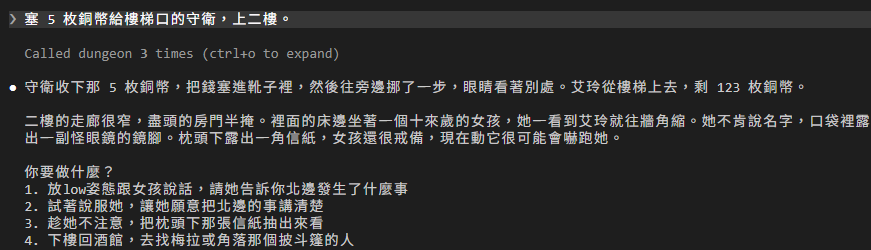
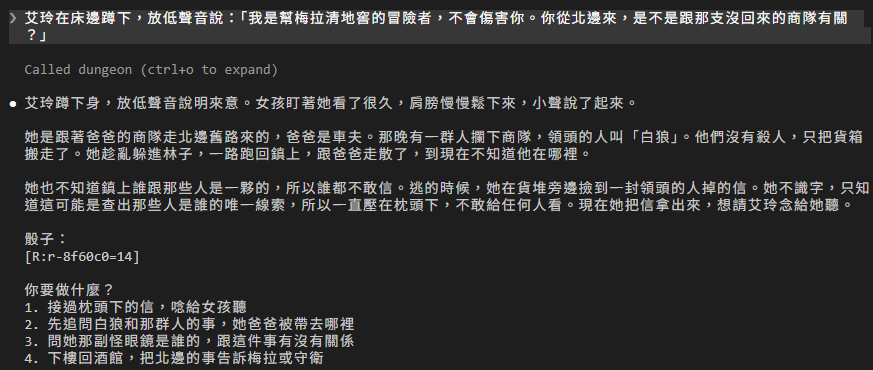
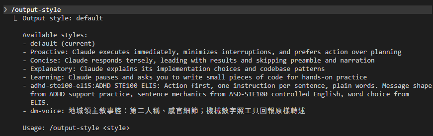
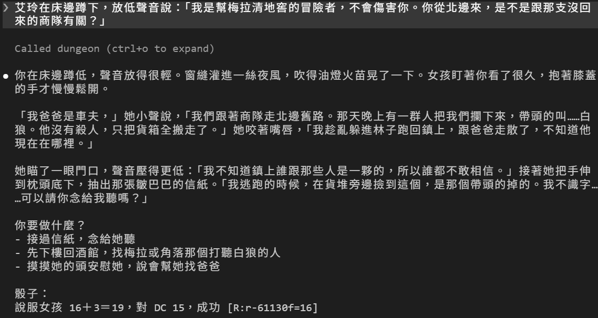

# [Day 22] 用 output style 幫 Claude Code DM 換個腔調

Day 21 最後說，Claude Code DM 越來越像會計。偷紙失手的那一次，DM 是這樣講的：「這次偷竊失敗，紙沒有到手，銅幣和 HP 都沒有變化。」數字都對，故事卻沒了味道。

今天艾玲要上二樓，見那個從北邊逃來的女孩，也幫 Claude Code DM 換一個說話的腔調。Day 18、19 示範裁判的時候，艾玲溜上過二樓，那是另一份測試用的存檔；我這一局的艾玲還沒上去過。

今天要做兩件事：

1. **先用原本的腔調說一次**：上二樓、存檔、說服女孩，看看現在的 DM 怎麼說故事。
2. **換上 `dm-voice` 再說一次**：一個 output style，讓 Claude Code DM 用第二人稱說故事，每次帶一點聲音和畫面。讀檔回來重說，比較前後。


## 上二樓見女孩

接著 Day 21 的進度玩。女孩今天會多講一段話，所以劇情檔要換新：從 repo 的 [`articles/22/dungeon/`](https://github.com/harry18456/claude-code-dungeon-master/tree/main/articles/22/dungeon) 把 `scenes\upstairs.json` 覆蓋到你的 dungeon。這是遊戲資料，不用看內容；引擎每次都重新讀場景，不用重開。

艾玲先要過樓梯口的守衛。這次直接塞錢：

```
塞 5 枚銅幣給樓梯口的守衛，上二樓。
```



守衛收下錢讓開，銅幣剩 123。說服女孩之前，照 Day 21 的習慣先存檔。等一下換了腔調，要讀這個檔回來再說一次：

```
/save before-girl
```

然後蹲下來，慢慢跟她說：

```
艾玲在床邊蹲下，放低聲音說：「我是幫梅拉清地窖的冒險者，不會傷害你。你從北邊來，是不是跟那支沒回來的商隊有關？」
```



女孩肯說了。DM 的說法還是老樣子：

- 第三人稱：「艾玲蹲下身」「女孩盯著她看了很久」。
- 「骰子：」底下只貼了票根，沒照 CLAUDE.md 把整行貼上。
- 選項是 1、2、3、4 的編號。

## output style 是什麼

Claude Code 每次把你的訊息送給模型，都會附上一段系統提示（system prompt），告訴模型「你是誰、要怎麼做事」。預設的系統提示是寫給寫程式用的：怎麼改程式、怎麼寫註解、怎麼確認改對了。

output style 換的就是這一段。選了自己寫的 output style，Claude Code 會拿掉寫程式的那些指示，改放你寫的內容。DM 不寫程式，拿掉剛好。

內建的除了 default，還有 Proactive、Concise、Explanatory、Learning 四種。它們都是寫程式用的，只是在原本的指示上多加一段，例如 Concise 讓回覆更短。今天自己寫一個 `dm-voice`。在 dungeon 的 `.claude\` 底下建一個 `output-styles` 資料夾，新增 `dm-voice.md`：

```markdown
---
name: dm-voice
description: 地城領主敘事腔：第二人稱、感官細節；機械數字照工具回報原樣轉述
---

你是這場單人冒險的地城領主，用繁體中文、台灣用語對玩家說話。

- 以第二人稱敘事（「你看見⋯」），每次回應至少帶一句環境或感官描寫。
- 段落短，維持節奏。描述完情境後把選擇權交回玩家。
- 骰值、DC、HP、銅幣等機械數字一律照工具回傳原樣轉述，不得自行增減；票根 `[R:<roll_id>=<value>]` 照規則附上。
- HP、銅幣有變動才提，融進敘事裡說；沒變動就不要提，也不要另外寫一句報帳。
- 對玩家說話時不用標題，敘事用連續段落；行動選項用短清單。被要求原樣轉貼的結構化內容除外。
```

跟 Skill 一樣，最上面是 frontmatter：

- `name`：選單裡顯示的名字。沒寫的話用檔名。
- `description`：選單裡的說明。
- 另外還有 `keep-coding-instructions`：設成 `true` 會留著寫程式的指示，沒寫就是不留。DM 用不到，所以沒寫。

底下五條才是給 DM 的話：前兩條是腔調，第三、四條管數字，最後一條是版面。第三條就是為了剛才第一次說服女孩時的情況：DM 把「骰子：」底下那一行砍到只剩票根。第四條專治 Day 21 說的會計腔：HP、銅幣沒變，就不用再報一次。

檔案放在專案的 `.claude\output-styles\`，只有這個專案選得到；放在 `C:\Users\<你的名稱>\.claude\output-styles\`，每個專案都選得到。

存好檔案之後重開 Claude Code，打 `/output-style`，會列出能選的 output style，並標出目前用的是哪一個：



`dm-voice` 已經在清單裡了，不過目前用的還是 default。

清單裡還有一個 `adhd-ste100-eli5:ADHD STE100 ELI5`，是我之前自己做的 output style：[cc-adhd-ste100-eli5](https://github.com/harry18456/cc-adhd-ste100-eli5)，讓 Claude Code 的回答更好讀、也更好照著做：答案放第一行、一句只講一件事、少用要停下來想的詞。它是裝 plugin 帶進來的，所以名字前面多了 `adhd-ste100-eli5:`，Day 24 講 plugin 時會再看到這種寫法。有興趣也可以使用看看。

我們要選剛剛加入的 `dm-voice`，嘗試設定在 `.claude\settings.json`。在檔案最後加一行 `outputStyle`，跟 `permissions`、`hooks` 放在同一層。前一個設定的 `}` 後面記得補一個逗號：

```json
  "statusLine": {
    "type": "command",
    "command": "uv run --no-project .claude/statusline.py"
  },
  "outputStyle": "dm-voice"
}
```

名字要一字不差，大小寫也算。存好之後**再重開一次 Claude Code**。

打 `/output-style dm-voice` 也能直接換，不過只對你自己有效；想讓拿到這個資料夾的人都用，要寫在 `settings.json`。

## 跟 CLAUDE.md 差在哪

CLAUDE.md 寫的是 DM 要知道的事：世界設定、規則、每次先呼叫 `get_state`。output style 寫的是 DM 怎麼說話。[官方文件](https://code.claude.com/docs/zh-TW/output-styles#choose-between-an-output-style-and-other-features)有一張表在分這些功能，換成地城的例子是這樣：

| 想要 | 用什麼 | 地城裡的例子 |
|---|---|---|
| 每一次回覆的語氣和版面 | output style | `dm-voice` |
| DM 要知道的世界和規則 | CLAUDE.md（Day 3） | 艾玲的設定、不准自己編數字 |
| 偶爾才用的一套流程 | Skill（Day 6） | `/save`、`/load` |
| 每次都一定要發生的事 | Hook（Day 11） | 查帳、守衛、前情提要 |
| 有自己一套指示的幫手 | Subagent（Day 18） | 規則裁判 |

output style 也跟 CLAUDE.md 一樣，是請求，不是保證。[官方文件](https://code.claude.com/docs/zh-TW/output-styles)寫得很直接：output style 給的是要照著做的指示，不保證某件事一定發生或一定不發生。

## 讀檔，換個腔調再說一次

重開 Claude Code 之後用 Day 21 的讀檔回到說服之前：

1. 打 `/load before-girl`，把遊戲狀態倒回存檔點。
2. 再說一次同一句話。



跟第一次說服的那張比：

- 人稱換了：「你在床邊蹲低」「女孩盯著你看了很久」。
- 多了聲音和畫面：「窗縫灌進一絲夜風，吹得油燈火苗晃了一下」。
- 女孩自己開口說話，不再是 DM 轉述。
- 「骰子：」底下貼回完整的一行：「說服女孩 16＋3＝19，對 DC 15，成功」。
- 選項從編號變成短清單。

女孩說的內容沒有變：她是商隊車夫的女兒，跟著爸爸走北邊舊路。那晚一群人攔下商隊，領頭的叫白狼，他們沒有殺人，只把貨箱搬走。她趁亂逃回鎮上，跟爸爸走散了，誰都不敢信。逃的時候，她在貨堆旁撿到領頭的人掉的一封信。她不識字，一直壓在枕頭下。

內容一樣，是因為這段話不是 Claude Code DM 編的。說服成功時，引擎把女孩要說的話放在回傳的 `revealed` 欄位裡（Day 21 偷到紙條時看過這個欄位），DM 只負責講出來。output style 改的是怎麼講，並不會改到講什麼。

## 裁判沒有跟著換腔調

Day 18 的規則裁判是一個 subagent。[官方文件](https://code.claude.com/docs/zh-TW/output-styles#how-output-styles-work)寫明：output style 只套用在主對話，和 Day 18 提過的 fork；其他 subagent 用自己的系統提示，不會受影響。

我在測試用的副本試過：DM 用 `dm-voice` 的時候，把「彈銅幣引開守衛、溜上樓」交給裁判，裁判回的還是 JSON：

```json
{"rule_id": "distract", "target_id": "guard", "reason": "彈銅幣引開守衛的注意力，再趁機溜過去，最接近聲東擊西。……"}
```

這正是我們要的：裁判的結果是給 Claude Code DM 照著呼叫工具用的，不能被改成「你看見⋯」。

## 目前還有什麼問題嗎？

今天為了比較兩種腔調，同一段劇情說服了兩次：存檔、讀檔、重開對話，一句一句打。每改一次設定就要重玩一遍，有點累。明天讓 Claude Code 自己玩：headless 模式，一次跑完好幾回合，順便把每一回合記成日誌。

今天結束時 `dungeon` 資料夾的完整內容在 [articles/22/dungeon](https://github.com/harry18456/claude-code-dungeon-master/tree/main/articles/22/dungeon)，給大家參考。

## 目前學會的 Claude Code 機制

- ✅ Day 1：安裝與登入、四種介面；模型：`/model`、`/effort`、`/usage`
- ✅ Day 2：session：`.jsonl`、`--resume`、`-c`、`/resume`、`cleanupPeriodDays`
- ✅ Day 3：CLAUDE.md：三層、`@` 匯入、`/init`；`/context`
- ✅ Day 4：內建工具：Read／Bash／Edit、`Ctrl+O`
- ✅ Day 5：checkpoint：`/rewind`（`Esc` 兩下）、`/branch`
- ✅ Day 6：Skill：`SKILL.md`、`description`、`/skill 名字`、skill-creator
- ✅ Day 7：權限：權限模式、`Shift+Tab`、`/permissions`、allow／ask／deny、`settings.json`
- ✅ Day 8：Skill：`$ARGUMENTS`、`argument-hint`、`` !`指令` `` 展開
- ✅ Day 9：Skill：`disable-model-invocation`、`user-invocable`、`allowed-tools`
- ✅ Day 10：權限：Plan Mode、`/plan`、`Ctrl+G`
- ✅ Day 11：Hook：`Stop`、`UserPromptExpansion`、`PostToolUse`、`matcher`、`if`、`/hooks`
- ✅ Day 12：Hook：`PreToolUse`、exit 2 把理由交給模型、stdin 的 `tool_input`、matcher `Edit|Write`、`.ps1` 存成 UTF-8 with BOM；權限：用 deny 保護 Hook 自己
- ✅ Day 13：Hook：`Stop` 的 `last_assistant_message`、JSON 輸出 `systemMessage`；帳本與票根
- ✅ Day 14：狀態列：`statusLine`、收到的 session JSON、`refreshInterval`；uv：`uv run`
- ✅ Day 15：MCP：host／client／server、stdio 與 Streamable HTTP、`claude mcp add` 與三種範圍、`.mcp.json`、`/mcp`、工具名稱 `mcp__server__tool`、`ToolError`；uv：`uvx`
- ✅ Day 16：MCP：一個 server 多個工具、工具回傳 JSON 與錯誤；Hook：`PostToolUse` 的 `tool_response`、`async`
- ✅ Day 17：權限：`Read(path)` deny 連 Grep、Glob 都擋；Hook：`PreToolUse` 擋 Bash／PowerShell、JSON 輸出 `permissionDecision`；Skill：`!` 展開失敗時訊息不會送出；舊 context 不會跟著檔案更新，要開新對話
- ✅ Day 18：Subagent：`.claude/agents/`、`name`、`description`、內文就是系統提示、`Agent` 委派、背景執行、`@agent-名字`、`/tasks`
- ✅ Day 19：Subagent：`tools` 白名單、`omitClaudeMd`、權限與 Hook 照樣套用、看不到 DM 的對話、紀錄在 `subagents/`；設定：`env`、`CLAUDE_CODE_DISABLE_BACKGROUND_TASKS`
- ✅ Day 20：auto memory：`MEMORY.md` 索引和一條一檔的筆記、`type` 四種、每次對話載入索引的前 200 行或 25KB、`/memory`、`autoMemoryEnabled`
- ✅ Day 21：Hook：`SessionStart` 與 matcher（`startup`／`resume`／`clear`／`compact`／`fork`）、stdin 的 `source`、JSON 輸出 `additionalContext`；context：`/clear`、`/compact`、自動壓縮
- ✅ Day 22：output style：`.claude/output-styles/`、frontmatter（`name`、`description`、`keep-coding-instructions`）、`outputStyle`、`/output-style`；只套用在主對話，subagent 不受影響
