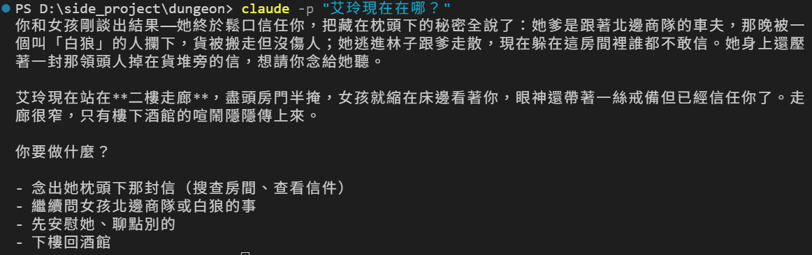
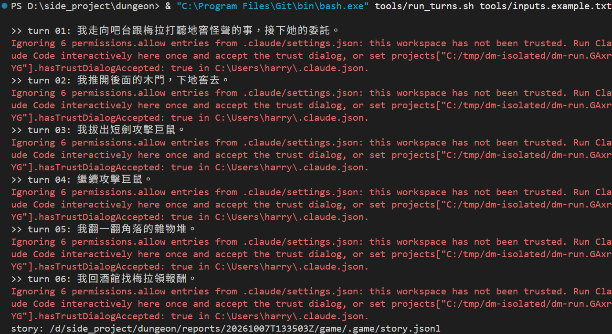

# [Day 23] 讓 Claude Code 自己玩：headless 模式和記錄每回合的冒險筆記

Day 22 為了比較兩種腔調，同一段劇情說服了兩次：存檔、讀檔、倒帶，再一句一句打。每改一次設定就得重玩一遍，很累。

今天讓 Claude Code 自己玩。給一份寫好的台詞，Claude Code 一行一行照著跑，不用人坐在旁邊按 Enter。這叫 headless 模式（不開互動畫面）。順便把每一回合記成日誌，Day 30 要用它寫冒險紀錄。

今天要做兩件事：

1. **`claude -p` 和 `tools\run_turns.sh`**：照一份輸入檔，一行跑一回合，接在同一段對話裡。
2. **`story.py`**：用四個 Hook，把玩家說的話和 DM 的回答一回合一回合記進 `.game\story.jsonl`。


## 換上 Day 23 的地城

照下面的步驟換上去：

1. 從 repo 的 [`articles/23/dungeon/`](https://github.com/harry18456/claude-code-dungeon-master/tree/main/articles/23/dungeon) 複製這些到你的 dungeon 資料夾：`.claude\hooks\story.py`、`tools\` 整個資料夾。
2. 這幾個檔案直接用 repo 的版本覆蓋：`.claude\settings.json`、`.claude\hooks\audit.py`、`engine\core.py`、`.gitignore`。
3. **重開 Claude Code。** 改了 `settings.json` 的 Hook 通常會自動生效，重開一次最保險。

不想一個一個換的話，也可以直接拿 `articles/23/dungeon/` 整個資料夾來用，一樣要重開 Claude Code。想接著玩自己的進度，可以複製前先備份自己的 `state.json`，複製完再放回去。

`engine\core.py` 只改了一行：開新局時，連日誌一起清掉。`audit.py` 為什麼要換，後面講日誌時會提到。

## claude -p：問一句，答完就結束

在 dungeon 資料夾的終端機打：

```
claude -p "艾玲現在在哪？"
```



沒有輸入框，也沒有狀態列。Claude Code 印出 DM 的回答就結束了。`-p` 是 `--print` 的縮寫，[官方文件](https://code.claude.com/docs/zh-TW/headless)叫它為非互動模式（non-interactive mode），也常被叫做 headless。

回答裡的 `**二樓走廊**` 是 Markdown 的粗體記號。假如在互動畫面會把它畫成粗體，`-p` 只印原始文字，所以星號會留著。

非互動模式常用的參數有這幾個：

| 參數 | 做什麼 |
|---|---|
| `--output-format json` | 不只是印回答，而是改印一段 JSON：真正回答在 `result`，這段對話的編號在 `session_id`，而對話累積花費在 `total_cost_usd`|
| `--resume <session_id>` | 接在那段對話後面繼續問。就是 Day 2 的 `--resume`，只是這邊換成給非互動模式用 |
| `--allowedTools "..."` | 非互動模式下先放行哪些工具。|
| `--permission-prompts none` | 原本 Claude Code 會詢問的行為，變成一律直接拒絕 |

`--allowedTools` 後面可以接好幾個值，要放在問句後面。放在前面的話，問句會被當成它的值吃掉。

## 一行一回合：run_turns.sh

`tools\inputs.example.txt` 是六回合的台詞：

```text
我走向吧台跟梅拉打聽地窖怪聲的事，接下她的委託。
我推開後面的木門，下地窖去。
我拔出短劍攻擊巨鼠。
繼續攻擊巨鼠。
我翻一翻角落的雜物堆。
我回酒館找梅拉領報酬。
```

`tools\run_turns.sh` 照著跑。第一行開一段新對話，從第二行起都用 `--resume` 才能接在上一次的同一段對話。核心是這幾行：

```bash
args=(-p "$line" --model "$MODEL" --setting-sources project
      --strict-mcp-config --mcp-config .mcp.json
      --allowedTools "mcp__dungeon__* Skill Agent Bash(uv run --no-project gamectl.py *) Read Grep Glob"
      --permission-prompts none)
[ -n "$SID" ] && args+=(--resume "$SID")
```

除了上一節的參數，還多了三個：

- `--model "$MODEL"`：用哪個模型，沒指定就用 sonnet（Day 1 的 `/model`）。
- `--setting-sources project`：只讀專案的 `settings.json`，不讀你自己的設定（使用者層和 `settings.local.json`）。
- `--strict-mcp-config --mcp-config .mcp.json`：同前一點一樣邏輯，只連 dungeon 自己的 MCP server（Day 15），不連你在別處加的。

最後加上 `--output-format json`，讓每一回合的回應 JSON 各存成一個檔。

`run_turns.sh` 會先把 dungeon 複製一份到暫存資料夾，在副本裡開新局，跑完再刪掉副本，所以不會動到你自己的進度。副本是沒有信任過的新資料夾（Day 7 的信任對話框），Claude Code 不會用它 `settings.json` 裡的 allow 規則，所以每一回合都會印一行 `Ignoring 6 permissions.allow entries … not been trusted`。不用理它，要用的工具已經用 `--allowedTools` 放行了。

`run_turns.sh` 是 bash 腳本。PowerShell 裡打 `bash` 不一定會開到 Git Bash，所以寫 Git Bash 的完整路徑，前面的 `&` 讓 PowerShell 執行引號裡的程式：

```
& "C:\Program Files\Git\bin\bash.exe" tools/run_turns.sh tools/inputs.example.txt
```

用 Git Bash 的話，直接打 `bash tools/run_turns.sh tools/inputs.example.txt`。



照 JSON 裡的 `duration_ms`，這一局每回合 5 到 24 秒，六回合加起來大約 76 秒。最後一回合的 `total_cost_usd` 是 0.29，整局大約花了 0.29 美元。

每回合的結果放在 `reports\<時間>\`：`turn_01.json` 是那一回合的 JSON，`turn_01.state.json` 是那一回合結束時的 `state.json`，最後還有一份 `game\` 資料夾，放副本跑完的存檔和日誌。

## 台詞是死的，骰子是活的

這一局的六回合是這樣跑的：

1. 接下梅拉的委託。
2. 下地窖，一隻巨鼠先撲上來，骰出 1，咬空了。
3. 台詞是「攻擊巨鼠」，可是地窖裡有兩隻。DM 反問要打哪一隻，台詞沒辦法回答，這一回合什麼都沒發生。
4. 「繼續攻擊巨鼠」：DM 挑了背上黏著紙的那隻，砍到只剩 1 點 HP，艾玲也被反咬，HP 剩 8。
5. 「翻一翻雜物堆」：在兩隻巨鼠旁邊翻，什麼都沒找到，又被咬到 HP 6。
6. 「回酒館領報酬」：艾玲逃回酒館，可是巨鼠還在，梅拉不給錢：

```
她擦著杯子的手停了下來，狐疑地看你一眼：「地窖的怪聲還沒解決，先別急著要錢。」
```

台詞不會看狀況改變，DM 和引擎還是照規則走，要隨機應變還是得有人在旁邊玩。不過 headless 本身是很重要的功能：它讓程式可以自動跑 Claude Code，測試、重跑同一套流程、比較設定改了之後的差別等等，都用得到它。

## 冒險筆記

Claude Code DM 說過的話，Day 2 提到的 `.jsonl` 對話紀錄裡其實都有。不過 Claude Code 不是一說完就寫進這個檔，而是晚一點才寫，[官方文件](https://code.claude.com/docs/zh-TW/hooks#common-input-fields)說這個檔是非同步寫入的。為了完整記錄每一回合的冒險筆記，`story.py` 會從 Hook 收到的 JSON 裡記下玩家說的話、DM 說的話，以及這一回合結束時的狀態。

| Hook 事件 | 什麼時候觸發 | `story.py` 記下 |
|---|---|---|
| `UserPromptSubmit` | 玩家送出一句話 | 玩家說的話 |
| `UserPromptExpansion` | 玩家打的斜線指令被展開（Day 11） | 斜線指令本身 |
| `MessageDisplay` | DM 的文字顯示在畫面上時 | DM 說的話 |
| `Stop` | DM 這一回合說完（Day 13） | 最後一段話（`last_assistant_message`），當作保險 |

settings.json 多了這幾段設定：

```json
"UserPromptSubmit": [
  { "hooks": [ { "type": "command", "command": "uv run --no-project .claude/hooks/story.py" } ] }
],
"UserPromptExpansion": [
  { "hooks": [ { "type": "command", "command": "uv run --no-project .claude/hooks/story.py" } ] }
],
"MessageDisplay": [
  { "hooks": [ { "type": "command", "command": "uv run --no-project .claude/hooks/story.py", "async": true } ] }
]
```

而 `Stop` 原本就有設置查帳的 `audit.py` 和音效的 `sound.py`，現在在後面再加一個 `story.py`：

```json
"Stop": [
  { "hooks": [
    { "type": "command", "command": "uv run --no-project .claude/hooks/sound.py chimes" },
    { "type": "command", "command": "uv run --no-project .claude/hooks/audit.py --mode warn" },
    { "type": "command", "command": "uv run --no-project .claude/hooks/story.py" }
  ] }
]
```

這邊有幾個要注意的地方：

- **同一回合怎麼串起來**：玩家送出一句話之後，Hook 收到的 JSON 都有 `prompt_id`，同一句玩家輸入引發的 Hook，`prompt_id` 都一樣。`story.py` 照實記下，之後要整理時，用它把同一回合的紀錄放在一起。
- **`MessageDisplay` 用 `async`**：Day 16 講過，`async: true` 的 Hook 在背景跑，不擋住畫面上的字。代價是 `-p` 一結束，還沒跑完的背景 Hook 可能來不及寫，所以 `Stop` 也記一筆最後一段話。
- **`story.py` 什麼都不印**：Day 21 講過 `SessionStart` 印的東西會補進對話；`UserPromptSubmit` 也一樣，印出來的文字會變成 DM 看得到的內容。所以日誌只寫檔案，不印任何文字。
- **斜線指令會記兩次**：打 `/save` 這類指令時，`UserPromptExpansion` 和 `UserPromptSubmit` 都會觸發，所以會有兩筆一樣的玩家紀錄。

剛才那一局的日誌，第一回合長這樣（省略了時間、`session_id` 這類欄位）：

```json
{"prompt_id": "480bbd3c-…", "kind": "player", "text": "我走向吧台跟梅拉打聽地窖怪聲的事，接下她的委託。", "events": 1}
{"prompt_id": "480bbd3c-…", "kind": "dm", "text": "推開醉月酒館的門，一股煙燻味混著麥酒的酸氣撲面而來。……"}
{"prompt_id": "480bbd3c-…", "kind": "stop", "text": "推開醉月酒館的門，一股煙燻味混著麥酒的酸氣撲面而來。……", "events": 2}
```

`events` 是當下引擎紀錄（Day 16 的 `events.jsonl`）有幾筆。玩家開口時 1 筆、DM 說完時 2 筆，中間多的那一筆就是這回合發生的事。Day 30 寫冒險紀錄時，靠它把每一回合的對話，對到引擎記下的骰子和結果。

`audit.py` 換新的原因也在這裡。Day 13 說過，`last_assistant_message` 只有最後一段話，DM 要是在呼叫工具之前就先貼了票根，查帳會以為漏貼。現在查帳也會讀日誌裡同一個 `prompt_id` 的 Claude Code DM 訊息。

## 目前還有什麼問題嗎？

這套 Claude Code DM 越來越完整了：說話方式、規則裁判、存讀檔、前情提要、查帳、守衛、日誌、音效。可是全部都住在這一個資料夾裡，想給朋友用，得照這二十幾天的文章一個一個檔案複製。

明天把這些打包成 plugin，放上 marketplace，讓別人能用 `/plugin` 一個指令就安裝好。

今天結束時 `dungeon` 資料夾的完整內容在 [articles/23/dungeon](https://github.com/harry18456/claude-code-dungeon-master/tree/main/articles/23/dungeon)，給大家參考。

## 目前學會的 Claude Code 機制

- ✅ Day 1：安裝與登入、四種介面；模型：`/model`、`/effort`、`/usage`
- ✅ Day 2：session：`.jsonl`、`--resume`、`-c`、`/resume`、`cleanupPeriodDays`
- ✅ Day 3：CLAUDE.md：三層、`@` 匯入、`/init`；`/context`
- ✅ Day 4：內建工具：Read／Bash／Edit、`Ctrl+O`
- ✅ Day 5：checkpoint：`/rewind`（`Esc` 兩下）、`/branch`
- ✅ Day 6：Skill：`SKILL.md`、`description`、`/skill 名字`、skill-creator
- ✅ Day 7：權限：權限模式、`Shift+Tab`、`/permissions`、allow／ask／deny、`settings.json`
- ✅ Day 8：Skill：`$ARGUMENTS`、`argument-hint`、`` !`指令` `` 展開
- ✅ Day 9：Skill：`disable-model-invocation`、`user-invocable`、`allowed-tools`
- ✅ Day 10：權限：Plan Mode、`/plan`、`Ctrl+G`
- ✅ Day 11：Hook：`Stop`、`UserPromptExpansion`、`PostToolUse`、`matcher`、`if`、`/hooks`
- ✅ Day 12：Hook：`PreToolUse`、exit 2 把理由交給模型、stdin 的 `tool_input`、matcher `Edit|Write`、`.ps1` 存成 UTF-8 with BOM；權限：用 deny 保護 Hook 自己
- ✅ Day 13：Hook：`Stop` 的 `last_assistant_message`、JSON 輸出 `systemMessage`；帳本與票根
- ✅ Day 14：狀態列：`statusLine`、收到的 session JSON、`refreshInterval`；uv：`uv run`
- ✅ Day 15：MCP：host／client／server、stdio 與 Streamable HTTP、`claude mcp add` 與三種範圍、`.mcp.json`、`/mcp`、工具名稱 `mcp__server__tool`、`ToolError`；uv：`uvx`
- ✅ Day 16：MCP：一個 server 多個工具、工具回傳 JSON 與錯誤；Hook：`PostToolUse` 的 `tool_response`、`async`
- ✅ Day 17：權限：`Read(path)` deny 連 Grep、Glob 都擋；Hook：`PreToolUse` 擋 Bash／PowerShell、JSON 輸出 `permissionDecision`；Skill：`!` 展開失敗時訊息不會送出；舊 context 不會跟著檔案更新，要開新對話
- ✅ Day 18：Subagent：`.claude/agents/`、`name`、`description`、內文就是系統提示、`Agent` 委派、背景執行、`@agent-名字`、`/tasks`
- ✅ Day 19：Subagent：`tools` 白名單、`omitClaudeMd`、權限與 Hook 照樣套用、看不到 DM 的對話、紀錄在 `subagents/`；設定：`env`、`CLAUDE_CODE_DISABLE_BACKGROUND_TASKS`
- ✅ Day 20：auto memory：`MEMORY.md` 索引和一條一檔的筆記、`type` 四種、每次對話載入索引的前 200 行或 25KB、`/memory`、`autoMemoryEnabled`
- ✅ Day 21：Hook：`SessionStart` 與 matcher（`startup`／`resume`／`clear`／`compact`／`fork`）、stdin 的 `source`、JSON 輸出 `additionalContext`；context：`/clear`、`/compact`、自動壓縮
- ✅ Day 22：output style：`.claude/output-styles/`、frontmatter（`name`、`description`、`keep-coding-instructions`）、`outputStyle`、`/output-style`；只套用在主對話，subagent 不受影響
- ✅ Day 23：headless：`claude -p`、`--output-format json`、`--resume`、`--allowedTools`、`--permission-prompts`、`--setting-sources`、`--strict-mcp-config`；未信任的資料夾會忽略 allow 規則；Hook：`UserPromptSubmit`（玩家送出一句話時觸發）、`MessageDisplay`（DM 的文字顯示時觸發）、每個 Hook 都收得到的 `prompt_id`（同一回合都一樣）、`UserPromptSubmit` 印出的文字 Claude Code 也會看得到
