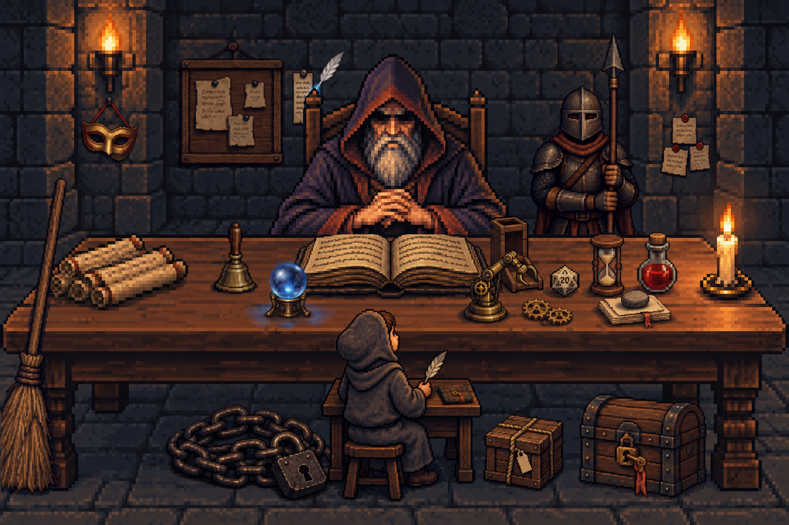
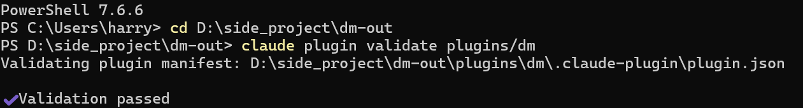
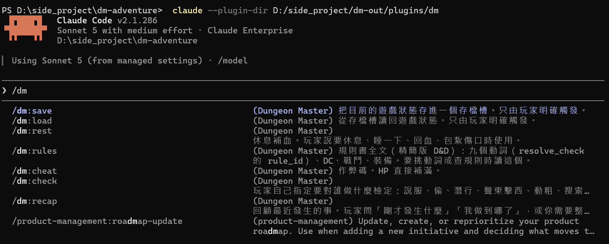
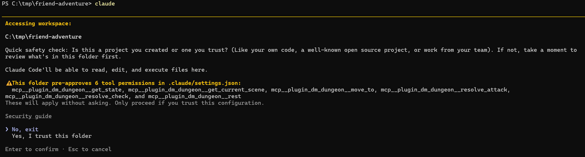
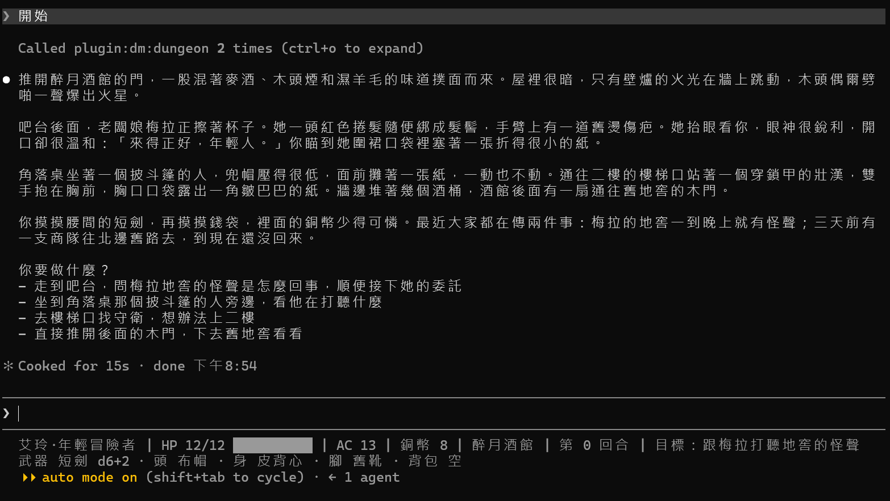
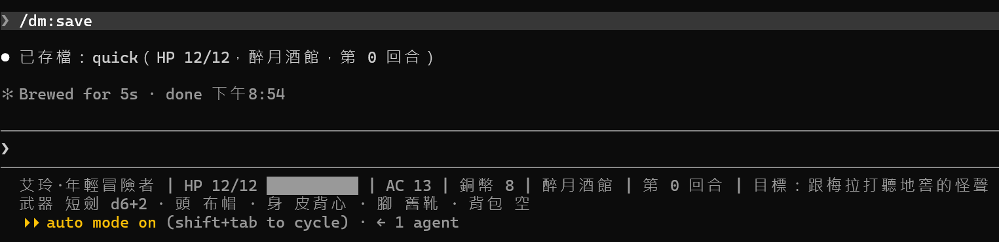

# [Day 24] 把地城領主打包帶走：plugin 和 marketplace

Day 23 最後說，這套 Claude Code DM 越來越完整，可是全部都住在一個資料夾裡：說話方式、規則裁判、存讀檔、前情提要、查帳、守衛、日誌、音效。朋友想玩，得照二十幾天的文章，一個一個檔案複製。

今天故事先停一天，艾玲還在二樓陪著女孩。我們把這套 DM 連同引擎和世界打包成一個 plugin，放上 marketplace，讓朋友打開一個資料夾就能玩。

今天要做三件事：

1. **分清楚**：哪些能放進 plugin，哪些只能留在資料夾裡。
2. **做出 `dm` plugin**：`plugins\dm\`，再用 `claude plugin validate` 檢查。
3. **放上 marketplace**：在一個新資料夾，從頭裝一次。



## 換上 Day 24 的地城

照下面的步驟換上去：

1. 從 repo 的 [`articles/24/dungeon/`](https://github.com/harry18456/claude-code-dungeon-master/tree/main/articles/24/dungeon) 複製 `tools\make_plugin.py` 到你的 dungeon 資料夾。
2. 這幾個檔案直接用 repo 的版本覆蓋：`engine\core.py`、`engine\server.py`、`gamectl.py`、`.claude\statusline.py`、`.claude\hooks\audit.py`、`.claude\hooks\recap.py`、`.claude\hooks\story.py`。

## plugin 是什麼

plugin 是一包 Claude Code 的元件：Skill、Subagent、Hook、output style、MCP server 等等都可以放進去。可以方便地安裝和使用。

裝好的 plugin，每個元件的名字前面都會多一個 plugin 的名字。像是 plugin 叫 `dm`，就會變成：

| 原本 | 裝成 plugin 之後 |
|---|---|
| `/save` | `/dm:save` |
| `rules-judge` | `dm:rules-judge` |
| `dm-voice` | `dm:dm-voice` |
| `mcp__dungeon__get_state` | `mcp__plugin_dm_dungeon__get_state` |

MCP 工具的名字規則不太一樣：`mcp__` 後面變成 `plugin_dm_dungeon`，也就是「plugin 的名字＋server 的名字」。

## 哪些帶走，哪些留下

不是每樣東西都能放進 plugin。[官方文件](https://code.claude.com/docs/zh-TW/plugins/manifest-reference)寫明兩件事：

- plugin 自己的 `settings.json` 只認兩個設定：`agent`，和給子代理用的 `subagentStatusLine`。Day 14 教的主畫面 `statusLine`、allow／deny 規則、Day 19 的 `env`，這些都不在這兩個裡面，plugin 帶不走。
- 放在 plugin 裡的 `CLAUDE.md` 不會被讀進 context。

除了這些，能放的我們都放進去：

| 放進 plugin | 留在冒險資料夾 |
|---|---|
| 說話方式 `dm-voice`（Day 22） | `CLAUDE.md`：世界設定和規則（Day 3） |
| 規則裁判 `rules-judge`（Day 18～19） | `settings.json`：allow／deny（Day 7、17）、`env`（Day 19） |
| 所有 Skill：`/save`、`/load`、`/recap`、`/check`、`/rest`、`/cheat`、`world-lore` | 狀態列（Day 14） |
| Hook：前情提要、查帳、守衛、日誌、音效 | 存檔：`state.json`、`.game\` |
| 引擎和它的 MCP server、場景、資料、規則書 | |

存檔其實也放得進 plugin，但不該放：plugin 裝好的資料夾在 plugin 更新時會換掉，[官方文件](https://code.claude.com/docs/zh-TW/plugins/manifest-reference#environment-variables)提醒不要在裡面存東西。所以存檔留在冒險資料夾，引擎要改成把存檔寫到這裡，下一節會講。

## 做出 plugin

plugin 的資料夾長這樣：

```text
plugins\dm\
├── .claude-plugin\
│   └── plugin.json      plugin 的名字、版本、說明
├── output-styles\
│   └── dm-voice.md
├── agents\
│   └── rules-judge.md
├── skills\
│   ├── save\SKILL.md
│   └── ……（load、recap、check、rest、cheat、world-lore、rules）
├── hooks\
│   ├── hooks.json       Hook 設定
│   ├── recap.py、audit.py、guard.py、story.py、sound.py
│   └── sounds\
├── .mcp.json            MCP server 設定
├── engine\              引擎和 MCP server
├── data\
├── scenes\
├── gamectl.py
└── rules.md
```

大部分檔案都是直接從 dungeon 複製過來。名字或路徑會變的，下面幾小節一個一個講。

`plugin.json` 只有 `name` 是必填，下面是節錄：

```json
{
  "name": "dm",
  "displayName": "Dungeon Master",
  "version": "1.0.0",
  "description": "地城領主：說話方式 dm-voice、規則裁判、存讀檔、前情提要、查帳、守衛、日誌和音效，加上 dungeon 引擎、MCP server、場景和規則書。CLAUDE.md、權限和存檔放在你的冒險資料夾。",
  "author": {"name": "harry18456", "url": "https://github.com/harry18456"}
}
```

### Hook

`hooks.json` 就是 `settings.json` 裡的 `hooks` 那一段，外面多包一層 `"hooks"`，路徑改成從 plugin 的位置開始：

```json
{
  "hooks": {
    "SessionStart": [
      {
        "hooks": [
          { "type": "command", "command": "uv run --no-project \"${CLAUDE_PLUGIN_ROOT}/hooks/recap.py\"" }
        ]
      }
    ]
  }
}
```

`${CLAUDE_PLUGIN_ROOT}` 是 plugin 裝好之後所在的資料夾，Claude Code 執行 Hook 前會換成真正的路徑。[官方文件](https://code.claude.com/docs/zh-TW/plugins/manifest-reference#quoting-and-path-separators)建議用雙引號包起來，路徑裡有空格也不會斷掉。

### MCP server

plugin 根目錄放一個 `.mcp.json`，寫法跟 Day 15 的一樣，路徑也從 plugin 的位置開始：

```json
{
  "mcpServers": {
    "dungeon": {
      "command": "uv",
      "args": ["run", "--no-project", "${CLAUDE_PLUGIN_ROOT}/engine/server.py"]
    }
  }
}
```

工具的名字會變成 `mcp__plugin_dm_dungeon__get_state` 這種。用到工具名字的地方都要換：冒險資料夾的 allow、Skill 的 `allowed-tools`、裁判的 `tools`、音效 Hook 的 `matcher`。

### 存檔寫回冒險資料夾

引擎原本把存檔寫在自己旁邊：`engine\core.py` 的 `ROOT` 是引擎往上一層，`state.json` 和 `.game\` 都放在那裡。放進 plugin 之後，引擎住在 plugin 的資料夾，存檔就要改寫到冒險資料夾。

Claude Code 啟動 MCP server 時，會給它一個環境變數 `CLAUDE_PROJECT_DIR`，就是你開 Claude Code 的那個資料夾。所以改成這樣：

```python
ROOT = pathlib.Path(__file__).resolve().parent.parent
PLUGIN_MODE = (ROOT / ".claude-plugin" / "plugin.json").exists()
GAME_ROOT = pathlib.Path(os.environ.get("CLAUDE_PROJECT_DIR") or os.getcwd()) if PLUGIN_MODE else ROOT
STATE = GAME_ROOT / "state.json"
GAME = GAME_ROOT / ".game"
```

旁邊有 `.claude-plugin\plugin.json`，表示放在 plugin 裡，存檔寫到 `CLAUDE_PROJECT_DIR`；沒有的話照舊。Skill 的 `!` 指令拿不到這個環境變數，不過它就在冒險資料夾裡執行，所以拿不到的時候，就用目前所在的資料夾。

前情提要、查帳、日誌三支 Hook 原本這樣找 dungeon：「我在 `.claude\hooks\`，往上兩層就是 dungeon」。裝成 plugin 之後往上兩層什麼都沒有，就改用 Hook 收到的 `CLAUDE_PROJECT_DIR`：

```python
ROOT = pathlib.Path(__file__).resolve().parents[2]
if not (ROOT / "gamectl.py").exists():  # installed as a plugin: the game is the project folder
    ROOT = pathlib.Path(os.environ.get("CLAUDE_PROJECT_DIR", "."))
```

前情提要還要執行 `gamectl.py`，所以 `recap.py` 多一行，改去 plugin 裡找它。

### Skill

Day 21 的 `/save` 執行的是 `` !`uv run --no-project gamectl.py save …` ``。`gamectl.py` 搬進 plugin 了，所以路徑改成從 plugin 的位置開始，`allowed-tools` 也一樣：

```text
allowed-tools: Bash(uv run --no-project "${CLAUDE_PLUGIN_ROOT}/gamectl.py" save *)

!`uv run --no-project "${CLAUDE_PLUGIN_ROOT}/gamectl.py" save quick $ARGUMENTS`
```

`${CLAUDE_PLUGIN_ROOT}` 寫在 Skill 的內容和 `allowed-tools` 裡都有效。

### 規則書

規則裁判原本自己用 Read 讀 `rules.md`。規則書放進 plugin 之後，就在冒險資料夾外面了，Claude Code 讀專案外的檔案要先經過你同意，每次請裁判都會跳出來問一次。所以規則書全文直接接在裁判的說明後面，裁判不用再讀檔，`tools` 也拿掉 Read。

DM 那邊，`CLAUDE.md` 原本叫 DM 去 `rules.md` 挑動詞，可是 `CLAUDE.md` 指不到 plugin 裡的檔案。[官方文件](https://code.claude.com/docs/zh-TW/plugins/manifest-reference#standard-layout)說，要讓 plugin 帶著給 Claude 看的指示，就放進 Skill。所以多做一個 `dm:rules` Skill，內容就是規則書，冒險資料夾的 `CLAUDE.md` 改成「全文在 `dm:rules` Skill」。

### 狀態列

狀態列的設定帶不走，`statusline.py` 只好留在冒險資料夾。可是它要跟引擎拿 AC、地點、目標這些資料，而它不知道 plugin 裝在哪裡。

所以 MCP server 啟動時，會把自己的位置寫進冒險資料夾的 `.game\engine_root.txt`，狀態列照著這張紙條找到引擎。MCP server 還沒啟動前，狀態列會先顯示「等 dungeon 引擎啟動」，打一句話之後就會出現。

### 一個指令組出來

上面這些，我寫成了 `tools\make_plugin.py`：

```
uv run --no-project tools/make_plugin.py <輸出資料夾> --adventure <冒險資料夾>
```

兩個資料夾都要放在 dungeon 外面。放在裡面的話，輸出資料夾會被一起複製進冒險資料夾；冒險資料夾也會往上讀到 dungeon 的 CLAUDE.md（Day 3）。

它會做三件事：

1. 在輸出資料夾組出 `plugins\dm\`，順便改好上面說的名字和路徑。
2. 寫好 marketplace 的檔案，下一節會用到。
3. 加了 `--adventure` 的話，再匯出一份「冒險資料夾」：只剩 `CLAUDE.md`、`.claude\settings.json`、`.claude\statusline.py`，加上一份新局的 `state.json`，讓朋友從頭玩。裡面的名字換成 `/dm:save`、`mcp__plugin_dm_dungeon__get_state` 這類新名字。Day 17 保護遊戲檔案的 deny 也改成指向 plugin：`Read(~/.claude/plugins/**/scenes/**)` 擋住偷看場景，`Edit(~/.claude/plugins/**)` 擋住改檔。

組好之後，到輸出資料夾打這一行檢查：

```
claude plugin validate plugins/dm
```



### 先在自己電腦上試

還沒公開之前，可以用 `--plugin-dir` 只在這一次載入 plugin。到冒險資料夾打：

```
claude --plugin-dir <輸出資料夾>/plugins/dm
```



打 `/dm` 就看得到 `/dm:save` 這些，說明前面的 `(Dungeon Master)` 就是 `plugin.json` 的 `displayName`。`world-lore` 不在選單裡，因為它設了 `user-invocable: false`（Day 9），只給 DM 用。再打 Day 11 用過的 `/hooks`，這次每個 Hook 前面都標著 `[Plugin]`，後面寫著 `dm@inline`，不是 Day 11 的 `Project settings`。用 `--plugin-dir` 載入的 plugin，名字後面接的就是 `@inline`。

## 放上 marketplace

marketplace 是 plugin 的目錄：一個 repo 根目錄放一份 `.claude-plugin\marketplace.json`，列出有哪些 plugin、在哪裡。我們直接放在這個系列的 repo：

```json
{
  "name": "dungeon-master",
  "description": "iThome 鐵人賽「30 天建立 Claude Code 地城領主」用到的 plugin",
  "owner": {"name": "harry18456", "url": "https://github.com/harry18456"},
  "plugins": [
    {"name": "dm", "source": "./plugins/dm", "description": "地城領主工具包：……"}
  ]
}
```

名字不能看起來像官方的：plugin 的名字用 `claude-` 開頭，`claude plugin validate` 會直接擋下；marketplace 也有一串保留的名字。保險起見，marketplace 不用 repo 的名字，叫 `dungeon-master`。plugin 的全名是「plugin 名字@marketplace 名字」，也就是 `dm@dungeon-master`，`enabledPlugins` 裡寫的就是它。

### 嘗試安裝

先把 repo 裡的 [`articles/24/adventure/`](https://github.com/harry18456/claude-code-dungeon-master/tree/main/articles/24/adventure) 複製到一個新資料夾，在那裡打 `claude`。

冒險資料夾的 `settings.json` 已經寫好兩個設定：

```json
"extraKnownMarketplaces": {
  "dungeon-master": { "source": { "source": "github", "repo": "harry18456/claude-code-dungeon-master" } }
},
"enabledPlugins": { "dm@dungeon-master": true }
```

`extraKnownMarketplaces` 寫加入哪些 marketplace，`enabledPlugins` 寫要啟用哪個 plugin。這兩個設定本來是給團隊共用 repo 用的，要等朋友在 Day 7 那個信任對話框按下信任才算數。信任之後，Claude Code 會在背景把 marketplace 抓下來。`dm` 就放在這個 marketplace 裡面，[官方文件](https://code.claude.com/docs/zh-TW/plugins/loading#enabled-in-project-settings-but-not-installed)說這種 plugin 會直接從 marketplace 載入，不用另外安裝。



信任對話框只列出 6 個預先放行的工具，名字都是 plugin 版的 `mcp__plugin_dm_dungeon__…`，沒有提到 plugin。按下信任之後，畫面上也不會有任何提示：Claude Code 在背景抓 marketplace，抓完就自動載入 plugin，我這邊大約十秒。狀態列一開始顯示「等 dungeon 引擎啟動」，打一句話就會換成艾玲的資料。

信任之後沒有自動載入的話，也可以在冒險資料夾裡自己裝：

```
/plugin install dm --marketplace harry18456/claude-code-dungeon-master
```

這一行會先問要不要加入這個 marketplace，再打開 plugin 的介紹。接著選安裝範圍：

| 選項 | 誰會用到 | 記在哪裡 |
|---|---|---|
| Install for you（user） | 你這台電腦的每個專案 | `C:\Users\<你的名稱>\.claude\settings.json` |
| Install for all collaborators on this repository（project） | 這個資料夾的每個人 | `.claude\settings.json` |
| Install for you, in this repo only（local） | 只有你、只在這個資料夾 | `.claude\settings.local.json` |

**別選 user。** plugin 的 Hook 和 MCP server 在每個啟用它的專案都會跑。裝成 user 範圍的話，你平常寫程式的專案也會掛著前情提要、查帳、守衛，還會多啟動一個 dungeon 引擎。

打「開始」，DM 用 dm-voice 介紹醉月酒館。工具呼叫那一行寫著 `plugin:dm:dungeon`，用的是 plugin 裡的引擎；狀態列也照著引擎留下的紙條，換成艾玲的資料：



再打 `/dm:save`，存檔寫在朋友的資料夾裡：



## 目前還有什麼問題嗎？

整座地城都裝進 plugin 了，朋友打開冒險資料夾，就能從醉月酒館開始玩。我們的故事還停在原地：艾玲在二樓，女孩請她念那封信。

plugin 還能帶一種元件：mod。Day 25 用它做一本冒險手冊，帶著手冊把第一幕玩到底。

今天結束時 `dungeon` 資料夾的完整內容在 [articles/24/dungeon](https://github.com/harry18456/claude-code-dungeon-master/tree/main/articles/24/dungeon)，給朋友的冒險資料夾在 [articles/24/adventure](https://github.com/harry18456/claude-code-dungeon-master/tree/main/articles/24/adventure)，plugin 在 [plugins/dm](https://github.com/harry18456/claude-code-dungeon-master/tree/main/plugins/dm)，給大家參考。

## 目前學會的 Claude Code 機制

- ✅ Day 1：安裝與登入、四種介面；模型：`/model`、`/effort`、`/usage`
- ✅ Day 2：session：`.jsonl`、`--resume`、`-c`、`/resume`、`cleanupPeriodDays`
- ✅ Day 3：CLAUDE.md：三層、`@` 匯入、`/init`；`/context`
- ✅ Day 4：內建工具：Read／Bash／Edit、`Ctrl+O`
- ✅ Day 5：checkpoint：`/rewind`（`Esc` 兩下）、`/branch`
- ✅ Day 6：Skill：`SKILL.md`、`description`、`/skill 名字`、skill-creator
- ✅ Day 7：權限：權限模式、`Shift+Tab`、`/permissions`、allow／ask／deny、`settings.json`
- ✅ Day 8：Skill：`$ARGUMENTS`、`argument-hint`、`` !`指令` `` 展開
- ✅ Day 9：Skill：`disable-model-invocation`、`user-invocable`、`allowed-tools`
- ✅ Day 10：權限：Plan Mode、`/plan`、`Ctrl+G`
- ✅ Day 11：Hook：`Stop`、`UserPromptExpansion`、`PostToolUse`、`matcher`、`if`、`/hooks`
- ✅ Day 12：Hook：`PreToolUse`、exit 2 把理由交給模型、stdin 的 `tool_input`、matcher `Edit|Write`、`.ps1` 存成 UTF-8 with BOM；權限：用 deny 保護 Hook 自己
- ✅ Day 13：Hook：`Stop` 的 `last_assistant_message`、JSON 輸出 `systemMessage`；帳本與票根
- ✅ Day 14：狀態列：`statusLine`、收到的 session JSON、`refreshInterval`；uv：`uv run`
- ✅ Day 15：MCP：host／client／server、stdio 與 Streamable HTTP、`claude mcp add` 與三種範圍、`.mcp.json`、`/mcp`、工具名稱 `mcp__server__tool`、`ToolError`；uv：`uvx`
- ✅ Day 16：MCP：一個 server 多個工具、工具回傳 JSON 與錯誤；Hook：`PostToolUse` 的 `tool_response`、`async`
- ✅ Day 17：權限：`Read(path)` deny 連 Grep、Glob 都擋；Hook：`PreToolUse` 擋 Bash／PowerShell、JSON 輸出 `permissionDecision`；Skill：`!` 展開失敗時訊息不會送出；舊 context 不會跟著檔案更新，要開新對話
- ✅ Day 18：Subagent：`.claude/agents/`、`name`、`description`、內文就是系統提示、`Agent` 委派、背景執行、`@agent-名字`、`/tasks`
- ✅ Day 19：Subagent：`tools` 白名單、`omitClaudeMd`、權限與 Hook 照樣套用、看不到 DM 的對話、紀錄在 `subagents/`；設定：`env`、`CLAUDE_CODE_DISABLE_BACKGROUND_TASKS`
- ✅ Day 20：auto memory：`MEMORY.md` 索引和一條一檔的筆記、`type` 四種、每次對話載入索引的前 200 行或 25KB、`/memory`、`autoMemoryEnabled`
- ✅ Day 21：Hook：`SessionStart` 與 matcher（`startup`／`resume`／`clear`／`compact`／`fork`）、stdin 的 `source`、JSON 輸出 `additionalContext`；context：`/clear`、`/compact`、自動壓縮
- ✅ Day 22：output style：`.claude/output-styles/`、frontmatter（`name`、`description`、`keep-coding-instructions`）、`outputStyle`、`/output-style`；只套用在主對話，subagent 不受影響
- ✅ Day 23：headless：`claude -p`、`--output-format json`、`--resume`、`--allowedTools`、`--permission-prompts`、`--setting-sources`、`--strict-mcp-config`；未信任的資料夾會忽略 allow 規則；Hook：`UserPromptSubmit`（玩家送出一句話時觸發）、`MessageDisplay`（DM 的文字顯示時觸發）、每個 Hook 都收得到的 `prompt_id`（同一回合都一樣）、`UserPromptSubmit` 印出的文字 DM 也看得到
- ✅ Day 24：plugin：`.claude-plugin/plugin.json`、元件資料夾、`hooks/hooks.json`、plugin 的 `.mcp.json`、`${CLAUDE_PLUGIN_ROOT}`（Hook、MCP 設定、Skill 內容和 `allowed-tools` 都能用）、`CLAUDE_PROJECT_DIR`、名字前綴 `dm:`、MCP 工具名字 `mcp__plugin_dm_dungeon__`、帶不走 `CLAUDE.md` 和大部分設定、`claude plugin validate`、`--plugin-dir`；權限：讀專案外的檔案要先經過同意；marketplace：`marketplace.json`、`/plugin install --marketplace`、安裝範圍 user／project／local、`enabledPlugins`、`extraKnownMarketplaces`
