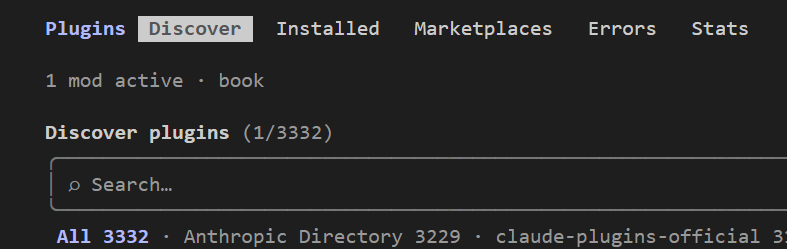
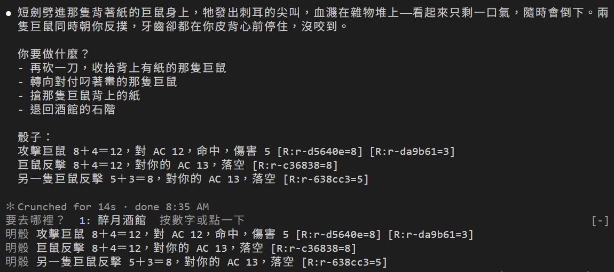
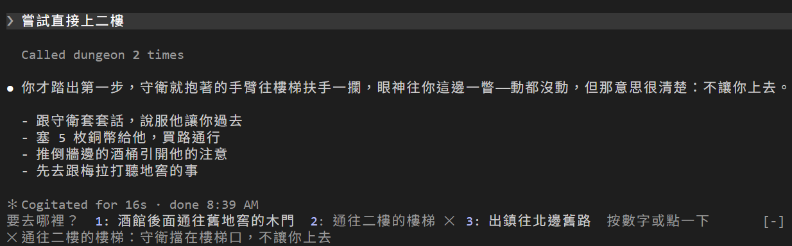
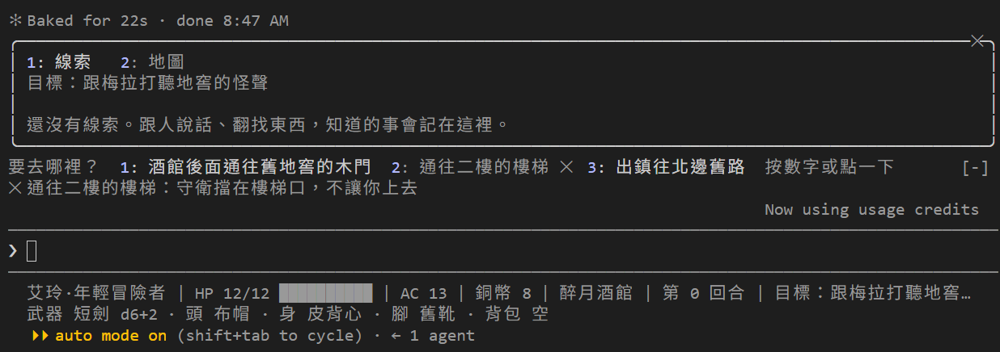
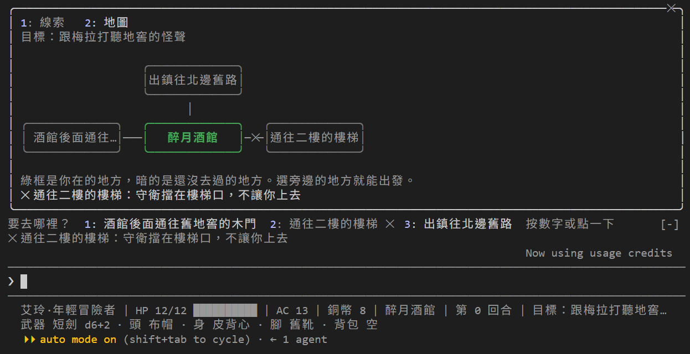
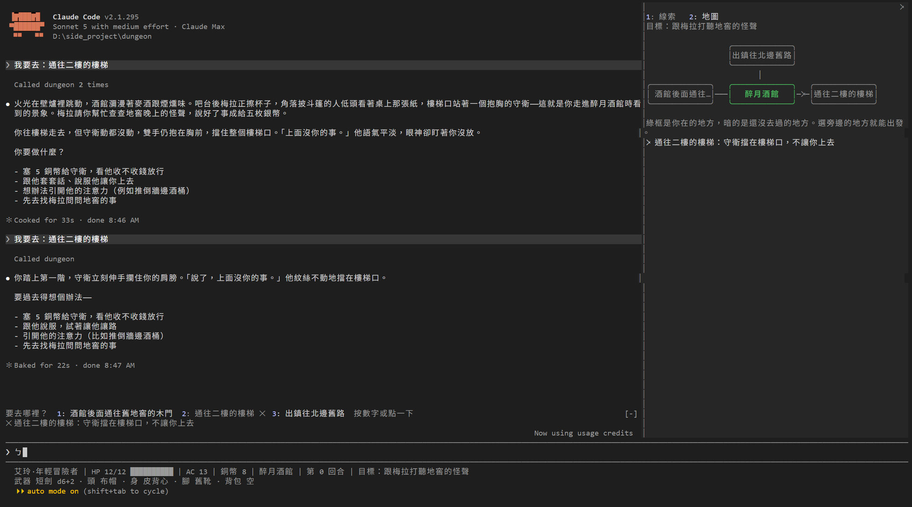
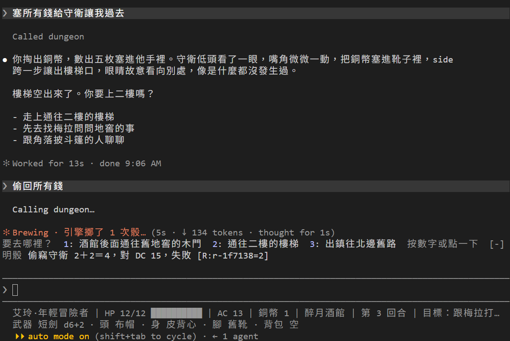
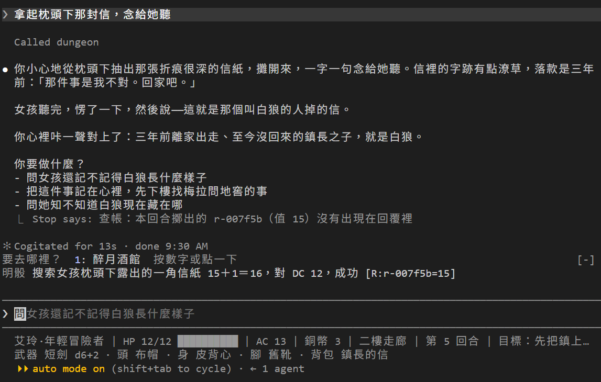
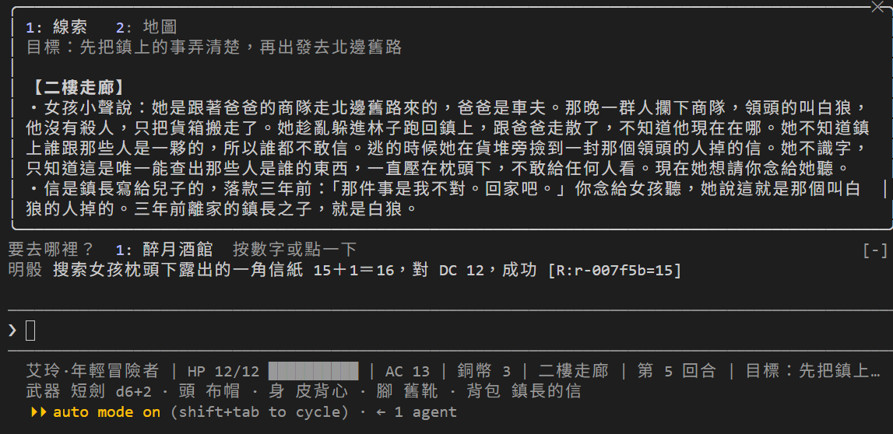

# [Day 25] 冒險手冊：用 mod 把骰子、出口和地圖畫在畫面上

玩到第 25 天，要記的事越來越多：誰說過什麼、哪條路走不通、地窖在哪一邊，全都散在對話裡。Day 14 的狀態列只有幾行；Day 11 的 Hook 只能跑指令，不能畫畫面；骰子也要等 DM 講完才看得到。

Day 24 把 DM 打包成 plugin 的時候提過，plugin 還能帶一種元件：mod。mod 在 Claude Code 裡面執行，可以在畫面上畫東西。今天用它做一本「冒險手冊」：一個叫 book 的 mod，下面叫它手冊 mod。做好之後，帶著手冊把第一幕從頭玩一次，最後幫女孩念那封信。

今天要做三件事：

1. **認識 mod**：mod 到底是什麼，它能做什麼。
2. **輸入框上方提示**：骰子一擲出來就顯示，輸入數字或用滑鼠點，就能選要去哪裡；Claude Code DM 思考時轉圈的圖案旁也能看到這一回合擲了幾次骰。
3. **`/book`**：打開手冊窗格，看線索和地圖。


## 換上 Day 25 的地城

照下面的步驟換上去：

1. 從 repo 的 [`articles/25/dungeon/`](https://github.com/harry18456/claude-code-dungeon-master/tree/main/articles/25/dungeon) 複製這些到你的 dungeon 資料夾：`.claude\skills\book\` 整個資料夾、`.claude\skills\newgame\`、`tools\book_fixtures.py`。
2. 這幾個檔案直接用 repo 的版本覆蓋：`engine\core.py`、`gamectl.py`、`scenes\` 裡的三個場景檔、`CLAUDE.md`、`.claude\settings.json`、`.gitignore`。
3. **重開 Claude Code。** mod 只在啟動時載入。

mod 要 Claude Code 2.1.287 以上，我用的是 2.1.294。目前 mod 的型別檔開頭還標著 EARLY ACCESS，所以之後的版本可能會改。另外假如你用公司帳號，公司可能限制了能用哪些 marketplace（`strictKnownMarketplaces`）。這時 `.claude\skills\` 裡的 plugin 不會自動載入，打 `/plugin` 也看不到 `book`。可以改在 dungeon 資料夾用這個指令啟動，手冊就會載入：`claude --plugin-dir .claude/skills/book`。

手冊 mod 要畫在畫面上，所以還要看你在哪裡用 Claude Code（Day 1 介紹過這幾種）：

| 在哪裡用 Claude Code | 手冊 mod 畫得出來嗎 |
|---|---|
| 終端機打 `claude`（包含 VS Code 裡的終端機）、JetBrains 外掛 | 可以。這個系列從 Day 1 就是用 VS Code 裡的終端機 |
| Claude 桌面 app 的 Code 分頁 | 可以。手冊窗格會停在右邊；新的 session 要先送出第一句話，手冊 mod 才會載入 |
| VS Code 擴充套件的聊天面板 | 不行：mod 會執行，但畫不出來 |
| `claude -p`（Day 23） | 不行：mod 會執行，但不會畫畫面 |

詳見[官方文件的完整表格](https://code.claude.com/docs/zh-TW/plugins/mods/overview#where-mods-run)。

重開之後打 `/plugin`，標籤下面那行暗字寫著 `1 mod active · book`，就表示手冊 mod 載入了：



## 全螢幕：才能用滑鼠點

重開之後，畫面會變成全螢幕，因為覆蓋過的 `.claude\settings.json` 多了一行 `"tui": "fullscreen"`。這篇的截圖都是全螢幕畫面。

Claude Code 在終端機有兩種畫面：原本的畫面，和全螢幕。「全螢幕」不是把視窗放到最大，而是 Claude Code 接管整個終端機畫面，像 `vim` 一樣。接管之後，Claude Code 才收得到滑鼠。

| | 原本的畫面 | 全螢幕 |
|---|---|---|
| 滑鼠 | 不能用，只能用鍵盤 | 可以點按鈕、點選項 |
| 往回看對話 | 用終端機的捲軸 | 用滑鼠滾輪或 PgUp／PgDn |

手冊 mod 在兩種畫面都能用。差別只在能不能用滑鼠點，和手冊窗格放在哪裡，後面講到時再說。

怎麼切換：

- **這個資料夾已經開好了**：重開 Claude Code 就是全螢幕。
- **其他資料夾也想用全螢幕**：在 Claude Code 裡打 `/tui fullscreen`。Claude Code 會存下設定再重新啟動，對話還在。只打 `/tui`，會告訴你現在是哪一種畫面。
- **這個資料夾想換回原本的畫面**：在 `.claude\settings.local.json` 加上 `"tui": "default"`。

其他差別見[官方的全螢幕說明](https://code.claude.com/docs/zh-TW/fullscreen)。

## mod 是什麼

Day 11 的 Hook 是一支外面的程式：Claude Code 把 JSON 交給它，它印什麼回來，Claude Code 就照著做。mod 不一樣，它是一段 TypeScript，直接在 Claude Code 裡面執行，所以能在畫面上畫東西。不用裝 Node，也不用編譯。

特別要注意官方的用詞變了。[官方文件](https://code.claude.com/docs/zh-TW/plugins/mods/overview)現在說的「hook」，指的是 mod 裡處理事件的函式；Day 11 寫在 `settings.json` 的那種，改叫「設定 hook (setting hook)」。mod 還在早期存取的時候，叫做 function hooks。這個系列前面說的 Hook，都是設定 hook。官方文件還有一張[表](https://code.claude.com/docs/zh-TW/plugins/mods/overview#compare-mods-settings-hooks-skills-and-mcp-servers)，比較 mod、設定 hook、Skill 和 MCP server，這四種裡只有 mod 能在畫面上畫東西。

手冊 mod 的資料夾長這樣：

```text
.claude\skills\book\
├── .claude-plugin\
│   └── plugin.json      名字叫 book
├── hooks\
│   ├── hooks.json       {"modules": ["./register.tsx"]}
│   ├── register.tsx     mod 本體
│   ├── book.test.ts     測試
│   └── fixtures.ts      測試用的引擎回答
├── types\index.d.ts
└── tsconfig.json
```

有 `.claude-plugin\plugin.json` 的資料夾就是一個 plugin（Day 24）。放在專案的 `.claude\skills\` 底下，資料夾信任過之後，打 `claude` 就會自動載入，名字是 `book@skills-dir`。不用像 Day 24 那樣用 `--plugin-dir`，也不用指定 marketplace。

`register.tsx` 的寫法是 `on(事件, 條件, 函式)`。Claude Code 每做一件事，例如啟動、呼叫工具、畫畫面，就會發出一個事件；`on` 的意思是「這個事件發生時，執行這段函式」。`book` mod 目前用到這幾個事件：

| 事件 | Claude Code 什麼時候發出 | 手冊 mod 收到後做什麼 |
|---|---|---|
| `session.start` | 啟動時 | 註冊 `/book` 指令，先跟引擎要一次出口、線索和地圖 |
| `classic.SessionStart` | 打 `/clear` 或 `/resume` 之後 | 清掉骰子，再跟引擎要一次 |
| `turn.start` | 玩家送出一句話時 | 清掉上一回合的骰子 |
| `tool.call` | DM 呼叫工具時 | 記下引擎回傳的骰子行 |
| `turn.complete` | DM 回完這一回合時 | 再跟引擎要一次出口、線索和地圖 |
| `command.run` | 玩家打 `/book` 時 | 打開手冊窗格 |
| `ui.render` | 要畫某一塊畫面時 | 畫輸入框上方那一列和手冊窗格，也改轉圈那一行 |

## 明骰：骰子一有結果就顯示出來

這是 `tool.call` 那一段，簡化過的節錄：

```ts
on('tool.call', { tool: /^mcp__dungeon__/ }, async ($, e, next) => {
  const ran = await next(e)                  // 讓工具照常跑，拿到引擎的回答
  const answer = answerOf(ran.text)          // 取出回答裡 dice 那幾行
  if (answer.lines.length > 0) await update($, dice, all => [...all, ...answer.lines])
  return ran                                 // 原封不動交還給 DM
})
```

條件 `{ tool: /^mcp__dungeon__/ }` 只看 dungeon 引擎的工具。`next(e)` 讓工具照常執行，拿到結果之後，把裡面的骰子行存起來，再原封不動交還。所以骰子會比 DM 的敘述先出現在輸入框上方，而且是引擎給的原文，DM 改不了。Day 13 的查帳是事後對帳，明骰是當場攤開。

下面是在地窖打巨鼠的一回合。上半部是 DM 的回覆；最下面「要去哪裡？」那一行和標著「明骰」的三行，是手冊 mod 畫的：



## 選出口：輸入數字或用滑鼠點

同一列還有出口按鈕，每個出口前面有一個數字。選出口有兩種方式：

- **輸入數字**：輸入框是空的時候，輸入 `2`，mod 會把它換成「我要去：通往二樓的樓梯」。
- **用滑鼠點**：在全螢幕模式，直接點出口的名字，效果一樣。

兩種方式都只是用 `$.prompt.fill` 把字填進輸入框，按 Enter 才會送出。Claude Code DM 收到之後還是照規則呼叫 `move_to`，由引擎決定走不走得過去。

鎖住的路一開始看起來跟其他路一樣。要等 DM 的 `move_to` 被引擎拒絕，mod 才在那條路打上 ✕，並在下一行寫出原因。例如守衛擋著樓梯：



## /book：線索和地圖

打 `/book` 打開手冊窗格。按 `1` 看線索，按 `2` 看地圖 ，Esc 關掉。實際也可以用滑鼠點擊數字分頁以及點擊右上角 X 關閉。

```ts
on('command.run', { command: 'book' }, async $ => {
  await $.ui.open({ id: 'book', title: '冒險手冊', focus: true, closeOnEscape: true, columns: 56, rows: 20 })
  await refresh($)
  return {}
})
```

`/book` 這個指令是 `session.start` 時用 `$.command.register` 註冊的，`$.ui.open` 負責打開窗格。

出口、線索和地圖，手冊 mod 都不自己算，而是用 `$.process.run` 跑 `uv run --no-project gamectl.py book` 去問引擎。所以沒去過的地方畫不出來，還沒解開的線索也讀不到，跟 Day 17「世界由引擎持有」是同一個原則。

為了回答手冊 mod，引擎多記了幾樣東西。這些照著換上就好，不逐行講：

- `state.json` 多了 `visited`：去過哪些地方。
- 場景檔的 `visible.map`：每個出口畫在哪一邊。
- 線索的 `journal`：這條線索要不要寫進手冊的線索頁。

剛開始玩的時候，線索頁是空的。跟人說話、翻找東西之後，知道的事才會寫進來：



按 `2` 換到地圖頁。一個地方一個框：綠框是你在的地方，暗的是還沒去過的地方，框裡寫的是出口的名字。被引擎拒絕過的路，連線上也會打 ✕：



手冊窗格放在哪裡，看視窗寬度。上面兩張是視窗比較窄的時候，窗格出現在輸入框上方。把視窗拉寬，窗格會停在對話右邊，可以一邊玩一邊看地圖。原本的畫面不管多寬，都出現在輸入框上方：



## 介入 Claude Code 介面

mod 不只能畫新的東西，也能改 Claude Code 自己顯示的部分。Claude Code DM 回覆的時候，輸入框上方會暫時有一行轉圈的字，官方文件叫它「微調器」。手冊 mod 在它後面加上這一回合引擎擲了幾次骰：

```ts
on('ui.render', { component: 'Spinner' }, async ($, e, next) => {
  const rolled = await read($, dice)                 // 明骰存下的骰子行
  const count = rolled.join('\n').match(/\[R:/g)?.length ?? 0
  if (count === 0) return next(e)                    // 還沒擲骰：照原樣畫
  return next({ ...e, props: { ...e.props, suffix: ` · 引擎擲了 ${count} 次骰…` } })
})
```

`next(e)` 是交給 Claude Code 照原樣畫；`next({ ...e, props })` 只改後面那一段字，畫面還是 Claude Code 畫的。擲骰的次數，就是明骰存下的那幾行裡有幾張票根：引擎每擲一次骰，就留一張票根（Day 13）。同一個 mod 裡的 hook 可以共用資料：`tool.call` 記下來，`ui.render` 拿來畫。

這個數字在同一回合裡會累加：DM 每呼叫一次引擎，新的骰子行就加進去。像前面打巨鼠那一回合，攻擊有 2 張票根（命中和傷害各擲一次），兩隻巨鼠反擊各 1 張，最後會顯示「引擎擲了 4 次骰」。玩家送出下一句話，新回合開始，就跟明骰一起歸零。

下面是想把塞給守衛的錢偷回來的那一回合。DM 還在回覆，轉圈那一行後面已經寫著「· 引擎擲了 1 次骰…」，下面的明骰也同時出現了。上一回合付錢之後，樓梯的 ✕ 也不見了：狀態一變，手冊 mod 就重新問引擎。



## 檢查 mod 確認是否可以使用

寫 mod 的時候可以先檢查：

```
claude plugin validate .claude/skills/book
```

不用真的執行 mod，就能列出 mod 掛了哪些 hook、呼叫了哪些 `$.` 的功能。mod 用你的權限執行，沒有沙箱，所以[官方文件](https://code.claude.com/docs/zh-TW/plugins/mods/overview#list-what-a-mod-does-before-you-install-one)建議裝別人的 mod 之前先跑一次。

清單裡有兩行寫著 `gating hook without .catch`：`tool.call` 和 `classic.SessionStart` 這兩個 hook 有能力擋下動作，卻沒寫出錯時要怎麼辦。擋東西的 hook，例如不准改 `.env` 的護欄，官方建議加上 `.catch`，出錯就改成拒絕。手冊 mod 只是讀骰子，出錯時讓工具照常回傳就好，所以不加。

`claude plugin test .claude/skills/book` 會跑資料夾裡的 15 個測試。

## 帶著手冊走完第一幕

換上之後，打 `/newgame` 從頭開始。這個 Skill 只有玩家能叫，另外執行時會先把目前的進度存到 `before-newgame`，假如想回到原本二樓的進度，打 `/load before-newgame` 就好。

嘗試把進度推進到女孩把信交給我們：



信裡只有一句：「那件事是我不對。回家吧。」三年前離家的鎮長之子，就是白狼。這條線索寫進手冊的線索頁：



## 目前還有什麼問題嗎？

念信那一回合，回覆下面多了一行 `Stop says: 查帳：本回合擲出的 r-007f5b（值 15）沒有出現在回覆裡`。這是 Day 13 的查帳：搜信擲了一次骰，DM 的回覆裡卻沒有那張票根。明骰已經把這一擲攤在輸入框上方，玩家看得到；可是查帳只看 DM 的回覆，所以還是會警告。現在的查帳只會警告；未來會把它改成擋下來，請 Claude Code DM 補上票根再回覆。

劇情有些進展了，可是信裡的「那件事」是什麼？手冊的地圖頁上，那條「出鎮往北邊舊路」還是不通的。明天讓艾玲出去晃晃，地圖頁會多出新的地方。

今天結束時 `dungeon` 資料夾的完整內容在 [articles/25/dungeon](https://github.com/harry18456/claude-code-dungeon-master/tree/main/articles/25/dungeon)，給大家參考。

## 目前學會的 Claude Code 機制

- ✅ Day 1：安裝與登入、四種介面；模型：`/model`、`/effort`、`/usage`
- ✅ Day 2：session：`.jsonl`、`--resume`、`-c`、`/resume`、`cleanupPeriodDays`
- ✅ Day 3：CLAUDE.md：三層、`@` 匯入、`/init`；`/context`
- ✅ Day 4：內建工具：Read／Bash／Edit、`Ctrl+O`
- ✅ Day 5：checkpoint：`/rewind`（`Esc` 兩下）、`/branch`
- ✅ Day 6：Skill：`SKILL.md`、`description`、`/skill 名字`、skill-creator
- ✅ Day 7：權限：權限模式、`Shift+Tab`、`/permissions`、allow／ask／deny、`settings.json`
- ✅ Day 8：Skill：`$ARGUMENTS`、`argument-hint`、`` !`指令` `` 展開
- ✅ Day 9：Skill：`disable-model-invocation`、`user-invocable`、`allowed-tools`
- ✅ Day 10：權限：Plan Mode、`/plan`、`Ctrl+G`
- ✅ Day 11：Hook：`Stop`、`UserPromptExpansion`、`PostToolUse`、`matcher`、`if`、`/hooks`
- ✅ Day 12：Hook：`PreToolUse`、exit 2 把理由交給模型、stdin 的 `tool_input`、matcher `Edit|Write`、`.ps1` 存成 UTF-8 with BOM；權限：用 deny 保護 Hook 自己
- ✅ Day 13：Hook：`Stop` 的 `last_assistant_message`、JSON 輸出 `systemMessage`；帳本與票根
- ✅ Day 14：狀態列：`statusLine`、收到的 session JSON、`refreshInterval`；uv：`uv run`
- ✅ Day 15：MCP：host／client／server、stdio 與 Streamable HTTP、`claude mcp add` 與三種範圍、`.mcp.json`、`/mcp`、工具名稱 `mcp__server__tool`、`ToolError`；uv：`uvx`
- ✅ Day 16：MCP：一個 server 多個工具、工具回傳 JSON 與錯誤；Hook：`PostToolUse` 的 `tool_response`、`async`
- ✅ Day 17：權限：`Read(path)` deny 連 Grep、Glob 都擋；Hook：`PreToolUse` 擋 Bash／PowerShell、JSON 輸出 `permissionDecision`；Skill：`!` 展開失敗時訊息不會送出；舊 context 不會跟著檔案更新，要開新對話
- ✅ Day 18：Subagent：`.claude/agents/`、`name`、`description`、內文就是系統提示、`Agent` 委派、背景執行、`@agent-名字`、`/tasks`
- ✅ Day 19：Subagent：`tools` 白名單、`omitClaudeMd`、權限與 Hook 照樣套用、看不到 DM 的對話、紀錄在 `subagents/`；設定：`env`、`CLAUDE_CODE_DISABLE_BACKGROUND_TASKS`
- ✅ Day 20：auto memory：`MEMORY.md` 索引和一條一檔的筆記、`type` 四種、每次對話載入索引的前 200 行或 25KB、`/memory`、`autoMemoryEnabled`
- ✅ Day 21：Hook：`SessionStart` 與 matcher（`startup`／`resume`／`clear`／`compact`／`fork`）、stdin 的 `source`、JSON 輸出 `additionalContext`；context：`/clear`、`/compact`、自動壓縮
- ✅ Day 22：output style：`.claude/output-styles/`、frontmatter（`name`、`description`、`keep-coding-instructions`）、`outputStyle`、`/output-style`；只套用在主對話，subagent 不受影響
- ✅ Day 23：headless：`claude -p`、`--output-format json`、`--resume`、`--allowedTools`、`--permission-prompts`、`--setting-sources`、`--strict-mcp-config`；未信任的資料夾會忽略 allow 規則；Hook：`UserPromptSubmit`（玩家送出一句話時觸發）、`MessageDisplay`（DM 的文字顯示時觸發）、每個 Hook 都收得到的 `prompt_id`（同一回合都一樣）、`UserPromptSubmit` 印出的文字 DM 也看得到
- ✅ Day 24：plugin：`.claude-plugin/plugin.json`、元件資料夾、`hooks/hooks.json`、plugin 的 `.mcp.json`、`${CLAUDE_PLUGIN_ROOT}`（Hook、MCP 設定、Skill 內容和 `allowed-tools` 都能用）、`CLAUDE_PROJECT_DIR`、名字前綴 `dm:`、MCP 工具名字 `mcp__plugin_dm_dungeon__`、帶不走 `CLAUDE.md` 和大部分設定、`claude plugin validate`、`--plugin-dir`；權限：讀專案外的檔案要先經過同意；marketplace：`marketplace.json`、`/plugin install --marketplace`、安裝範圍 user／project／local、`enabledPlugins`、`extraKnownMarketplaces`
- ✅ Day 25：mods：plugin 裡的 `hooks/register.tsx`、`on(事件, 條件, 函式)`、`session.start`、`turn.start`、`tool.call`（`next(e)` 拿到工具結果）、`turn.complete`、`command.run`、`ui.render`（輸入框上方、窗格，也能改 Claude Code 自己的轉圈那一行：`next({ ...e, props })`）、`$.command.register`、`$.ui.open`、`$.process.run`、`$.prompt.fill`、hook 之間共用資料、`claude plugin validate`／`claude plugin test`；官方用詞：mod 的處理函式叫 hook，`settings.json` 的叫設定 hook（早期叫 function hooks）；專案 `.claude/skills/` 裡的 plugin（`@skills-dir`）；全螢幕畫面才能用滑鼠點：設定 `"tui": "fullscreen"`／`"default"`、指令 `/tui fullscreen`
