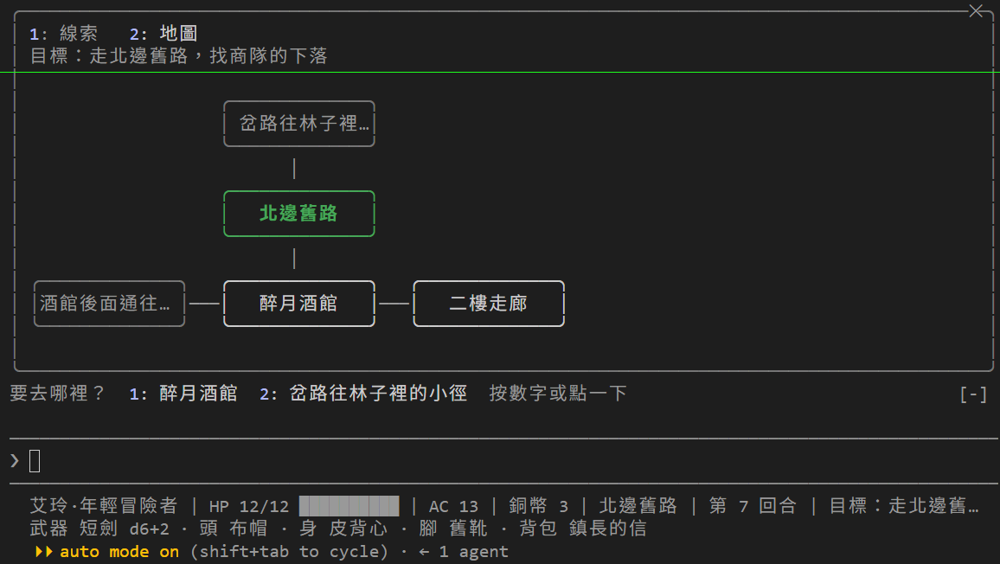

# [Day 26] 上路：Claude Code DM 會不會在對的時候自己叫 Skill？

二樓女孩的信說白狼是鎮長之子，商隊在北邊舊路被攔下。今天讓艾玲走出城鎮，走上那條舊路。

出發前先解決一件從 Day 9 留到現在的事。Day 9 把大部分 Skill 設成只有玩家能叫，只留 `/rest` 和 `/recap` 讓 Claude Code DM 自己決定要不要用。可是 DM 真的會在對的時候叫嗎？玩家說「好累」，DM 會叫 `/rest` 嗎？玩家問「剛才發生什麼」，DM 會叫 `/recap` 嗎？從 Day 9 到現在，我們只憑印象覺得「大概會」，但都沒有測量過。

今天要做三件事：

1. **量觸發率**：寫一組該叫和不該叫的句子，用 Day 23 的 headless 跑法，每句跑三次，算 DM 叫了幾次。
2. **看結果決定要不要改 `description`**：改了就再量一次，數字會說話。
3. **上路**：走北邊舊路，翻商隊的殘骸，走到岔路口。


## 換上 Day 26 的地城

照下面的步驟換上去：

1. 從 repo 的 [`articles/26/dungeon/`](https://github.com/harry18456/claude-code-dungeon-master/tree/main/articles/26/dungeon) 複製 `scenes\old_road.json`、`tools\skill_rate.py` 和 `tools\trigger-set.json` 到你的 dungeon 資料夾。
2. 這幾個檔案直接用 repo 的版本覆蓋：`scenes\tavern.json`、`data\actors.json`、`data\items.json`、`data\quest.json`、`rules.md`、`.claude\skills\rest\SKILL.md`、`.claude\skills\recap\SKILL.md`。
3. 重開 Claude Code。

世界多了一個場景：北邊舊路。酒館往舊路的出口現在走得通了，條件還是 Day 18 那個：要先從披斗篷的人那裡知道商隊走哪條路。

## 複習：誰能叫 Skill

Day 9 之後，dungeon 的 Skill 分成兩種：

| 誰能叫 | Skill | 怎麼設 |
|---|---|---|
| 只有玩家 | `/save`、`/load`、`/newgame`、`/cheat`、`/check`、`/world-lore` | `disable-model-invocation: true` |
| 玩家和 DM 都能 | `/rest`、`/recap` | 什麼都不寫 |

DM 決定要不要叫 `/rest`，靠的是 `SKILL.md` 開頭的 `description`。現在是這樣寫的：

```yaml
description: 休息補血。玩家說要休息、睡一下、回血、包紮傷口時使用。
```

`/recap` 的則是：

```yaml
description: 回顧最近發生的事。玩家問「剛才發生什麼」「我做到哪了」，或你需要整理已發生的事實時使用。
```

Day 6 說過，`description` 是 Claude Code 決定要不要用 Skill 的唯一依據。寫得夠不夠精準，確實要測試才知道。

## 官方怎麼測量

Claude Code 有兩個現成的工具。

**`claude plugin eval`**：給 plugin 寫測試案例，每個案例一句話加幾個檢查，跑完給分數。檢查裡有一種 `tool_used`，可以查 Claude 有沒有叫某個 Skill：

```markdown
---
type: tool_used
tool: Skill
input_match: '"skill"\s*:\s*"rest"'
---
```

**skill-creator 的調校迴圈**：Day 6 裝過的 skill-creator plugin 裡有一支 `run_loop.py`。給它 20 句該叫和不該叫的句子，它會量現在的 `description` 觸發率，請 Claude 改寫，再量一次，最多來回五輪，挑分數最高的版本。

兩個我都沒直接用，原因一樣：它們把 Skill 放進一個**空的專案**裡測。`claude plugin eval` 的文件寫明每個 run 在空的工作資料夾開始，不讀專案的 `CLAUDE.md`、MCP server 和 Hook。可是 dungeon 的 DM 沒有 `CLAUDE.md` 就不是 DM，沒有引擎就不知道艾玲在哪裡、有沒有在打架。在空資料夾裡量到的觸發率，跟玩家實際玩的時候對不上。

所以今天借用官方的**方法**（該叫和不該叫的句子、每句多跑幾次、算比例），在`CLAUDE.md`、引擎、Hook 都在的情況下，用在 Day 23 建立的工具：`run_turns.sh` 在 dungeon 的複本裡跑一回合，記錄下來再分析。

## 自己量：tools\skill_rate.py

`tools\skill_rate.py` 做的事很簡單：讀一份 JSON，每一句用 `run_turns.sh` 開一局新遊戲跑一回合，看紀錄裡有沒有 `Skill` 這個工具呼叫，重複三次，印成表格。

```json
[
  {"skill": "rest",  "should": true,  "query": "好累，我想找個角落坐下來喘口氣，包紮一下。"},
  {"skill": "rest",  "should": false, "query": "問梅拉這間酒館有沒有房間可以租。"},
  {"skill": "recap", "should": true,  "query": "我做到哪了？"},
  {"skill": "recap", "should": false, "query": "巨鼠身上那封信寫什麼？"}
]
```

句子怎麼寫，照 skill-creator 的建議：

- **該叫的**：同一個意思換幾種說法。有的直說「休息」，有的只說「血快沒了」。
- **不該叫的**：要挑**近似句**。「問梅拉有沒有房間可以租」提到房間和過夜，但玩家只是在問話，不是要休息。「巨鼠身上那封信寫什麼」是問劇情，不是要回顧。太不像的句子（例如「我攻擊巨鼠」）測不出東西。

`/rest` 和 `/recap` 各 7 句，當中該叫 4 句、不該叫 3 句。全部在 `tools\trigger-set.json`。執行：

```
uv run --no-project tools/skill_rate.py tools/trigger-set.json --runs 3
```

14 句乘 3 次是 42 回合，用 Sonnet 花了 2.94 美元，跑了 22 分鐘。每一回合都是從新遊戲的酒館開始。

第一次的結果：

| Skill | 該叫 | 句子 | 叫了幾次 |
|---|---|---|---|
| `/rest` | 是 | 好累，我想找個角落坐下來喘口氣，包紮一下。 | 2/3 ✗ |
| `/rest` | 是 | 先在酒館過一夜，明天再說。 | 1/3 ✗ |
| `/rest` | 是 | 血快沒了，有沒有辦法回一點血？ | 0/3 ✗ |
| `/rest` | 是 | 我靠著牆閉眼休息一會。 | 1/3 ✗ |
| `/rest` | 否 | 我讓巨鼠休息一下，不攻擊牠，看牠會不會走開。 | 0/3 |
| `/rest` | 否 | 問梅拉這間酒館有沒有房間可以租。 | 0/3 |
| `/rest` | 否 | 我坐到角落那桌，跟披斗篷的人說話。 | 0/3 |
| `/recap` | 是 | 等等，剛才到底發生了什麼事？我有點混亂，幫我整理一下。 | 3/3 |
| `/recap` | 是 | 我做到哪了？ | 0/3 ✗ |
| `/recap` | 是 | 回顧一下這幾回合的經過。 | 3/3 |
| `/recap` | 是 | 我忘了梅拉剛剛說什麼委託。 | 0/3 ✗ |
| `/recap` | 否 | 巨鼠身上那封信寫什麼？ | 0/3 |
| `/recap` | 否 | 梅拉，地窖的怪聲是什麼時候開始的？ | 0/3 |
| `/recap` | 否 | 這座鎮上有什麼傳聞？ | 0/3 |

14 句只有 8 句照預期。

不該叫的 6 句全部沒叫，18 次零失誤。問題全在該叫的那邊：`/rest` 該叫的 12 次只叫了 4 次，`/recap` 12 次叫了 6 次。

把沒叫的那幾回合的紀錄打開看。每一次都是同一個模式：DM 先呼叫 `get_state`，看到艾玲滿血、第 0 回合，就自己下了判斷。「血快沒了」那句，DM 回：「引擎記錄的跟你說的對不上：艾玲現在是 12/12，滿血……所以現在沒血可補，休息也不會擲骰。」「我做到哪了」那句，DM 回：「你還在遊戲最開頭，什麼都還沒發生。」

DM 沒說錯。但這些判斷本來該由 Skill 做：`/rest` 會呼叫引擎的 `rest` 工具，滿血時引擎自己會說不用擲骰；`/recap` 會讀引擎的紀錄，剛開局紀錄是空的，它自己會說。DM 看了狀態就自己當裁判，把 Skill 跳過了。

還有一個有趣的：「先在酒館過一夜」那回合，有一次 DM 沒叫 `/rest` Skill，卻直接呼叫了引擎的 `rest` 工具。結果是對的，但 Skill 裡寫的四個步驟（例如最後貼一行骰子）全跳過了。Skill 和工具是兩層：工具只管算，Skill 管算完怎麼說。

## 改 description，再測量一次

既然問題是「DM 看了狀態自己再判」，`description` 就要明說：不管狀態怎樣都先用 Skill。`/rest` 改成：

```yaml
description: 休息補血。玩家說要休息、睡一下、喘口氣、回血、包紮傷口、過一夜時使用。不管 HP 滿不滿、在不在戰鬥，都先用這個 Skill，能不能休息由引擎回答，不要自己判斷。
```

`/recap` 改成：

```yaml
description: 回顧最近發生的事。玩家問「剛才發生什麼」「我做到哪了」「我忘了誰說過什麼」，或你需要整理已發生的事實時使用。就算是剛開局、你覺得沒什麼好回顧，也先用這個 Skill，由引擎的紀錄回答。玩家問某個人或某樣東西的事（信寫什麼、傳聞是什麼）不算回顧。
```

兩個共同改法：多列幾種說法（喘口氣、過一夜、忘了誰說過什麼）、說明「什麼狀態都先用」，`/recap` 則是再多寫「什麼不算」，把不該叫的近似句也寫進去。

再跑一次：

| Skill | 該叫 | 句子 | 改前 | 改後 |
|---|---|---|---|---|
| `/rest` | 是 | 好累，我想找個角落坐下來喘口氣，包紮一下。 | 2/3 | 3/3 |
| `/rest` | 是 | 先在酒館過一夜，明天再說。 | 1/3 | 3/3 |
| `/rest` | 是 | 血快沒了，有沒有辦法回一點血？ | 0/3 | 3/3 |
| `/rest` | 是 | 我靠著牆閉眼休息一會。 | 1/3 | 3/3 |
| `/rest` | 否 | 我讓巨鼠休息一下，不攻擊牠，看牠會不會走開。 | 0/3 | 0/3 |
| `/rest` | 否 | 問梅拉這間酒館有沒有房間可以租。 | 0/3 | 0/3 |
| `/rest` | 否 | 我坐到角落那桌，跟披斗篷的人說話。 | 0/3 | 0/3 |
| `/recap` | 是 | 等等，剛才到底發生了什麼事？我有點混亂，幫我整理一下。 | 3/3 | 3/3 |
| `/recap` | 是 | 我做到哪了？ | 0/3 | 3/3 |
| `/recap` | 是 | 回顧一下這幾回合的經過。 | 3/3 | 3/3 |
| `/recap` | 是 | 我忘了梅拉剛剛說什麼委託。 | 0/3 | 3/3 |
| `/recap` | 否 | 巨鼠身上那封信寫什麼？ | 0/3 | 0/3 |
| `/recap` | 否 | 梅拉，地窖的怪聲是什麼時候開始的？ | 0/3 | 0/3 |
| `/recap` | 否 | 這座鎮上有什麼傳聞？ | 0/3 | 0/3 |

14 句全部照預期。該叫的 24 次全叫，不該叫的 18 次全沒叫。第二次 42 回合花 3.01 美元，跑了 18 分鐘。

兩件事值得記住：

- **改的是 `description`，不是 Skill 的內文。** 內文一個字都沒動。DM 決定叫不叫，只看 `description`；叫了之後才讀內文。
- **不該叫的那幾句是保險。** 改法裡那句「不管狀態怎樣都先用」寫得很強，我原本擔心「問梅拉有沒有房間」會被帶著一起叫。結果沒有，但要是沒放這幾句進去測，我不會知道。

實際我們測量的是「這一組句子、這個模型、這一天」的觸發率，並不是保證。但比起「我覺得應該會叫」，現在有數字可以比較，也能看到改了之後是否真的改善。

寫 Skill 不是寫完就好。`description` 決定 Claude 叫不叫，寫得對不對，只有量了才知道。怎麼量，看 Skill 靠不靠專案：

- **Skill 自己就能跑完**（整理筆記、查文件格式這類），用 skill-creator 幫你產的句子和調校迴圈，或 `claude plugin eval`，現成的就夠。
- **Skill 要靠專案的 `CLAUDE.md`、MCP server、Hook 才有意義**（像 dungeon 的 Claude Code DM），空專案測不出東西，就用 Day 23 的 headless 自己搭：一組該叫和不該叫的句子、每句跑幾次、改前改後各量一次。今天的 `tools\skill_rate.py` 就是這樣來的。

## 上路：舊路和殘骸

換上之後，打 `/load` 讀回 Day 25 的進度，或打 `/newgame` 重玩。艾玲從酒館出鎮，往北走。

> 你推開酒館的門，夜風帶著濕草味撲上來。身後的火光一下被關在門裡，你沿著鎮外那條長滿雜草的舊路往北走，靴底踩得枯枝輕響。
>
> 沒多久，路邊出現一輛翻倒的貨車，木箱裂開，貨物散了一地，布料和碎陶片被風吹得沙沙響。更遠的岔路口站著一個帶刀的男人，一手搭在刀柄上，眼睛盯著這條路。他腰帶上塞著一張字條，看你走近，他的身體明顯繃緊了。
>
> 那就是白狼的手下，通往林子的小徑被他擋住了。

路邊有一輛翻倒的商隊貨車。翻一翻：

> 你蹲下身，避開守路那人的視線，在散落的木箱和布料之間翻找。碎陶片在指尖刮出細響，貨堆裡有股受潮的麻布味。
>
> 你抽出一張被壓皺的商隊清單，上頭多了一箱沒有貨主的東西，收件人寫的是鎮長。再往下翻，貨堆底下壓著一把獵人的短弓，旁邊還有一袋箭，一共十支。你把清單、短弓和箭都收進身上。
>
> 骰子：
> 搜索翻倒的商隊貨車 17＋1＝18，對 DC 15，成功 [R:r-f6dba8=17]

搜貨車是 DC 15 的檢定，規則書（Day 18）寫著「商隊貨車 15」。成功一次就翻完了，再翻引擎會說「貨車翻遍了」。

清單的最後一行多了一箱沒有貨主的東西，收件人寫著鎮長。這條線索進了手冊。貨堆底下壓著一把獵人的短弓和一袋箭。

打開手冊的地圖頁：北邊舊路亮了，上面多了一個還沒去過的地方。



前方岔路口站著一個帶刀的男人。披斗篷的人說過，商隊就是在這條路上被攔下的。

## 目前還有什麼問題嗎？

Day 11 起用 Hook 幫幾個特殊動作加了音效：擲骰、落空、開門。可是從酒館走到舊路，大半時間都是安靜的，玩起來有點單調。明天幫冒險配樂：開局放一首，換場景就換曲，結束時關掉。

今天結束時 `dungeon` 資料夾的完整內容在 [articles/26/dungeon](https://github.com/harry18456/claude-code-dungeon-master/tree/main/articles/26/dungeon)，給大家參考。

## 目前學會的 Claude Code 機制

- ✅ Day 1：安裝與登入、四種介面；模型：`/model`、`/effort`、`/usage`
- ✅ Day 2：session：`.jsonl`、`--resume`、`-c`、`/resume`、`cleanupPeriodDays`
- ✅ Day 3：CLAUDE.md：三層、`@` 匯入、`/init`；`/context`
- ✅ Day 4：內建工具：Read／Bash／Edit、`Ctrl+O`
- ✅ Day 5：checkpoint：`/rewind`（`Esc` 兩下）、`/branch`
- ✅ Day 6：Skill：`SKILL.md`、`description`、`/skill 名字`、skill-creator
- ✅ Day 7：權限：權限模式、`Shift+Tab`、`/permissions`、allow／ask／deny、`settings.json`
- ✅ Day 8：Skill：`$ARGUMENTS`、`argument-hint`、`` !`指令` `` 展開
- ✅ Day 9：Skill：`disable-model-invocation`、`user-invocable`、`allowed-tools`
- ✅ Day 10：權限：Plan Mode、`/plan`、`Ctrl+G`
- ✅ Day 11：Hook：`Stop`、`UserPromptExpansion`、`PostToolUse`、`matcher`、`if`、`/hooks`
- ✅ Day 12：Hook：`PreToolUse`、exit 2 把理由交給模型、stdin 的 `tool_input`、matcher `Edit|Write`、`.ps1` 存成 UTF-8 with BOM；權限：用 deny 保護 Hook 自己
- ✅ Day 13：Hook：`Stop` 的 `last_assistant_message`、JSON 輸出 `systemMessage`；帳本與票根
- ✅ Day 14：狀態列：`statusLine`、收到的 session JSON、`refreshInterval`；uv：`uv run`
- ✅ Day 15：MCP：host／client／server、stdio 與 Streamable HTTP、`claude mcp add` 與三種範圍、`.mcp.json`、`/mcp`、工具名稱 `mcp__server__tool`、`ToolError`；uv：`uvx`
- ✅ Day 16：MCP：一個 server 多個工具、工具回傳 JSON 與錯誤；Hook：`PostToolUse` 的 `tool_response`、`async`
- ✅ Day 17：權限：`Read(path)` deny 連 Grep、Glob 都擋；Hook：`PreToolUse` 擋 Bash／PowerShell、JSON 輸出 `permissionDecision`；Skill：`!` 展開失敗時訊息不會送出；舊 context 不會跟著檔案更新，要開新對話
- ✅ Day 18：Subagent：`.claude/agents/`、`name`、`description`、內文就是系統提示、`Agent` 委派、背景執行、`@agent-名字`、`/tasks`
- ✅ Day 19：Subagent：`tools` 白名單、`omitClaudeMd`、權限與 Hook 照樣套用、看不到 DM 的對話、紀錄在 `subagents/`；設定：`env`、`CLAUDE_CODE_DISABLE_BACKGROUND_TASKS`
- ✅ Day 20：auto memory：`MEMORY.md` 索引和一條一檔的筆記、`type` 四種、每次對話載入索引的前 200 行或 25KB、`/memory`、`autoMemoryEnabled`
- ✅ Day 21：Hook：`SessionStart` 與 matcher（`startup`／`resume`／`clear`／`compact`／`fork`）、stdin 的 `source`、JSON 輸出 `additionalContext`；context：`/clear`、`/compact`、自動壓縮
- ✅ Day 22：output style：`.claude/output-styles/`、frontmatter（`name`、`description`、`keep-coding-instructions`）、`outputStyle`、`/output-style`；只套用在主對話，subagent 不受影響
- ✅ Day 23：headless：`claude -p`、`--output-format json`、`--resume`、`--allowedTools`、`--permission-prompts`、`--setting-sources`、`--strict-mcp-config`；未信任的資料夾會忽略 allow 規則；Hook：`UserPromptSubmit`（玩家送出一句話時觸發）、`MessageDisplay`（DM 的文字顯示時觸發）、每個 Hook 都收得到的 `prompt_id`（同一回合都一樣）、`UserPromptSubmit` 印出的文字 DM 也看得到
- ✅ Day 24：plugin：`.claude-plugin/plugin.json`、元件資料夾、`hooks/hooks.json`、plugin 的 `.mcp.json`、`${CLAUDE_PLUGIN_ROOT}`（Hook、MCP 設定、Skill 內容和 `allowed-tools` 都能用）、`CLAUDE_PROJECT_DIR`、名字前綴 `dm:`、MCP 工具名字 `mcp__plugin_dm_dungeon__`、帶不走 `CLAUDE.md` 和大部分設定、`claude plugin validate`、`--plugin-dir`；權限：讀專案外的檔案要先經過同意；marketplace：`marketplace.json`、`/plugin install --marketplace`、安裝範圍 user／project／local、`enabledPlugins`、`extraKnownMarketplaces`
- ✅ Day 25：mods：plugin 裡的 `hooks/register.tsx`、`on(事件, 條件, 函式)`、`session.start`、`turn.start`、`tool.call`（`next(e)` 拿到工具結果）、`turn.complete`、`command.run`、`ui.render`（輸入框上方、窗格，也能改 Claude Code 自己的轉圈那一行：`next({ ...e, props })`）、`$.command.register`、`$.ui.open`、`$.process.run`、`$.prompt.fill`、hook 之間共用資料、`claude plugin validate`／`claude plugin test`；官方用詞：mod 的處理函式叫 hook，`settings.json` 的叫設定 hook（早期叫 function hooks）；專案 `.claude/skills/` 裡的 plugin（`@skills-dir`）；全螢幕畫面才能用滑鼠點：設定 `"tui": "fullscreen"`／`"default"`、指令 `/tui fullscreen`
- ✅ Day 26：Skill 的觸發率：該叫和不該叫的句子（近似句才有鑑別力）、每句多跑幾次算比例、`description` 改前改後各量一次；`claude plugin eval`（`tool_used` 查有沒有叫 Skill）和 skill-creator 的調校迴圈都在空專案裡測，靠整個專案的 Skill 要用 Day 23 的 headless 自己量（`tools/skill_rate.py`）
